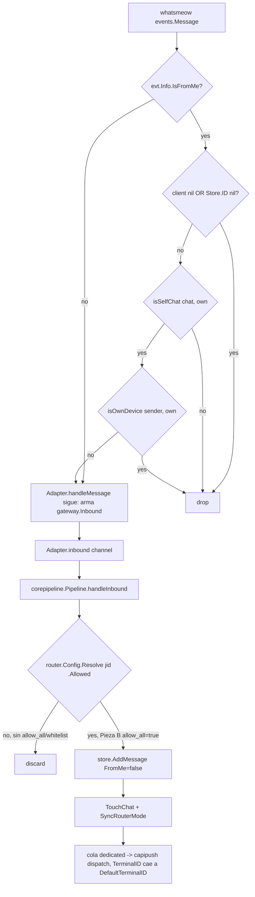

# Antena — Pieza D: Note-to-Self como canal de comandos (ct-2026-07-24-0527)

Cuarta pieza del contrato `ct-2026-07-24-0527` (junto a A: modal Antena restaurado, B:
`allow_all` en `router.json`, C: badge en vivo). Objetivo: dejar pasar al pipeline un mensaje
que el boss se manda a sí mismo (chat "Note to Self" de WhatsApp) desde OTRO dispositivo
vinculado — el celular. Hoy `handleMessage` descarta TODO mensaje `IsFromMe` sin excepción
(el eco multi-device de cualquier mensaje propio).

## Diagrama

Validado contra el codemap con `dflux_resolve` — los 7 nodos de código (no las ramas de
control) resuelven `grounded` contra el archivo/línea real; el contraste de aristas es
Roslyn-only (no cubre Go), así que las flechas de abajo están verificadas a mano, no por la
herramienta.

## Por qué esta forma y no otra

- **`isSelfChat` (User+Server) vs `isOwnDevice` (+Device) — dos predicados, no uno.**
  Responden preguntas distintas: "¿es el chat Note-to-Self?" (identidad del NÚMERO) contra
  "¿lo mandó ESTE proceso?" (identidad del DISPOSITIVO). `MANUAL.md:2393` ya documenta que
  el gateway se linkea siempre como companion, nunca device 0 — por eso el celular y el
  gateway nunca comparten `Device`, y el filtro nunca confunde el propio eco del gateway
  hacia el self-chat con una nota real del boss (sin eso, una respuesta del agente en el
  self-chat volvería a entrar como "nuevo mensaje" y loopearía).
- **Sin nodo puente nuevo.** `handleMessage` sigue siendo el único punto de entrada; no hay
  una rama de "modo comando" aparte. El mensaje del Note-to-Self entra al pipeline
  exactamente igual que cualquier inbound (mismo `AddMessage`, mismo `TouchChat`, mismo
  dispatch dedicated) — la única diferencia es que ahora se le permite llegar.
- **Depende de la Pieza B, no la duplica.** El self-chat no está en el whitelist de
  `router.json`. Sin `allow_all:true` (activado en la Pieza B, mismo contrato) el mensaje
  pasaría `isSelfChat`/`isOwnDevice` pero moriría en el gate de
  `corepipeline.handleInbound` (`router.Resolve(...).Allowed == false`). A/B/C/D son un
  solo contrato, no cuatro features sueltas.
- **`TerminalID`/`Plugin` vacíos no bloquean el dispatch.** Ninguna ruta de `router.json`
  matchea el self-chat explícitamente, así que `Decision.TerminalID` queda `""` — cae al
  `DefaultTerminalID` (fallback ya existente, `internal/capipush/capipush.go:101`).
  `capipush.dispatch` tampoco lee el campo `Plugin`, así que dejarlo vacío no frena nada.

## Test coverage

`internal/whatsmeow/inbound_test.go::TestHandleMessageFromMeNoteToSelf` — table-driven, los 4
casos pedidos: self-chat + otro device (pasa), self-chat + mismo device (eco del gateway,
descarta sin loop), `IsFromMe` en un chat que no es Note-to-Self (descarta — ya cubierto en
general por `TestHandleMessageFiltersFromMe`, repetido acá con el cliente wireado para no
dejar un hueco en esa combinación puntual), y `Store.ID` nil / gateway aún no pareado
(descarta sin panic).

## Fuera de alcance (flagueado, no decidido acá)

- Si el pipeline debe tratar un mensaje de Note-to-Self distinto de un inbound normal (p.ej.
  no disparar el mood `new_msg`/`vip`, o taggearlo para el agente) es una decisión de
  producto que este sub-cambio no toma — hoy entra indistinguible de cualquier chat 1:1.
- No se verificó contra una sesión de WhatsApp real vinculada (companion device) — el
  análisis es lectura de código + tests unitarios. Por decisión del boss no se pide smoke
  por pieza; se acumula y se pide uno solo al cerrar el lote completo.
