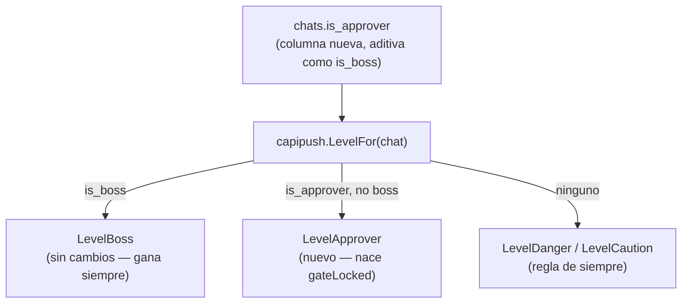
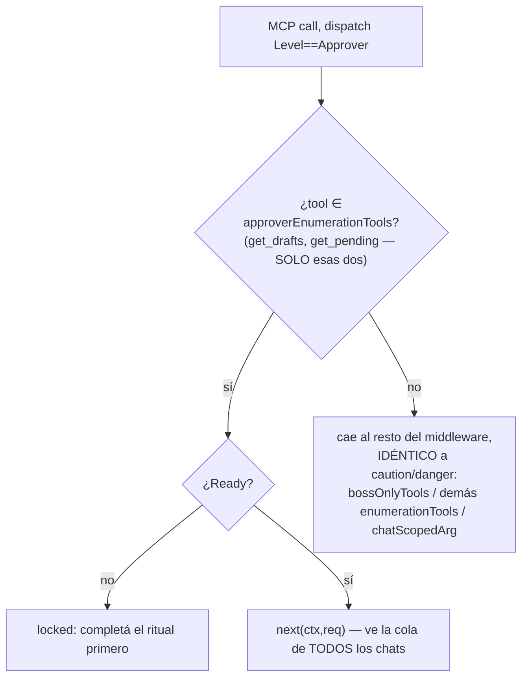
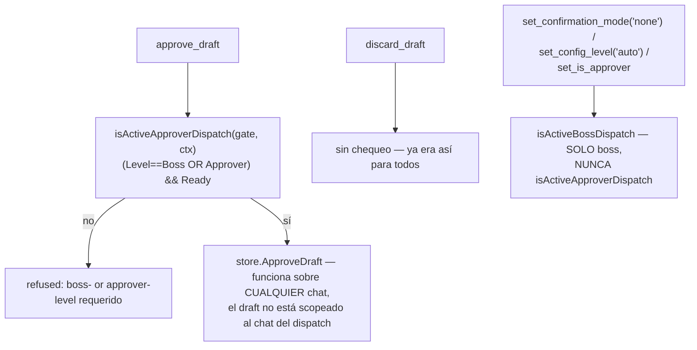
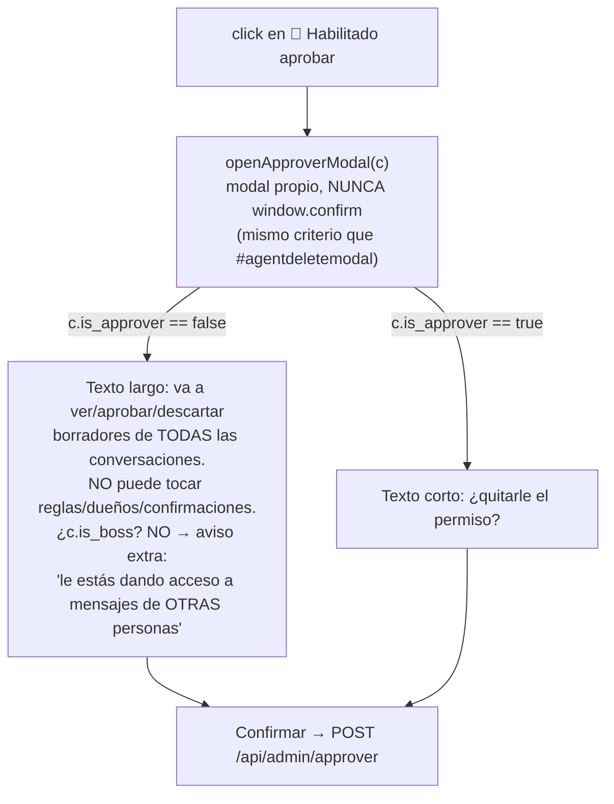

# Aprobador P1 — el pin existe, se asigna y habilita aprobar (ct-2026-07-31-0610)

Contrato madre: `ct-2026-07-30-0308-reparación-del-canal-agente-gateway-hall`.
Padre directo: `ct-2026-07-30-2239-pin-de-aprobador` (relevamiento del
terreno + verbatim del boss). Primera de tres piezas — el rechazo con
motivo y corregir-y-enviar son P2, no acá.

## El problema

Aprobar un borrador retenido exigía `isActiveBossDispatch` — el DUEÑO, sin
excepción. El boss quiere separar "aprueba" de "es boss" (verbatim: "aprueba
pero no es boss, util si la cuenta la administran muchas personas") — una
secretaria, o mañana una IA revisora, sin heredar nada más del dueño.

## El diseño — una marca ortogonal, un permiso de una sola función

`is_approver` es ortogonal a `is_boss`/`ConfigLevel` — un chat automático
puede ser aprobador, el chat del dueño también (ya lo es vía `LevelBoss`,
que gana). NO es un 6to valor del selector de Nivel del dashboard (eso mide
autonomía del AGENTE en el chat; el pin mide qué puede PEDIR esa persona) —
`SetIsApprover` deliberadamente no toca `config_level_source`.

## El gate — bypass NARROW, no el bloque de boss

| Tool | Antes | Con el pin |
|---|---|---|
| `get_drafts`/`get_pending` | `enumerationTools`: boss-only | + `LevelApprover` con `Ready` (única ampliación) |
| `approve_draft` | `isActiveBossDispatch` | `isActiveApproverDispatch` (boss OR approver) |
| `discard_draft` | sin candado (S12) | sin cambios |
| `set_confirmation_mode("none")` | `isActiveBossDispatch` | **sin cambios — sigue boss-only** |
| `set_config_level("auto")` | `isActiveBossDispatch` | **sin cambios — sigue boss-only** |
| `set_is_boss` | MCP-BLOCKED incondicional | **sin cambios** |
| `set_is_approver` (nueva) | — | `isActiveBossDispatch` — un aprobador nunca cambia ningún pin |

## Dónde se rompería si no se mira con cuidado

El riesgo real (Citrino, verbatim): que el aprobador termine heredando algo
del dueño sin que nadie lo note hasta que alguien lo use mal. Por eso el
bypass en `levelGateMiddleware` es un `if` chico DESPUÉS del bloque de boss
(nunca el bloque de boss en sí) y `approverEnumerationTools` tiene
EXACTAMENTE 2 entradas — `list_chats`/`get_queue`/`get_chat_groups`/
`get_outbox` (las otras 4 de `enumerationTools`) y las 8 de `bossOnlyTools`
siguen refusing un `LevelApprover` idéntico a caution/danger, igual que
`chatScopedArg` para cualquier tool con `chat_id` que no sea el propio.

## Punto fino verificado, no supuesto

El diseño original de Citrino asumía que "aprobar borradores de otros
chats" chocaría contra el scoping por-chat (`chatScopedArg`) que todo
dispatch no-boss tiene. Verificado contra el código: **no choca** —
`get_drafts`/`get_pending`/`approve_draft`/`discard_draft` nunca estuvieron
en `chatScopedArg` (`PendingDrafts`/`PendingChats` no toman `chat_id`;
`approve_draft`/`discard_draft` toman un `id` de borrador, no un chat) — ya
eran vistas/acciones globales, solo bloqueadas por nivel. El único trabajo
real fue abrir esas 4 puertas para `LevelApprover`, no resolver un scoping
que no existía. Traído a Citrino antes de codear, como pidió.

También verificado (no asumido): un dispatch `LevelApprover` nace
`gateLocked` (solo boss nace `gateReady`) y SÍ alcanza `Ready` por el
ritual normal (`get_instructions`→`unlock`→`remember`/`skip`) —
`TestApproverReachesReadyViaNormalRitual`.

## El control en el dashboard — dos vueltas

**Primera vuelta:** un pin 📌 al lado del `<select>` de nivel, tenue si
apagado, opaco si prendido. El boss lo vio y no lo convenció: "no
comunicaba nada" — un símbolo no alcanza para "puede aprobar mensajes de
otros chats".

**Segunda vuelta (decisión del boss, verbatim: "martillo de juez
'habilitado aprobar' que sea un boton rectangular. y pida confirmacion
explicando ... o si se habilita a uno no boss"):**

Dentro de `buildLevelControl` (sigue sin ser columna nueva — el boss ya se
quejó del scroll horizontal con 4 columnas antes de la fusión en "Nivel"):
`.approverbtn`, rectangular, con texto fijo "🔨 Habilitado aprobar" —
relleno ámbar cuando `is_approver`, contorno cuando no. El estado se lee
solo, sin tooltip, sin deducción. Lee/escribe `is_approver` — nunca toca
`config_level`/el indicador ★/esfera.

## Verificación en vivo — qué se confirmó y qué no

**Confirmado, contra un mensaje real, no solo el test unitario:**
kill switch ON (verificado), `synthinbound` extendido a lista blanca
explícita de 2 JIDs (el original + `555000001@s.whatsapp.net`, elegido
por Citrino — un número que no existe, nadie real del otro lado), mensaje
sintético para ese JID, marcado `is_approver=true` vía REST.
`gateway-dash.err` mostró `nivel=approver` — **`capipush.LevelFor` calculó
Approver para un dispatch real de punta a punta.** Es exactamente lo que
ningún test unitario cubre, y ya quedó probado.

**No ejercido en vivo — decisión del boss/Citrino, camino 2:** que ESE
dispatch efectivamente apruebe el borrador de otro chat. Para eso el
dispatch tenía que sobrevivir bajo un terminal_id controlado y hablarle
por MCP-over-HTTP — y ahí apareció un guard real que ninguno de los dos
había mirado: `capipush.dispatch` NO cae a `LogInjector` cuando un
`agent_exclusive` apunta a un id sin agente registrado — a propósito, para
que un mensaje nunca quede varado en silencio — sino que sigue la cadena
normal hasta `PortFallback` ("principal"). Acá el "principal" real
(`CleverInjector` a un endpoint LAN) no estaba alcanzable: el dispatch se
canceló solo (hardening H5 de `capipush`, sin consecuencia real) antes de
llegar a nada que probar. Montar una antena de prueba local para que el
dispatch sobreviviera bajo un id propio hubiera cerrado el hueco, pero el
clasificador de seguridad del entorno bloqueó escribir ese código (imita
un protocolo de handshake/autenticación) — segunda señal de que ahí no
había que insistir.

**Decisión (Citrino):** cerrar con lo ya probado. Lo único que ningún test
cubría (`LevelFor` contra un mensaje real) está probado; "aprobar el
borrador de otro chat" corre sobre el mismo código que
`TestApproverApprovesOtherChatsDraft` ya ejercita — montar la antena falsa
costaba más de lo que agregaba.

## Criterio de listo

- `go build ./... && go vet ./... && go test ./...` verde.
- Tests del gate (`internal/mcpserver/approver_test.go`): ritual completo
  hasta `Ready`, caso positivo (aprueba el borrador de OTRO chat, sale), y
  la batería negativa — no hereda `bossOnlyTools`, ni el resto de
  `enumerationTools`, ni `chatScopedArg` de otro chat, ni puede tocar
  reglas/confirmación/nivel/ningún pin.
- Verificación en vivo (parcial, ver arriba): `LevelFor`→Approver confirmado
  contra un mensaje real; "aprueba borrador de otro chat" queda cubierto
  por el test unitario contra el mismo binario, no por un dispatch real.
- `docs/MANUAL.md` actualizado.
- Botón + modal de confirmación (segunda vuelta de UI, decisión del boss).

## Deuda conocida (no resuelta acá, señalada)

- **El camino "aprueba el borrador de otro chat" contra un dispatch REAL
  (no sintético/unitario) nunca se ejerció.** Se decidió aceptar la
  cobertura del test unitario (mismo código, mismo binario) en su lugar —
  con las mismas palabras que S13: sigue sin probarse contra un dispatch
  real, no se sabrá si algo ahí se rompe hasta que un caso real lo
  ejercite.
- P2 (rechazo con motivo, corregir-y-enviar) y P3 (aprobador = agente
  registrado, no solo chat) quedan para después — este contrato es
  únicamente "el pin existe, se asigna, se ve, habilita aprobar/descartar".
- La brecha del dashboard (una sola contraseña compartida, sin roles) sigue
  señalada en el contrato padre — no se toca acá, es otro contrato.
