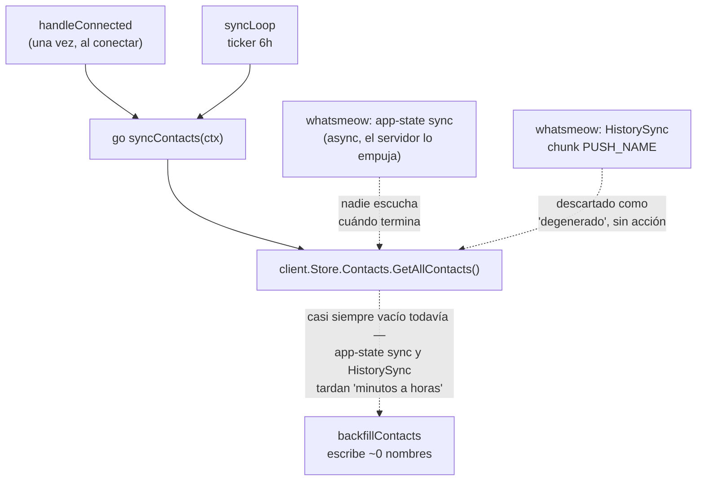
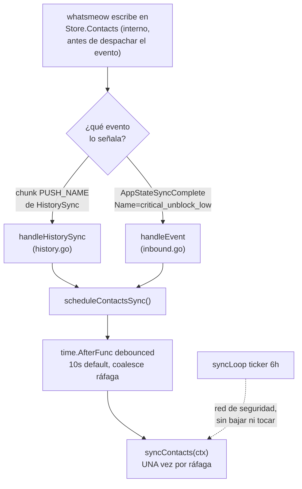
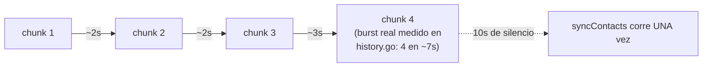
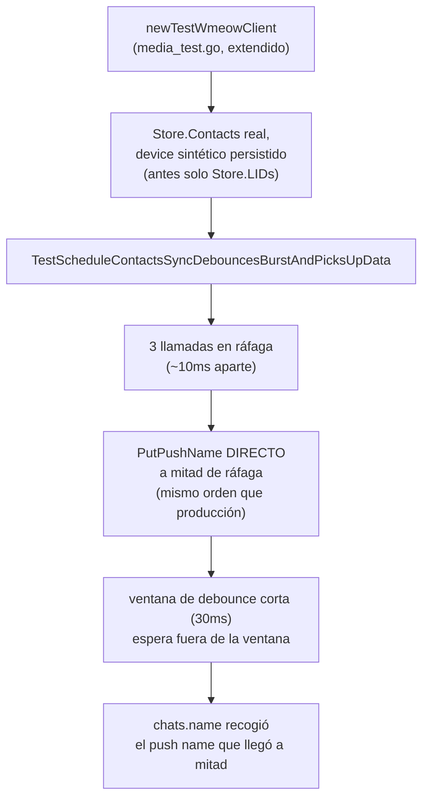

# No llegan contactos en una instalación nueva (ct-2026-07-31)

Boss: *"la lista de contactos no carga"*. Instalación real medida dos veces,
~20 min de diferencia, números idénticos — no era "todavía sincronizando",
no llegaba nunca. Diagnóstico completo (mensaje aparte a Citrino) encontró
UNA causa raíz para `is_contact=0` y `chats.name` vacío en 714/720 chats;
`history_state` resultó ruido ya conocido, sin relación (columna muerta
desde ct-2026-07-24-2004).

## La causa — reloj, no evento

Ningún código distinto en dev: `handleConnected` se dispara en CADA
reconexión, no solo el primer pareo. Una instancia vieja acumuló muchas
corridas de `syncContacts` a lo largo de su vida — alguna cayó después de
que los datos ya habían llegado, y como `TouchChat`/`SetContactName` son
upserts persistentes, quedó pegado para siempre. Una instalación de 20
minutos tuvo una sola oportunidad, temprana.

## El fix — reaccionar al evento

`critical_unblock_low` verificado leyendo `appstate/keys.go` de la
librería vendored — el nombre obvio ("regular") es otra colección
(config local de chat, no contactos).

## Por qué el debounce, y por qué 10s

`syncContacts` recorre cada contacto con un delay anti-ban real —
correrlo una vez por chunk sería lento y sin beneficio. 10s: más que el
burst observado, corto comparado con las 6h viejas.

## Verificación sin cuenta de WhatsApp nueva

Condición explícita de Citrino: no vincular una cuenta nueva para probar
sin hablarlo antes, y el bug solo se reproduce en una instalación nueva
(la del boss ya pasó ese momento). Resuelto reproduciendo la carrera
offline:

Más 4 tests de los disparadores en aislamiento (`TestHandleHistorySync
PushNameChunkSchedulesContactsSync`, `...ConversationsChunkDoesNotSchedule...`,
`TestHandleEventAppStateSyncCompleteContactsSchedulesSync`,
`...OtherCollectionIgnored`).

## Criterio de listo

- `go build ./... && go vet ./... && go test ./...` verde.
- El tick de 6h queda intacto, sin bajar — red de seguridad, no mecanismo
  principal.
- Comentario en el descarte del chunk `PUSH_NAME` explica por qué el
  contenido se descarta Y por qué el chunk en sí es una señal.
- Nada pedido de nuevo a WhatsApp — los datos ya los mandó; el fix es
  mirarlos en el momento correcto.
- `docs/MANUAL.md` actualizado.
- Instalación real del boss: sin escritura, sin reinicio — verificado
  offline, pendiente que el fix se despliegue ahí para confirmación final
  en vivo (fuera de este cambio, coordinar con Citrino).
