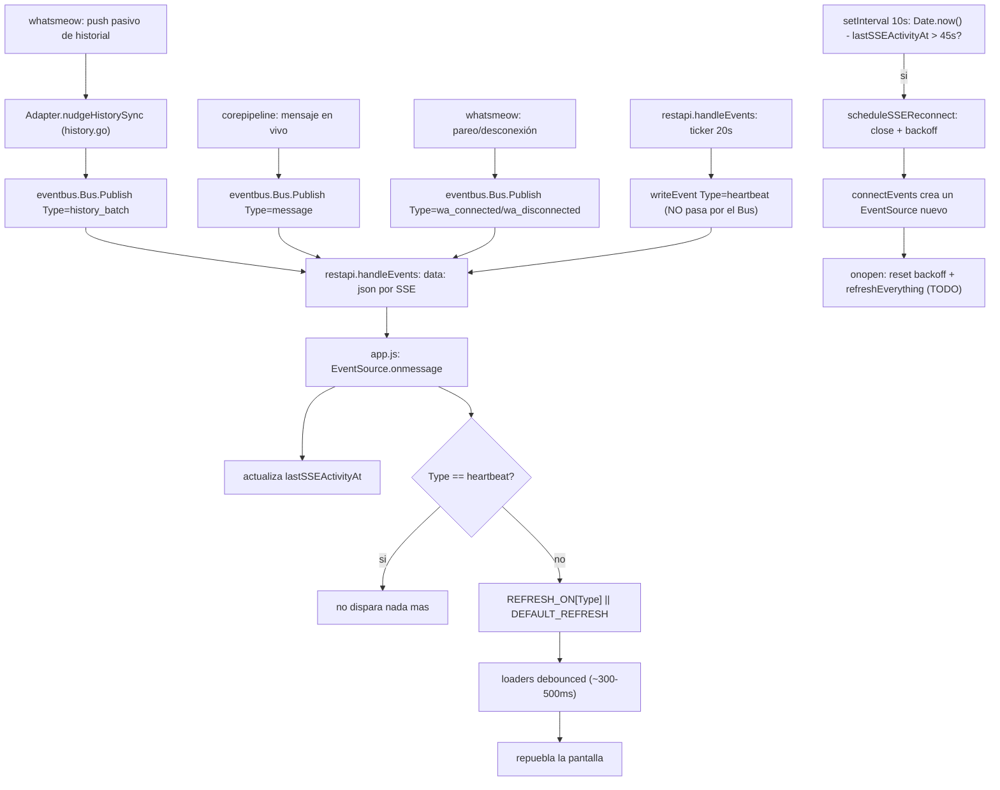

# Dashboard: auto-refresco sin F5 (ct-2026-07-24-0527)

Pieza C ("mensajes en vivo en el dashboard") prometía esto y no lo cumplía.
Síntoma real: el boss se parea, entran 431 conversaciones/1108 mensajes por
el push pasivo de historial, y el dashboard sigue mostrando la foto de
cuando cargó la página — 1 sola fila. Causa raíz completa en
`docs/HISTORY-SYNC-REGRESION-2026-07-24.md` (measurement) y en el reporte
de diagnóstico a Citrino (hex `81123a77`): el handler SSE cortaba con
`return` antes de refrescar la lista para `wa_connected`, y el push pasivo
de historial no publicaba nada al eventbus.

El boss subió el listón mientras se armaba el fix puntual (verbatim,
2026-07-29): *"que el dashboard tenga mecanismos de auto refresco... nada
de andar presionando ctrl f5, eso es producto de mala calidad."* Regla de
producto, no bug puntual: **ninguna vista puede depender de que el usuario
recargue la página.**

## Diseño (decisión de arquitectura de Citrino)

## Por qué esta forma y no otra

- **Tabla declarativa (`REFRESH_ON`), no una cadena de `if/return`.** El
  bug real no era "un evento mal manejado" — era la FORMA del código: cada
  rama nueva podía olvidarse de refrescar algo, y no había dónde ver ese
  olvido. `REFRESH_ON[tipo] || DEFAULT_REFRESH` es el único lugar de
  decisión: agregar un evento sin entrada cae al default (`[loadStatus]`),
  nunca "no hace nada", pero si necesita más hay que declararlo, literal.
- **Debounce en los loaders, no coalescing en el backend.** `nudgeHistorySync`
  publica SIN throttle, una vez por chunk (4 chunks en ~7s en la captura
  real del 29-jul) — coalescer ahí solo cubriría ráfagas de ESE evento. El
  debounce del lado del dashboard (`debounce()`, ventana aleatoria
  300-500ms, mismo estilo anti-fingerprint que los delays del backend Go)
  cubre cualquier MEZCLA de tipos de evento llegando juntos, no solo uno.
- **`history_batch` es un tipo de evento propio, nunca `"message"`.**
  `"message"` es lo que le dice al agente "hay trabajo nuevo"
  (`corepipeline.handleInbound`). El historial no debe parecer un mensaje
  nuevo — mismo principio que ya regía `persistHistoryMessage` (nunca
  escribe a `a.inbound`). Un futuro suscriptor agent-facing que solo
  reacciona a `"message"` queda intacto.
- **El heartbeat pasa a ser un evento real, no un comentario SSE.** Un
  comentario (`: keep-alive\n\n`) nunca dispara `EventSource.onmessage` —
  el dashboard no tenía CÓMO saber que 20s habían pasado sin señal. Sin
  esto, el watchdog de reconexión no tiene nada que mirar.
- **Watchdog por inactividad (45s, más del doble del heartbeat), no
  confiar solo en `onerror`.** Una conexión a medio morir (sleep del
  equipo, el gateway reiniciado sin que el socket viejo reciba un cierre
  limpio) nunca dispara `onerror` — el navegador simplemente no tiene
  ninguna señal de que el socket murió. Silencio prolongado es la única
  pista posible del lado del cliente.
- **Reconexión propia con backoff exponencial (1s → 30s tope), no la
  reconexión nativa de `EventSource`.** El reintento nativo usa un delay
  fijo (no configurable desde `data:`, y no hay backoff real). `onerror`
  hace `close()` explícito — eso desactiva el reintento nativo del mismo
  objeto — y programa el propio con backoff.
- **Al reconectar (`onopen`), refrescar TODO, no confiar en qué se
  perdió.** Cualquier evento emitido mientras la conexión estuvo caída se
  perdió para siempre (el bus no tiene replay) — la única forma honesta de
  quedar consistente es repoblar desde cero al reabrir.
- **Nada de `setInterval` recargando todo a fuerza bruta** (pedido
  explícito del boss/Citrino) — cada refresco dispara por una señal real:
  un evento del bus, o la inactividad prolongada de la propia conexión SSE.
  Los `setInterval` de 15s que ya existían (`loadStatus`/`loadPendingDrafts`/
  `loadAgents`) quedan como estaban — son polling de respaldo preexistente,
  no algo nuevo agregado acá.

## Mapeo de la tabla de ejemplo de Citrino a lo que existe hoy

El diseño original mencionaba `loadQR`/`qr_updated`/`inbound` como
ilustración. En este código real:

- **No existe un `loadQR` separado** — `loadStatus()` ya llama
  `applyLinkGate(s)` + `qrUpdateTimer(s)` internamente (actualizan el
  overlay QR como efecto de leer `/api/status`). Agregar un wrapper
  redundante sería abstracción especulativa sin un segundo caso real.
- **No existe un evento `qr_updated`** — nada lo publica hoy. El
  countdown/refresh del código QR mientras el overlay está abierto ya lo
  cubre `qrTimerInterval` (poll de 1s, mecanismo preexistente, acotado a
  cuando el overlay está realmente abierto — no se tocó).
- **El evento de mensaje en vivo real se llama `"message"`**, no
  `"inbound"` (nombre real de `corepipeline.handleInbound`'s publish).

## El otro bug encontrado en el camino: "Desconectar" no mostraba el QR

`disconnect_confirm` (botón "Desconectar" del modal) mostraba *"reiniciá
el gateway para ver el QR nuevo"* — texto de ANTES de que P1
(ct-2026-07-24-0015) agregara el re-pareo en caliente. `Logout()`
(`whatsmeow/adapter.go`) no publica ningún evento al eventbus (doc propia
del método) — nada le avisa al dashboard que hay que re-parear. Fix:
factorizado `startReconnectFlow()` (compartido con el botón "Conectar
QR") — cierra el modal y dispara `POST /api/admin/reconnect` +
overlay QR de una, en vez de pedirle al boss que reinicie el proceso a
mano.

## Verificación

- Backend: `go build/vet/test` verdes. `TestNudgeHistorySyncPublishesEveryCall`
  confirma el Type y que no hay throttle. Verificado el heartbeat contra un
  proceso real y aislado (puertos 18091/18092, DB descartable — nunca
  tocó la sesión pareada del boss): `curl -N /api/events` devolvió
  `data: {"type":"heartbeat","ts":...}` — un evento real, ya no un
  comentario invisible. Ciclo kill+relanzamiento del proceso aislado
  verificado limpio (mismo patrón que "gateway reiniciado con la pestaña
  abierta").
- **Frontend: NO verificado en navegador real** — la extensión Claude in
  Chrome no está disponible en este entorno (`tabs_context_mcp` devuelve
  "Browser extension is not connected"). `node --check` confirma sintaxis
  válida; el resto es revisión de código, no observación en vivo. Falta el
  criterio de aceptación real de Citrino ("si en algún momento tenés que
  apretar F5, no está terminado") — alguien con navegador tiene que
  probarlo antes de dar esto por cerrado de verdad, en particular el caso
  4 (matar el proceso del gateway con la pestaña abierta y ver que se
  recupera sola).
