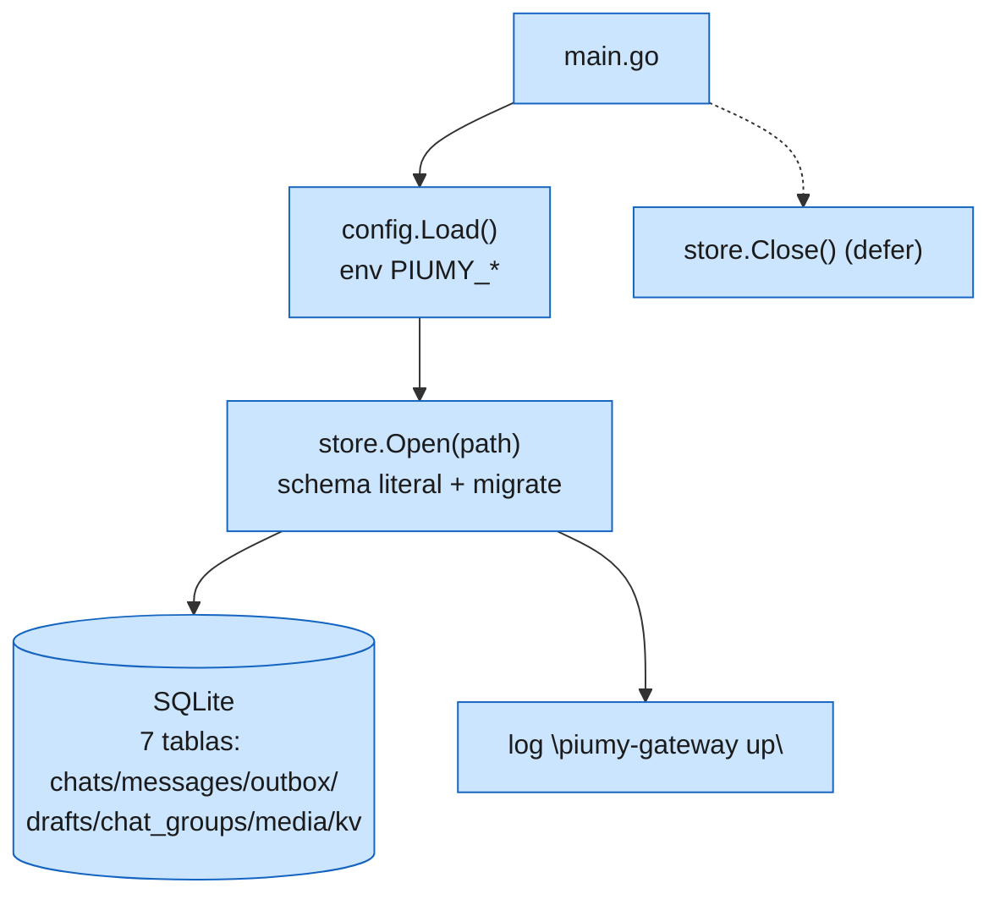

# F0 — Esqueleto Go de piumy-gateway

Diagrama del sub-cambio F0: arranque mínimo (config → store → salida limpia),
sin lógica de negocio (eso es F1). El resto de `internal/*` queda como
andamiaje vacío para las fases siguientes.

Andamiaje sin lógica (carpetas `internal/` del inventario, contenido llega en
F1/F2): `router governor eventbus state mcpguard capi capipush mcpserver
sessionbackup sysinfo netinfo dashboard autoreply bridge corepipeline openwa`.
