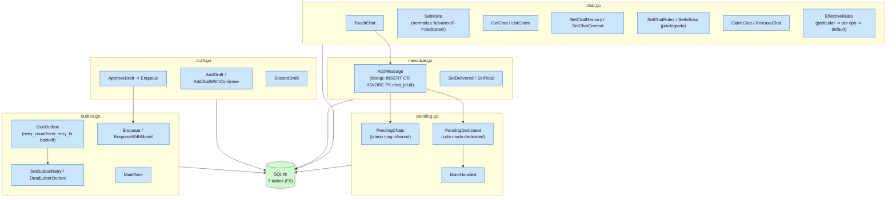

# F1a — Capa de acceso de store

Diagrama del flujo de datos de la capa de acceso (CRUD) sobre el esquema ya
migrado en F0. Cherry-pick limpio de Piumy `store.go` (~1292 líneas), sin
tocar `capi`/`capipush`/`mcpserver`/`restapi` (fuera de scope, F4).

Sin dependencias a otros paquetes internos (store es agnóstico, como en
Piumy) — nada que flaguear.
