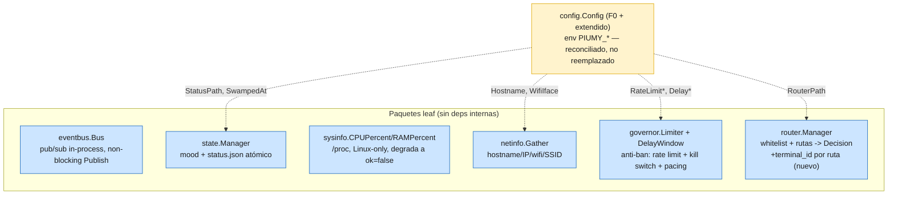

# F1b — Infra & routing leaves

Diagrama del batch: 7 paquetes leaf (ninguno importa otro paquete interno),
cherry-pick directo desde Piumy. `config` es el único que requiere
reconciliación (ya existía un `config.go` env-only de F0).

## Reconciliación de `config`

El `config.go` de F0 (env-only, 5 campos: `DBPath/MCPKey/OpenWA*`) se
**extiende**, no se reemplaza. De las ~50 vars de Piumy (`PIMYWA_*`), sumo
solo las que un paquete de **este** batch consume para poder construirse
(`RouterPath`, `RateLimitPerMin/Day`, `Dispatch/Read/ActionDelay Min/Max`,
`StatusPath`, `SwampedAt`, `Hostname`, `WifiIface`) — todas renombradas a
`PIUMY_*`.

**Explícitamente NO porteado** (fuera del alcance de piumy-gateway o de otra
fase):
- `Gateway`/`DeviceName`/`SessionDB` (selector whatsmeow) — `whatsmeow` no se
  usa, per tesis del proyecto.
- `BatteryFile`/`FaceFile`/`BatteryMaxAge`/`FaceMaxAge`/`StatusHeartbeat`/
  `BatteryLogFile` — sidecars de un adaptador de display/batería físico
  (e-paper Pi) que no existe en el diseño de piumy-gateway. **Actualización:**
  el propio mecanismo del lado `state` (`batteryFile`/`faceFile`/
  `ReadBatteryFile`/`ReadFaceFile`/`BatteryReading`, más los campos
  `Battery/Voltage/Charging/TimeRemaining/Face` del `Status`) se **recortó**
  de `state.go` en un 6º commit — Citrino confirmó que era código muerto sin
  ningún caller posible, no un leaf a preservar. El core de mood/status.json
  (`SwampedAt`, `moodTier`, `React`/`SetResting`/`SetMuted`, lo que
  router/governor consumen) queda intacto.
- `Dash*` (dashboard) — F4, depende de `restapi`.
- `Backup*` (sessionbackup), `MCPGuard*` (mcpguard), `Bridge*`/`DeepSeek*`/
  `AutoReply*` (bridge/autoreply) — paquetes de F1c, cada uno suma su propia
  config cuando aterrice.
- `MediaDir`/`MediaMaxMB` — `media` es post-MVP (MIGRATION-PLAN).
- `ClaimTTLDefault`/`OutboxMaxRetry` — consumidos por `mcpserver`/pipeline
  (F2/F4), no por ningún paquete de este batch.
