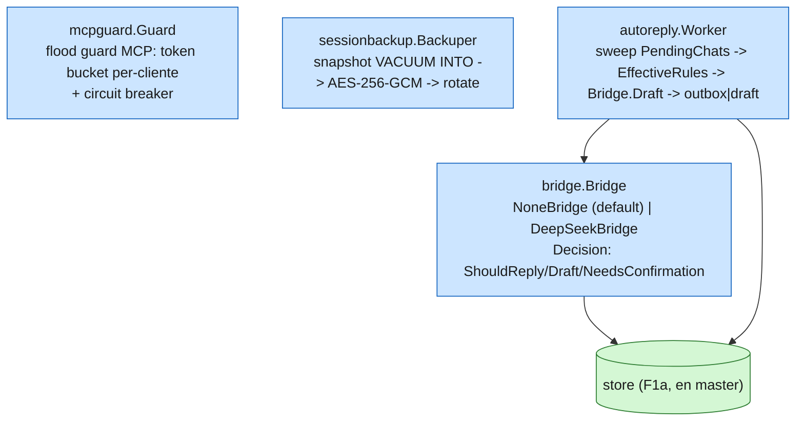

# F1c — mcpguard, sessionbackup, bridge, autoreply (cierra F1)

Orden por dependencia real: `mcpguard`/`sessionbackup` (leaves) → `bridge`
(→ `store`, ya en master) → `autoreply` (→ `bridge` + `store`, último).
`dashboard` no entra (F4, depende de `restapi`).

## Decisión: `sessionbackup` respalda `store.db`, no una sesión whatsmeow

En Piumy, `sessionbackup` respalda la DB de sesión de **whatsmeow** (el
device-pairing de WhatsApp Web) — algo que piumy-gateway **no tiene**:
`whatsmeow` no se usa, open-wa administra su propia sesión externamente
(proceso Node, fuera de este módulo Go).

El mecanismo en sí (`crypto.go`/`lock.go`/`restore.go`/`snapshot.go`/
`volume.go`) es **genérico**: `SessionDBPath` es un string cualquiera, y
`snapshotSQLite` hace `VACUUM INTO` sobre cualquier SQLite. Se migra tal cual
(cero cambios de lógica) pero se **reinterpreta el target**: en piumy-gateway
va a respaldar el **`store.db` propio** (chats/mensajes/memoria/rules) — de
hecho más valioso de proteger que un token de sesión, porque ahí vive la
memoria que el agente construyó con cada contacto. Esto se resuelve
efectivamente al cablear `main.go` (F5): `sessionbackup.Config.SessionDBPath
= cfg.DBPath`. Este batch solo deja el paquete listo + su config.

Los mensajes de error/log que decían "pimywa serve" se corrigen a
"piumy-gateway" (ver DoD: cero `pimywa`/`pimiwa` en código nuevo).

## Config nueva (reconciliación, no reemplazo)

- `BackupKey`/`BackupDir`/`BackupKeep`/`BackupInterval` → `sessionbackup`.
- `MCPGuardRatePerMin`/`MCPGuardEmitRatePerMin`/`MCPGuardBlockThreshold`/
  `MCPGuardBlockCooldown` → `mcpguard`.
- `BridgePlugin`/`DeepSeekKey`/`DeepSeekEndpoint`/`DeepSeekModel`/
  `BridgeBudget` → `bridge`.
- `AutoReplyInterval`/`AutoReplyDelay` → `autoreply`.

Todo `PIUMY_*`, cero hardcode, mismos defaults que Piumy (probados en
producción) salvo el prefijo de env var.
