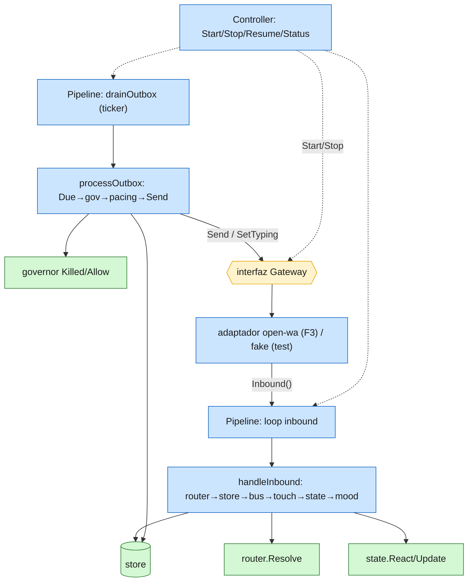

# F2 — Diseño: interfaz Gateway + corepipeline + control facade

Diseño del arquitecto (Citrino). F2 **reescribe limpio** el spaghetti que en Piumy vive
embebido en `gateway/gateway.go` (1302 líneas que mezclan whatsmeow + router + store +
governor + outbox + media en un solo tipo). Acá se parte en tres piezas con una
responsabilidad cada una. **No es cherry-pick** — es rediseño, mirando el original como
referencia para no perder los edge-cases anti-ban.

> Regla que gobierna F2 (CLAUDE.md #2): la interfaz existe **para que el core NO conozca a
> open-wa**, no por pluggability especulativa. Una sola implementación real (open-wa, F3) +
> un fake para tests. Nada más.

## Qué migra y qué se cae

`gateway.go` tiene dos clases de código mezcladas:

**AGNÓSTICO (migra al `corepipeline`, reescrito):**
- `onMessage` → `handleInbound`: router.Resolve (allowed?) → store.AddMessage → eventbus nudge → TouchChat → CountPendingDedicated + state.Update(Queue/LastMsg) → React mood (vip/new_msg).
- `drainOutbox`/`processOutbox` → drain loop: DueOutbox → governor(Killed/Allow) → dispatch delay (pacing) → typing on → send → typing off → MarkSent → sentMessageRow(AddMessage) → Sent counter.
- `retryOrDeadLetter` + `exponentialBackoff` → tal cual (anti-ban: nunca resend en loop).
- `sentMessageRow` → tal cual (registra el msg saliente con el id real del cliente).
- `markReadMessages` + read delay → recibos honestos (solo cuando el agente atendió).
- delays `dispatchDelay`/`readDelay`/`actionDelay` (leen KV-override del governor).

**WHATSMEOW-ESPECÍFICO (NO migra — lo provee el adaptador open-wa en F3):**
- `connect`, `reconnectLoop`, `handleQRChannel`, QR exposure cap, `onConnected`/`onLoggedOut`.
- `resolvePN` (@lid→número), `messageText`/`unwrapMessage` (contenedores whatsmeow), `onReceipt` con tipos whatsmeow.
- `SendChatPresence`/`SendMessage(waE2E)`/`IsConnected`/`ParseJID` → se vuelven llamadas a la interfaz `Gateway`.
- Todo el ciclo de pairing/QR: open-wa maneja su sesión **afuera**, no existe acá. El facade de piumy-gateway es más simple que el `Controller` de Piumy por esto.

**MEDIA:** post-MVP (MIGRATION-PLAN). `scheduleMediaDownload`/`gcMediaLoop` NO se portan en F2; el `Inbound.Type` se guarda igual, la descarga es un shim/no-op hasta una fase posterior.

## 1. La interfaz `Gateway` (el seam — el core solo conoce esto)

Vive en su propio paquete (`internal/gateway`, solo la interfaz + tipos; sin implementación).

```go
package gateway

import "context"

// Inbound es un mensaje entrante agnóstico. El adaptador (F3) parsea el evento
// crudo de open-wa a esto y lo entrega al pipeline. Ningún tipo de open-wa
// (ni de whatsmeow) cruza este seam. ChatJID/SenderJID ya vienen resueltos al
// formato que usa router.json (número real) — la resolución es del adaptador.
type Inbound struct {
    ChatJID   string
    SenderJID string
    MsgID     string
    Text      string
    Type      string // "text", "image", ... (Type se guarda; media = post-MVP)
    TS        int64
    PushName  string // nombre best-effort para TouchChat
}

// SendResult es lo que devuelve un Send exitoso.
type SendResult struct {
    MsgID string
    TS    int64
}

// Status es el estado de conexión del cliente (para el facade/dashboard).
type Status struct {
    Connected bool
}

// Gateway abstrae el cliente de mensajería. Implementaciones: openwa (F3) y un
// fake para tests. El core NUNCA importa open-wa — solo esta interfaz.
type Gateway interface {
    // Start conecta el cliente y empieza a entregar mensajes por Inbound().
    // Idempotente. El ctx corta la conexión al cancelarse.
    Start(ctx context.Context) error
    // Stop desconecta y cierra el canal de Inbound().
    Stop()
    // Connected: el drain del outbox no envía mientras esté false.
    Connected() bool
    // Inbound: stream de mensajes entrantes que el adaptador alimenta.
    Inbound() <-chan Inbound
    // Send entrega text al chat y devuelve el id de mensaje del cliente.
    Send(ctx context.Context, toJID, text string) (SendResult, error)
    // SetTyping alterna el indicador "escribiendo" (best-effort; un cliente
    // que no lo soporte hace no-op).
    SetTyping(ctx context.Context, toJID string, on bool) error
    // MarkRead manda recibos de lectura (recibos honestos: cuando el agente
    // atendió de verdad, no al recibir).
    MarkRead(ctx context.Context, chatJID string, msgIDs []string) error
    // MarkDelivered ackea entrega. Probable no-op en open-wa (WhatsApp Web lo
    // hace solo) — queda en el seam por completitud.
    MarkDelivered(ctx context.Context, chatJID string, msgIDs []string) error
}
```

## 2. `corepipeline` — la lógica agnóstica (goroutines + business logic)

Paquete `internal/corepipeline`. Tiene un `Gateway` + store + router + governor + state +
eventbus (todos ya migrados en F1). **No importa open-wa.**

```go
type Pipeline struct {
    gw    gateway.Gateway
    store *store.Store
    rt    *router.Manager
    gov   *governor.Limiter
    state *state.Manager
    bus   *eventbus.Bus   // opcional (SetBus)
    cfg   Config          // OutboxPoll, OutboxMaxRetry, delays...
}

func (p *Pipeline) Run(ctx context.Context)  // lanza los 2 loops:
```
- **Loop inbound:** `for msg := range p.gw.Inbound() { p.handleInbound(ctx, msg) }`
  - `handleInbound`: router.Resolve(allowed? → si no, return) → store.AddMessage → (si OK) eventbus.Publish("message") → TouchChat(pushname) → CountPendingDedicated → state.Update(Queue,LastMsg) → React mood (IsVIP? vip : new_msg).
  - **NO** marca read automático (decisión Piumy 2026-07-01: el read refleja atención real del agente, no recepción).
- **Loop outbox:** ticker `cfg.OutboxPoll` → `processOutbox(ctx)`:
  - `if !gw.Connected(): return`
  - `DueOutbox(10, now)`; por item: `gov.Killed()`→return, `gov.Allow()`→return si rate-limited, validar JID (inválido → MarkSent+skip), dispatch delay, `gw.SetTyping(to,true)`, ventana composing, `gw.Send(ctx,to,text)`, `gw.SetTyping(to,false)`, en error → `retryOrDeadLetter`, en éxito → MarkSent + sentMessageRow(AddMessage con el MsgID real) + Sent counter.
- `retryOrDeadLetter`/`exponentialBackoff`/`sentMessageRow`: portados tal cual de gateway.go.
- `MarkRead(chatJID, msgs)`: aplica el read delay anti-ban y llama `gw.MarkRead`.

## 3. Control facade

Paquete `internal/corepipeline` (o `internal/control`). Orquesta gateway + pipeline.
Mucho más simple que el `Controller` de Piumy: **sin QR/pairing/reconnect** (open-wa los maneja afuera).

```go
type Controller struct { gw gateway.Gateway; pipe *Pipeline; ... mu, running, cancel, doneCh }
func (c *Controller) Start() error   // gw.Start(ctx) + pipe.Run(ctx) en goroutine; idempotente
func (c *Controller) Stop()          // cancel + espera salida limpia (doneCh)
func (c *Controller) Resume() error  // == Start (idempotente)
func (c *Controller) Status() gateway.Status
func (c *Controller) SetBus(b *eventbus.Bus)
func (c *Controller) MarkRead(chatJID string, msgs []store.Message) // delega a pipe (paced) si running
```
`SetPostLinkHook`/`onConnectedHook` de Piumy: opcional. El "conectado" ahora lo reporta el
adaptador; el hook (ej. backup post-link) se puede disparar desde el evento de conexión del
adaptador. Para F2 con el fake, alcanza con Start/Stop/Status.

## 4. Test con Gateway fake (lo pide MIGRATION-PLAN F2)

Un `fakeGateway` que implementa la interfaz: `Inbound()` devuelve un canal que el test
alimenta; `Send` registra lo enviado (y puede simular error para probar retry/deadletter);
`Connected()` configurable. Con eso se testea TODO el pipeline sin open-wa:
- inbound: un Inbound entra → se guarda en store, respeta router (no-allowed no guarda), toca chat, actualiza state.
- outbox: encolar → drain lo envía por el fake, MarkSent, sentMessageRow; fake con error → retry/backoff → deadletter al tope; `gov.Killed()`/`!Allow()` → no envía.

## Diagrama objetivo (F2)



## DoD de F2
- `internal/gateway` (solo interfaz + tipos) + `internal/corepipeline` (Pipeline + Controller).
- `handleInbound` y `processOutbox` con los edge-cases de gateway.go preservados (router gate, eventbus solo-en-store-OK, anti-ban pacing/retry/deadletter, Sent recomputado no incrementado).
- Media = shim/no-op (post-MVP). Sin QR/pairing/reconnect (F3/open-wa).
- Test del pipeline con `fakeGateway` (inbound + outbox + retry/deadletter + kill/rate-limit).
- `go build/vet/test` verde. Diagrama validado con D'Flux.
