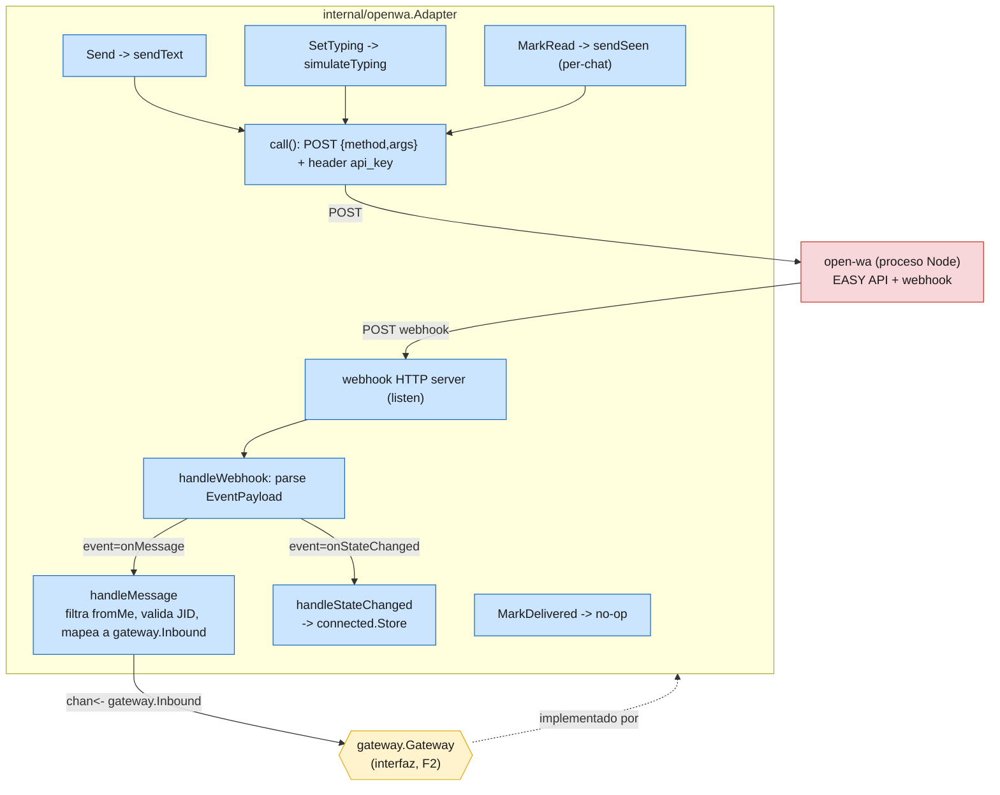

# F3 — Diagrama: adaptador open-wa

Complementa `docs/F3-OPENWA-ADAPTER.md` (diseño autoritativo, sin diagrama
propio) con el flujo concreto que implementa `internal/openwa.Adapter`.

## Decisiones tomadas al codear (no cerradas del todo por el doc — flagueadas a Citrino)

1. **`registerWebhook` vía REST:** el doc deja abierta la opción "REST o asumir
   `-w` ya seteado". Como el formato REST exacto de `registerWebhook` no está
   confirmado (a diferencia de `sendText`, que sí trae el body exacto), el
   adaptador **no** lo llama — asume `-w <url>` al levantar open-wa. No sumé
   `PIUMY_OPENWA_WEBHOOK_URL` a `config` porque hoy no tiene consumidor
   (sería config sin cablear a ningún lado).
2. **`simulateTyping`/`sendSeen` — forma exacta de `args`:** el doc solo da el
   body exacto de `sendText` (`{to, content}`). Para `simulateTyping` y
   `sendSeen` asumí la misma convención de objeto nombrado
   (`{"to":...,"on":...}` y `{"chatId":...}`) por consistencia con el único
   ejemplo confirmado. A verificar contra open-wa real en el smoke de F5.
3. **`onStateChanged` — forma de `data`:** no está dado el shape exacto.
   Parseo defensivo: primero como string plano, si falla como
   `{"state": "..."}`.
4. **`/getConnectionState` al arrancar:** el doc lo marca opcional y sin
   contrato exacto — no lo llamé. `Connected()` arranca en `false` (honesto:
   "no confirmado todavía", no un valor fabricado) hasta el primer
   `onStateChanged`.
5. **Respuesta de `sendText`:** el doc dice "MessageId (string) o boolean".
   Implementé asumiendo que `sendText` responde el string — si el body no
   decodifica como string, `Send` devuelve error (cae en el retry/backoff
   del pipeline, ya probado en F2).
