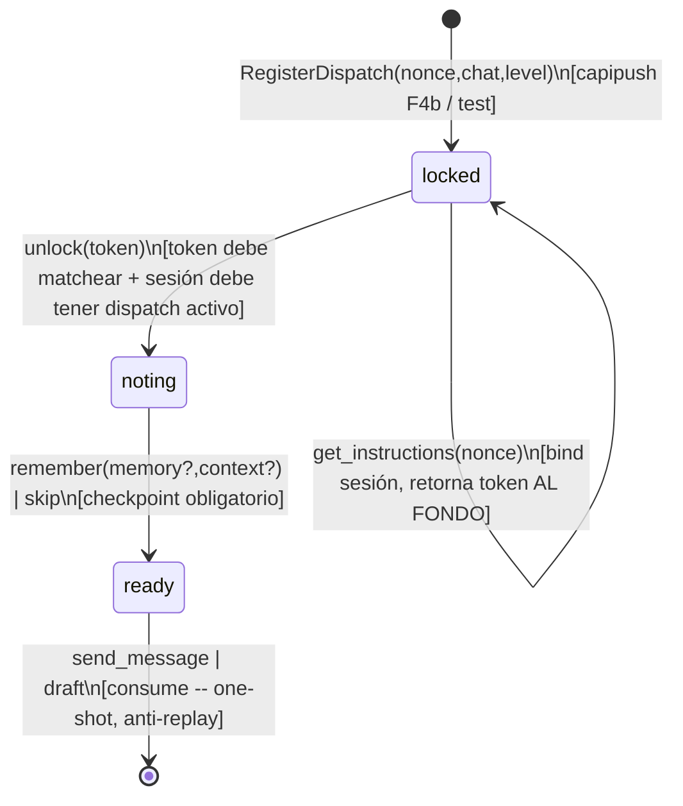
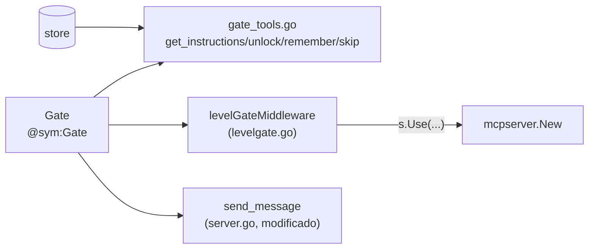

# F4a — Diagrama: gate state machine + gating por nivel (parte 2)

Confirmado por Citrino (mensaje `3e356d97`, 2026-07-09) antes de codear:

1. **Correlación nonce↔sesión:** tracking por MCP session ID, un dispatch activo por
   sesión. El estado se liga en `get_instructions(nonce)` (pull) — el server ya tiene el
   dispatch registrado (por capipush en F4b, por el test acá) antes de que el agente
   llame `get_instructions`. `remember/skip/send_message` NO llevan nonce — operan sobre
   el dispatch activo de la sesión.
2. **Red de seguridad:** `send_message(to=X)` valida `X == dispatch.chat_jid` para
   caution/danger (NO para boss — un dispatch boss puede mandar a cualquier chat). Esto
   hace la correlación robusta aunque "replace" pise un dispatch sin terminar.
3. **Anti-leakage de 2 capas** (caution/danger): (a) tools con `chat_id`/`to` — solo el
   chat del dispatch; (b) tools de enumeración (`list_chats`, `get_pending`, `get_queue`,
   `get_chat_groups`) — **no disponibles en absoluto**. Boss sin restricción.
4. **boss = sin gate**: el gate mecánicamente es igual para todos los niveles (unlock
   sigue validando token+estado), pero `send_message` NO exige `ready` ni chat-match
   cuando `dispatch.Level == "boss"`.

> **🔒 Gap de seguridad, hallado en auditoría (Citrino, post-merge):** "sin dispatch
> bound → irrestricto" (el default cuando ninguna sesión llamó `get_instructions`) es
> **fail-OPEN**, no un fallback seguro — un agente que saltea `get_instructions` bypassa
> lock/unlock + el anti-leakage por nivel (los 6 checks base de `send_message` sí
> siguen aplicando). Inerte hoy porque nada llama `RegisterDispatch` fuera de tests.
> **F4b tiene que cerrarlo:** `RegisterDispatch` liga el dispatch al `terminal_id`;
> una sesión con dispatch pendiente no puede actuar como "sin dispatch" (default DENY);
> boss/admin solo por nivel explícito o credencial aparte, nunca por ausencia de
> dispatch. Ver `docs/F4-DESIGN.md` (nota de seguridad) y los comentarios corregidos en
> `gate.go`/`levelgate.go`/`server.go`.

## Máquina de estados (por dispatch, keyed por nonce Y por sesión — mismo puntero)

## Componentes nuevos

## Judgment calls (parte 2)

1. **Sin `byToken` global** — `unlock(token)` busca el dispatch activo de LA SESIÓN
   que llama (no un índice global token→dispatch) y compara su propio token. Un token
   robado de otra sesión nunca matchea el dispatch de ESTA sesión — la propiedad
   anti-replay sale gratis de "cablear directo" sin un mapa de más.
2. **`RegisterDispatch` limpia el dispatch anterior de la sesión si lo reemplaza** —
   si la sesión ya tenía un nonce sin terminar y llega uno nuevo, el viejo se borra de
   `byNonce` también (huérfano = inútil, se descarta, no se deja pudrir en memoria).
3. **Sweep oportunista de dispatches no reclamados** (registrados pero nunca
   pulled vía `get_instructions`) — mismo patrón que `mcpguard.sweepLocked`: un TTL +
   barrido bajo lock en cada `RegisterDispatch`/`get_instructions`, sin goroutine nueva.
   Sin esto, un nonce registrado y abandonado (crash del agente, etc.) quedaría para
   siempre — no hay cAPI real todavía para que esto duela, pero el mecanismo ya existe
   en el codebase y es gratis reusarlo.
4. **`draft` y enforcement de `confirmation_mode` (F4-DESIGN §4) quedan FUERA de F4a**
   — el contrato de este subcontrato (`ct-2026-07-09-1600-...`) solo lista
   get_instructions/unlock/remember/skip como tools nuevas del gate; ni `draft` ni
   confirmation_mode aparecen en su Definition of Done. `send_message` es hoy la única
   vía de envío tras `ready` — igual que antes de F4a. Flagueado por si es una omisión,
   no una decisión.
5. **Tools "chat_id-scoped" para caution/danger** (bloqueadas si `chat_id`/`to` ≠
   `dispatch.chat_jid`): `get_chat`, `get_messages`, `set_chat_status`, `set_chat_active`,
   `set_chat_memory`, `set_chat_context`, `get_media`, `set_mode`, `escalate`,
   `mark_handled`, `resolve_chat`, `claim_chat`, `release_chat`. `send_message` tiene su
   propio check (mismo efecto, vive en su handler porque ya necesita leer el dispatch
   para el estado `ready`). Tools SIN concepto de chat (`get_status`, `get_decision_policy`,
   `get_outbox`, `get_drafts`, y los 4 tools del gate) — sin restricción por nivel.
