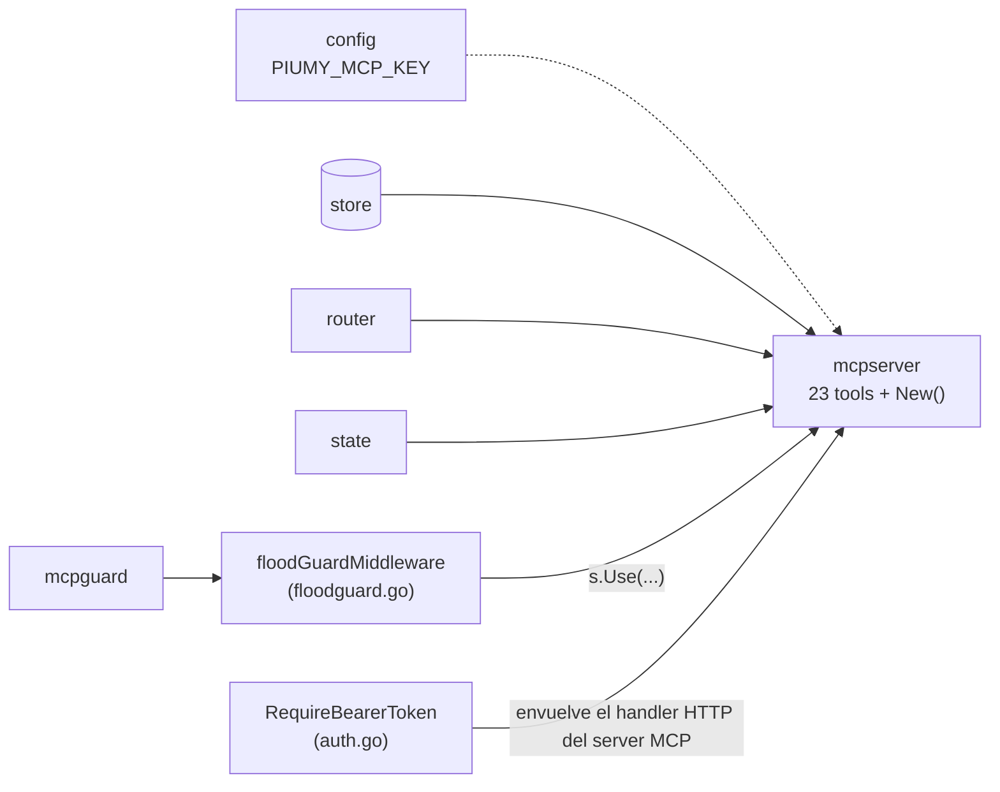

# F4a — Diagrama: mcpserver core (parte 1 — 23 tools + Bearer + flood-guard)

Parte 1 de F4a: migración cherry-pick de las 23 tools MCP + auth Bearer fail-closed +
flood-guard middleware, contra `internal/store`/`router`/`state`/`mcpguard` ya portados
(F1a/F1b/F1c). El gate state machine + gating por nivel (parte 2) tiene diagrama propio
una vez Citrino confirme la correlación nonce↔sesión (`F4A-DIAGRAMA-GATE.md`).

## Judgment calls (parte 1)

1. **`Deps.Gov` (governor.Limiter) se DESCARTA** — en Piumy está en `Deps` pero ninguna de
   las 23 tools lo lee (grep confirma cero usos). Cablear un campo que nadie consume es
   exactamente el "nodo de medio camino" que la regla anti-noodles prohíbe — no se porta.
2. **`reset_dashboard_password` no depende del paquete `dashboard`** — ese paquete (web UI
   completo, sesiones, bcrypt login) no es un nodo de F4 (no aparece en la tabla de
   F4-DESIGN §"Nodos"). La tool solo necesita generar una password random + bcrypt-hash +
   `store.KVSet(store.SettingDashPassHash, hash)` — ambos ya existen en `store` (portado en
   F1a). Implemento un helper local de 5 líneas (`crypto/rand` + `hex`), no el paquete
   entero — YAGNI hasta que exista un dashboard real que lo consuma.
3. **`get_decision_policy` — el archivo `decision-policy.md` embebido** se re-escribe para
   piumy-gateway (JID de ejemplo `@c.us`, no `@s.whatsapp.net` — formato open-wa, no
   whatsmeow) y sin la mención a "Piumy" en el título.
4. **`isGroupJID`** se duplica como función local de 2 líneas (no un paquete `jidutil`
   compartido) — mismo criterio que Piumy: una función tan chica no justifica una
   abstracción, y `openwa` ya tiene su propia validación de JID completa para su capa (F3);
   esto es solo el sufijo `@g.us` para decidir "es grupo", sin acoplar mcpserver a openwa.
5. **`MCPAuthConfigured`** se computa en `main.go` como `cfg.MCPKey != ""` y se pasa como
   bool a `Deps` — igual que Piumy, mcpserver nunca ve el secreto en sí.
