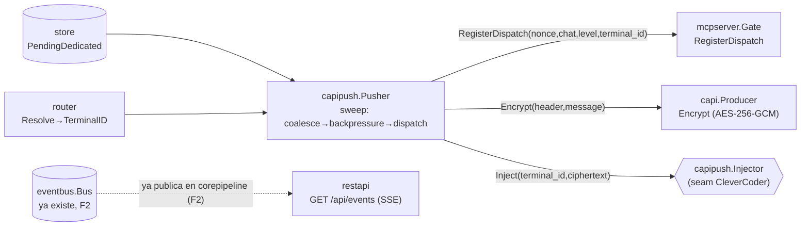

# F4b — Diagrama: capi + capipush + nudge SSE (parte 2/3)

Construcción nueva (F4-DESIGN.md §1) — cAPI/AES-GCM no existe en Piumy. El nudge SSE de
`restapi` sí se cherry-pickea (solo `GET /api/events`, sin los endpoints privilegiados,
que son F4c).

## Judgment calls

1. **`capi.Producer` deriva la key con SHA-256** (`New(secret string)`) — `PIUMY_CAPI_KEY`
   puede ser cualquier string, igual que el resto de las `*_KEY` del proyecto; no le pido
   al operador que genere exactos 32 bytes.
2. **`capi.Decrypt` existe** aunque piumy-gateway nunca lo llama en producción (CleverCoder
   descifra del lado terminal) — sin él, `Encrypt` no sería testeable sin una segunda
   implementación paralela. Vive en el mismo archivo, no es un nodo de más.
3. **`capipush.Injector` es el seam real a CleverCoder** — interfaz mínima
   (`Inject(terminalID, ciphertext) error`), default `LogInjector` (loguea, no entrega) para
   que `capipush` corra y se pueda testear end-to-end sin que el mecanismo real de
   CleverCoder exista todavía. Mismo criterio que `gateway.Gateway`.
4. **Nivel del dispatch** (`levelFor`, AGENT-BEHAVIOR.md: "el nivel sale del router/estado
   del chat: is_boss, status, si es nuevo"): `is_boss→boss`, `status=="new"→danger`
   (AGENT-BEHAVIOR.md: "clientes, desconocidos, chats nuevos"), cualquier otro
   (conocido, no-boss) → `caution`. No hay un algoritmo más explícito en los docs de
   referencia — esta es mi traducción a código, documentada por si Citrino la quiere ajustar.
5. **`terminal_id` — ruta explícita gana, si no `PortFallback`** (`cfg.OpenWAPort`, ya
   provisto desde F0/F1b exactamente para esto). Sin ninguno de los dos → se loguea y se
   saltea ese chat (no se puede despachar sin saber a quién).
6. **Coalescing por-sweep, no por-nonce-histórico** — cada sweep dispatcha como mucho una
   vez por chat con pendientes (agrupa `PendingDedicated` por `chat_jid`, usa el mensaje
   más reciente como preview). Si el agente no atiende antes del próximo sweep, el chat
   se vuelve a despachar (nuevo nonce, reemplaza el dispatch sin terminar del mismo
   terminal) — un "nudge" repetido, no un bug: no hay tracking de "ya avisé este batch"
   más allá de lo que el propio `PendingDedicated`/`mark_handled` ya resuelve. Si en la
   práctica esto satura, el upgrade path es trackear el último nonce no consumido por
   chat y saltear el re-dispatch mientras siga vivo.
7. **`restapi` — solo el nudge**, sin los endpoints privilegiados (F4c). Auth fail-OPEN
   si `APIKey==""` (igual que Piumy — LAN-only, de bajo riesgo, solo lectura), a
   diferencia del Bearer fail-closed de MCP.
