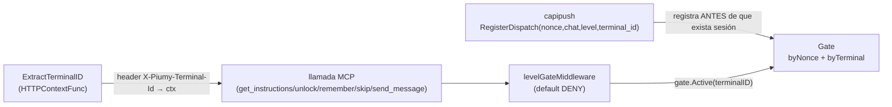
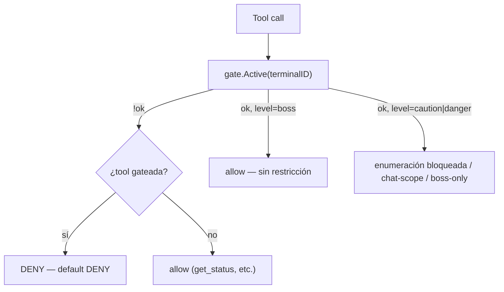

# F4b — Diagrama: cerrar el fail-open del gate (parte 1 — la crítica)

Esta es la pieza que Citrino audita personalmente. Se codea primero porque el resto de
F4b (capi/capipush) depende de la nueva firma de `RegisterDispatch`.

## El cambio de modelo

F4a trackeaba el gate por **MCP session ID** (efímero). F4b lo cambia a **`terminal_id`**
(estable) — es lo único que `capipush` conoce al momento de registrar un dispatch (nunca
conoce una sesión MCP, que no existe todavía en ese momento). La sesión MCP presenta su
`terminal_id` (seam de CleverCoder — ver abajo); el gate resuelve todo por ese id.

## Seam: cómo la sesión MCP presenta su `terminal_id`

**Forma real (documentada, no cableada a un HTTP real todavía — `main.go` no monta el
transporte MCP aún, eso es F5/smoke):** un header HTTP fijo por conexión,
`X-Piumy-Terminal-Id`, configurado en el `.mcp.json` de cada terminal por CleverCoder —
mismo patrón que `Authorization: Bearer <token>` (auth.go), pero para identidad de
terminal, no de cuenta. `mcp-go` expone `server.WithHTTPContextFunc` para leer el header
y meterlo en el `context.Context` de cada llamada — `mcpserver.ExtractTerminalID` queda
lista para que quien monte el transporte real la pase como opción.

**En tests (F4a/F4b):** un helper `withTerminalID(ctx, id)` inyecta el valor directo en el
contexto, sin pasar por HTTP — mismo criterio que `sessionKey(ctx)` ya usaba (los tests
tampoco pasan por transporte real).

## Máquina de estados (actualizada — ver también F4A-DIAGRAMA-GATE.md, que este diagrama
reemplaza en el punto de la clave de tracking, no en la mecánica lock→ready)

- `RegisterDispatch(nonce, chatJID, level, terminalID)` — agrega `terminalID` al struct
  `dispatch`. Sin este dato el dispatch no significa nada (a qué terminal se lo entrega).
- `GetInstructions(callerTerminalID, nonce, st)` — **valida `dispatch.terminalID ==
  callerTerminalID` antes de bindear** — esto es lo que hace imposible que el terminal B
  consuma un dispatch registrado para el terminal A (ni siquiera con el nonce correcto).
- `Unlock/Remember/Skip/Active/Consume` — todos toman `terminalID` en vez de `sessionKey`.

## Default DENY (el fix central)

**Antes (F4a):** `!bound → unrestricted` (fail-open).
**Ahora:** `!bound` → **DENY** para las tools *gateadas* (enumeración, chat-scoped,
boss-only, `send_message`). Las tools sin concepto de chat (`get_status`,
`get_decision_policy`, `get_outbox`, `get_drafts`, los 4 tools del gate) siguen sin
restricción — nunca fueron parte del anti-leakage, no hace falta un dispatch para
leerlas.

`send_message` aplica el mismo criterio en su propio handler (ya necesita leer el
dispatch para el estado `ready`): sin dispatch → DENY (ya no cae a "irrestricto"); boss →
sin restricción; caution/danger → `ready` + chat-match, igual que F4a.

## Judgment calls

1. **Nombre del header:** `X-Piumy-Terminal-Id` — no está en ningún doc previo, lo elijo
   por consistencia con el patrón `X-API-Key` de `restapi` y `Authorization: Bearer` de
   `mcpserver`. Si CleverCoder ya tiene una convención distinta para esto, avisame y lo
   renombro (es un `const` en un solo lugar).
2. **`ExtractTerminalID` queda sin cablear a un transporte HTTP real** — `main.go` no
   construye el server MCP sobre HTTP todavía (sigue siendo el esqueleto de F0). Cablear
   el transporte real es trabajo de integración (F5/smoke), no de este subcontrato — acá
   dejo la función lista + documentada para que ese cableado sea una línea.
3. **Tools "sin concepto de chat" no exigen dispatch** — mismo criterio que F4a (nunca
   estuvieron en `enumerationTools`/`chatScopedArg`/`bossOnlyTools`). Un DENY total sobre
   TODA tool sin dispatch habría bloqueado hasta `get_status`, que es inofensivo.
