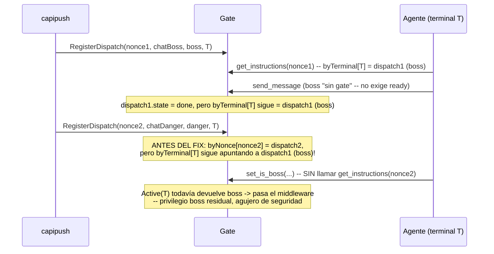
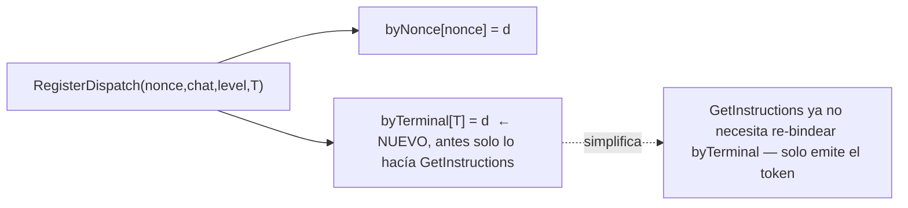

# Fix: ventana de privilegio residual en la transición de nivel del gate

Hallazgo de Citrino durante la auditoría de F4c (originado en mi propia nota sobre
"boss no es one-shot"). Rama `f4b-gate-privilege-transition`, independiente de F4c
(vive en `internal/mcpserver/gate.go`, parte de F4b, no de F4c).

## El hueco

## El fix

`RegisterDispatch` ahora bindea `byTerminal[terminalID]` al dispatch NUEVO
inmediatamente (estado `locked`), reemplazando lo que hubiera — ya no espera a que
el agente llame `get_instructions`. `Active(T)` refleja el nivel nuevo (danger,
`locked`) al toque; toda tool gateada + `send_message` caen en DENY/gated-por-nivel
hasta que el agente re-gatee correctamente para el dispatch nuevo.

`GetInstructions` se simplifica: como `byTerminal[terminalID]` ya apunta al dispatch
correcto desde el registro, la limpieza de "reemplazar el dispatch anterior de la
sesión" que tenía (comparando `prev.nonce != nonce`) queda inalcanzable — se borra
(ponytail: código muerto, no lo dejo "por las dudas").

## Refinamiento en capipush (no es la garantía de seguridad, es UX/eficiencia)

`capipush.dispatch()` ahora chequea `gate.InFlight(terminalID)` antes de registrar
— si el terminal ya tiene un dispatch bound-y-no-`done`, salta ese chat en este
sweep (no lo interrumpe a mitad de trabajo legítimo). El próximo sweep lo retoma
cuando el terminal se libera. Esto reduce el churn de re-despacho que ya había
flagueado en `F4B-DIAGRAMA-CAPI-CAPIPUSH.md` punto 6 — mismo problema, ahora con
upgrade path implementado.

**Importante:** el fix de `RegisterDispatch` es la garantía real — sigue siendo
seguro aunque `capipush` decida registrar de todos modos mientras el terminal está
in-flight (el nuevo dispatch reemplaza igual, sin dejar privilegio residual). El
chequeo de `InFlight` en capipush es puramente para no interrumpir trabajo en
curso, no para tapar un agujero.

## Tests

- `TestRegisterDispatchClosesResidualPrivilegeWindow` (mcpserver/gate_test.go):
  reproduce el escenario exacto de Citrino — boss bound+done → registrar danger →
  `Active(T)` es danger/locked, `reset_dashboard_password` refused, `send_message`
  al chat boss viejo queda locked.
- `TestInFlightReportsBoundNonDoneDispatch` (mcpserver/gate_test.go): unidad de
  `Gate.InFlight`.
- `TestInFlightTerminalSkipsNewDispatch` (capipush/capipush_test.go): el
  refinamiento — 2 chats al mismo terminal, el segundo espera a que el primero
  termine.
