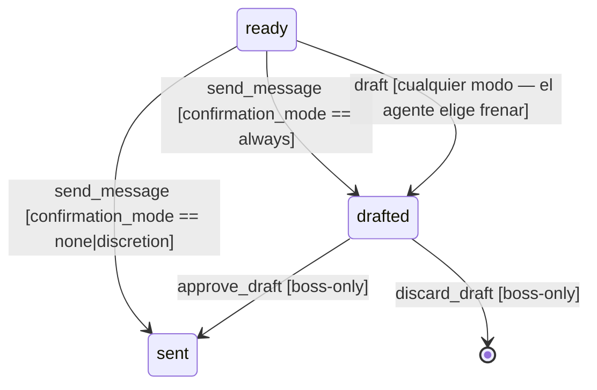
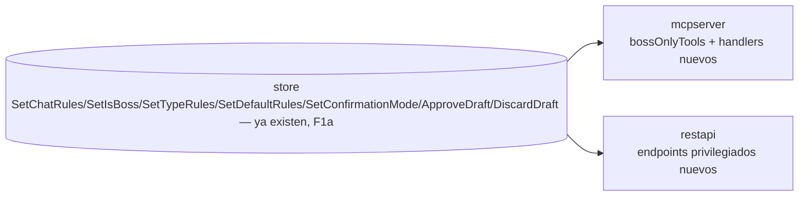
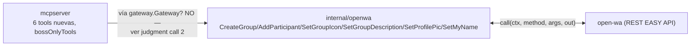

# F4c — Diagrama: confirmation_mode + draft + DB-admin + grupo/perfil (boss-only)

## 1. confirmation_mode + draft

- `send_message` gana un branch al final (tras los 6 checks + el gate F4b): si
  `chat.ConfirmationMode == "always"` → `store.AddDraftWithConfirmer` en vez de
  `EnqueueWithModel`, responde "held for confirmation" en vez de "queued for sending".
  `none`/`discretion` (o vacío, mismo default que hoy) → envía como siempre.
- Tool nueva `draft`: mismos checks que `send_message` (comparten el helper
  `validateSend` — ver judgment call 1) pero SIEMPRE crea un draft, nunca envía —
  disponible en cualquier modo (el agente puede optar por frenar aunque el chat esté en
  `none`; la checklist de contenido sensible que guía esa decisión es de la skill
  `/piumy`, no del código).
- `approve_draft`/`discard_draft`: boss-only (MCP) + REST privilegiado.

## 2. DB-admin + draft-approval (REST privilegiado + MCP boss-only)

- Todo lo privilegiado llama a métodos de `store` ya migrados en F1a — cero método
  nuevo en store.
- MCP: `set_chat_rules`, `set_is_boss`, `set_type_rules`, `set_default_rules`,
  `set_confirmation_mode`, `approve_draft`, `discard_draft` → todas a `bossOnlyTools`
  (mismo middleware de F4b: sin dispatch → DENY; caution/danger → refused; boss → pasa).
- REST: mismos 7 + un handler HTTP cada uno, mismo `auth()` fail-open-si-vacío que ya
  tiene `restapi` (F4b) — es admin directo del dueño desde la LAN, no des-cara-al-agente.

## 3. Grupo/perfil (boss-only, MCP-only — sin REST, no está en el contrato)

Verificado contra context7 `/open-wa/wa-automate-nodejs` (no inventado):

| Tool MCP | Método open-wa real | Firma verificada |
|---|---|---|
| `create_group` | `createGroup` | `(groupName string, contacts []string) → GroupChatCreationResponse` |
| `add_participant` | `addParticipant` | `(groupId, participantId string) → ...` (forma de respuesta no confirmada, ver judgment call 3) |
| `set_group_icon` | `setGroupIcon` | `(groupId string, image DataURL) → bool` |
| `set_group_description` | `setGroupDescription` | `(groupId, description string) → bool` |
| `set_profile_pic` | `setProfilePic` | `(image DataURL) → bool` — **sin groupId**, es el perfil del host |
| `set_profile_name` | `setMyName` | `(newName string) → bool` — el nombre real del método NO es "setProfileName" |

## Judgment calls

1. **`validateSend` extraído** de `send_message` — helper compartido con `draft` (los 6
   checks + el chequeo del gate F4b). Antes vivía todo inline en el handler; con 2
   callers reales (no especulativo) se justifica extraerlo. `send_message`/`draft`
   solo difieren en la acción final (Enqueue vs AddDraft) y en el branch de
   `confirmation_mode` (solo `send_message` lo mira).
2. **Grupo/perfil llaman `*openwa.Adapter` directo, NO por `gateway.Gateway`** — la
   interfaz `Gateway` (F2) expone Send/SetTyping/MarkRead/MarkDelivered/Inbound/
   Start/Stop/Connected, nada de grupo/perfil (no es su contrato, y agregarle métodos
   de grupo la infla para un solo implementador real). `mcpserver.Deps` suma un campo
   `OpenWA *openwa.Adapter` (opcional, nil-safe) — mismo criterio que `Gate`/`Guard`:
   si no está cableado, las 6 tools devuelven "not available" en vez de nil-panic.
   Esto acopla mcpserver a openwa concretamente (rompe la pureza del seam de F2) — lo
   flagueo: la alternativa (meter grupo/perfil en `Gateway`) infla la interfaz para
   funcionalidad que NINGÚN otro adaptador futuro (Cloud API oficial, F6) va a tener
   igual — WhatsApp Cloud API maneja grupos distinto. Prefiero el acoplamiento directo
   y localizado a una interfaz incorrecta para todos los futuros adaptadores.
3. **`addParticipant`/`createGroup` — respuesta decodificada como `json.RawMessage`**,
   no un struct tipado — la doc no confirma el shape exacto de
   `GroupChatCreationResponse` ni de la respuesta de `addParticipant` (solo confirma
   los códigos de error posibles). Devolver el JSON crudo es honesto (no inventa
   campos); el agente ve lo que open-wa realmente contestó.
4. **`set_group_icon`/`set_profile_pic` piden un `data_url` string** (DataURL
   base64) como argumento — no hay pipeline de media todavía (F4d), así que el
   agente/skill arma el DataURL si lo necesita. No es una decisión de "cómo se genera
   la imagen", solo el formato de tránsito que open-wa exige.
5b. **Nota (encontrada escribiendo el test de `draft`, no un cambio de comportamiento):**
   un dispatch `boss` NO es one-shot como caution/danger — `send_message`/`draft` solo
   chequean `ready`/chat-match para no-boss, así que un dispatch boss consumido
   (`gateDone`) sigue pasando el chequeo de nivel (`active.Level == LevelBoss` no mira
   el estado) y puede volver a enviar/draftear hasta que un nuevo `get_instructions` lo
   reemplace. Es consistente con "boss = sin gate" (diseño de F4a/F4b, no F4c) — lo
   anoto para que quede documentado, no lo cambio sin que Citrino lo pida.
5. **Descripciones restauradas** (hallazgo Sonnet, F4a): `get_chat` recupera el texto
   sobre `confirmation_mode`/`confirmer`/`description`; `get_pending`/`claim_chat`
   recuperan "no siempre la última palabra" + la semántica de claim; `list_chats`
   recupera su texto completo. Texto para el LLM — no cambia lógica.
