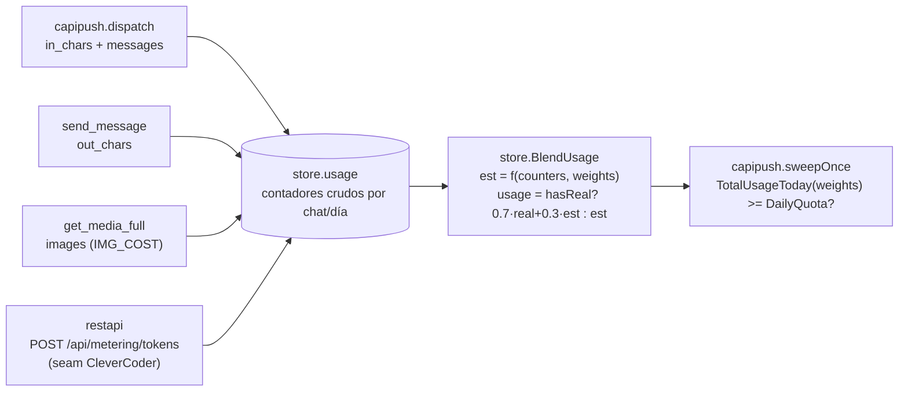

# F4d — Diagrama: media (por ruta + JPEG low-q) + metering (nativo + blend)

Cierra F4. Diseño: F4-DESIGN.md §6 (media) y §8 (metering).

## 1. Media

Verificado contra context7 `/open-wa/wa-automate-nodejs` (no inventado): el webhook
`onMessage` de open-wa **no** trae la media descifrada — `body`/`content` son solo un
thumbnail base64 salvo que el cliente Node tenga configurado un preprocessor
(`AUTO_DECRYPT`/`AUTO_DECRYPT_SAVE`, una opción de arranque del proceso Node, fuera del
control de piumy-gateway). El camino confiable es pedir el original explícitamente:
`decryptMedia(message)` (método real de la Client API, disponible por la EASY API REST)
devuelve una `DataURL` (`data:<mimetype>;base64,<datos>`).

```mermaid
sequenceDiagram
    participant OW as open-wa
    participant AD as openwa.Adapter
    participant ST as store

    OW->>AD: POST webhook onMessage {mimetype: "image/jpeg", id, chatId, ...}
    AD->>OW: call("decryptMedia", {msgId: id}) -- REST EASY API
    OW-->>AD: DataURL (data:image/jpeg;base64,...)
    AD->>AD: guarda original en PIUMY_MEDIA_DIR/<msg_id>.<ext>
    AD->>AD: si es imagen: genera JPEG low-q (image/jpeg stdlib)
    AD->>ST: AddMedia{msg_id, chat_jid, path=low-q (o original), full_path=original, mime, size}
```

- **`get_media`** (ya migrada, F4a) sigue devolviendo `path` — el low-q por defecto, menos
  tokens para el agente.
- **`get_media_full(chat_id, msg_id)`** (tool nueva) devuelve `full_path` — el original sin
  comprimir. Pide `chat_id` además de `msg_id` (el contrato solo menciona `msg_id`, pero la
  PK de `media` es `(chat_jid, msg_id)` — pedir los dos evita cualquier colisión de ID entre
  chats. Judgment call, flagueado).
- **No-imagen (video/audio/documento):** sin compresión — `path == full_path` (mismo
  archivo). No hay "low-q" razonable para esos tipos todavía.

## 2. Metering



- **Tabla `usage`** guarda CONTADORES CRUDOS (`out_chars, in_chars, images, audio,
  messages, tokens_real`) por `(chat_jid, day)` — el estimado (`est`) y el blend se
  calculan al leer, con los pesos de `config` (nunca hardcode, nunca precomputado en la
  fila — si los pesos cambian, no hay que re-migrar datos históricos).
- **`audio` existe en el schema pero nada lo incrementa todavía** — no hay tool de audio
  en F4d (`send_voice` es un seam post-F4, F4-DESIGN §9) — el campo queda listo, no
  "especulativo con lógica a medias": es un campo sin lógica, no un half-wired feature.
- **Incentivo automático (tal como lo pide el contrato):** `get_media` (low-q) NO
  incrementa `images` — es gratis en el modelo de costo, ya es barato en chars/tokens
  reales. Solo `get_media_full` incrementa `images` (a `IMG_COST`). Así "pedir el
  original cuesta más" queda implementado literal, no como metáfora.
- **Seam de tokens:** `POST /api/metering/tokens {chat_jid, day, tokens}` en `restapi` —
  mientras CleverCoder no lo llame, `tokens_real` queda en 0 y el blend usa el estimado
  puro (`hasReal=false`) — el "stub que corre sin el reporte real" sale gratis de la
  propia fórmula del blend, no hace falta un segundo componente tipo `LogInjector`.
- **Cuota (hook en capipush):** antes de cada sweep, si `TotalUsageToday(weights) >=
  DailyQuota` → no despacha nada este sweep (igual que el backpressure de `swamped`,
  mismo lugar). Global simple (suma todos los chats), como pide el contrato.

## Judgment calls

1. **`get_media_full` pide `chat_id` + `msg_id`**, no solo `msg_id` — la PK real de
   `media` lo exige, evita ambigüedad.
2. **`images`/`audio` cuentan en `get_media_full`/`get_media`, no en la llegada del
   inbound** — el costo modela lo que el AGENTE efectivamente consume (interpretar la
   imagen), no lo que el gateway simplemente archivó.
3. **`audio` sin caller** — campo listo en schema/fórmula, cero lógica (no hay tool de
   audio en scope de F4d).
4. **Pesos y `DailyQuota` en `config`** (env `PIUMY_METERING_*`) — perillas de
   calibración, ningún valor final hardcodeado en el código de negocio.
5. **`usage` es por `(chat_jid, día)`, la cuota es GLOBAL** (suma de todos los chats del
   día) — coincide con "cuenta" siendo single-tenant hoy (post-MVP: multi-tenancy real).
