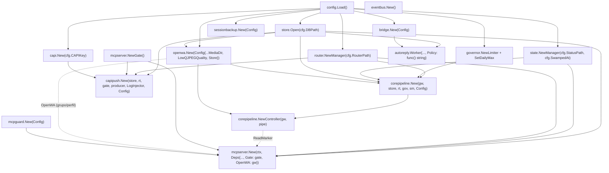
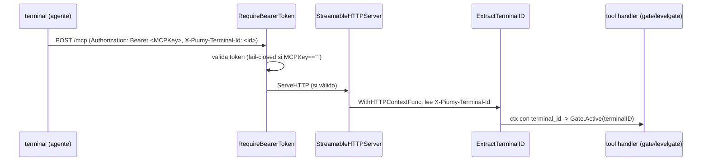
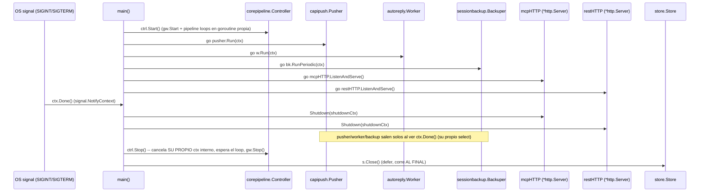

# F5-wire — Diagrama: `main.go` cablea todo + MCP sobre HTTP + shutdown

Cierra el MVP (parte 1: el wire, sin el smoke con open-wa real — eso es
un paso conjunto con el boss aparte). Diseño: `docs/F5-DESIGN.md`.

## 1. Orden de composición

**El `*Gate` es compartido** entre `capipush` (registra dispatches) y
`mcpserver` (los consume vía `get_instructions`/`unlock`/...) — un solo
`mcpserver.NewGate()`, pasado a ambos constructores. Sin esto, capipush
y el agente estarían mirando gates distintos y nada calzaría.

## 2. MCP sobre HTTP — el hueco que F5 cierra

`mcpTransport := server.NewStreamableHTTPServer(mcpSrv, WithHTTPContextFunc(ExtractTerminalID), WithEndpointPath("/mcp"))`,
envuelto por `mcpserver.RequireBearerToken(cfg.MCPKey, mcpTransport)` — el
Bearer corre PRIMERO (rechaza antes de que el terminal_id importe), fail-
closed ya existente desde F4b. REST monta su propio mux directo (sin este
envoltorio, fail-open-si-vacío por diseño de `restapi`, ver `MANUAL.md`).

## 3. Arranque y apagado (graceful shutdown)

**Por qué este orden y no otro:** `ctrl.Stop()` bloquea hasta que el
goroutine de `Pipeline.Run` retorna (`<-doneCh`) ANTES de devolver el
control — así ninguna goroutine del pipeline puede tocar `store` después
de que el `defer s.Close()` corra. `pusher`/`worker`/`backup` comparten
el `ctx` raíz de `main` (no uno propio como `Controller`), así que
`ctx.Done()` ya los para solos — no hace falta un `Stop()` explícito para
esos tres. `mcpHTTP`/`restHTTP` se apagan ANTES que `ctrl.Stop()`: dejar
de aceptar tráfico nuevo antes de drenar el pipeline, no al revés.

**Flaky preexistente — arreglado de raíz (no dejado anotado):**
`TestEndToEndWithRealPipeline` ("database is closed") resultó ser DOS
carreras independientes, ambas cerradas en este subcontrato:

1. **`Pipeline.Run` no esperaba `outboxLoop`** (`pipeline.go`) — lo
   lanzaba con `go p.outboxLoop(ctx)` pero solo bloqueaba en
   `inboundLoop`. `Controller.Stop()` retornaba en cuanto `Run` volvía,
   así que un `processOutbox` en curso (bloqueado en `gw.Send`, por
   ejemplo) podía seguir escribiendo al store (`MarkSent`/`AddMessage`)
   DESPUÉS de que el caller cerrara la DB. Fix: `sync.WaitGroup` en
   `Run` que espera a `outboxLoop` antes de retornar — así `Stop()`
   solo vuelve cuando NINGUNA goroutine del pipeline puede tocar el
   store. Regresión: `TestControllerStopWaitsForInFlightOutboxSend`
   (`controller_test.go`) — confirmado que falla contra el código viejo
   (revertido con `git stash`) y pasa con el fix.
2. **El propio test tenía una carrera de sincronización** — rompía su
   loop de polling apenas el handler HTTP fake veía la llamada
   `sendText` (antes de que `MarkSent` corriera), y chequeaba
   `PendingOutbox` inmediatamente después, sin esperarlo. Fix: pollear
   la condición real (`PendingOutbox` vacío) en vez de la señal proxy.

Confirmado: 30/30 corridas verdes (`go test -count=30`) tras ambos
fixes, contra las fallas intermitentes observadas antes (11/20 y 2/5 en
corridas de diagnóstico). `go test -race` en Linux (fuera de alcance de
F5-wire) sigue siendo el paso que Citrino coordina aparte, pero ya no
hay una causa raíz conocida pendiente para que lo encuentre.

## 4. Config nueva (cero hardcode)

| Campo | Env | Default |
|---|---|---|
| `MCPAddr` | `PIUMY_MCP_ADDR` | `:8091` |
| `RESTAddr` | `PIUMY_REST_ADDR` | `:8092` |
| `RESTKey` | `PIUMY_REST_KEY` | `""` (abierto, dev/LAN — mismo criterio que el resto de `restapi`) |
| `PolicyPath` | `PIUMY_POLICY_PATH` | `""` (cae al `decision-policy.md` embebido) |

## Judgment calls

1. **`autoreply.Worker.Policy` es `func() string`, no un `string` fijo**
   (`worker.go`, ya documentado ahí: "so each sweep sees a live edit") —
   el snippet de `F5-DESIGN.md` §1 escribía `Policy:
   autoreply.PolicyText(cfg.PolicyPath)` (llamada directa, produce un
   `string`), que no compila contra el campo real. Wireado como
   `Policy: func() string { return autoreply.PolicyText(cfg.PolicyPath) }`
   — preserva la propiedad de "live edit" que el propio comentario del
   campo pide, ya que `PolicyText` relee el archivo en cada llamada.
2. **`cfg.ActionDelayMin/Max` (F1b) sigue sin consumidor** — no es parte
   de `corepipeline.Config` (que usa `ComposingMin/Max`, con default de
   paquete, tal como dice `F5-DESIGN.md` §1: "Composing: defaults del
   paquete"). Preexistente a F5-wire, fuera de scope de este contrato
   (no estaba en `files_in_scope`) — anotado, no tocado.
3. **`mcpSrv.New(ctx, ...)` recibe el `ctx` raíz** (el mismo de
   `signal.NotifyContext`) — el sweeper de `agentTracker` (`tracker.sweep(ctx)`)
   sale solo al cancelarse, mismo criterio que pusher/worker/backup.
