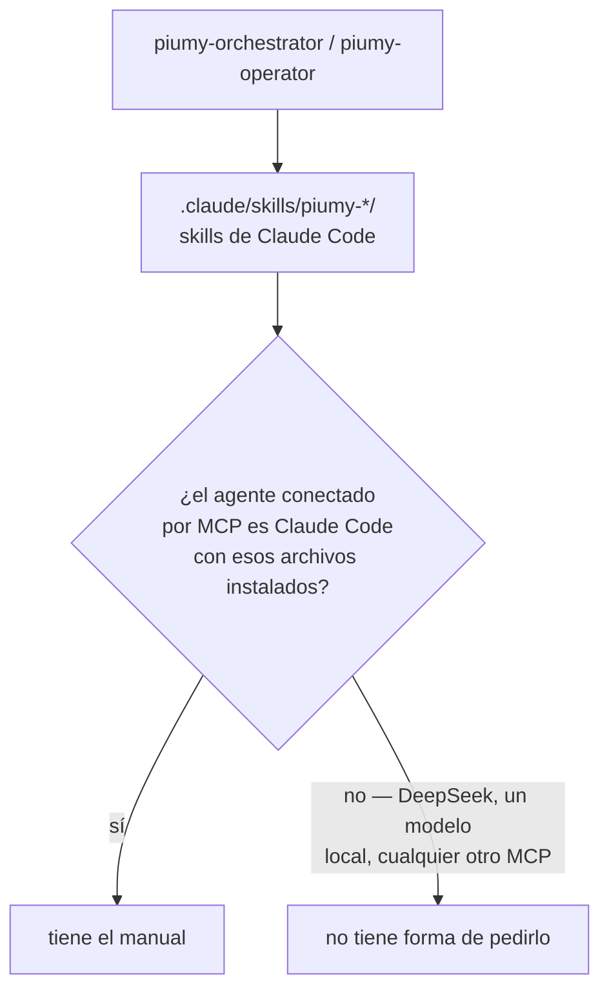
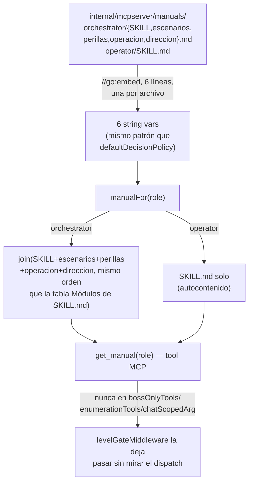
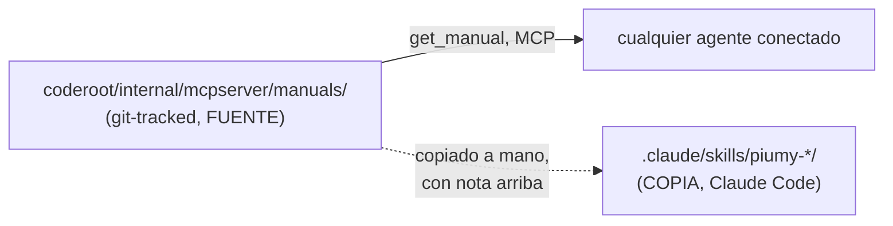

# get_manual — los manuales viajan dentro del binario (ct-2026-07-31-1541)

Contrato madre: `ct-2026-07-30-0308-reparación-del-canal-agente-gateway-hall`.
Paso previo al instalador de Windows: el instalador va a llevar el
binario, y el binario ya lleva los manuales adentro.

## El problema

## El fix — mismo patrón que get_decision_policy, no uno nuevo

## Fuente única — la parte que se rompe sola con el tiempo

El riesgo no es técnico, es la deriva: dos copias del mismo manual que
dejan de coincidir y nadie sabe cuál vale. `.claude/skills/piumy-*/`
**no estaba versionado** (vive en `C:\proyectos\piumy-gateway\`, fuera de
cualquier repo git) — sin este cambio, editar esos archivos no dejaba
ningún rastro revisable.

Cada uno de los 6 archivos lleva una línea arriba diciendo cuál es cuál —
la fuente dice "soy la fuente, la copia vive en .claude/skills/...";
la copia dice "soy una copia, editame acá no hace nada". Sin script de
sincronización: la nota alcanza y no se rompe sola.

**Contenido de los 6 archivos: sin reescribir.** Ya están escritos y
probados contra un agente real (S13/Aprobador P1) — esto es moverlos y
exponerlos, nada más. Verificado con `diff` línea por línea contra el
original antes de dar el sub-cambio por cerrado.

## Criterio de listo

- `go build ./... && go vet ./... && go test ./...` verde.
- `TestGetManualTool`: cada rol devuelve su contenido propio, no se mezclan
  entre sí, un rol inválido refusa con mensaje claro, y (mismo patrón que
  `get_decision_policy`) funciona sin ningún dispatch bound.
- Verificación en vivo: `get_manual` contra el binario real, los dos roles.
- `docs/MANUAL.md` actualizado.
