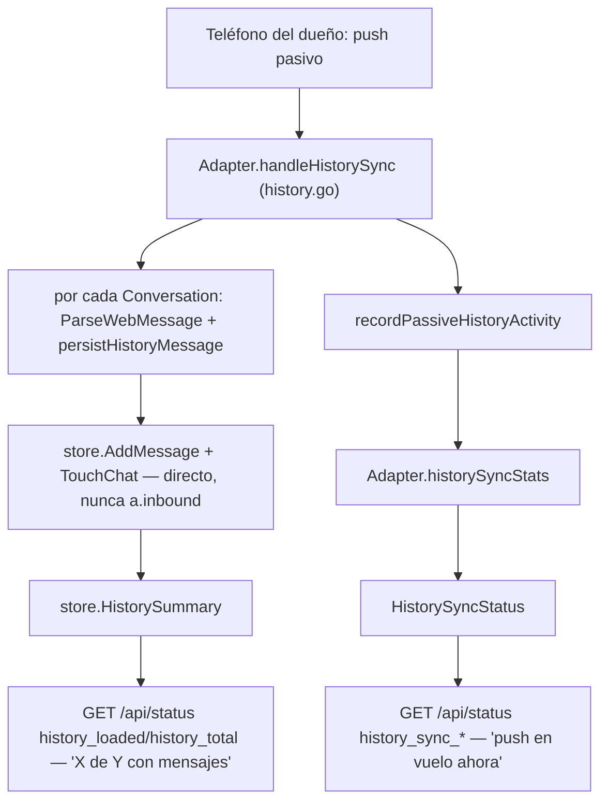

# Regresión "dejó de descargar historial" — se borra el worker on-demand (ct-2026-07-24-2004)

El boss reportó que el historial dejó de descargar. La primera hipótesis
(Citrino) era un bug de estado: `history_state="skipped"` se contaba como
`"loaded"` en `HistorySummary`, así que el dashboard podía reportar "todo
bien" sin haber bajado nada. La medición real la tumbó — y abrió una
pregunta más grande, que terminó en borrar el worker entero.

## 1. Medición (solo lectura, sin código)

DB (`secrets/piumy.db`) y el único log con actividad del history worker en
todo el historial de runs guardados (`secrets/gateway-dash.err`, un solo
run de ~67 min):

- `history_state`: `pending=1666`, `loaded=114`, `downloading=0`,
  `skipped=0` — **cero** chats "skipped". La hipótesis de Citrino no era
  la causa activa: no hay nada que `HistorySummary` esté escondiendo.
- Log: `"history worker: giving up on"` → 0 ocurrencias. Fallos de envío
  (`"history worker: request page ... : <err>"`) → 0 ocurrencias.
- **26 pedidos ON_DEMAND reales, contra chats CON mensajes existentes
  (no chats vacíos — esos se drenan gratis, sin pedido) → 26 respuestas
  `COMPLETE_AND_NO_MORE_MESSAGE_REMAIN_ON_PRIMARY`, con `messages=0` las
  26 veces.** El worker funcionaba perfecto — pedía bien, el teléfono
  contestaba rápido — y no traía nada.

## 2. Lectura del módulo whatsmeow (código, no la web)

`go.mau.fi/whatsmeow@v0.0.0-20260709092057-73fe7355f59f` (la versión
pineada en `go.mod`):

- `EndOfHistoryTransferType` tiene 4 valores
  (`proto/waHistorySync/WAWebProtobufsHistorySync.proto:69-74`): dos dicen
  "hay más, seguí pidiendo" (`COMPLETE_BUT_MORE_MESSAGES_REMAIN_ON_PRIMARY`,
  `COMPLETE_ON_DEMAND_SYNC_BUT_MORE_MSG_REMAIN_ON_PRIMARY`), dos dicen
  "no hay más, andá parando" (`COMPLETE_AND_NO_MORE_MESSAGE_REMAIN_ON_PRIMARY`,
  `..._WITH_MORE_MSG_ON_PRIMARY_BUT_NO_ACCESS`). Las 26 respuestas medidas
  fueron el primero de esos dos — el teléfono confirmando un límite físico,
  no una ventana a reintentar distinto.
- `BuildHistorySyncRequest` (`send.go:558-582`, doc propio del método): pide
  como mucho `count` mensajes ANTERIORES al ancla dada — nuestro
  `buildHistoryAnchor` ya anclaba bien (`time.Unix(ts, 0)` contra segundos
  reales en `store.OldestMessage` — no había bug de unidades tipo
  `OldestMsgTimestampMS`, verificado línea por línea).
- `HistorySyncConfig` (`DeviceProps`, `store/clientpayload.go:124-157`)
  tiene 23 campos; solo tocábamos 2 (`FullSyncDaysLimit=365`,
  `FullSyncSizeMbLimit=10240`). `OnDemandReady`/`CompleteOnDemandReady`
  quedaban en `nil` — hipótesis propia (sin poder confirmarla con el
  código solo) de que el teléfono nunca supo que este companion sabía
  hacer ON_DEMAND.

## 3. Lo que cerró la decisión (Citrino + fuente oficial + el boss)

1. El bug de unidades que sugería la doc no existe en nuestro código —
   confirmado leyendo `buildHistoryAnchor` línea por línea.
2. **Fuente oficial de Meta / FAQ de WhatsApp** (Citrino, en paralelo):
   *"Not all messages and chats are synced to linked devices from your
   phone."* — un dispositivo companion recibe **una porción** del
   historial del teléfono, por diseño. No es un flag a prender.
3. El boss redefinió el objetivo (verbatim, 2026-07-29): *"la idea es que
   se vean todas las conversaciones, despues con el tiempo si hacemos bien
   el backup y desde el inicio podemos ir tenendo chats mas profundos que
   el webview"* — la profundidad se construye **hacia adelante**,
   acumulando lo que entra en vivo, no rescatando el pasado.

Con eso, `OnDemandReady`/`CompleteOnDemandReady` (punto 2 arriba) dejaron
de tener sentido: declarar que sabemos pedir ON_DEMAND no vale la pena si
vamos a borrar el mecanismo que lo usa.

## 4. Qué quedó — diagrama del camino único

`internal/whatsmeow/history.go` es ahora el ÚNICO archivo de historial —
pasivo adentro, store afuera, listo. Nada activo, nada programado, sin
scheduler ni anti-ban propio (el push pasivo no pega contra el servidor
por nuestra cuenta, así que no necesita pacing).

## 5. Qué se borró

- **`internal/whatsmeow/historyworker.go`** — el archivo entero: el loop,
  `requestNextHistoryPage`, `buildHistoryAnchor`, `ownChatJID`,
  `nextHistoryPageSize`, `historyLoopDelay`, `historySyncDelay` y las
  ventanas de pacing ON_DEMAND (`historyPageDelay`, `historyResponseTimeout`,
  `historyRequestMaxAttemptsMin/Max`).
- **La rama ON_DEMAND de `history.go`**: `isOnDemandHistorySync`,
  `updateHistoryState`, `historyPageIsFinal`, `markHistoryLoaded`,
  `historyEmptyPageBelt`. `handleHistorySync` ya no distingue
  ON_DEMAND/pasivo — todo alimenta `recordPassiveHistoryActivity`.
- **Store**: `NextHistoryChat`, `OldestMessage`, `MarkHistoryRequested`,
  `ClearHistoryRequestPending`, `SetHistoryState`, `ResetAllHistoryState`,
  `IncrementHistoryEmptyPages`, `ResetHistoryEmptyPages`, y el enum
  `validHistoryStates`.
- **Config/settings**: `Config.HistorySyncIntervalMin/Max`
  (`PIUMY_HISTORY_SYNC_INTERVAL_MIN/MAX`), `store.SettingHistorySyncIntervalMin/Max`.
- El arranque del worker en `Adapter.Start()` y el
  `store.ResetAllHistoryState()` del pareo fresco en `pairLoop`.

## 6. Qué se movió (no se borró)

`killSwitchActive()`, `pairedAt`/`pairedAtMu`, `historySyncStats`,
`historySyncAnchor`, `freshPairingSyncWindow`,
`defaultHistoryFreshPairGraceWindow`, `historyFreshPairAbsoluteCeiling` y
`HistorySyncStatus()` — todo esto también servía al camino pasivo (la
señal "el push post-re-pareo sigue en vuelo" que ya usa el dashboard,
`restapi/read.go`), así que se relocalizaron: `killSwitchActive` a
`adapter.go` (lo comparten `mediaworker.go`/`mediabgworker.go`), el resto a
`history.go`. `store.SettingHistoryFreshPairGraceWindow` también se queda
— sigue siendo la ventana que lee `freshPairingSyncWindow`.

## 7. `store.HistorySummary()` — nuevo significado

Antes: `history_state IN ('loaded','skipped')` sobre el total — medía
progreso del worker borrado. Ahora: cuántos chats tienen **al menos un
mensaje** sobre el total de chats — avanza con cada mensaje real que
llega (vivo o push pasivo), nunca retrocede. Mismo shape JSON
(`history_loaded`/`history_total`), cero cambio de contrato con el
dashboard.

## 8. Fuera de alcance (flagueado, no arreglado acá)

- `chats.history_state`/`history_requested_at`/`history_request_attempts`/
  `history_empty_pages` siguen en el schema sin ningún escritor — no se
  migró nada (destructivo, no lo pide la tarea). El badge por-chat
  `history_state` que expone `GET /api/chats` (`app.js`'s
  `HISTORY_BADGES`) queda congelado con el valor que ya tenía: nunca más
  pasa a "downloading", y un "loaded" viejo no significa nada nuevo — no
  es un dato falso (sigue siendo cierto que ese chat tuvo mensajes en su
  momento), pero tampoco es útil de ahí en más. No lo toqué (fuera del
  scope de este sub-cambio); queda para quien quiera limpiarlo.
