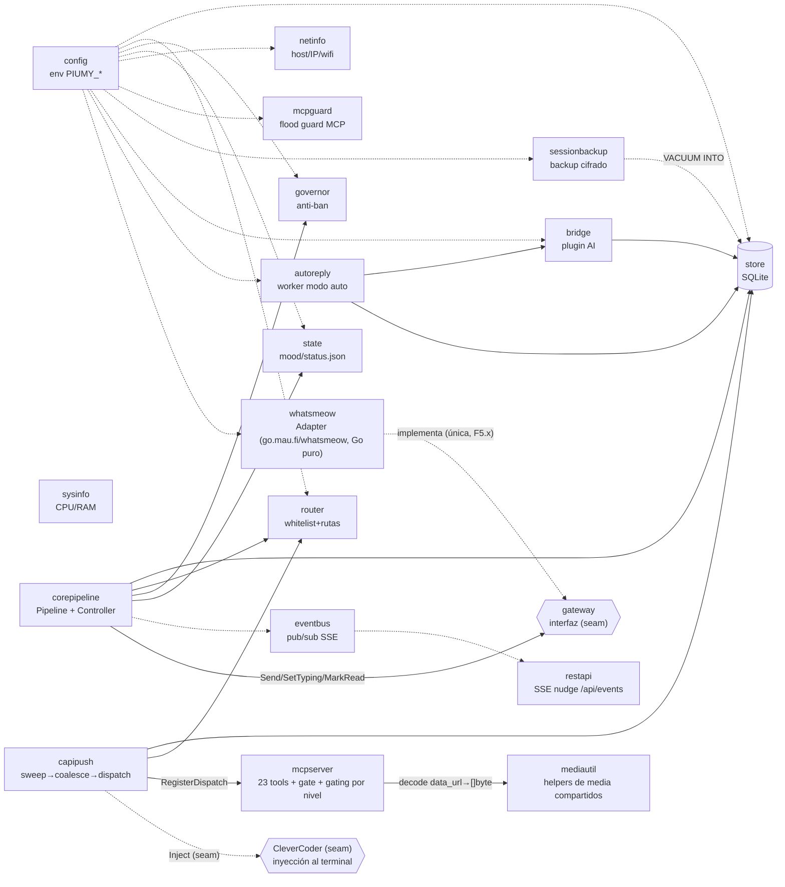

# Manual de piumy-gateway — nodos y botones

Mapa rápido de todo lo que existe hoy en `internal/`: qué hace cada
paquete (nodo) y cuáles son sus funciones/tipos exportados clave
(botones) — para no tener que leer la implementación entera solo para
saber qué se puede llamar. Cada nodo linkea al diagrama de su fase, si
existe.

**Regla de mantenimiento:** cuando un sub-cambio agrega o cambia un
botón (función/tipo exportado), actualizar la sección del nodo
correspondiente en el mismo commit — es parte de la disciplina de cierre,
igual que el diagrama Mermaid y el build verde.

## Cómo se conectan (vista de alto nivel)



`gateway`/`corepipeline` son de F2 (reescritura, no cherry-pick): la
interfaz es el seam contra cualquier cliente de mensajería. `open-wa` (F3)
fue el primer implementador real, pero su v4 quedó EOL y dejó de manejar
el WhatsApp Web actual; `whatsmeow` (F5.x, ct-2026-07-10-0420) lo
reemplazó, y `internal/openwa` se borró del todo en ST-E
(ct-2026-07-11-1444) una vez que las 5 tools de grupo/perfil que aún
dependían de él quedaron cableadas a whatsmeow. En tests, `fakeGateway`
(`corepipeline`) alcanza para probar todo sin WhatsApp real.

Todavía sin lógica propia (andamiaje F0, contenido llega en F4c/F4d):
`dashboard` (no es nodo de F4 en absoluto — ver `mcpserver`, sección
`reset_dashboard_password`).

---

## config — `internal/config`

Rol: carga `PIUMY_*` desde el entorno. Cero hardcode. Cada fase suma
solo los campos que sus propios paquetes necesitan.

- `Load() (Config, error)` — lee todo el entorno; falla si falta
  `PIUMY_DB_PATH`. Sin cambios de comportamiento por T11 (abajo) — sigue
  siendo 100% env-only, no sabe ni le importa de dónde salió el valor.
- **`ApplyFileDefaults() error` / `ApplyFileDefaultsIn(dir) error`**
  (`filedefaults.go`, T11, ct-2026-08-05-1214, boss verbatim: "se nota que
  se ejecuta un bat o algo, se puede hacer eso silencioso?") — corre en
  `main.go` ANTES de `Load()`: rellena los `PIUMY_*` que NO estén ya
  seteados, leyendo `piumy-config.json` (al lado del binario, resuelto vía
  `os.Executable()`) — o, si ese archivo todavía no existe, migrándolo
  desde un `run-piumy.bat` viejo (T6/T21/T22) que sí esté ahí. Precedencia
  explícita del contrato: variable de entorno primero, siempre — solo
  llena lo que falta, así que dev/`rl.bat`/tests no cambian en nada.
  - `piumy-config.json` es el archivo de ENTRADA (el gateway lo lee) —
    **nunca confundir con `agent-connect.json`** (`internal/agentconnect`,
    SALIDA: el gateway lo escribe para que un agente lo lea). Direcciones
    opuestas, archivos distintos, adrede.
  - `migrateFromBat(batPath)` porta a Go el MISMO parser tolerante que
    `piumy.iss` tiene para el `.bat` (T21/T22: `hasBOM`/`parseSetLine` —
    mayús/minús, comillas sin despojar del valor, última coincidencia
    gana). Exige las 3 claves base (MCP/REST/BACKUP) o aborta sin escribir
    nada — mismo "ante la duda, no se pisa nada". `PIUMY_CAPI_KEY` (si un
    `.bat` de antes de T28 todavía la tiene) se ignora — nada la lee más
    (T28, ct-2026-08-05-2242: el despacho dejó de tener una segunda capa
    de cifrado propia).
  - El instalador (`piumy.iss`, `ResolveKeys`) escribe `piumy-config.json`
    directamente desde T11 — ver `docs/T11-DIAGRAMA-CONFIG-FILE-NO-BAT.md`
    para el flujo completo (por qué `.vbs`/`.bat` salieron del camino de
    arranque, y cómo `ResolveKeys` prueba 3 fuentes en orden).
  - **T51 (ct-2026-08-10-1826) — `CompleteConfigJSON`, no reescribir un
    `piumy-config.json` existente:** `ResolveKeys` solo LEE 4 claves
    conocidas (MCP/REST/BACKUP + `PIUMY_REST_ADDR` opcional); hasta T51,
    `CurStepChanged` después REESCRIBÍA el archivo entero desde la
    plantilla fija de 9/10 líneas — cualquier variable que el usuario
    hubiera agregado a mano y el instalador no conociera (el caso real:
    Citrino perdió `PIUMY_DEFAULT_TERMINAL_ID` al actualizar a 0.1.16, en
    vivo, sin ningún aviso) desaparecía en la próxima instalación. Ahora,
    si el archivo ya existe, `CompleteConfigJSON(ExistingRaw, NewJSON)`
    (más `ConfigHasKey`, el mismo chequeo de línea que ya usaba
    `ReadConfigJSONValue`) trabaja línea por línea — mismo espíritu que el
    resto de este bloque, nunca un parser JSON en Pascal (T11 ya lo
    advierte): conserva TEXTUALMENTE cada línea del archivo existente
    (conocida por el instalador o no) y solo agrega, antes del cierre, las
    líneas de la plantilla cuya clave todavía no esté — asegurando coma en
    la última línea de contenido si hacía falta para seguir siendo JSON
    válido. Si el archivo ya tiene las 9/10 claves (el caso normal), es un
    no-op textual — verificado instalando de verdad, no razonando sobre el
    script: dos instalaciones reales sobre la instalación del dueño
    (`piumy-config.json` con `PIUMY_DEFAULT_TERMINAL_ID` real, y con una
    segunda clave de prueba agregada a mano) dieron hash SHA-256 idéntico
    antes y después.
    **Bug encontrado por Citrino antes de integrar, en el camino que SÍ
    agrega algo** (el "no-op" de arriba nunca lo ejercitaba): las líneas
    de la plantilla ya vienen con coma final salvo la última (ver
    `ConfigJSON` más abajo). La primera versión guardaba `Trimmed` tal
    cual en `ToAdd` —con su coma— y volvía a decidir la coma según la
    posición al escribir: doble coma si la línea ya la traía y no era la
    última, o coma colgante antes del cierre si la ÚNICA clave que
    faltaba (`addCount=1`) conservaba la suya. Las dos formas rompen el
    JSON — el gateway no arranca. Arreglo: sacarle la coma a `Trimmed`
    AL RECOLECTAR (antes de guardarlo en `ToAdd`), no al escribir —
    `ToAdd` guarda pares limpios, y la lógica de "coma en todos menos el
    último" pasa a ser correcta tal como estaba escrita. Verificado con
    una instalación aislada standalone (su propio `.iss` mínimo, sin
    `AppMutex` ni `CloseRunningInstance` — nunca toca el Piumy real) que
    corre la función real contra un archivo al que le falta
    `PIUMY_MEDIA_DIR` (clave del medio de la plantilla) y otra al que le
    faltan dos claves no consecutivas; el resultado se parseó con
    `json.load` de Python — no "se ve bien", parsea de verdad — y el
    valor de cada clave agregada coincide con el de la plantilla nueva,
    mientras el resto conserva el valor que ya tenía.
- `DispatchDebounce` (`PIUMY_DISPATCH_DEBOUNCE`, default `60s`) — ventana de silencio antes de despachar un chat (ct-2026-07-13-2243).
- `MaxDispatchDebounce` (`PIUMY_MAX_DISPATCH_DEBOUNCE`, default `5m`) — techo anti-infinito: si el chat lleva más de este tiempo pendiente se despacha igual, sin importar el silencio (ct-2026-07-13-2243).
- `SMTPHost/Port/User/Pass/From` (`PIUMY_SMTP_HOST` sin default —
  `SMTPHost==""` es la señal de "email de recuperación no configurado";
  `PIUMY_SMTP_PORT` default `"587"`; `PIUMY_SMTP_USER`/`PIUMY_SMTP_PASS`/
  `PIUMY_SMTP_FROM` sin default) — el relay de correo saliente del boss
  (S1e-2, ct-2026-07-19-1716), consumido por `restapi.Deps.SMTP`
  (`recover.go`, `net/smtp.SendMail`). **Solo STARTTLS (puerto 587) —
  `net/smtp` de la stdlib no habla el handshake TLS-implícito de un relay
  en 465**, documentado como limitación conocida, no un bug.

---

## store — `internal/store`

Rol: persistencia SQLite (8 tablas). "El oro" — se migró literal desde
Piumy. Ver `docs/F1A-STORE-ACCESO.md`.

**Ciclo de vida** (`schema.go`)
- `Open(path) (*Store, error)` — abre/crea la DB, aplica esquema + migraciones.
- `(*Store) Close() error`

**Chats** (`chat.go`)
- `IsGroupJID(jid) bool` — `@g.us` vs `@s.whatsapp.net`/otros sufijos.
  Exportado (ct-2026-07-10-1758, antes privado) para que callers fuera del
  package (`corepipeline`) compartan el mismo criterio en vez de duplicar
  el chequeo de sufijo — mismo espíritu que ya evitaba duplicar en `store`.
- `StripDeviceSuffix(jid) string` (T45, ct-2026-08-10-1424) — quita el
  sufijo de dispositivo de WhatsApp: `usuario:NN@s.whatsapp.net` →
  `usuario@s.whatsapp.net`. `@lid` y `@g.us` nunca lo llevan, vuelven sin
  tocar. Llamada al inicio de `TouchChat` (sobre `jid`) y al inicio de
  `AddMessage` (sobre `m.ChatJID`, ANTES de usarlo en nada — si solo se
  normalizara dentro de `TouchChat`, el `INSERT INTO messages` de
  `AddMessage` seguiría escribiendo el jid crudo, desincronizando
  `messages.chat_jid` de `chats.jid` y rompiendo el `JOIN` que usa
  `PendingDedicated`). Red de seguridad genuina: los ~10 call sites de
  `TouchChat`/`AddMessage` en todo el repo (whatsmeow, corepipeline,
  restapi, y `AddMessage` mismo llamando `TouchChat` internamente) pasan,
  sin excepción, por estas dos funciones — confirmado leyendo cada
  llamador antes de codear, no asumido. Medido contra la instalación
  real: de 200 chats, exactamente uno tenía sufijo — la propia cuenta del
  dueño, desde `client.Store.ID` (`whatsmeow.recordOwnIdentity`), siempre
  device-qualified por diseño multi-dispositivo de WhatsApp, duplicada
  junto a la fila legítima sin sufijo, marcada `is_boss` las dos, y la
  del sufijo sin poder recibir nada nunca.
  **Regresión encontrada por Citrino antes de integrar (misma tarea,
  segunda vuelta):** normalizar solo acá NO alcanzaba. `markOwner`
  (`inbound.go`) llama `TouchChat(jid)` y LUEGO `MarkOwnerIfUntouched(jid)`
  con la MISMA variable — `TouchChat` normaliza y crea el chat limpio,
  pero `MarkOwnerIfUntouched` es un `UPDATE chats SET is_boss=1 WHERE
  jid = ?` puro, sin normalización propia; llamado con el jid crudo no
  matchea ninguna fila, sin error — el chat queda creado y limpio, pero
  SIN marcar como dueño (rompía T12, el auto-mark del propio número en
  una instalación nueva). El arreglo real y más chico: normalizar en el
  ORIGEN, `recordOwnIdentity` (`ownJID := store.StripDeviceSuffix(a.client.Store.ID.String())`)
  — el único productor de un jid con sufijo en todo el repo (todo lo
  demás ya resuelve vía `resolveChatJID`) — así que `markOwner` recibe el
  jid ya limpio en las dos llamadas, y de paso `state.Status.OwnJID`
  (`GET /api/status`) también queda limpio. `StripDeviceSuffix` dentro de
  `TouchChat`/`AddMessage` se queda como red de seguridad — no arregla
  esta costura puntual, pero atrapa el chat fantasma si aparece otro
  productor de jids con sufijo en el futuro.
- `TouchChat(jid, name, ts)` — upsert de last-seen; default de `status`/`confirmation_mode` por tipo: 1-1 → `none`, grupo → `always` (F4c audit: era `required`, el esquema legacy de Piumy — `send_message` chequea `== "always"`, `"required"` nunca matcheaba, el fail-safe quedaba muerto para grupos frescos; `migrateRequiredToAlways` en `schema.go` reconcilia filas viejas). `name=""` es un no-op sobre el nombre ya guardado (el upsert solo pisa si el nuevo valor es no-vacío) — la garantía que usa `corepipeline.handleInbound` para no pisar el nombre de un grupo (ver abajo).
- `SetMode(jid, mode)` — DELIBERADO: `set_mode`/`escalate` (MCP) y el
  endpoint REST admin lo llaman. Marca `mode_source='manual'`, así
  `SyncRouterMode` nunca lo vuelve a pisar (ST-B, ct-2026-07-11-0741 — antes
  el router revertía cualquier cambio manual en el próximo inbound).
- `SyncRouterMode(jid, mode)` — el espejo del router: lo llama
  `corepipeline.handleInbound` (cada inbound) y `whatsmeow.seedGroups` (cada
  reconexión). NO-OP si `mode_source` ya es `'manual'` — la perilla del
  owner/agente gana siempre. `chats.mode_source` (`'router'|'manual'`,
  default `'router'`) es la columna nueva.
- **`SetActive(jid, active)`/`SetArchived/SetStatus(jid, ...)`** — S8
  (ct-2026-07-30-031126): `SetActive(jid, true)` en una transición REAL
  inactivo→activo (nunca en `active=false`, nunca en una re-activación de
  un chat YA activo) barre a `handled=1` lo pendiente MÁS VIEJO que
  `activationSweepWindow` (`MarkHandledBefore(jid, now - window)`, reusado
  tal cual) ANTES de escribir el flag — activar un chat significa "de ahora
  en adelante", no "reprocesá su historia completa". Antes, activar un chat
  con meses de backlog sin atender lo volcaba ENTERO a `PendingDedicated`
  (que solo filtra por `active=1`, sin ventana temporal) de una sola vez,
  `ts ASC` — meses viejos antes que la conversación de hoy, y suficiente
  volumen como para disparar el backpressure de S3 por su cuenta (la
  ventana de S3, `SwampedWindow`, solo acota el UMBRAL de backpressure,
  nunca qué mensajes devuelve `PendingDedicated` — verificado antes de
  codear que no cubría esto). **Corrección de Citrino sobre el primer
  pase:** el corte NO puede ser `now` literal — el flujo real del boss
  ("atendé a este número 9849083") es ver un mensaje y RECIÉN AHÍ activar,
  segundos o minutos después, nunca simultáneo; barrer hasta `now` se comía
  justo el mensaje que motivó la orden. `activationSweepWindow` (default
  1h, `store.SettingActivationSweepWindow` en vivo, mismo patrón que
  `SwampedWindow` de S3) deja sobrevivir cualquier cosa reciente y barre
  solo lo genuinamente viejo. Nunca borra ni oculta nada: `GetMessages` no
  filtra por `handled` en absoluto, así que el historial (y la lista de
  mensajes del dashboard) queda exactamente igual — solo cambia lo que se
  le pide ATENDER al agente hacia adelante. Cubre las 3 llamadas indirectas de
  `SetConfigLevel` (`boss`/`auto`/`confirm`, todas activan) sin tocarlas —
  el chequeo vive en `SetActive`, la única fuente.
- `ClaimChat/ReleaseChat(jid, model, ttl)` — lock anti-doble-atención.
- `SetIsBoss` — **privilegiado**: boss-only por MCP (F4c) + REST. Marca
  `chats.is_boss_touched=1` en cada llamada (cualquier dirección) — ver
  `MarkOwnerIfUntouched` abajo.
- `SetChatRules` — privilegiado por REST desde siempre; por MCP también
  desde T31 (ct-2026-08-06-0244), sin ninguna restricción (decisión
  explícita del boss — ver la sección `mcpserver` más abajo para el
  porqué). `SetTypeRules`/`SetDefaultRules` NO cambiaron — siguen
  REST-only.
- **`MarkOwnerIfUntouched(jid) error`** (T12, ct-2026-08-05-1231, boss
  verbatim: "el selfnumber no se auto define como boss automaticamente") —
  marca `jid` dueño SOLO si `is_boss_touched=0` (nunca se decidió, ni a
  mano ni por este mismo auto-marcado antes). Único llamador:
  `whatsmeow.markOwner` (`inbound.go`), desde `recordOwnIdentity` — cada vez
  que se conecta/reconecta, con `state.OwnJID` (el número con el que se
  vinculó WhatsApp, dueño por definición). Requiere que la fila YA EXISTA
  con los defaults de un chat individual normal (`markOwner` llama
  `TouchChat` primero) — insertarla desde cero dejaría
  `confirmation_mode='always'` (el default crudo de grupo), y
  `send_message`'s gate (`send.go:174`) mira `confirmation_mode` sin
  importar `is_boss` — cada respuesta al dueño quedaría como draft
  esperando que se apruebe a sí mismo. `chats.is_boss_touched`
  (`ALTER...DEFAULT 0`, migración atómica propia — `migrateIsBossTouched`,
  backfillea **todas las filas preexistentes a 1** en la misma transacción,
  igual patrón que `migrateConfirmationMode`; un `DEFAULT` plano en el
  `ALTER` habría envenenado también las filas NUEVAS, porque `TouchChat`
  nunca nombra la columna) es independiente de `config_level_source` —
  rastrea SOLO `is_boss`, para que un cambio de `active`/`confirmation_mode`
  ajeno nunca lo marque "decidido" por error. Ver
  `docs/T12-DIAGRAMA-SELFNUMBER-OWNER.md` para el diagrama completo.
- `BossJIDs() ([]string, error)` (ct-2026-07-19-1652, S1e-1) — todos los JIDs
  con `is_boss=1`. Único consumidor: `restapi/recover.go`, el fan-out del
  código de recuperación de contraseña por WhatsApp (self number + is_boss).
- **`Chat.IsApprover` / `SetIsApprover(jid, bool)`** (Aprobador P1,
  ct-2026-07-31-0610, columna `is_approver`, aditiva como `is_boss`) — el
  pin de "aprueba pero no es boss" (boss verbatim: "util si la cuenta la
  administran muchas personas"). Ortogonal a `is_boss`/`ConfigLevel` a
  propósito: `SetIsApprover` NO toca `config_level_source` (a diferencia de
  `SetIsBoss`/`SetActive`/`SetConfirmationMode`, que sí lo marcan
  `'manual'` porque ESOS sí son uno de los 5 niveles unificados; el pin no
  es un 6to nivel). Un chat puede ser aprobador siendo boss, automático, o
  cualquier otra cosa — `capipush.LevelFor` lo lee después de `is_boss`.
  Settable por REST (`POST /api/admin/approver`, privilegio de dashboard)
  y por MCP (`set_is_approver`, `mcpserver/admin_tools.go`) — a diferencia
  de `is_boss`, el boss explícitamente quiere este alcanzable también por
  el agente, pero solo con `isActiveBossDispatch` activo (ver mcpserver
  abajo).
- **`ReconcileIdentities(resolve func(lidJID string) string) ([]ReconcileOutcome, error)`**
  (`reconcile.go`, S13 ct-2026-07-30-1835, firma revisada en C-3
  ct-2026-07-31-0136) — fusiona un chat `@lid` con su contraparte de
  número, cuando existe. Reactiva el diseño de F2 (ct-2026-07-11-0030,
  cancelado ct-2026-07-18-171940 por prioridad, nunca por falla técnica —
  su propio código de fusión nunca corrió contra datos reales antes de
  cancelarse) — mecánica intacta (transaccional, `rekeyReferencingRows`/
  `mergeUsageRows` mueven `messages`/`outbox`/`media`/`drafts`/`usage`;
  `group_members.member_jid` deliberadamente fuera de alcance — antes decía
  `chat_groups.member_jid`, esa tabla se retiró en T18B, ct-2026-08-05-1243),
  **política de
  merge reescrita**: el boss decidió "el número gana siempre... sin
  mezclas" — a diferencia del F2 original (que hacía OR de `is_boss`,
  tomaba el `confirmation_mode` más restrictivo, y dejaba ganar al `@lid`
  en un empate de contenido en rules/memory/context), `mergeChat` no toca
  NINGUNA columna de configuración de la fila del número
  (`is_boss`/`active`/`status`/`rules`/`memory`/`context`/
  `confirmation_mode`/`confirmer`/`config_level_source` quedan EXACTAMENTE
  como ya estaban) — solo `name`/`contact_name` (fallback SOLO si el
  número no tiene, un hueco de display, no una decisión de config) y
  `last_ts` (MAX, un hecho, no una política) se completan desde el `@lid`.
  Si no existe fila del número, `rekeyChat` simplemente renombra — nada que
  fusionar. `IsLIDJID` decide qué filas son candidatas (no
  `AddressingMode`: ese era el gate de `resolveNumberJID`, la pieza de F2
  que NO se reactivó — quedó redundante con `resolveChatJID`, ya arreglado
  por S7c, que cubre la ingesta en vivo).
  **Ejecutada contra datos reales desde S13 C-2** (ct-2026-07-30-2238):
  primera corrida abortó entera al primer par problemático (bug de diseño,
  no de dato) — **corregido en C-3**: `dedupeBeforeRekey` borra, ANTES del
  `UPDATE...SET chat_jid`, las filas de `messages`/`media` (única tabla con
  PK compuesta incluyendo `chat_jid` además de `messages`) cuyo id ya
  exista del lado destino — mismo mensaje, mismo id/ts/from_me, eco real de
  WhatsApp sobre el propio chat Note-to-Self (se entrega dos veces, una por
  cada forma de dirección) — sin esto la fila colisiona contra la PK al
  reclavar. `ReconcileIdentities` ya no aborta el barrido entero por un par
  malo: cada par corre en su propia transacción, un fallo hace rollback
  SOLO de ese par y se registra como `ReconcileOutcome{Action:"failed",
  Reason}`; el error de retorno queda reservado para fallas de infraestructura
  (ni siquiera poder leer `chats`). Ver `docs/S13-INFORME-UNIFICAR-IDENTIDAD.md`
  para el porqué completo del diseño.
- `SetChatMemory/SetChatContext` — escribibles por el agente.
- `SetChatSilence(jid, reason, ts)` (S11, ct-2026-07-30-1619) — el motivo
  (opcional) y cuándo el agente eligió `silent_act` sobre `send_message` por
  última vez; un solo slot, mismo criterio que `Memory`/`Context`, no
  historial. `Chat.SilenceReason`/`SilenceAt`, columnas
  `silence_reason`/`silence_at`. Único writer: `silent_act` (`send.go`).
- `SetConfirmationMode/SetConfirmer/SetChatDescription/SetGroupInviteLink` —
  `ConfirmationMode` ∈ `none|discretion|always` (F4-DESIGN §4); validar el
  enum es responsabilidad del caller (mcpserver/restapi), no de este método.
- `ListChats(limit)` / `GetChat(jid) (Chat, ok, error)`
- `ChatOrigin(jid)` — inbound_spoke | group_discovered | synced_contact.
  `inbound_spoke` = existe un mensaje REAL (`realMessageSQL`, excluye ruido
  de protocolo y `status@broadcast`) en CUALQUIER dirección — no exige que
  el contacto haya hablado. T18 (ct-2026-08-05-1243): antes solo miraba
  `from_me=0`, así que un chat que el dueño inició y nadie contestó caía en
  `group_discovered`/`synced_contact` en vez de `inbound_spoke` — arreglado
  reusando `realMessageSQL` tal cual, la misma fuente que ya usa
  `ChatJIDsWithMessages`. El valor `inbound_spoke` se mantuvo (no se
  renombró — viaja por `list_chats`/`get_chat` (MCP) y `decision-policy.md`,
  romperlo cuesta más de lo que arregla) aunque ya no es literalmente
  "entrante" — no dice de quién es el turno de responder, eso es
  `last_speaker`, un campo aparte.
  - **Resuelto en T18B (ct-2026-08-05-1243).** El hallazgo de T18: `group_discovered`
    leía `chat_groups` (`AddGroupMember`/`GroupsOf`) — una tabla **sin
    ningún escritor en código de producción**, solo en tests. El sync real
    de grupos (`whatsmeow.seedGroups`, `inbound.go`) escribía `group_members`
    vía `UpsertGroupMember` **a propósito, no `AddGroupMember`** (comentario
    propio de la época: "chat_groups, a different table, untouched"). Así,
    `group_discovered` nunca disparaba en producción — todo caía en
    `synced_contact` (mismo resultado práctico, etiqueta mentirosa), y
    `get_chat_groups` (MCP) siempre devolvía vacío. Decisión de Citrino: se
    **retira `chat_groups`** — dos tablas para la misma relación, con una
    sola viva, es la deuda que ya veníamos pagando; `group_members` (la que
    el sync real escribe) queda como fuente única. `ChatOrigin` y
    `GroupsOf` leen `group_members` ahora; `AddGroupMember`/
    `RemoveGroupMember` y la tabla `chat_groups` se borraron enteros (sin
    migración de datos — nunca hubo nada adentro en producción, confirmado
    antes de borrar). `group_discovered` dispara de verdad desde acá, y
    `get_chat_groups` responde con datos reales por primera vez.
    **Cuidado documentado, no resuelto (no hacía falta para esta
    decisión):** `group_members` se llena por `seedGroups`, que corre solo
    al conectar/reconectar o con un `KickResync` explícito — no hay
    handler para el evento de WhatsApp de "cambió la membresía del grupo"
    (`events.GroupInfo`/`events.JoinedGroup`, existen en la librería,
    ninguno está cableado acá). Un grupo o miembro nuevo no aparece hasta
    la próxima reconexión. No es peor que antes (que nunca funcionaba) —
    si se quiere en vivo, es un sub-cambio aparte.
- **Falso amigo — "origen" nombra TRES cosas distintas en este código:**
  (1) `ChatOrigin`/`chatOut.Origin` (arriba) — de dónde salió el chat
  (inbound_spoke/group_discovered/synced_contact), consumido por el agente
  (`list_chats`/`get_chat`, MCP) y desde T18 también por la pestaña Chats
  del tablero (`app.js#isRealConversation`). (2) El eje "origen" de M5
  (`SettingRulesDefaultNewNumber`/`SettingRulesDefaultContact`,
  `origin_new_rules`/`origin_contact_rules` en la pestaña Reglas) — un
  split BINARIO por `is_contact` (contacto de agenda o no), para la
  jerarquía de reglas — sin relación con `ChatOrigin`. (3) `chatOut.IsContact`
  (P5, ver más abajo) — el mismo binario `is_contact`, pero para partir la
  pestaña Contactos en "Contactos"/"Números". (2) y (3) comparten criterio
  (`contact_name != ""`); (1) es un eje de tres valores completamente
  distinto. Confundir cuál "origen" se está tocando es exactamente el tipo
  de cosa que hace tocar el eje equivocado — si vas a cambiar algo con esa
  palabra, confirmá primero cuál de los tres es.
- `EffectiveRules(jid)` — jerarquía particular → (GRUPO: `rules_type_group`
  | INDIVIDUAL: **eje origen, M5** — contacto vs número nuevo, contacto
  GANA) → default global → "". `rules_type_individual` ya NO se lee para
  un chat individual desde M5 (ct-2026-07-22-1903) — el eje origen ocupa
  exactamente su lugar en la cadena, más específico que un balde único
  "todo lo individual". Ver el bloque M5 más abajo para el detalle
  completo (settings/pipeline).
- `SetTypeRules(chatType, rules)` / `SetDefaultRules(rules)`
- **`SettingIdentity` (`identity`, T13, ct-2026-08-05-123147)** — "asistente
  de qué" (boss verbatim: "una empresa de x cosa, una persona ocupada,
  etc."), el campo que rige el tono de las 4 reglas de arriba. Mismo patrón
  CRUD plano que ellas — `GET/POST /api/admin/identity`
  (`handleGetIdentity`/`handleSetIdentity`, `admin.go`), sin wiring en
  `EffectiveRules` (es un campo propio, no una quinta capa de la cadena de
  reglas).
- **`Store.KVExists(key) (bool, error)`** (T13) — a diferencia de
  `KVGet` (devuelve `""` tanto si la fila no existe como si existe con
  valor vacío), distingue "nunca se escribió" de "se escribió vacío a
  propósito". Necesario para `SeedFactoryRulesIfUnset` de abajo — mismo
  problema que `chats.is_boss_touched` (T12) resolvió con una columna
  dedicada; acá alcanza con un `EXISTS` liso porque nada más escribe estas
  claves antes de esta feature.
- **`Store.SeedFactoryRulesIfUnset() ([]string, error)`** (`rules_seed.go`,
  T13) — siembra `identity` + las 4 reglas con su texto de fábrica
  (`FactoryIdentity`/`FactoryRulesDefault`/`FactoryRulesTypeGroup`/
  `FactoryRulesDefaultContact`/`FactoryRulesDefaultNewNumber`, boss
  verbatim, "apruebo las 4 reglas" — texto tal cual, no parafraseado)
  SOLO para las claves que `KVExists` dice que nunca se escribieron.
  Llamada una vez al arrancar (`main.go`, después de
  `SeedRecoveryEmailFromEnv`) — cubre tanto una instalación limpia como
  una YA CORRIENDO que actualiza a esta versión (la del boss tenía las 4
  vacías, verificado por API antes de escribir esto). Sin esto, el gate
  duro "sin reglas efectivas, la IA nunca actúa" (`EffectiveRules`) deja a
  una instalación limpia muda para siempre — devuelve `keysSeeded` (las
  que sí sembró) para que `main.go` lo loguee, no para nada más.
- **Pestaña Rules del tablero** (`index.html`/`app.js`) — los 4 campos que
  antes vivían sueltos arriba de las pestañas (M5) se mudaron acá, +
  `identity` arriba de todos ("porque los gobierna a todos", boss
  verbatim). Mismo `.origindefault-row`/nivel-selector que ya existían
  (Mensajes nuevos/Contactos conservan su selector de nivel al lado — es
  el mismo par modo+reglas de M5, no se separó). `flashSaveResult(elId)`
  (`app.js`) — "✓ Guardado." por 2.5s tras cada guardado exitoso, sin
  recargar la página (mismo patrón que `config_email_save` ya usaba,
  factorizado porque la pestaña lo repite 5 veces).
- `ConfigLevel(c Chat) string` / `SetConfigLevel(jid, level string) error` —
  capa de traducción PURA sobre los 4 campos de arriba (is_boss/status/
  active/confirmation_mode), unificados en un solo nivel de 5 valores
  (`boss|auto|confirm|unattended|ignored`) para la interfaz (MCP/REST). NO
  es una columna nueva ni una fuente de verdad nueva — el motor (`LevelFor`,
  el gate, `send.go`) sigue leyendo los 4 campos directo, sin tocar. `Set`
  REUSA los setters existentes (cero SQL nuevo). Mapeo completo + el edge
  case documentado (un chat ya `"ignored"` + nivel `confirm`/`boss` no
  limpia `status`, así que `ConfigLevel` lo sigue leyendo `ignored` hasta
  que también se lo saque de ignorado) en el doc comment de `ConfigLevel`/
  `SetConfigLevel`, `chat.go`. M5 (ct-2026-07-22-1903): `SetIsBoss`/
  `SetActive`/`SetConfirmationMode` ahora TAMBIÉN marcan
  `chats.config_level_source = 'manual'` en el mismo UPSERT — ver el
  bloque M5 abajo.
- **M5 (ct-2026-07-22-1903) — defaults de atención por origen, el
  pipeline completo (checkpoint cerrado con Citrino):**
  - **4 settings KV nuevas** (`settings.go`): `config_level_default_new`/
    `config_level_default_contact` (modo) y `rules_default_new_number`/
    `rules_default_contact` (reglas, ya consumidas por `EffectiveRules`
    arriba). GET/POST × 4 en `admin.go` (calco de
    `handleGetRecoveryEmail`/`handleSetRecoveryEmail`); `validConfigLevelDefault`
    es un enum de 4 valores SIN `"boss"` (un default nunca es la identidad
    del dueño) — distinto de `validConfigLevel` (5 valores, incluye boss).
  - **`Store.EffectiveConfigLevelDefault(settingKey)`** (ct-2026-07-22-2100,
    sumado al lote de fixes de datos) — el KV vacío (nunca configurado)
    resuelve a `"unattended"`, NO a "sin efecto": default de seguridad
    ("por defecto el agente NO atiende, hasta que el dueño configure
    explícitamente", boss verbatim). UN solo lugar para esa sustitución,
    compartido por `applyOriginDefaultIfUnset` (el efecto real en el
    pipeline) y los 2 `GET` de arriba (para que el combo box de la
    cabecera muestre "Desatendido" seleccionado en vez de caer en la
    primera opción de la lista por casualidad — sin este cableado, el
    `<select>` mentía sobre lo que el pipeline en verdad iba a hacer).
    Encaja con D4 (reset "partir de 0"): cada chat nuevo tras el reset
    entra desatendido hasta que el dueño lo configure.
  - **`chats.config_level_source`** (`'manual'|'default'`, `ALTER` con
    `DEFAULT 'manual'`) — 'manual' = una decisión EXPLÍCITA del dueño fija
    el modo, nunca se pisa; 'default' = todavía elegible para que el
    origen (contacto/nuevo) decida. **Todas las filas preexistentes
    migran a 'manual'** (congeladas) — a diferencia de `mode_source`
    (que sí retro-marca todo a 'router'), acá había ~700+ chats ya
    triados a mano durante todo el MVP; marcarlos 'default' arriesgaba
    que un re-sync de agenda futuro les pisara el estado ya establecido,
    rompiendo el criterio de aceptación "chats ya configurados a mano:
    sin cambios".
  - **`applyOriginDefaultIfUnset(jid)`** (privada) — el corazón del
    pipeline: si `config_level_source=='manual'` o `jid` es grupo, NO-OP
    (grupos quedan FUERA del eje origen por completo, ratificado por
    Citrino). Si no, lee `contact_name` fresco (mismo criterio que
    `IsContact` de `read.go`) y aplica el KV correspondiente vía
    `applyConfigLevelDefault` — SIN pasar por `SetIsBoss`/`SetActive`/
    `SetConfirmationMode` (que ahora marcan 'manual'), para no auto-
    congelarse a sí misma. `config_level_source` queda en 'default' tras
    aplicar — permite que se vuelva a aplicar si el origen cambia de
    nuevo (p.ej. otro mensaje de un contacto ya conocido re-afirma el
    default de "contacto", sin efecto visible, idempotente).
  - **2 puntos de disparo, no 3 lugares de lectura caliente:** `TouchChat`
    (CADA touch, no solo la creación — un mensaje posterior de un contacto
    ya conocido tiene que seguir re-afirmando el default de contacto) y
    `SetContactName` (la transición vacío→no-vacío de `contact_name` — el
    disparador REAL es esa transición, no "quién crea la fila primero":
    `whatsmeow.backfillContacts` llama TouchChat y RECIÉN DESPUÉS
    SetContactName, así que `contact_name` nunca está presente en el
    instante exacto en que TouchChat crea la fila, ni siquiera dentro del
    mismo sync pass). Se decidió ASÍ (no dinámico en cada read) porque
    `PendingDedicated`/`CountPendingDedicated` (pending.go) son SQL CRUDO
    sobre columnas materializadas (`active`/`status`) — resolver origen
    dinámico ahí habría exigido un JOIN contra `kv` duplicado en 3 lugares
    (esas 2 queries + `ConfigLevel`'s propia proyección), frágil de
    mantener sincronizado. Materializar en 2 puntos de escritura, cero
    cambios a esas 3 lecturas calientes.
    - ponytail: la transición INVERSA (contacto borrado de la agenda,
      `contact_name` vuelto a "") NO re-clasifica hacia "número nuevo" —
      `syncContacts` nunca limpia `contact_name` hoy, y el borrado manual
      vía dashboard es raro/deliberado. `SetContactName` documenta el
      límite; revisar si se vuelve una necesidad real.
  - **`MarkConfigManual(jid)`** (pública) — el complemento para
    `SetStatus`-based paths, que se mantiene NEUTRAL a propósito
    (`TouchChat` lo usa para crear la fila, `assign_chat_to_agent`/M3-M4
    lo usan para `agent_exclusive:<id>` — ninguno de los dos es una
    decisión de modo). Se llama explícitamente desde: `handleSetIgnored`
    (REST, Tramo C) y el tool MCP `set_chat_status` — este último SOLO
    para sus valores de triage reales (whitelist/blacklist/new/ignored),
    NUNCA para `agent_exclusive:<id>` (`store.AgentExclusiveID` decide
    cuál es cuál, mismo helper de M1).
  - **`capipush.dispatch`/`LevelFor` sin tocar** — el modo (auto/confirm/
    unattended/ignored) y el semáforo (boss/caution/danger, M4's propio
    análisis) son EJES DISTINTOS; M5 solo escribe columnas que ya existían
    (`active`/`status`/`confirmation_mode`), el resto de la maquinaria
    (`PendingDedicated`, `LevelFor`, el gate) las sigue leyendo
    exactamente igual que antes — cero cambio de comportamiento fuera de
    "qué valor tienen esas columnas al momento de leerlas".
  - **Frontend** (`index.html`/`app.js`): 2 pares — descritos acá tal como
    los dejó M5 — con un `<select>` de nivel (mismo array `LEVELS` de la
    columna Nivel, filtrado SIN `"boss"` — `ORIGIN_LEVELS`) que guarda al
    cambiar, y un `<textarea>` de reglas con botón "Guardar reglas"
    explícito (NO el modal compartido `#editmodal` de chat/grupo — acá no
    hace falta preview+editar, hay lugar de sobra para 2 cajas completas;
    desviación deliberada de "reusa buildRulesControl" del contrato, más
    simple para este caso). Sin poll periódico — estos 4 valores solo
    cambian por acción del propio dashboard, se cargan una vez al
    login/arranque.
    > **Ubicación desactualizada (hallazgo de T14, ct-2026-08-05-1232,
    > sumado por Citrino en T19)**: decía "entre el buscador y
    > `.tabs-head`, dentro de la card 'Conversaciones'" — ya no es ahí.
    > T13 (ct-2026-08-05-123147) mudó estos 4 campos a la pestaña Reglas
    > (`data-panel="rules"`, `index.html`); el buscador en sí se movió
    > después, dentro de las pestañas, en T14 (ver `CHANGELOG.md`). El
    > resto de este párrafo — QUÉ hace cada campo — sigue siendo correcto,
    > no se reescribe.
- **Reglas invisibles (ct-2026-07-31) — los 4 niveles se ven y se editan,
  y un chat sin reglas propias dice cuál lo rige (boss: "las reglas por
  defecto no se ven").** Citrino lo verificó antes de despachar: `app.js`
  nunca llamaba `/api/admin/default-rules` ni `/api/admin/type-rules` —
  existían, funcionaban, y nadie podía verlos desde el tablero.
  - **`GET /api/admin/type-rules?chat_type=group|individual` y
    `GET /api/admin/default-rules`** (`admin.go`) — faltaban, eran
    POST-only. Mismo patrón que `rules-default-new-number`/
    `rules-default-contact`. `chat_type=individual` sigue respondiendo
    (simétrico con el POST, que también lo acepta) — el dashboard
    deliberadamente NO le pone editor, ver el punto siguiente.
  - **`rules_type_individual` queda como trampa conocida, sin resolver.**
    `SetTypeRules("individual", ...)` existe y persiste el valor;
    `EffectiveRules` dejó de leerlo desde M5 (eje origen lo reemplazó en
    la cadena). Un setter que acepta y guarda un valor que nada lee es
    exactamente la mentira que este cambio corrige, al revés: el día que
    alguien lo use por API va a pasar lo mismo. Decisión de Citrino:
    NO reconectarlo (cambiar el orden de resolución con reglas reales
    cargadas es riesgo puro) y NO exponerlo en el dashboard — reevaluar
    (reconectar o sacar el setter) queda pendiente, explícitamente no
    resuelto acá.
  - **`rulesSourceFor(c, isGroup, general, typeGroup, originNew,
    originContact) string`** (`read.go`, no exportada) — calcula
    `rules_source` para `GET /api/chats` (nuevo campo en `chatOut`):
    `"particular"` | `"tipo:grupo"` | `"origen:nuevo"` |
    `"origen:contacto"` | `"general"` | `""` (nada en ningún nivel). Misma
    rama que `EffectiveRules` (chat.go) pero SEPARADA a propósito — llamar
    a `EffectiveRules` una vez por fila habría significado hasta
    `dashboardChatLimit` round-trips extra a la DB por request; acá las 4
    KV se leen UNA sola vez en `handleChats` y se pasan a cada fila (I/O
    compartido, branching conceptualmente igual). Si la jerarquía de
    `EffectiveRules` cambia, esta función tiene que cambiar con ella —
    documentado en su propio doc comment.
  - **Opción A sobre B, decidida explícitamente:** la jerarquía se calcula
    en el backend (una sola fuente de verdad) en vez de que el JS la
    reproduzca client-side con los 4 valores ya cargados — la alternativa
    dejaba la misma regla escrita en Go y en JS, con el riesgo de que una
    cambie y la otra mienta (el bug que este cambio corrige, de nuevo).
  - **Frontend**: mismo bloque `#origindefaults` (index.html), 2 filas
    nuevas ("General", "Grupos") arriba de las 2 de M5 (orden: General →
    Grupos → Mensajes nuevos → Contactos), sin selector de nivel (son solo
    reglas, M5 ya trae el modo). Leyenda fija de una línea arriba de las 4
    filas explicando la precedencia, para que no haya que deducirla del
    layout. `buildRulesControl` (antes: `c.rules || "(sin reglas
    propias)"`, que mentía por omisión) ahora distingue "sin regla propia
    pero gobernada por X" (`RULES_SOURCE_LABEL[c.rules_source]`) de "sin
    reglas en ningún nivel" (`rules_source == ""`) — dos estados
    distintos, texto distinto.

**Mensajes** (`message.go`)
- `AddMessage(Message)` — dedup por PK (chat_jid, id).
- `SetDelivered/SetRead(chatJID, id, ts)` — receipts.
- `MarkDecryptRetry(chatJID, id, ts)` (T35, ct-2026-08-08-1258) — marca la
  columna `decrypt_retry_at`: la señal de que un mensaje que ENVIAMOS llegó
  al dispositivo del destinatario pero no se pudo descifrar (WhatsApp lo
  avisa con un retry receipt). Antes solo se logueaba (`log.Printf`, invisible
  en producción — sin archivo de log, `-H windowsgui` sin consola); ahora
  además queda persistida y expuesta en `GET /api/messages`
  (`decrypt_retry_at`). No tocar una fila que no existe no es error — nada
  que marcar. Cableada nil-safe desde `whatsmeow.handleRetryReceipt`.
- `LastMessage/LastOutboundModel(chatJID)`
- `GetMessages(jid, limit)`
- `GetMessageByID(chatJID, id) (m Message, ok bool, err error)` (T43,
  ct-2026-08-08-2043) — lookup por PK exacta. Lo usa `capipush.dispatch`
  para resolver, dado el `QuotedID` de un reply entrante, el
  `origin_terminal_id` del mensaje citado.
- `ChatJIDsWithMessages() (map[string]bool, error)` (ct-2026-07-19-1801, S1g;
  filtro de contenido real ct-2026-07-29) — el set de `chat_jid` con AL
  MENOS un mensaje REAL (`realMessageSQL`, `chat.go`): texto o tipo no
  vacíos, y nunca `StatusBroadcastJID`. Un chat solo tocado por `TouchChat`
  (backfill de `syncContacts`, `ts=0`, o `whitelist-add`) NO aparece acá —
  únicamente `AddMessage` inserta en `messages`. Tampoco cuenta una fila de
  `messages` con texto Y tipo vacíos — ruido de protocolo de WhatsApp
  (receipts/reacciones/ecos de voto de encuesta) que `AddMessage` persiste
  igual que un mensaje real; medido: 401 de 405 chats `@lid` "con mensaje"
  eran 100% de estas filas vacías, miembros de grupo con los que el boss
  nunca habló 1:1. `realMessageSQL` (constante compartida, `chat.go`) es la
  MISMA condición usada por `BackupCounts` y `HistorySummary` — no puede
  desalinearse entre el badge y la lista.
- `StatusBroadcastJID = "status@broadcast"` (`chat.go`, ct-2026-07-29) — el
  pseudo-chat compartido de WhatsApp para Estados/Historias; su `name`
  refleja el último contacto cuyo estado se vio, no una identidad real.
  Nunca una conversación/contacto/grupo — excluido de `realMessageSQL` y de
  `handleChats` (`read.go`) explícitamente.

**Pendientes** (`pending.go`)
- `PendingChats(limit, now)` — último mensaje inbound, más viejo primero.
- `PendingDedicated(limit)` — cola de despacho al agente. Desde T5
  (ct-2026-08-05-0311, boss verbatim: "todos los mensajes automaticos y
  por confirmacion deben empezar a entrar solos"), `mode IN ('dedicated',
  'auto')` — antes solo `mode='dedicated'`, y un chat `auto` sin nadie
  atendiéndolo (`internal/autoreply` inerte sin `PIUMY_BRIDGE=direct-api`,
  apagado en producción) quedaba sin contestar y sin nada que lo mostrara.
  Entrar y responder son dos cosas distintas: `mode`/`confirmation_mode`
  deciden cómo sale la respuesta (el propio gate de `send_message`), nunca
  si el agente llega a ver el mensaje. Excluye chats `unattended`
  (`active=false`) o `ignored` (`status='ignored'`) (ct-2026-07-21-1853: el
  config_level corta el despacho de verdad, no solo se ve en la UI — mismo
  criterio que `ConfigLevel`, sin ser su fuente). `is_boss=1` es bypass
  incondicional de ese filtro (mismo orden de precedencia que
  `ConfigLevel`: is_boss es su primer caso, gana aunque active/status digan
  lo contrario) — el chat del boss suele nunca pasar por
  `set_chat_active`/`set_config_level`, así que exigirle active=true lo
  hubiera dejado sin respuesta.
- `MarkHandled(jid, id)`
- `MarkHandledBefore(chatJID, tsResp)` — marca handled todos los inbound con ts<=tsResp (ct-2026-07-13-2105: auto-liberación del gate tras send_message/approve_draft).
- `MarkPendingBefore(chatJID, tsResp)` (T15, ct-2026-08-05-123241) — inverso exacto de `MarkHandledBefore` (mismo bound de ts): `reject_draft` la llama cuando el borrador rechazado no llegó al tope de rondas, para que el mensaje que lo disparó vuelva a `PendingDedicated` y el próximo sweep de `capipush` lo redespache — estado honesto (el pedido sigue sin contestar), no un canal aparte para "rechazado".
- `CountPendingDedicated()` — mismo filtro que `PendingDedicated` (T5:
  también `mode IN ('dedicated','auto')`, en lockstep — un conteo distinto
  haría mentir al semáforo) / `CountOutboundSince(ts)`
- `CountRecentPendingNonBoss(sinceTS)` (S3, ct-2026-07-30-030948) —
  `capipush`'s propio conteo de backpressure: filtro INVERSO al de
  `PendingDedicated` (`is_boss = 0`, nunca 1) más `ts >= sinceTS` — un chat
  del boss nunca cuenta acá, y un mensaje más viejo que la ventana tampoco.
  **`mode IN ('dedicated','auto')`, en lockstep con `PendingDedicated`/
  `CountPendingDedicated` (T20, ct-2026-08-05-1301)** — T5 ensanchó qué
  DESPACHA para incluir chats `auto`, pero esta TERCERA query con el mismo
  filtro quedó en `mode = 'dedicated'` (hallazgo de la revisión de
  Amatista, R1) — una avalancha de chats `auto` era invisible para el
  freno de saturación, aunque sí despachaba. No abre la salida (los
  candados de `send.go` quedan intactos) — el semáforo mentía por omisión
  sobre cuánta carga había de verdad.

**Outbox** (`outbox.go`)
- `Enqueue/EnqueueWithModel(toJID, text, ts, model)`
- `PendingOutbox(limit)` / `DueOutbox(limit, now)` — respeta backoff.
- `SetOutboxRetry(seq, ...)` / `DeadLetterOutbox(seq, ...)` / `MarkSent(seq)`

**Drafts** (`draft.go`)
- `AddDraft(chatJID, text, model, ts)` — wrapper sin confirmer ni burstMaxTS (ambos cero).
- `AddDraftWithConfirmer(chatJID, text, model, confirmer string, burstMaxTS int64, ts int64)` — `burstMaxTS` es el TS del último msg del burst despachado (ct-2026-07-13-2243); 0 = draft sin dispatch previo (autoreply, pre-ct-2243). Desde T15 (ct-2026-08-05-123241) también calcula `round` vía `nextDraftRound` — continúa la cadena reject→redraft del chat (round del último draft de ese chat +1, si ese último quedó `rejected`) o arranca en 1 si es un hilo nuevo.
- `Draft{..., BurstMaxTS int64, Round int, RejectReason string}` — `Status` suma un cuarto valor, `rejected` (T15). `RejectReason` solo tiene contenido cuando `Status == "rejected"`.
- `MaxDraftRounds = 3` (T15) — tope de rondas automáticas; ver `RejectDraft`.
- `PendingDrafts(limit)` — incluye `round` desde T15 (sigue filtrando `status = 'pending'`, así que un draft `rejected` no aparece acá — ver `PendingRejectionNote`).
- `ApproveDraft(id, textOverride, ts) (chatJID string, burstMaxTS int64, ok bool, err error)` — retorna 4 valores (ct-2026-07-13-2243): `burstMaxTS` para `MarkHandledBefore`; 0 si el draft es pre-ct-2243 (caller usa `now` como fallback).
- `DiscardDraft(id) (ok, error)` — terminal: nunca se redespacha.
- `RejectDraft(id, reason) (chatJID string, burstMaxTS int64, round int, ok bool, err error)` (T15) — a diferencia de `DiscardDraft`, pide OTRO intento: guarda `reason` EN el draft (no en un campo aparte — Citrino: "el motivo tiene que viajar con el mensaje, no aparte"), pasa `status` a `rejected`. El caller (MCP/REST) compara `round` contra `MaxDraftRounds` para decidir si llama `MarkPendingBefore` (reabre el redespacho) o deja el chat tal cual (tope alcanzado — `edit_draft`/`discard_draft` resuelven a mano).
- `EditDraft(id, text) (ok, error)` (T15) — "editar sin aprobar": reemplaza el texto, `status` queda `pending`, sigue esperando `approve_draft`. Mismo guard `AND status = 'pending'` que `ApproveDraft`/`DiscardDraft`/`RejectDraft`.
- `PendingRejectionNote(chatJID) (reason, text string, ok bool, err error)` (T15) — el draft MÁS RECIENTE del chat, solo si sigue `rejected` (nadie redraft-eó todavía). Autolimpia solo: en cuanto existe un draft nuevo para ese chat (cualquier status), la consulta por `created_ts DESC LIMIT 1` deja de traer el rechazado. La llama `capipush.dispatchPayload` en cada despacho — ver `capipush` abajo.

**Media** (`media.go`, F4d: `full_path` + `GetMedia` nuevos)
- `Media{MsgID, ChatJID, Path, FullPath, Mime, Size, TS}` — `Path` es lo que
  `get_media` sirve por defecto (el JPEG low-q para imágenes); `FullPath`
  es siempre el original sin comprimir (`get_media_full`). Para media
  no-imagen (video/audio/documento) `Path == FullPath` — no hay "low-q"
  razonable todavía.
- `AddMedia(Media)` / `ListMedia(chatJID, limit)` / `DeleteMedia(chatJID, msgID)`
- `GetMedia(chatJID, msgID) (Media, ok, error)` — lookup por PK exacta
  (`get_media_full` la necesita).
- `MediaKind(mimeType) (kind string, ok bool)` — clasifica un mime
  (`messages.type`) al kind que muestra el popup: `photo`/`audio`/`sticker`
  (siempre `image/webp`)/`video`/`doc`. `ok=false` para un tipo no-media
  (texto, notificaciones). Los prefijos se mantienen en sync con el WHERE
  de `PendingMedia` — misma clasificación, dos formas.
- `MediaMsgIDs(chatJID) (map[string]bool, error)` — set de `msg_id` con
  fila `media` ya descargada en ese chat (membership check en bulk).
- `PendingMedia(chatJID) ([]Message, error)` — mensajes tipo-media SIN fila
  `media` todavía, oldest-first — el backlog FIFO que un worker de descarga
  drena de a uno.
- **`media_pending`** (tabla nueva, ct-2026-07-21-1437 parte 1) —
  `MediaPending{ChatJID, MsgID, Mime, Kind, DirectPath, MediaKey,
  FileSHA256, FileEncSHA256, FileLength, TS, Attempts}`: la referencia cruda
  de descarga de whatsmeow (`DownloadableMessage` — directPath/mediaKey/
  fileSHA256/fileEncSHA256 — más fileLength) capturada en el momento de la
  ingesta, porque el protobuf que la trae se descarta apenas esa función
  retorna — es la única chance de recuperarla más tarde. `Attempts`
  (parte 2) cuenta los intentos fallidos del worker de fondo.
  `AddMediaPending(MediaPending)` (INSERT OR REPLACE, resetea `Attempts` a
  0 — reprocesar el mismo mensaje es una referencia fresca) /
  `GetMediaPending(chatJID, msgID) (MediaPending, ok, error)` /
  `NextMediaPending(maxAttempts) (MediaPending, ok, error)` (la más vieja
  GLOBAL — cross-chat — bajo el tope de reintentos; parte 2) /
  `MediaPendingForChat(chatJID, maxAttempts) ([]MediaPending, error)` (el
  backlog de UN chat, oldest-first, bajo el tope; parte 3) /
  `IncrementMediaPendingAttempts(chatJID, msgID)` (parte 2/3) /
  `DeleteMediaPending(chatJID, msgID)` (una vez descargada o limpiada).
  Únicos llamadores: `internal/whatsmeow`'s `captureMediaPending` (escribe),
  `mediabgworker.go`'s worker de fondo Y `mediaworker.go`'s fetch on-demand
  (ambos leen/incrementan/borran vía `downloadMediaPending`, coordinados
  por `claimMediaDownload` para no bajar la misma fila dos veces).
  - `MaxMediaPendingAttempts = 3` (ct-2026-07-29, movida acá desde
    `internal/whatsmeow`) — única fuente de verdad del tope de reintentos;
    `restapi` la necesita para `MediaPendingFailedMsgIDs` sin importar
    `whatsmeow` (mismo layering de `Deps`).
  - `FailMediaPendingPermanently(chatJID, msgID) error` — salta `attempts`
    derecho a `MaxMediaPendingAttempts` en UNA llamada (fix: antes un 403/410
    llamaba `IncrementMediaPendingAttempts`, el mismo +1 de un fallo
    transitorio — tardaba 2 reintentos reales más, ambos condenados, en
    alcanzar el tope pese a que el log ya decía "giving up after 1
    attempt"). Llamada por `applyMediaDownloadFailure`
    (`internal/whatsmeow/media.go`) cuando `isPermanentMediaDownloadError`.
  - `MediaPendingFailedMsgIDs(chatJID) (map[string]bool, error)` — los
    `msg_id` de `chatJID` que ya agotaron `MaxMediaPendingAttempts`: nunca
    más los toca `NextMediaPending`/`MediaPendingForChat`, la fila queda
    como el registro honesto de "nos dimos por vencidos". `handleMessages`
    (`restapi/read.go`) la usa para exponer `messageMediaOut.Failed` — el
    dashboard deja de mostrar "descargando…" para un adjunto que no va a
    llegar nunca (boss: "los audios dicen descargando... un adjunto que
    falló con 403 no puede decir 'descargando' para siempre").

**Usage / metering** (`usage.go`, F4d — tabla nueva)
- `Usage{ChatJID, Day, OutChars, InChars, Images, Audio, Messages, TokensReal}`
  — contadores CRUDOS por `(chat_jid, día)`. El estimado/blend se calculan
  al leer (nunca precomputados en la fila) — recalibrar pesos no exige
  re-migrar históricos.
- `UsageWeights{OutCharWeight, InCharWeight, ImageCost, AudioCost, MessageCost}`
  — vienen de `config`, cero hardcode.
- `Today() string` — el día UTC (`"YYYY-MM-DD"`) que todo lo demás usa.
- `AddUsage(chatJID, day, UsageDelta) error` — upsert-incrementa (un campo
  en cero de `UsageDelta` es no-op para ese contador).
- `UsageForDay(chatJID, day) (Usage, error)` — cero-valor si no hay fila.
- `EstimateTokens(Usage, UsageWeights) float64` — `est ≈ out_chars/4·W_OUT
  + in_chars/4·W_IN + img·IMG_COST + audio·AUDIO_COST + msg·MSG_COST`.
- `BlendUsage(Usage, UsageWeights) float64` — `0.7·tokens_real + 0.3·est`
  si hay tokens reales reportados, si no el estimado puro (esto ES el
  "corre sin el seam de tokens todavía", sale gratis de la fórmula).
- `(*Store) TotalUsageToday(UsageWeights) (float64, error)` — suma
  blended de TODOS los chats del día — lo lee `capipush` para la cuota
  (global, single-account por ahora).
- **`audio` existe en el schema/fórmula pero nada lo incrementa** — no hay
  tool de audio en F4d (`send_voice` es un seam post-F4, F4-DESIGN §9).

**Grupos** (`group.go`) — UNA sola tabla desde T18B (ct-2026-08-05-1243;
antes había dos, `chat_groups` + `group_members`, "direcciones de consulta
opuestas" — la primera se retiró, ver el porqué en la sección `store`,
bullet `ChatOrigin`, arriba):
- `group_members` (group_jid, member_jid, member_name, added_ts — PRIMARY
  KEY group_jid-first, ct-2026-07-19-0102, backup Sub 1) — el scraping de
  miembros del boss ("scrapear los numeros de los miembros de los grupos"):
  "¿quiénes son los miembros de este grupo, y cómo se llaman?". Sub 1 es
  SOLO schema — el backfill que la puebla es Sub 2. Desde T18B, también la
  ÚNICA fuente para la pregunta inversa ("¿en qué grupos está este
  número?") — antes la respondía `chat_groups`/`GroupsOf`, una tabla sin
  escritor real; ahora `GroupsOf` lee acá.
  - `GroupMember{GroupJID, MemberJID, MemberName, AddedTS}`
  - `UpsertGroupMember(groupJID, memberJID, memberName string, addedTS int64) error` —
    ON CONFLICT DO UPDATE; un re-scrape con nombre vacío NUNCA borra un
    nombre ya conocido (`CASE WHEN excluded.member_name != ''...`), pero
    `added_ts` siempre se refresca. Único escritor de membresía de grupo en
    todo el código (T18B) — el único momento en que corre es
    `whatsmeow.seedGroups`, en cada conexión/reconexión o `KickResync`
    explícito, nunca por evento en vivo (`events.GroupInfo`/
    `events.JoinedGroup` de la librería, ninguno cableado) — un grupo o
    miembro nuevo no aparece hasta la próxima de esas.
  - `ListGroupMembers(groupJID) ([]GroupMember, error)` — ORDER BY added_ts.
  - `ListAllGroupMembers() ([]GroupMember, error)` (ct-2026-07-19-1801, S1g)
    — TODOS los grupos en una sola query (sin WHERE), en vez de
    `ListGroupMembers` una vez por grupo (N+1) — la zona de grupos
    colapsables del dashboard necesita todos los miembros de todos los
    grupos en una sola pasada.
  - `GroupsOf(memberJID) ([]string, error)` (T18B) — la reversa: en qué
    grupos está `memberJID`. Usa `get_chat_groups` (MCP) y
    `enrichChat`'s origin `group_discovered`. `group_members`' propia
    PRIMARY KEY (group_jid, member_jid) ya garantiza una fila por par, así
    que no hace falta `DISTINCT` acá.
- `chats.contact_name` (columna aditiva, ct-2026-07-19-0102) — el nombre de
  la AGENDA del teléfono ("respaldar el nombre de contacto si esta en el
  telefono", boss verbatim), distinto de `chats.name` (el nombre de
  WhatsApp que `TouchChat` mantiene al día en cada mensaje entrante).
  `Chat.ContactName` (expuesto en `GetChat`/`ListChats`, `chatColumns`/
  `scanChat`) + `SetContactName(jid, name) error`. Sub 2 lo puebla.

**Agregados** (`counts.go`)
- `BackupCounts() (chats, groups, contacts, numbers int, err error)`
  (ct-2026-07-19-1823, S1b; recategorizado por categoría en Tramo B,
  ct-2026-07-22-0436 P2c — el mix original mensajes+miembros+contactos no
  distinguía chats de grupos ni contactos de números) — 4 `COUNT(*)`
  livianos, sin caché: el badge "Backup" del dashboard, cuánto del backfill
  anti-ban realmente llegó a la DB, por categoría. `chats` = chats p2p (no
  `@g.us`, no `StatusBroadcastJID`) con ≥1 mensaje REAL (`realMessageSQL`,
  ver `ChatJIDsWithMessages` — mismo criterio, ct-2026-07-29);
  `groups` = filas `chats` con jid `@g.us`;
  `contacts` = `chats` con `contact_name` YA scrapeado (Sub 2a) — no toda
  fila de `chats` (eso duplicaría grupos/1:1 sin nombre de agenda
  conocido); `numbers` = `member_jid` distintos de `group_members` que NO
  son también un contacto conocido (mismo criterio que `chatOut.IsContact`,
  sin la resolución `@lid` — esa necesita `LIDResolver`+context,
  restapi-only, una comparación de jid crudo alcanza para un conteo
  resumen). El campo "sin leer" que el mockup del boss pedía **no se
  agregó** — investigado (`chats.unread` existe en el schema pero ninguna
  ruta de código lo escribe, siempre queda en 0 — dato muerto, no fabricado).

**Agentes secundarios** (`agents.go`, Multi-agente F1)
- `Agent{AgentID, Endpoint, AntennaTerminalID, Pinpass, Role}` — `Role ∈ "principal"|"secondary"`.
- `UpsertAgent(Agent) error` — ON CONFLICT DO UPDATE.
- `GetAgent(agentID) (Agent, bool, error)`
- `ListAgents() ([]Agent, error)` — ORDER BY agent_id.
- `DeleteAgent(agentID) error`
- `UnassignAllChatsForAgent(agentID) (int64, error)` (agentes paso 1,
  ct-2026-07-29) — `UPDATE chats SET status='new' WHERE status =
  agent_exclusive:<agentID>`, una sola query; devuelve cuántos chats tocó.
  El llamador único hasta ahora era `POST /api/admin/agent-delete`; desde
  paso 3 también `delete_agent` (MCP) — mismo store call, dos entry points.
- `PrincipalAgent(principalID) (a Agent, ok bool, err error)` / `SetPrincipalAgent(name, endpoint, terminalID, pinpass) error`
  (agentes paso 3, ct-2026-07-29) — el principal NUNCA se movió a la tabla
  `agents` (vive en KV: `SettingCAPIEndpoint`/`TerminalID`/`Pinpass` +
  `SettingPrincipalName` nuevo), pero antes de paso 3 cada llamador
  (`GET /api/agents`, `POST /api/admin/agent-update`, y ahora
  `set_capi_connector`/`list_agents` por MCP) leía/escribía esas 4 keys a
  mano — un cuarto lugar tocando el mismo KV era el momento de sacar el
  duplicado, no de agregar uno más. `PrincipalAgent` sintetiza un `Agent{Role:
  "principal"}` de solo lectura desde el KV (`ok=false` solo si
  `principalID==""`, nunca refleja "hay datos guardados o no" — no confundir
  con `GetAgent`). `SetPrincipalAgent` es la única escritura — **gate duro
  nuevo, no solo cosmético de UI**: hasta paso 3 nada en el backend
  enforceaba nada sobre el endpoint del principal, solo el dashboard (paso
  2, campo `readonly`, cosmético); por MCP (`set_capi_connector`, viejo,
  sin check) o un curl directo a `agent-update` no había ninguna barrera.
  Encontrado como efecto colateral de cablear el nombre por MCP, no
  buscado — se reportó igual (regla "verlo, decirlo").
  - **Primera versión, corregida el mismo día:** el primer gate exigía
    literal `http://127.0.0.1:` — el boss lo cazó de inmediato: el gateway
    está pensado para correr en una **Raspberry Pi** con la antena del
    principal en OTRA máquina de la misma LAN (backlog #4, CLAUDE.md:
    "Raspberry Pi, Linux en general, Apple"); con ese candado, Piumy en una
    Pi era inconfigurable. La invariante real nunca fue "esta máquina", es
    "nunca una dirección pública".
  - `isAllowedPrincipalEndpoint(endpoint) (allowed bool, host string, err
    error)` — el ÚNICO lugar donde vive esa decisión. Parsea la URL
    (`net/url`), y evalúa el host por RANGO de IP (`net.IP.IsLoopback`/
    `IsPrivate`/`IsLinkLocalUnicast` — no por prefijo de string: eso ya
    fallaba con `localhost`, `https://`, IPv6 o un puerto raro).
    Permitido: loopback (`127.0.0.0/8`, `::1`), privado RFC1918/RFC4193
    (`10/8`, `172.16/12`, `192.168/16`, `fc00::/7`), link-local
    (`169.254.0.0/16`), y los nombres `localhost`/`*.local` (mDNS, sin
    resolución DNS real — un hostname que no es ninguno de esos y no
    parsea como IP literal se trata como dominio público). Rechazado:
    cualquier IP pública o dominio — `ErrPrincipalEndpointPublic`
    (`errors.Is`-checkable, `restapi/admin.go` lo mapea a 400), con el host
    concreto en el mensaje, no un "not local" genérico.
  - **Caso túnel/VPS (IP pública), deliberadamente NO construido:** el boss
    ya avisó que el MCP va a vivir detrás de un túnel más adelante ("después
    vemos eso de otra manera") — cuando esa decisión esté tomada, se amplía
    `isAllowedPrincipalEndpoint` (un solo lugar), no se agrega un flag ni
    una whitelist configurable hoy por las dudas (YAGNI, CLAUDE.md).

**Settings / KV** (`settings.go`)
- `KVGet/KVSet(key, val)`
- `SettingBool/SetSettingBool`, `SettingDuration/SetSettingDuration`, `SettingInt/SetSettingInt`
- Consts `Setting*` — nombres de keys compartidos (rate limits, delays, rules hierarchy, mcpguard, dashboard).
- `RotateDashSessionSecret() error` (ct-2026-07-19-1616, S1d) — genera 32
  bytes random y los persiste en `SettingDashSessionSecret`: el HMAC que
  firma la cookie de sesión del dashboard (`restapi/auth.go`). Rotar
  invalida TODA cookie firmada con el secreto anterior en una sola
  escritura — es lo que "cerrar todas las sesiones" significa acá (no hay
  tabla de sesiones server-side). Dos llamadores: `restapi`'s
  `POST /api/admin/password` (cambio normal) y `mcpserver`'s
  `reset_dashboard_password` (reset de emergencia) — ambos deben matar
  sesiones de navegador existentes, no solo la que hizo el cambio.
- `SettingDashRecoveryEmail = "dashboard_recovery_email"` (ct-2026-07-19-1716,
  S1e-2) — el correo del boss para el canal email de recuperación. Sin
  método/getter dedicado — `restapi/admin.go`'s
  `GET/POST /api/admin/recovery-email` y `restapi/recover.go`'s
  `recoveryEmailAddress` leen/escriben con `KVGet`/`KVSet` directo, mismo
  criterio que `SettingDashPassHash`.

---

## router — `internal/router`

Rol: whitelist + rutas → `Decision` (modo/plugin/modelo/`terminal_id`).
Ver `docs/F1B-INFRA-ROUTING.md`.

**Falso amigo** (encontrado en T30, ct-2026-08-06-0159): `store.Chat.Status`
también usa los valores literales `"whitelist"`/`"blacklist"` (ver
`store.SetConfigLevel` en la sección `store`) — es un concepto de UI para el
triage por-chat, sin ninguna relación con el `Whitelist []string` de acá
abajo. Mismo nombre, dos sistemas completamente distintos; no confundir uno
por otro al buscar quién gatea qué.

- `Load(path) Config` — lee `router.json`; default whitelist-only/dedicated.
- `(Config) Resolve(jid) Decision` — exacto gana sobre `"*"`. `Decision.Allowed` es
  el gate anti-ban real — lo consultan `corepipeline.handleInbound` (entrada,
  is_boss exento desde T30) y `mcpserver.validateSend` (salida, misma
  excepción) — nada más lo re-chequea (`capipush.dispatch` solo lee
  `.TerminalID` para rutear, confía en el gate que ya aplicó `PendingDedicated`).
- `(Config) IsVIP(jid) bool`
- `NewManager(path) *Manager` — wrapper con lock + persistencia.
- `(*Manager) Resolve/IsVIP/Snapshot(...)`
- `(*Manager) Update(fn func(*Config)) error` — muta y persiste a disco.

---

## governor — `internal/governor`

Rol: anti-ban — rate limiter + kill switch + pacing humano.

- `NewLimiter(max, window) *Limiter`
- `(*Limiter) Allow() bool` — token bucket + cap diario + kill switch.
- `SetMax/SetDailyMax/SeedDailyCount/SetKill(...)`
- `NewDelayWindow(min, max, defMin, defMax) DelayWindow`
- `(DelayWindow) Random() time.Duration` / `(DelayWindow) Sleep(ctx)`
- **`SetKill` sigue siendo memoria pura** — este paquete no persiste nada,
  a propósito (no conoce `store`). T19 (ct-2026-08-05-1249) agregó la
  persistencia AFUERA: `store.SettingKillSwitch` (KV) + `main.go`'s
  `restoreKillSwitch`, que llama a este mismo `SetKill` al arrancar, antes
  de que nada pueda mandar — ver la sección `main.go` más abajo.

---

## mcpguard — `internal/mcpguard`

Rol: anti-flood del lado MCP-inbound (distinto de `governor`, que es
WhatsApp-outbound).

- `New(Config) *Guard`
- `(*Guard) Check(clientKey, emit) Verdict` — token bucket por cliente + circuit breaker.
- `SetRatePerMin/SetEmitRatePerMin/SetBlockThreshold/SetBlockCooldown(...)`
- `(*Guard) Status() Status` — snapshot para dashboard/REST (F4).

---

## sessionbackup — `internal/sessionbackup`

Rol: backup cifrado y rotado del **`store.db` propio** (reinterpretado
de Piumy — ver `docs/F1C-*.md`).

⚠️ **`whatsmeow.db` NO se respalda — por nadie.** El texto anterior decía
"no hay sesión whatsmeow que respaldar": era cierto pre-pivote a whatsmeow
(ST-E) y hoy es FALSO. `WADBPath` guarda el pareo del teléfono y ningún
backup lo toca (`restapi/admin.go` lo declara explícito: "NEVER touches
whatsmeow.db"). Si ese archivo se pierde, el único camino es re-parear por
QR: `store.db` sobrevive (historial/reglas/memoria), la sesión no.

- `New(Config) *Backuper` — `Key` vacío desliga el backup (fail-safe-off).
- `(*Backuper) BackupNow(ctx) (Result, error)`
- `(*Backuper) RunPeriodic(ctx)` / `BackupIfDue(ctx, minInterval)`
- `(*Backuper) Status() Status` / `Enabled() bool`
- `MarkServing/UnmarkServing(sessionDBPath)` — lock anti-doble-proceso.
- `CheckNotServing(sessionDBPath, force) error` — gate antes de restaurar.
- `Restore(backupPath, sessionDBPath, passphrase) error`
- `WarnIfSameVolume(backupDir, sessionDir, logf)`

---

## bridge — `internal/bridge`

Rol: conexión pluggable a un modelo AI para el modo auto. **Sin cablear en
`main.go` desde T5** (ct-2026-08-05-0311) — ver la nota en `autoreply`
abajo, misma razón. Paquete intacto, solo desconectado del arranque.

- `New(Config) Bridge` — `"direct-api"` → `*DeepSeekBridge`; si no, `NoneBridge` (fail-safe).
- `Bridge` interfaz: `Draft(ctx, chatMessages, policy, ChatInfo) (Decision, error)`
- `NewBudget(max) *Budget` / `(*Budget) Allow() bool` — tope duro anti-gasto.
- `ErrBudgetExhausted` — error centinela cuando el budget corta antes de llamar.

---

## autoreply — `internal/autoreply`

Rol: worker del modo auto — sweep → `EffectiveRules` (gate duro) → `Bridge.Draft` → outbox o draft.

**Sin arrancar desde `main.go` desde T5** (ct-2026-08-05-0311): con `mode
IN ('dedicated','auto')` en `PendingDedicated` (ver `store`), un chat
`auto` ahora también llega al agente por cAPI — dejar este worker
barriéndolo en paralelo duplicaría la respuesta al mismo mensaje. El
paquete y `internal/bridge` **no se borraron**: si el auto-reply por IA
propia vuelve, es decisión del boss, no daño colateral — recablear `br
:= bridge.New(...)` + `w := &autoreply.Worker{...}` + sumar `w.Run` al
slice de goroutines de `main.go` es lo único que hace falta.

- `PolicyText(path) string` — archivo externo si existe, si no el `decision-policy.md` embebido.
- `Worker{Store, Bridge, Policy, ModelName, Interval, Delay}`
- `(*Worker) Run(ctx)` — sweep periódico hasta cancelar el contexto.
- `bridge.ChatInfo.DefaultConfirm bool` se deriva de `c.ConfirmationMode !=
  "none"` (F4c) — colapsa el esquema de 3 estados a un bool porque este
  worker no tiene un agente vivo para ejercer "discretion" mensaje a
  mensaje; tanto `discretion` como `always` bajan por el lado conservador
  (`DefaultConfirm=true`). Flagueado a Citrino, no una decisión unilateral.
- `eligible(store.Pending) bool` (privada) — auto-mode + activo + no
  blacklisted + no `ignored`. **ST-B fix (ct-2026-07-11-0741):** antes el
  chequeo de `ignored` era `!isGroupJID(p.JID) || p.Status != "ignored"` —
  vacuamente `true` para cualquier 1-1 (el `!isGroupJID` ya lo satisfacía),
  así que un 1-1 silenciado por el owner igual recibía autoreply. Ahora
  `p.Status != "ignored"` aplica parejo a todo tipo de chat.

---

## eventbus — `internal/eventbus`

Rol: pub/sub in-process para notificar a un agente conectado (sin contenido, solo "algo cambió").

- `New() *Bus`
- `(*Bus) Subscribe() (ch, unsubscribe)` — el caller DEBE llamar `unsubscribe`.
- `(*Bus) Publish(Event)` — nunca bloquea al publisher. Nil-safe (un `*Bus`
  nil no-opea) — un caller nunca necesita chequear antes de llamar.
- `(*Bus) Subscribers() int`
- `Event.Type` hoy: `"message"` (corepipeline, inbound en vivo), `"wa_connected"`/
  `"wa_disconnected"`/`"history_batch"` (whatsmeow), `"draft"` (T16,
  ct-2026-08-05-123257 — un borrador se crea o se resuelve; sin `jid`,
  el dashboard refetchea la lista entera igual que con `wa_connected`) y
  `"heartbeat"` (`restapi.handleEvents`, cada 20s). Publicado desde
  `mcpserver.publishDraftChanged`/`restapi.publishDraftChanged` — dos
  helpers idénticos, uno por paquete a propósito (no comparten internals) —
  en cada punto donde un draft se crea (`draft`/`send_message`, send.go) o
  se resuelve (`approve_draft`/`discard_draft`/`reject_draft`/`edit_draft`,
  admin_tools.go, y sus 4 equivalentes REST en admin.go).

---

## state — `internal/state`

Rol: contrato mood/`status.json` para un consumidor de display externo (opcional, no cableado hoy).

- `NewManager(path, swampedAt) *Manager`
- `(*Manager) Update/UpdateMood(mut func(*Status)) error`
- `SetMood/SetResting/React(mood, speech, ttl)/SetMuted(...)` — `React`/`SetResting` respetan el tier del mood actual.
- `(*Manager) Snapshot() Status`
- `Write(path, Status) error` — escritura atómica standalone.
- `Status.OwnJID`/`OwnName` (ct-2026-07-10-2312) — el JID/nombre de la
  cuenta vinculada. Antes definidos pero nunca escritos; ahora
  `whatsmeow.Adapter.recordOwnIdentity` los llena al conectar (lee
  `client.Store.ID`/`PushName`). `Status.ShowQR`/`QRData`: mismo caso —
  `main.go`'s loop de QR ahora los escribe en cada código (antes solo
  imprimían por consola).
  - **T17 Parte 1 (ct-2026-08-05-1240) — el bug real detrás de "(sin
    nombre)".** El boss vio la cabecera con un número real pero sin
    nombre, CON el gateway corriendo (no solo al arrancar). Reproducido a
    nivel código (sin pareo real — `seedFakeDevice`, mismo patrón que
    `TestNewLogsExistingSessionFound`): un dispositivo YA pareado
    (`Store.ID != nil`) puede tener `Store.PushName == ""` — confirmado
    contra la librería whatsmeow vendorizada, `Store.PushName` lo escribe
    EXCLUSIVAMENTE la mutación de appstate `PushNameSetting`
    (`appstate.go:367`, único lugar en todo el módulo) y no hay ninguna
    llamada consultable para pedirlo (`GetUserInfo` no trae nombre, solo
    `Status`/`PictureID`/`Devices`). Esa mutación puede no volver a
    replicarse nunca para una cuenta ya asentada. Antes de este fix,
    `recordOwnIdentity` escribía `OwnName` SIN CONDICIÓN en cada
    `*events.Connected` — si `PushName` volvía vacío, borraba cualquier
    nombre ya conocido, cada vez, para siempre (no un parpadeo al
    arrancar — el estado permanente mientras esa cuenta no reciba la
    mutación de nuevo). La hipótesis original de Citrino (arranca vacío,
    el archivo no se relee) quedó descartada como explicación COMPLETA
    por ella misma: `OwnJID`/`OwnName` los escribe la misma llamada, así
    que un arranque en blanco dejaría los dos vacíos, no solo el nombre —
    el número sí aparecía en la captura del boss.
  - **Fix, dos mitades:**
    1. `recordOwnIdentity` (`inbound.go`) solo pisa `OwnName` cuando
       `Store.PushName` NO es vacío — mismo criterio "nunca blanquear un
       valor conocido" que `TouchChat` ya aplica a `chats.name`
       (`chat.go`), reusado, no un patrón nuevo. `OwnJID` sigue
       incondicional (un JID pareado no "deja de pasar").
    2. `NewManager` siembra `OwnName`/`OwnJID` desde un `status.json`
       existente al arrancar — deliberadamente ANGOSTO: solo esos dos
       campos de identidad, nunca el resto del `Status` (`Mood`,
       `WAConnected`, `Queue`, `Muted`, ...), que debe arrancar fresco
       siempre — sembrar un `Mood="responding"` o `WAConnected=true`
       viejo de una corrida caída mentiría sobre el proceso ACTUAL, un
       bug peor que el que esto arregla. Archivo ausente o corrupto cae
       al mismo `Status{Mood:"idle"}` de siempre.
  - Tests: `TestRecordOwnIdentityWithEmptyPushNameLeavesNameBlank`
    (reproduce el bug — antes), `TestRecordOwnIdentityPreservesKnownNameWhenPushNameEmpty`
    (confirma el fix — después), ambos en `adapter_test.go`.
    `TestNewManagerSeedsOwnIdentityFromExistingFile`/
    `_MissingFileStartsBlank`/`_CorruptFileStartsBlank` en `state_test.go`.

---

## agentconnect — `internal/agentconnect`

Rol: escribe `agent-connect.json` — lo único que un agente en cualquier
máquina necesita leer para saber cómo hablarle al gateway, sin parsear el
`run-piumy.bat` del instalador de Windows (`installer/windows/piumy.iss`).

- `Write(Params) error` — escritura atómica (tmp + rename, mismo patrón que
  `state.Write`), se reescribe entera en cada arranque (las claves pueden
  cambiar entre reinstalaciones). Crea `Params.DataDir` si no existe
  (`os.MkdirAll`).
- `Params{DataDir, MCPAddr, RESTAddr, MCPKey, RESTKey}` — struct en vez de
  posicionales (T1): con varios strings seguidos el riesgo real es
  transponer dos por error en el call site.
- `Info{MCPURL, RESTURL, MCPKey, RESTKey}` — sin `omitempty`: una clave sin
  setear queda como `""` en el JSON, nunca se omite el campo (el archivo
  refleja la realidad, no la maquilla). `CAPIKey`/`AgentClientPath` (T2)
  salieron en T28 (ct-2026-08-05-2242, decisión del boss): el despacho ya
  no lleva una segunda capa de cifrado propia, así que no hay clave que
  descifrar ni un `cmd/agentclient` que publicar la ruta de — `cmd/agentclient`
  se borró del todo, no quedó atrás como opcional.
- `localURL(addr, path)` (no exportado) — convierte un bind address
  (`host:port`, típicamente `:8091`) en una URL de loopback dialeable: host
  vacío, `0.0.0.0` o `::` (bind-a-todo, no dialeable — el wildcard IPv6
  arreglado en la auditoría de T1) mapea a `127.0.0.1`; un host explícito
  (p. ej. una IP LAN real) se conserva tal cual.
- Permisos `0600` — en Unix aplica directo; en Windows el bit owner-write
  presente evita el atributo read-only, así que hereda la ACL normal de la
  carpeta (`ponytail:` en el código — mismo techo sin cifrar que ya tiene
  `store.db` en esa carpeta).
- Enganchado en `main.go` justo después de `state.NewManager(cfg.StatusPath, ...)`:
  `agentconnect.Write(agentconnect.Params{DataDir: filepath.Dir(cfg.StatusPath), ...})`
  — mismo data dir donde ya vive `status.json`, derivado de la config, no
  clavado. Fallo no es fatal, solo se loguea (mismo criterio que
  `SeedRecoveryEmailFromEnv`).

---

## gwlog — `internal/gwlog`

Rol: redirige la salida del paquete estándar `log` a un archivo rotado por
tamaño, junto a `piumy.db`/`router.json`/`status.json`. El binario se
compila `-H=windowsgui` (sin consola) y el instalador lo lanza directo — sin
esto, todo lo que `log.Printf` escribe se evapora (T53, ct-2026-08-10-1849).
No cambia qué se loguea, solo dónde aterriza lo que ya existía.

- `Setup(dir string) error` — crea `dir` si no existe, abre (o continúa)
  `dir/piumy.log` en modo append y hace `log.SetOutput(...)`. Falla no-fatal:
  el gateway sigue arrancando aunque no pueda abrir el archivo (mismo
  criterio que `agentconnect.Write`).
- Rotación propia (`rotatingWriter`, no exportado), sin dependencia nueva —
  `lumberjack` no estaba en `go.mod` y agregar una dependencia pide OK
  explícito (constitución §6); la rotación por tamaño son ~30 líneas.
  `maxSize=5MB`, `maxBackups=3` (hardcode — nadie pidió que fuera
  configurable): al cruzar `maxSize`, el archivo actual pasa a `.1`
  (corriendo `.1→.2→.3`, lo que cae en `.4` se borra) y se abre uno nuevo.
  Verificado forzando el tamaño en el test (`gwlog_test.go`), no razonando
  sobre el código.
- Enganchado en `main.go` justo después de `config.Load()`:
  `gwlog.Setup(filepath.Dir(cfg.StatusPath))` — mismo data dir que
  `agentconnect.Write` ya deriva (`secrets/` en la instalación real). Va lo
  antes posible: solo las 1-2 líneas de `ApplyFileDefaults`/`config.Load` en
  sí (que fallan fatal si algo anda tan mal) quedan fuera del archivo.
- El archivo **no contiene texto de conversaciones** — verificado corriendo
  el binario real contra un data dir sintético (sin sesión de WhatsApp,
  cero contactos reales) y leyendo `secrets/piumy.log` resultante: solo
  líneas de arranque (`store`, `whatsmeow`, `capipush`, `sessionbackup`,
  `mcpserver`), sin cuerpo de mensaje. Las líneas existentes de
  `capipush`/`whatsmeow` cerca del despacho ya solo loguean IDs, JIDs y
  nombres de campo, nunca el texto — sin cambios de este contrato (fuera de
  alcance: no se agregó logging nuevo).
- Reiniciar no borra el historial — `os.O_APPEND`, confirmado con el
  binario real: un segundo arranque contra el mismo `dir` agrega líneas
  nuevas al final, las del primer arranque siguen ahí.

---

## sysinfo — `internal/sysinfo`

Rol: CPU/RAM desde `/proc` (Linux-only, degrada a `ok=false` en cualquier otra plataforma).

- `CPUPercent() (pct, ok)` / `RAMPercent() (pct, ok)`

---

## netinfo — `internal/netinfo`

Rol: hostname/IP/wifi/SSID, best-effort.

- `Gather(hostnameOverride, wifiIface) Info`

---

## gateway — `internal/gateway`

Rol: el seam — el core (`corepipeline`) NUNCA importa un cliente de
mensajería real, solo esta interfaz. Implementador único: `internal/whatsmeow`
(F5.x) + un fake en tests de `corepipeline`. `internal/openwa` (el primer
implementador, F3) se borró del todo en ST-E (ct-2026-07-11-1444). Ver
`docs/F2-PIPELINE.md`.

- `Inbound{ChatJID, SenderJID, MsgID, Text, Type, TS, PushName}` — mensaje entrante agnóstico.
- `SendResult{MsgID, TS}` / `Status{Connected}`
- `Gateway` interfaz: `Start(ctx) error`, `Stop()`, `Connected() bool`, `Inbound() <-chan Inbound`, `Send(ctx, toJID, text) (SendResult, error)`, `SetTyping(ctx, toJID, on) error`, `MarkRead(ctx, chatJID, msgIDs) error`, `MarkDelivered(ctx, chatJID, msgIDs) error`, `QRChannel(ctx) (<-chan string, error)`.
- `QRChannel` (F5.x, ct-2026-07-10-0420): entrega los códigos de QR del
  primer login — whatsmeow lo necesita (embebido, sin proceso Node
  aparte). Llamar ANTES de `Start`. `(nil, nil)` = no hace falta QR ahora
  (ya emparejado, o el implementador no usa QR pairing en absoluto).

---

## corepipeline — `internal/corepipeline`

Rol: la lógica agnóstica reescrita desde el `gateway.go` de Piumy (1302
líneas que mezclaban whatsmeow + esto) — loop inbound, drain de outbox,
retry/backoff/dead-letter, y el facade `Controller`. Ver
`docs/F2-PIPELINE.md`.

- `New(gw, store, router, governor, state, Config) *Pipeline`
- `(*Pipeline) Run(ctx)` — lanza el loop inbound + el drain de outbox; bloquea hasta cancelar `ctx`.
- `processOutbox` (ST-D, ct-2026-07-11-074139): tras un `gw.Send` exitoso +
  `MarkSent`, llama `store.AddUsage{OutChars, Messages:1}` — el ÚNICO
  punto de metering de salida de todo el codebase (ver la sección de
  `mcpserver`/`send.go` para el porqué se movió acá). `processOutbox` es
  también el ÚNICO caller de `gw.Send` — todo lo demás (`send_message`,
  `approve_draft`, el auto-send de `autoreply`) solo encola.
- `handleInbound` — primera línea: `router.Resolve(msg.ChatJID).Allowed`, si no pasa el
  mensaje se descarta ahí mismo, antes de `store.AddMessage` — sin log, sin publicar al
  eventbus. Excepción, y una sola: `isBossChat(jid)` (T30, ct-2026-08-06-0159) — si el chat
  ya es `is_boss=1`, entra igual aunque el whitelist esté vacío. Antes de T30 este era el
  único de los cuatro gates de is_boss (junto a `initiateAuthorized`, `store.PendingDedicated`
  y `capipush.dispatch`, ver `mcpserver`/`capipush` abajo) sin excepción — un `router.json`
  sin el número del dueño hacía desaparecer sus propios mensajes entrantes, en silencio.
  `isBossChat` consulta `store.GetChat` — un chat nunca tocado (`TouchChat` todavía no corrió)
  da `false`, mismo "sin beneficio de la duda" que `initiateAuthorized` — en la práctica no es
  un problema para el dueño real, porque `whatsmeow.markOwner` (T12) marca `is_boss` al
  conectar, antes de que cualquier mensaje real llegue acá.
- `TouchChat` recibe `msg.PushName` (nombre del REMITENTE) solo si el chat es
  1:1; si es grupo (`store.IsGroupJID`) pasa `""` (ct-2026-07-10-1758, escalado por el boss desde
  el smoke ct-2026-07-10-1656: un mensaje real de un grupo pisó su nombre sembrado por
  `whatsmeow.seedGroups` — "QUELENTARO INFORMADO" → "Bakery", el pushname de quien escribió). El
  `Sender` (JID de quien habló) sigue guardándose por-mensaje sin cambios — la base para
  comportamiento por-persona dentro de un grupo ya existe, sin columnas nuevas (YAGNI).
- `killSwitchActive()` — `governor.Killed()` **o** `state.Snapshot().Muted` (H2+H3
  hardening, ct-2026-07-10-0540: antes se chequeaba solo el governor — el kill switch los pone
  en true juntos, pero un futuro caller que solo toque uno de los dos no debe dejar nada
  corriendo). `processOutbox` lo chequea dos veces (antes del rate-limit y de nuevo tras el
  delay de pacing humano, por si cambió mientras dormía). `MarkRead` (abajo) también lo chequea
  — auditoría de Citrino sobre H6 (M1, escalado a esta misma tanda): un LoggedOut/TemporaryBan
  activa el kill switch, pero antes de este fix los recibos de lectura seguían saliendo a
  WhatsApp igual — "matar todo" no era cierto del todo.
- `(*Pipeline) SetBus(*eventbus.Bus)` — opcional, seguro llamar en cualquier momento.
- `(*Pipeline) MarkRead(chatJID, msgs)` — recibos honestos con el read delay anti-ban, no
  bloquea al caller; su goroutine de fondo aborta si `killSwitchActive()` (ver arriba) además
  del chequeo de `ctx.Err()` que ya tenía.
- `NewController(gw, pipe) *Controller`
- `(*Controller) Start() error` / `Stop()` / `Resume() error` — idempotentes.
- `(*Controller) Status() gateway.Status`
- `(*Controller) SetBus(*eventbus.Bus)` / `(*Controller) MarkRead(chatJID, msgs)` — delegan a `Pipeline`, `MarkRead` es no-op si no está corriendo.

Sin QR/pairing/reconnect propio — eso lo maneja el adaptador
(`internal/whatsmeow`). Media inbound: el adapter la baja y persiste
(ct-2026-07-14-0024); `corepipeline` no la toca — solo guarda `Inbound.Type`
(el mime real) e `Inbound.Text` (el caption). El `Inbound` sigue limpio,
sin tipos de whatsmeow.

---

## whatsmeow — `internal/whatsmeow`

Rol: el ÚNICO implementador de `gateway.Gateway` — el único paquete que
importa `go.mau.fi/whatsmeow` (cliente WhatsApp multi-device 100% Go, sin
proceso Node externo). F5.x (ct-2026-07-10-0420) reemplazó a open-wa;
`internal/openwa` se borró del todo en ST-E (ct-2026-07-11-1444). Validado
con un smoke aislado antes de escribir el paquete (ct-2026-07-10-0338): conecta,
`GetJoinedGroups` lista grupos reales, recibe `events.Message` reales,
compila `CGO_ENABLED=0` estático, device name anti-ban confirmado contra
una cuenta real.

**Regla de oro (no negociable):** este paquete NUNCA envía por su cuenta,
nunca auto-responde, no tiene camino de envío propio — todo sale del
outbox del core vía `Send`/`SetTyping`/`MarkRead`, llamados solo por
`corepipeline`. El muro anti-ban del ENVÍO (rate limits, delays humanos
antes de mandar/leer) vive enteramente en `governor`/`corepipeline`, nunca
acá. Matiz (ct-2026-07-19-0115, backup Sub 2a): el backfill de contactos
(`sync.go`, abajo) SÍ pacea internamente con `governor.DelayWindow` —
nunca manda un mensaje, solo lee el store local de whatsmeow y escribe al
store propio, pero igual necesita ser lento (server-facing reads cuentan
para el rate-limiting de WhatsApp) — mismo mecanismo que dispatch/read, en
la única capa que orquesta este sweep.

**Ciclo de vida** (`adapter.go`)
- `New(ctx, Config) (*Adapter, error)` — `Config{DBPath, DeviceName, Store,
  Router, Bus, State, Governor, MediaDir, LowQJPEGQuality, ActionDelayMin,
  ActionDelayMax, AvatarRecheckMin, AvatarRecheckMax}` — todos menos los dos
  primeros opcionales, nil-safe
  (`Store`/`Router` alimentan `seedGroups`; `Bus`/`State`/`Governor` son la
  hardening H6 de "muerte silenciosa", ver `inbound.go` abajo).
  `ActionDelayMin/Max` (ct-2026-07-19-0115) pacean el backfill de contactos
  — ver `sync.go` abajo. `MediaDir` = carpeta donde se guarda
  el media inbound (original + copia low-q JPEG); vacío deshabilita la
  descarga (el mensaje igual fluye, con `Type`=mime y `Text`=caption).
  `LowQJPEGQuality` (1-100, default 60) = calidad del JPEG low-q de imágenes.
  Abre el store de sesión propio (`modernc.org/sqlite`, `CGO_ENABLED=0`,
  DSN `?_pragma=foreign_keys(1)` — sintaxis distinta a mattn/go-sqlite3's
  `?_foreign_keys=on`, confirmada leyendo el source de modernc, no
  asumida) con `db.SetMaxOpenConns(1)` (el `SQLITE_BUSY` visto en el
  smoke bajo carga concurrente — history sync + decrypt pegándole al
  store al mismo tiempo). `store.DeviceProps.Os`/`PlatformType` se setean
  ANTES de construir el cliente (var de paquete de whatsmeow, no
  per-cliente) — `DeviceName` vacío cae a `"Piumy (Desktop)"`
  (`defaultDeviceName`) — anti-ban: el default de la librería
  (`"whatsmeow"`) delata un cliente no oficial en Dispositivos vinculados
  (catch del boss, confirmado en una cuenta real). `PlatformType` es
  `DeviceProps_DESKTOP` (ct-2026-07-24 — antes `CHROME`, contradecía pedir
  profundidad de historial "como Desktop" mientras nos declarábamos Web;
  FAQ de WhatsApp: "WhatsApp Desktop syncs more message history than
  WhatsApp Web"). `client.SetForceActiveDeliveryReceipts(true)`
  (ct-2026-07-15, fix del "1 tick" reportado por el boss) — por default
  whatsmeow manda los recibos de entrega con `type="inactive"` (llegan,
  pero WhatsApp no los pinta como el segundo tick gris) a menos que el
  cliente esté marcado online; esto fuerza el tipo normal SIN mandar
  presencia "online" (`SendPresence` haría lo mismo pero delataría la
  cuenta como siempre-conectada — anti-ban, mismo espíritu que el pacing
  humano de `governor`).
- **Flags de full sync** (M1, ct-2026-07-22-2342, re-pareo del historial):
  junto a `Os`/`PlatformType`, `New` también setea
  `store.DeviceProps.RequireFullSync = true` +
  `HistorySyncConfig.FullSyncDaysLimit = 365` +
  `FullSyncSizeMbLimit = 10240` — mismo mecanismo (var de paquete, debe
  setearse ANTES del pairing, solo tiene efecto en un pareo NUEVO). El
  pareo original (10 jul) quedó sin push real de historial porque
  `RequireFullSync` era `false` (default de la librería) — diagnóstico
  confirmado cruzando la fecha de ese pareo contra el commit que agregó
  `history.go` (18 jul, 8 días después). 365 días es lo que pide WhatsApp
  Desktop (referencia real, no un número inventado); el teléfono capea el
  payload igual, así que pedir más no garantiza traer más — subir el
  límite es la única línea a tocar si un futuro re-pareo necesita ir más
  atrás. `FullSyncSizeMbLimit` iguala el `StorageQuotaMb` (10GB) que la
  librería ya trae por default, un solo presupuesto de tamaño en vez de
  dos números sueltos. Descargar más historial no es riesgo anti-ban
  (asimétrico al envío masivo) — solo el ENVÍO paga el pacing de
  `governor`.
  **Precaución operativa:** no reiniciar el proceso del gateway durante la
  ventana de sync post-pareo — los chunks de `HistorySyncNotification`
  viajan en un canal en memoria, no exportado, interno a whatsmeow
  (`cli.historySyncNotifications`), y el recibo de entrega se manda a
  WhatsApp ANTES de terminar de procesar el chunk; un reinicio en esa
  ventana pierde ese chunk para siempre (no hay reintento — WhatsApp ya
  lo dio por entregado).
- `(*Adapter) QRChannel(ctx) (<-chan string, error)` — canal único creado
  en `New`, seguro de llamar en cualquier momento relativo a `Start`.
- `(*Adapter) Start(ctx) error` — primero stashea `ctx` en `runCtx`
  (guardado por `runMu`, leído por `context()` — ver `sync.go`) y lanza
  `go syncLoop(ctx)` (ct-2026-07-19-0115), INCONDICIONAL, antes de la
  rama de pairing de abajo — igual que Piumy's `Start` lanza `syncLoop`
  junto a sus otros loops de fondo. Si el store no tiene device ID (nunca
  emparejado), corre el loop de pairing él mismo: `GetQRChannel` →
  publica cada código en el canal de `QRChannel` → `Connect` → si la
  ronda termina sin parear (nadie escaneó a tiempo — whatsmeow cierra esa
  ronda con evento `"timeout"`, confirmado en el smoke), pide una ronda
  nueva. Bloquea hasta parear o cancelar `ctx` — aceptable para este
  gateway de un solo dueño, bootstrap manual (parear pasa una vez; cada
  reinicio después reusa la sesión guardada, sin bloqueo). Al parear con
  éxito (M2, ct-2026-07-22-2342) estampa `pairedAt` (guardado por
  `pairedAtMu`) — leído por `freshPairingSyncWindow()` (`history.go`) para
  la señal "el push pasivo puede seguir en vuelo" del dashboard
  (`HistorySyncStatus`). Una reconexión de rutina (`Store.ID != nil` al
  entrar a `Start`) nunca corre `pairLoop`, así que nunca estampa
  `pairedAt` — la señal es exclusiva del pareo NUEVO. (Ya no llama
  `store.ResetAllHistoryState()` — se borró junto al worker on-demand,
  ct-2026-07-24-2004.)
- `(*Adapter) context() context.Context` (ct-2026-07-19-0115, Piumy
  `runCtx`/`context()` cherry-pickeado verbatim) — el `ctx` de `Start()`,
  o `context.Background()` si `Start` todavía no corrió. Existe porque
  `handleConnected` (llamado sincrónicamente por el dispatcher de eventos
  de whatsmeow) no recibe `ctx` — es el único modo de darle al backfill un
  `ctx` cancelable sin hilar `ctx` por la firma del callback de whatsmeow.
- `(*Adapter) Logout(ctx) error` (M3, ct-2026-07-22-2342) — el botón
  "Desconectar" del dashboard. `client.Logout(ctx)`: pide el unlink,
  desconecta, y **borra el device store local** (`device.ID = nil`,
  vendored `store/store.go`) — DISTINTO de `Disconnect()`, que solo
  cierra el socket y deja la sesión intacta (un restart la reusaría tal
  cual, sin pareo nuevo, sin que los flags de M1 apliquen nunca). Tras un
  `Logout()` en caliente, el proceso NO vuelve a entrar al loop de pareo
  por sí solo — `pairLoop` corre una sola vez, desde `Start()`, al
  arrancar; ahora `Reconnect()` (Fix 2, ct-2026-07-23-0047, abajo)
  re-entra a `pairLoop` sin reiniciar. Antes de Fix 2 el flujo requería
  reiniciar el proceso.
- `(*Adapter) Reconnect(ctx) error` (Fix 2, ct-2026-07-23-0047) — re-entra
  a `pairLoop` tras un `Logout()` que puso `Store.ID = nil`. Guarda con
  `pairingActive` (bool bajo `pairingActiveMu`) para que nunca haya más de
  un escritor de `qrOut` a la vez; `Store.ID != nil` → error
  `"already paired"`. Resetea `pairedAt` (freshPairingSyncWindow) y
  `historySyncStats` (conteos de `GET /api/status`). Reusa el mismo `qrOut`
  long-lived de `New` (jamás cerrado, sin swap), y el mismo `runCtx` de
   `Start`. Diseño auditado por Citrino (msg 558d155d) — ver Fix 2 en la
   sección de contrato M3 abajo.
- `(*Adapter) QRState() (code string, expiresAt time.Time, expired bool)`
   (P2, ct-2026-07-24-0015) — live QR-pairing state for GET /api/status.
   Idempotent. Underlying `qrState` (campo `a.qr`, guardado por `qrMu`):
   `Code` (código actual), `ExpiresAt` (item.Timeout desde whatsmew),
   `Expired` (true cuando la ronda terminó sin parear). pairLoop es ahora
   **una sola ronda**: ya no re-intenta al expirar (P2 mata el auto-spam).
   `Start()` ya no arranca pairLoop sin sesión — espera a Reconnect.
- `(*Adapter) Stop()` / `Connected()` (delega a `client.IsConnected()`,
  sin duplicar estado) / `Inbound() <-chan gateway.Inbound`.

**Inbound** (`inbound.go`)
- `handleEvent` — el único `AddEventHandler` registrado (en `New`);
  despacha `*events.Connected` / `*events.Message` / `*events.HistorySync`
  (`go handleHistorySync`, ct-2026-07-19-0148 — ver `history.go` abajo) /
  los 5 eventos de desconexión de abajo (H6 hardening, ct-2026-07-10-0540) /
  `*events.Receipt` con `Type == types.ReceiptTypeRetry` → `handleRetryReceipt`
  (ver abajo).
- **`handleRetryReceipt(evt)`** (ct-2026-08-07, caso real: un mensaje
  nuestro llegó ilegible a un contacto y el gateway nunca se enteró hasta
  una captura de pantalla un día después) — `types.ReceiptTypeRetry` es
  la señal de whatsmeow para "llegó al dispositivo, no se pudo descifrar".
  Solo loguea (un `log.Printf` por `MessageIDs`, con el chat y el id) —
  no reintenta, no reenvía, no toca el direccionamiento del envío.
  `*events.Receipt` llega para TODO tipo de acuse (entregado, leído,
  reproducido); `handleEvent` filtra por `Type` ANTES de llamar a esta
  función, así que solo el caso retry deja rastro — el resto no genera
  ruido. No persiste contra `messages` (el schema no tiene columna para
  esto hoy).
- `handleConnected` — `clearErrorState()` (limpia el mood "error"
  display-only, ver abajo) + `recordOwnIdentity()` (`OwnJID`/`OwnName` en
  `state` + `markOwner`, ver abajo) + dispara `go syncContacts(context())`
  (ct-2026-07-19-0115, backfill inicial one-shot — en background,
  ANTES del fetch de grupos de abajo, para que un `GetJoinedGroups`
  fallido nunca se lo salte) + llama y loguea `GetJoinedGroups` tras
  conectar, alimentando el store vía `seedGroups` (ver Config.Store/Router
  arriba).
- `recordOwnIdentity` — vuelca `client.Store.ID`/`PushName` a
  `state.OwnJID`/`OwnName` (corre en cada `*events.Connected` Y en
  `*events.PushNameSetting`, el retry para cuando el pushname llega
  asincrónico tras un pareo fresco) + llama `markOwner(ownJID, ownName)`.
- **`markOwner(jid, name)`** (T12, ct-2026-08-05-1231) — `TouchChat(jid,
  name, now)` (garantiza la fila con los defaults de chat individual) +
  `store.MarkOwnerIfUntouched(jid)` (marca dueño solo si nadie lo decidió
  antes — ver `MarkOwnerIfUntouched` en el bloque `store` arriba). Corre en
  CADA conexión/reconexión, no solo el pareo inicial — idempotente por el
  guard de `is_boss_touched`. `nil`-safe (`a.store == nil`), mismo criterio
  que el resto del paquete.
- `seedGroups(groups []*types.GroupInfo)` — por cada grupo: `TouchChat` +
  `SyncRouterMode` (si hay router) ya existían; ct-2026-07-19-0138 (backup
  Sub 2b) agregó `SetChatDescription(jid, g.Topic)` + un loop de
  `g.Participants` → `UpsertGroupMember(groupJID, participantJID,
  p.DisplayName, now)` — el scraping de miembros que pidió el boss.
  **Store-only, SIN `actionDelay`**: a diferencia del backfill de contactos
  (`sync.go`), `g.Topic`/`g.Participants` ya vinieron con `GetJoinedGroups`
  — no hay llamada extra al servidor acá. `p.DisplayName` (whatsmeow) solo
  se puebla para participantes anónimos de grupos de anuncios — vacío para
  un miembro normal, lo cual está bien: `UpsertGroupMember` nunca pisa un
  nombre ya conocido con uno vacío (Sub 1). Único escritor de membresía de
  grupo en todo el código desde T18B (ct-2026-08-05-1243) — `chat_groups`
  (la tabla que este mismo sub-cambio, en su momento, dejaba deliberadamente
  sin tocar) se retiró entera.
- `handleMessage` — mapea a `gateway.Inbound`; filtra `IsFromMe` salvo UN
  caso (Pieza D, ct-2026-07-24-0527 — ver `ANTENA-PIEZA-D-NOTE-TO-SELF.md`):
  una nota del chat Note-to-Self mandada desde OTRO dispositivo vinculado
  (el celular) sí entra como inbound — `isSelfChat`/`isOwnDevice` (mismo
  archivo) distinguen esa nota del propio eco multi-device del gateway
  (mismo `Device`, siempre descartado, así el gateway no puede
  auto-dispararse respondiéndose a sí mismo);
  `Text` cae a `ExtendedTextMessage.GetText()` si
  `GetConversation()` viene vacío (respuestas/links llegan como
  extended, no conversation plana); grupos (`@g.us`) fluyen igual que
  1:1 — el core ya distingue por sufijo de JID (`store.isGroupJID`), sin
  necesidad de nada whatsmeow-específico acá. Media (Image/Video/Audio/
  Document/Sticker) → `detectMedia` + `downloadAndStoreMedia` (`media.go`):
  el caption va a `Inbound.Text` y el mime a `Inbound.Type`, el seam queda
  sin tipos de whatsmeow.
  - **S5 (ct-2026-07-30-031027) — un evento que no es texto no se guarda
    como texto.** `evt.Info.Type` es el atributo `type` del stanza CRUDO
    (whatsmeow's `parseMessageInfo` lo lee del nodo, nunca del payload
    descifrado) — vale `"text"` para reacciones, mensajes de protocolo
    (notificaciones de history-sync, reparto de claves app-state, revokes...),
    votos de poll, y decenas de otras variantes de `waE2E.Message` que no
    tienen `Conversation`/`ExtendedTextMessage`. Antes de este fix,
    `handleMessage` guardaba esos eventos igual: `type:"text"`, `text:""` —
    indistinguible de un mensaje realmente vacío. Evidencia: el chat
    Note-to-Self del boss, **nueve mensajes
    en quince segundos**, todos `from_me:false type:"text" text:""` — uno
    de esos fue el envelope que capipush despachó al agente durante el
    incidente que disparó S2 (el agente no tenía nada que hacer con un
    envelope en blanco, no cerró el gate, canal trabado detrás).
    **Qué eran, con la evidencia que hay:** no se puede reconstruir el
    protobuf EXACTO de esos nueve puntuales — el esquema `messages` nunca
    guardó el payload crudo, solo `type`/`text`, que es justo lo que salía
    mal. Lo que sí es cierto por código: `Info.Type` no distingue nada de
    esto, así que decir "eran texto" nunca fue verdad. El patrón encaja con
    tráfico de sincronización multi-device de WhatsApp (protocol messages:
    history-sync notifications, reparto de claves app-state) — comportamiento
    documentado de WhatsApp que fluye por el chat Note-to-Self entre los
    dispositivos vinculados del propio boss, coherente con `from_me:false`
    + ráfaga de nueve en quince segundos. Para que la próxima ocurrencia
    quede identificada con certeza (no solo teorizada), el fix agrega
    diagnóstico permanente, no un log temporal de una sola vez.
  - **Fix:** si tras extraer texto Y intentar `detectMedia` NINGUNO de los
    dos dio contenido, el evento no es un mensaje de chat real — se
    descarta ACÁ (nunca llega al store ni al pipeline de despacho, sin
    tocar `capipush`/`gate`, tal como pedía el contrato) y se loguea CON QUÉ
    campo venía poblado. `firstSetFieldName(msg *waE2E.Message) string`
    (nuevo) usa reflection de protobuf (`msg.ProtoReflect().Range`) en vez
    de un switch a mano — `waE2E.Message` tiene 100+ variantes oneof
    (reacciones, protocolo, polls, y lo que WhatsApp siga agregando), un
    switch quedaría desactualizado la primera vez que aparezca una nueva.
    Salta `messageContextInfo` explícitamente (metadata que viaja junto a
    casi cualquier otro tipo de contenido — campo 35, MÁS BAJO que
    `reactionMessage`/`pollUpdateMessage`/etc., así que sin este salto
    reflection podría nombrar la metadata en vez del contenido real).
  - **Trade-off señalado, no silencioso:** el descarte es amplio (cualquier
    evento sin texto Y sin media detectada), no una lista de tipos
    "conocidos seguros de tirar" — la alternativa (enumerar
    Protocol/Reaction/PollUpdate/etc. a mano) tiene el mismo problema de
    fondo que evitar un switch en el log: queda desactualizada. Un tipo de
    contenido real no cubierto por `detectMedia` hoy (location/contact/
    list/order/product) también caería acá — pero NUNCA en silencio: el log
    nombra el campo exacto, así que se ve inmediatamente si empieza a pasar
    y se puede sumar soporte explícito como su propio contrato.
- **`resolveChatJID(info)` (S7b, ct-2026-07-30-0332 + S7c,
  ct-2026-07-30-0524)** — completa el fix de identidad que `ResolvePN` ya
  hacía en despacho (`capipush.go`) y lectura (`restapi/read.go`), pero
  nunca en la ESCRITURA: antes, `handleMessage` guardaba
  `chatJID := evt.Info.Chat.String()` crudo, así que un contacto con número
  ya conocido igual quedaba escrito bajo su `@lid` — 557 pares duplicados
  medidos en la base del boss antes del fix (`secrets/investigate-lid-dup/`,
  read-only). Usado DENTRO de `handleMessage` (antes de todo lo demás —
  router/media/Inbound, un solo punto de resolución) Y de
  `persistHistoryMessage` (`history.go`, S7c — el mismo `chatJID` crudo
  vivía ahí también, sin tocar). No toca grupos (`IsGroup`).
  **El gate (S7c) es la identidad del propio JID** —
  `Chat.Server == types.HiddenUserServer`, el mismo chequeo que
  `ResolvePN`/`GetPNForLID` — **no** `info.AddressingMode`. S7b arrancó con
  el gate por `AddressingMode` y pasó sus 8 tests, pero nunca resolvió en
  producción: `AddressingMode` es un atributo de stanza independiente de
  qué `Server` termina teniendo el JID (`parseMessageSource`, whatsmeow) —
  un mensaje real del boss (2026-07-30 09:03) llegó con
  `addressing_mode=""` y un `SenderAlt` con el número perfectamente
  resuelto, y el gate viejo retornaba ANTES de mirarlo. Verificado con un
  log temporal (`S7C-DEBUG-TEMP`, sacado en el fix final) contra ese
  mensaje real antes de tocar el gate — no se asumió la hipótesis.
  Prioriza el alt JID que el propio stanza de whatsmeow ya trae resuelto
  (cero llamada extra a `whatsmeow.db`): `SenderAlt` para un inbound real
  (`Chat == Sender`, la otra persona) o `RecipientAlt` cuando `IsFromMe`
  (mensaje propio sincronizado desde otro dispositivo — ahí `Sender` es la
  CUENTA DEL GATEWAY, no el contacto; usar `SenderAlt` ahí escribiría el
  número del gateway en el chat de otra persona — confirmado contra
  `message.go`'s `parseMessageSource` antes de codear). `GetPNForLID` (la
  misma llamada de `ResolvePN`) solo como fallback, y esa ya está cacheada
  en RAM por whatsmeow (`sqlstore.CachedLIDMap`) — sin capa de cache propia.
  **En history sync, `GetPNForLID` es el ÚNICO camino que resuelve algo**:
  `ParseWebMessage` (whatsmeow's own history constructor, `client.go:949`)
  nunca llena `AddressingMode`/`SenderAlt`/`RecipientAlt` — son campos de
  stanza en vivo, no existen en el formato protobuf de history. Sin alt y
  sin mapeo todavía → el `@lid` crudo, nunca se pierde el chat.
  **No migra** los 557 pares ya duplicados — eso queda aparte, con OK
  explícito del boss.
  **`resolveChatJID(src types.MessageSource)` (T36, ct-2026-08-08-1312) —
  firma bajada de `types.MessageInfo` a `types.MessageSource`**, el struct
  que `MessageInfo` embebe y que `events.Receipt` embebe también
  (`parseMessageSource` arma los dos igual, whatsmeow). El cuerpo no cambió
  — solo usa campos que ya vivían en `MessageSource`. Motivo: un retry
  receipt llega con el mismo `Chat` `@lid` sin resolver que un mensaje —
  `handleRetryReceipt` marcaba con `evt.Chat` crudo, así que la marca nunca
  encontraba la fila de un chat LID (guardada bajo el número por
  `resolveChatJID`). Ahora `handleMessage`, `persistHistoryMessage`
  (`history.go`) y `handleRetryReceipt` (`MarkDecryptRetry`, T35) llaman a
  la MISMA función — el guardado y la marca no pueden volver a divergir.
- **"Muerte silenciosa" (H6 hardening, ct-2026-07-10-0540):** antes,
  `handleEvent` solo cubría `Connected`/`Message` — una sesión deauth/
  baneada/reemplazada desaparecía sin señal (un solo log crudo de la
  librería). `handleDisconnect(reason, kill)` es el path compartido:
  loguea, marca `state` (`Mood="error"`, `WAConnected=false`, y si
  `kill`, `Muted=true`), publica `eventbus.Event{Type:"wa_disconnected"}`.
  `kill=true` (`*events.LoggedOut`/`*events.TemporaryBan`) además llama
  `governor.SetKill(true)` — la cuenta no se recupera sola, hay que
  frenar hasta que el dueño intervenga. `*events.StreamReplaced`/
  `*events.ClientOutdated`/`*events.Disconnected` NO matan (este último
  es el caso auto-reconectante propio de whatsmeow, fuera de su
  `PermanentDisconnect`). `clearErrorState()` (llamado desde
  `handleConnected`) limpia `Mood`/`WAConnected` al reconectar pero
  **NUNCA** el kill switch — des-matar es decisión explícita del dueño
  (`set_kill_switch`), nunca implícita en un reconnect. Todos
  nil-safe (`Bus`/`State`/`Governor` sin wirear = solo se saltea esa
  mitad).
  - **S1f (ct-2026-07-19-1735):** `clearErrorState()` ahora TAMBIÉN
    resetea `Mood` si vale `"qr"` (antes solo `"error"`) — `main.go`'s
    loop del `QRChannel` setea `st.Mood = "qr"` junto a `ShowQR=true`
    cuando hay un código pendiente (faltaba, encontrado auditando este
    sub); sin el reset acá el mood quedaba pegado en "qr" para siempre
    tras el PRIMER vínculo. Y publica `eventbus.Event{Type:"wa_connected"}`
    — el mismo nudge que `handleDisconnect` ya hace para
    `"wa_disconnected"`, en la dirección contraria: el dashboard
    (`app.js`) lo escucha por SSE para transicionar en vivo de la
    pantalla de QR al panel admin sin esperar el próximo poll de 15s.

**Contact backfill** (`sync.go`, ct-2026-07-19-0115, backup Sub 2a — cherry-pick
de Piumy `gateway/sync.go:24-62`, SOLO contactos; grupos son el Sub 2b aparte)
- Boss verbatim: *"al conectar un numero, lenta pero progresivamente, guardar
  en la DB toda, absolutamente toda la info de todos los numeros y grupos...
  Progresivo, lento, antiban."*
- `syncInterval = 6 * time.Hour` — el re-sweep periódico. Idempotente por
  diseño: `GetAllContacts` siempre trae el set completo actual, así que
  re-barrer es un upsert inofensivo (`TouchChat`/`SetContactName` ya
  protegen contra pisar con vacío).
- `(*Adapter) actionDelay() governor.DelayWindow` — mismo mecanismo que
  `corepipeline` usa para pacear dispatch/read, acá para el backfill: lee
  el KV-override (`store.SettingActionDelayMin/Max`) con fallback a
  `Config.ActionDelayMin/Max` (`PIUMY_DELAY_ACTION_MIN/MAX`, default 1s/4s).
- `(*Adapter) syncLoop(ctx)` — `time.Ticker(syncInterval)`; en cada tick, si
  `client.IsConnected()`, corre `syncContacts(ctx)`. Lanzado desde `Start`
  (ver arriba), corre mientras el `ctx` de `Start` viva.
- `(*Adapter) syncContacts(ctx)` — nil-safe (`a.store == nil` → no-op, mismo
  patrón que `seedGroups`). `client.Store.Contacts.GetAllContacts(ctx)` →
  delega a `backfillContacts`.
- `(*Adapter) backfillContacts(ctx, contacts map[types.JID]types.ContactInfo)`
  — el loop pausado, separado de `syncContacts` a propósito para ser
  testeable con un mapa sintético (sin cliente whatsmeow real/conectado).
  Por CADA contacto: `ctx.Err() != nil` → corta (cancelación limpia) →
  `actionDelay().Sleep(ctx)` ANTES de tocar el store (el corazón anti-ban
  del sub) → `TouchChat(jid, info.PushName, 0)` (ts=0 nunca baja el
  `last_ts` existente) → nombre de AGENDA: `info.FullName`, con
  `info.FirstName` de fallback — **NUNCA** `info.PushName` (ese es el
  nombre que el contacto se puso, ya escrito arriba como `chats.name`) —
  vacío nunca se escribe (`SetContactName` no se llama; el guard vive acá,
  no en `SetContactName` mismo, que no tiene su propio CASE de "no pisar
  con vacío" — a diferencia de `UpsertGroupMember`, Sub 1).
- **Disparo por evento, no solo por reloj (ct-2026-07-31, "no llegan
  contactos en una instalación nueva").** Diagnóstico: `is_contact`/
  `chats.name` llegaban a ~0 en una instalación recién pareada porque
  `syncContacts` corría UNA vez al conectar (`handleConnected`) y recién de
  nuevo 6 horas después (`syncLoop`) — carrera casi segura contra la propia
  sincronización asíncrona de whatsmeow (app-state de contactos, o un chunk
  `PUSH_NAME` de HistorySync), que puede tardar "minutos a horas" (mismo
  orden que HistorySync). La instancia dev tenía nombres no por código
  distinto, sino porque cada reconexión + cada tick de 6h a lo largo de su
  vida le dio muchas más chances de que ALGUNA corrida cayera después de
  que los datos ya habían llegado (`TouchChat`/`SetContactName` son upserts
  persistentes — basta una vez).
  - **`(*Adapter) scheduleContactsSync()`** (nueva, `sync.go`) — arma/rearma
    un `time.AfterFunc` debounced que corre `syncContacts` una sola vez por
    ráfaga. `contactsSyncDebounceDefault = 10s` (más que el burst real
    observado, "4 chunks en ~7s", documentado en `history.go`) —
    overridable vía `Adapter.contactsSyncDebounce` (seam de test únicamente,
    NO KV-backed: es un detalle de coalescing interno, sin razón operativa
    para que el boss lo toque).
  - **Disparador 1 — chunk `PUSH_NAME` de HistorySync** (`handleHistorySync`,
    history.go): antes se descartaba como "degenerado" (cero conversaciones)
    sin comentar por qué eso está bien Y por qué ahora además dispara algo
    — comentario agregado a propósito para que nadie lo "limpie" en 6
    meses. whatsmeow escribe los pushnames a su propio `Store.Contacts`
    (`handleHistoricalPushNames`, vendored `user.go:641`) ANTES de
    despachar este evento — el chunk llegando acá ES la señal de que
    `Store.Contacts` acaba de cambiar.
  - **Disparador 2 — `*events.AppStateSyncComplete`** (`handleEvent`,
    inbound.go), filtrado por `Name == appstate.WAPatchCriticalUnblockLow`
    — verificado leyendo la librería vendored (`appstate/keys.go`: *"contains
    the user's contact list"*), no asumido; el nombre obvio ("regular") es
    otra colección (config local de chat — mute/starred), no contactos.
    Solo se dispara en un full-sync (primera vez de esa colección desde el
    pareo, o un resync forzado) — nunca en un patch incremental de rutina.
  - **El tick de 6h queda como red de seguridad**, sin bajar — con el
    disparo por evento andando, deja de ser el mecanismo principal.
  - **Verificado sin cuenta de WhatsApp en vivo** (condición explícita de
    Citrino: el bug solo se reproduce en una instalación nueva, y la del
    boss ya pasó ese momento — esperar su próximo tick de 6h no hubiera
    probado nada). `newTestWmeowClient` (media_test.go) se extendió para
    wirear `Store.Contacts` con un device sintético persistido (antes solo
    `Store.LIDs` estaba wireado) — reproduce la carrera real offline:
    `TestScheduleContactsSyncDebouncesBurstAndPicksUpData` arma una ráfaga
    de 3 llamadas, escribe un push name DIRECTO en `Store.Contacts` a mitad
    de ráfaga (mismo orden que producción), y prueba que el único
    `syncContacts` que corre después de la ventana de debounce lo recoge.

**HistorySync** (`history.go`, ct-2026-07-19-0148, backup Sub 3 — sin
referencia de Piumy, patrón oficial de whatsmeow `client.go:940-948`)
- WhatsApp empuja historial reciente al vincular (y a veces después) vía
  `*events.HistorySync` — **PASIVO** (nunca lo pedimos, solo procesamos lo
  que llega), así que **sin delay anti-ban**, a diferencia de `sync.go`
  (que sí pega contra el servidor por contacto/grupo).
- `ParseWebMessage(chatJID, webMsg) (*events.Message, error)` (de
  whatsmeow, NO nuestro) convierte cada mensaje histórico al MISMO tipo
  `*events.Message` que un mensaje en vivo — es lo que hace el sub simple,
  nada que inventar.
- `(*Adapter) handleHistorySync(evt)` — `evt.Data.GetConversations()` →
  por cada `conv`, `types.ParseJID(conv.GetID())` → `conv.GetMessages()` →
  `client.ParseWebMessage(chatJID, histMsg.GetMessage())` →
  `persistHistoryMessage`. Best-effort por mensaje: un JID o mensaje que no
  parsea logea y sigue, nunca aborta el sync completo. Disparado
  backgrounded desde `handleEvent` (`go handleHistorySync(v)`) — un solo
  HistorySync puede traer miles de mensajes, nunca bloquear el dispatcher
  de eventos de whatsmeow procesándolo.
- `(*Adapter) persistHistoryMessage(evt *events.Message)` — separado de
  `handleHistorySync` a propósito para ser testeable con un
  `*events.Message` sintético, sin protobuf `waHistorySync` real (mismo
  enfoque que `backfillContacts`, Sub 2a). Escribe **DIRECTO al store**
  (`AddMessage` + `TouchChat` con `PushName`), **NUNCA** por `a.inbound` —
  el historial no debe llegarle al agente como si fuera nuevo. Dos
  diferencias deliberadas con `handleMessage` (el path en vivo):
  - **NO filtra `IsFromMe`** — el histórico trae los mensajes PROPIOS
    viejos del dueño también, y el backup los quiere ("guardar...
    absolutamente toda la info", boss verbatim). `handleMessage` sí filtra
    (salvo la nota Note-to-Self de Pieza D, arriba) porque un self-send en
    vivo ya se captura por el outbox al salir — ese camino nunca aplica al
    historial.
  - **NO baja el archivo** (`downloadAndStoreMedia` nunca se llama) — un
    HistorySync puede traer miles de mensajes; bajar toda esa media
    inundaría el servidor (anti-ban). SÍ detecta media (`detectMedia`),
    alinea `Type` al mime real y usa el caption como fallback de `Text`
    (mismo criterio que `handleMessage`), y llama `captureMediaPending`
    (ct-2026-07-21-1437 parte 1) para persistir la referencia de descarga
    — el protobuf se descarta apenas la función retorna, así que sin esto
    un worker futuro no tendría de dónde bajar la media histórica.
  - `AddMessage` ya deduplica (`INSERT OR IGNORE`) — reprocesar un
    HistorySync (WhatsApp puede empujar más de uno) es inofensivo.
  - **S5 (ct-2026-07-30-031027), extendido acá por pedido explícito de
    Citrino antes de integrar** (misma lección de S7c: arreglar solo el
    path en vivo y dejar `history.go` igual ya costó un subcontrato entero
    hoy) **— mismo chequeo que `handleMessage`**: si ni texto ni media dan
    contenido, el mensaje se descarta ACÁ (nunca llega a `AddMessage`) y se
    loguea con `firstSetFieldName` (ver la sección de `handleMessage`
    arriba) qué campo venía poblado. Verificado antes de aplicar: aunque
    `ParseWebMessage` (whatsmeow) nunca llena `Info.Type` (queda `""`, a
    diferencia del `"text"` del path en vivo), SÍ llama `UnwrapRaw()`
    internamente igual que el path en vivo — `evt.Message` tiene la MISMA
    forma en ambos casos, así que `firstSetFieldName` sigue teniendo algo
    útil que nombrar; y `firstSetFieldName(nil)` es seguro (no explota,
    devuelve `"(sin campos poblados)"` en vez de una cadena vacía). El
    backfill es MÁS expuesto que el path en vivo, no menos: un solo
    `HistorySync` puede traer miles de mensajes.
  - **S9 (ct-2026-07-30-031143) — el hallazgo de arriba, resuelto.** Un
    mensaje de texto legítimo del histórico quedaba guardado con `type:""`
    (porque `Info.Type` nunca se llena acá) en vez de `type:"text"` como en
    el path en vivo — dos mensajes idénticos tratados distinto según por
    dónde entraron, la misma familia de asimetría silenciosa que costó S7c.
    Fix: si el chequeo de S5 ya descartó el caso sin-texto-ni-media, lo que
    queda ACÁ es necesariamente un mensaje de texto real — `msgType` se
    completa a `"text"` cuando llega vacío, alineando el histórico con lo
    que el path en vivo hubiera guardado para el mismo contenido.

**Gradual on-demand history backfill — BORRADO (ct-2026-07-24-2004)**. Vivía
en `historyworker.go` (ct-2026-07-21-1306, refinado ct-2026-07-21-2120, fix
de atasco ct-2026-07-22-0114 — el diagrama de ese fix,
`docs/HISTORY-WORKER-STALLFIX-DIAGRAMA.md`, queda como registro histórico).
Medición real: 26 pedidos ON_DEMAND contra chats CON mensajes, 26 respuestas
`COMPLETE_AND_NO_MORE_MESSAGE_REMAIN_ON_PRIMARY`, cero mensajes recuperados
— WhatsApp solo espeja una porción del historial del teléfono a un
dispositivo companion, por diseño (FAQ de Meta, confirmado), no existe
"más" que rescatar pidiendo distinto. El boss redefinió el objetivo:
profundidad se construye HACIA ADELANTE, acumulando lo que llega en vivo —
no rescatando el pasado. Ver `docs/HISTORY-SYNC-REGRESION-2026-07-24.md`
para el análisis completo. Se borraron `historyWorkerLoop`,
`requestNextHistoryPage`, `buildHistoryAnchor`, `ownChatJID`,
`nextHistoryPageSize`, `historyLoopDelay`, `historySyncDelay` y los pasos
ON_DEMAND de `handleHistorySync` (`isOnDemandHistorySync`,
`updateHistoryState`, `historyPageIsFinal`, `markHistoryLoaded`) —
`internal/whatsmeow` ahora solo tiene el camino pasivo (ver arriba).
`killSwitchActive()` (compartida con los workers de media) se movió a
`adapter.go`; `freshPairingSyncWindow`/`HistorySyncStatus`/`pairedAt` se
quedan (viven en `history.go` ahora) como la señal de "el push pasivo sigue
en vuelo" del dashboard — ya no gatean ningún worker, es puramente
informativo. Los store helpers que solo servían a este worker
(`NextHistoryChat`, `OldestMessage`, `MarkHistoryRequested`,
`ClearHistoryRequestPending`, `SetHistoryState`, `ResetAllHistoryState`,
`IncrementHistoryEmptyPages`, `ResetHistoryEmptyPages`) también se
borraron. Las columnas `chats.history_state`/`history_requested_at`/
`history_request_attempts`/`history_empty_pages` SIGUEN en el schema —
no se migró nada, ninguna las escribe más, `store.HistorySummary()` ya no
las lee (ver abajo). El badge por-chat `history_state` que expone
`GET /api/chats` (`app.js`'s `HISTORY_BADGES`) queda congelado con lo que
ya tenía — un chat nunca más pasa a `downloading`, y un `loaded` viejo no
significa nada nuevo; se dejó así (cosmético, sin dato falso, fuera del
scope de este sub-cambio) — flagueado para quien quiera limpiarlo después.
`store.HistorySummary()` ahora es honesto: cuántos chats tienen ≥1 mensaje
REAL (`realMessageSQL`, ct-2026-07-29 — mismo criterio que
`ChatJIDsWithMessages`/`BackupCounts`) sobre el total — avanza con lo que
entra en vivo, nunca retrocede.

**Outbound** (`outbound.go`)
- `Send`→`SendMessage` (texto plano), `SetTyping`→`SendChatPresence`
  (`composing`/`paused`), `MarkRead`→`MarkRead`, `MarkDelivered` no-op —
  WhatsApp ackea delivery a nivel de protocolo, sin una llamada explícita
  por mensaje; el lever real es el flag de sesión de `New` (arriba,
  `SetForceActiveDeliveryReceipts`), no algo por-mensaje acá.
- **Limitación conocida (flagueada, no arreglada — ver auditoría de
  Amatista, ST-E ct-2026-07-11-1444):** `MarkRead` pide el sender ORIGINAL
  de cada mensaje (importa en grupos, el recibo va dirigido per-sender),
  pero `gateway.Gateway.MarkRead` solo lleva `chatJID` — se pasa `chatJID`
  también como sender. Correcto en 1:1 (sender==chat ahí). En grupos es
  best-effort: el recibo puede no dirigirse al participante exacto, pero
  no es un error de protocolo que la red rechace. Si algún día importa de
  verdad, `gateway.Gateway.MarkRead` necesitaría llevar el sender por
  mensaje, no solo el chat.

**Media inbound** (`media.go`)
- `detectMedia(evt)` — detecta Image/Video/Audio/Document/Sticker desde el
  proto; devuelve mime + caption (filename para documentos) + `ref`
  (el sub-mensaje concreto, ya tipado como `downloadableRef` — evita un
  segundo type-switch en `captureMediaPending`). Texto → `ok=false`.
- `downloadAndStoreMedia(ctx, msgID, chatJID, ts, m)` — `client.DownloadAny`
  + `saveMedia` + `store.AddMedia`. Errores logueados, nunca bloquean el
  pipeline; siempre devuelve mime/caption (para que `Inbound` sea correcto
  aunque falle la descarga). Descarga **sincrónica** en el handler de eventos
  (mismo trade-off que `GetJoinedGroups`; ~200ms, absorbido por el debounce
  de capipush). Nil-safe: `MediaDir`/`Store` vacíos = detecta pero no guarda.
  Si la descarga falla, llama `captureMediaPending` (ver abajo) — sin eso,
  la referencia se pierde para siempre apenas retorna la función.
- `(*Adapter) captureMediaPending(chatJID, msgID, ts, m)` (ct-2026-07-21-1437
  parte 1) — persiste `store.MediaPending` (directPath/mediaKey/
  fileSHA256/fileEncSHA256/fileLength + mime/kind) a partir de `m.ref`.
  Único punto que escribe `media_pending`; lo llaman tanto el path de falla
  de `downloadAndStoreMedia` (en vivo) como `persistHistoryMessage`
  (histórico, `history.go`) — prerequisito de cualquier worker de descarga
  posterior (fondo/on-demand): sin esta fila, un mensaje "pendiente" no
  tiene de dónde bajar el archivo real.
- `mediaPendingType(kind)` — mapea el `Kind` de `store.MediaPending`
  (`photo`/`sticker`/`video`/`audio`/`doc`, salida de `store.MediaKind`) al
  `wmeow.MediaType` que pide `client.DownloadMediaWithPath` (misma
  clasificación que `classToMediaType` de la librería, ej. sticker →
  `MediaImage`, igual que `StickerMessage`).
- `(*Adapter) downloadMediaPending(ctx, p store.MediaPending) error`
  (ct-2026-07-21-1437 parte 2) — baja el archivo referenciado por `p` vía
  `client.DownloadMediaWithPath` (la forma de campos crudos — `media_pending`
  solo guarda los campos, no el sub-mensaje proto original) + `saveMedia` +
  `store.AddMedia`; éxito borra la fila de `media_pending`
  (`DeleteMediaPending`) para no reintentarla. Único punto que CONSUME
  `media_pending` — contraparte de `captureMediaPending` — compartido por
  el worker de fondo (parte 2) Y el fetch on-demand (parte 3).
- `(*Adapter) claimMediaDownload(chatJID, msgID) bool` /
  `releaseMediaDownload(chatJID, msgID)` (ct-2026-07-21-1437 parte 3,
  Citrino catch: "que no se pisen bajando el mismo ítem") — reserva en
  memoria (`Adapter.mediaInFlight`, `sync.Map`) para que el worker de fondo
  y el fetch on-demand nunca bajen la MISMA fila a la vez.
  `downloadMediaPending` toma el claim al entrar y lo libera con `defer`;
  si ya está tomado, retorna `errMediaDownloadInFlight` — ambos callers
  (`downloadNextPendingMedia`, `fetchOnePendingMedia`) lo reconocen y NO lo
  cuentan como intento fallido (no suman `attempts`).
- `saveMedia` → original + low-q JPEG (imágenes no-webp). `path`=low-q (lo que
  sirve `get_media`), `fullPath`=original (`get_media_full`).
  `saveLowQJPEG`/`safeMediaName`/`extensionFor` reconstruidos acá (antes
  openwa-only, ver mediautil).

**Media — worker de fondo** (`mediabgworker.go`, ct-2026-07-21-1437 parte 2)
- Cola FIFO cronológica **global** (todos los chats, no uno) — el "default"
  del diseño híbrido: llena la media pendiente gradualmente, siempre
  corriendo, sin necesitar que el boss abra ningún chat. Contraparte "abrir
  chat" (paralela, prioritaria, por-chat) es la parte 3, ver abajo.
- `(*Adapter) mediaBgWorkerLoop(ctx)` — lanzado incondicional desde `Start`
  (mismo patrón que `syncLoop`): `actionDelay().Sleep`
  (mismo pacing anti-ban que el backfill de contactos — la descarga pega
  contra el servidor de WhatsApp, no el teléfono) → si desconectado o
  kill-switch activo, `continue` sin gastar el turno → si no,
  `downloadNextPendingMedia`. Nil-safe: `Store`/`MediaDir` vacíos = no corre
  (mismo criterio que `downloadAndStoreMedia`: `MediaDir=""` desactiva la
  descarga de media por completo).
- `(*Adapter) downloadNextPendingMedia(ctx)` — un ítem por llamada (separado
  del loop para ser testeable sin timing real):
  `store.NextMediaPending(maxMediaPendingAttempts)`
  (el más viejo bajo el tope, cross-chat) → `downloadMediaPending`. Backlog
  vacío = no-op. Si falla: `IncrementMediaPendingAttempts` + log (distingue
  "intento N/max" de "me rindo, se saltea de la cola" al llegar al tope).
- **Tope de reintentos** (`media_pending.attempts`, Citrino catch,
  ct-2026-07-21-1437 parte 2): el `directPath` de WhatsApp **expira** — y la
  media que trae el HistorySync pasivo viene de mensajes VIEJOS, con más
  chance de tener el path ya vencido. Sin tope, una fila rota bloquearía
  TODA la cola FIFO detrás (siempre sería "la más vieja").
  `maxMediaPendingAttempts = 3` (mediabgworker.go, no es config — nadie lo
  va a tocar).
  `NextMediaPending(maxAttempts)` saltea filas con `attempts >= maxAttempts`
  (no las borra: un re-`AddMediaPending` — ej. el historial vuelve a traer
  el mismo mensaje con un path fresco — resetea `attempts` a 0 sin
  intervención extra).
- `store.NextMediaPending(maxAttempts)` — la fila `media_pending` con el
  `ts` más chico de TODA la tabla (no por chat, a diferencia de
  `PendingMedia`) entre las que tienen `attempts < maxAttempts` — la cola
  del worker de fondo.
- `store.IncrementMediaPendingAttempts(chatJID, msgID)` — la contraparte:
  suma 1 al contador tras un intento fallido.

**Identidad — sweep de reconciliación** (`identity_reconcile.go`, S13
ct-2026-07-30-1835)
- `(*Adapter) reconcileIdentitiesSweepLoop(ctx)` — lanzado incondicional
  desde `Start` (mismo patrón que `syncLoop`/`mediaBgWorkerLoop`):
  `time.Ticker(identityReconcileSweepInterval)` (1h, código fijo — no es
  una perilla que el boss vaya a tocar, a diferencia de otros sweeps) →
  `reconcileIdentitiesOnce`. `Store == nil` = no corre.
- `(*Adapter) reconcileIdentitiesOnce(ctx)` — separado del loop para ser
  testeable sin ticker real. Primero chequea
  `store.SettingIdentityAutoReconcile` (default `false`) — si está apagado,
  no-op TOTAL, ni siquiera intenta resolver nada. Si está prendido, llama
  `store.ReconcileIdentities` con un `resolve` armado sobre `ResolvePN`
  (nunca `resolveNumberJID` — esa pieza de F2 no se reactivó, quedó
  redundante con `resolveChatJID`, S7c). **Deliberadamente inerte por
  default**: el loop SÍ corre desde el boot (para que "activar" sea solo
  flippear el setting, no un deploy nuevo), pero mientras el setting esté
  apagado no fusiona ni borra nada — la regla dura del contrato ("nada
  destructivo sin OK explícito del boss y con backup verificado") no
  depende de que nadie recuerde comentar código, depende de un booleano
  en `false`.

**Media — fetch on-demand paralelo** (`mediaworker.go`, ct-2026-07-21-1437
parte 3 — reemplaza el placeholder FIFO de ct-2026-07-21-1358, que nunca
pudo bajar nada porque el gap de metadata todavía no estaba cerrado)
- Disparado por `POST /api/media/fetch` (`restapi.Deps.MediaFetcher`,
  `internal/restapi/media_fetch.go`, sin cambios) cuando el popup abre un
  chat: baja SU backlog en paralelo, rápido, SIN el pacing del worker de
  fondo — mimetiza un browser cargando las miniaturas de una conversación.
  Prioridad implícita: no espera turno detrás de la cola global del worker
  de fondo, solo compite por el claim de un ítem puntual si ambos lo tocan
  a la vez (ver coordinación abajo).
- `(*Adapter) FetchPendingMedia(chatJID)` — satisface `restapi.MediaFetcher`
  (interfaz sin cambios); fire-and-forget, igual que antes.
- `(*Adapter) fetchPendingMediaParallel(ctx, chatJID)` —
  `store.MediaPendingForChat(chatJID, maxMediaPendingAttempts)` (el backlog
  de ESE chat, oldest-first, mismo tope de intentos que el worker de fondo
  — reintentar más rápido no revive un `directPath` vencido) → pool
  acotado (`onDemandMediaConcurrency = 4`, canal-semáforo + `sync.WaitGroup`)
  → `fetchOnePendingMedia` por ítem. Kill-switch chequeado antes de lanzar
  cada descarga.
- `(*Adapter) fetchOnePendingMedia(ctx, p)` — llama `downloadMediaPending`
  (media.go, la MISMA función que usa el worker de fondo); si falla de
  verdad, `IncrementMediaPendingAttempts` + log; si el error es
  `errMediaDownloadInFlight` (el worker de fondo ya tiene la fila), no
  cuenta como fallo.
- `store.MediaPendingForChat(chatJID, maxAttempts)` — el backlog de UN
  chat, oldest-first, bajo el tope (contraparte por-chat de
  `NextMediaPending`, que es global).

**Catálogo** (`whatsmeow_catalog.go`)
- **Usados**: lo de arriba, más `CreateGroup`/`AddParticipant`/
  `SetGroupPhoto`/`SetGroupDescription`/`SetProfileStatus` — cableadas a
  `mcpserver/group_tools.go` (ST-E, ct-2026-07-11-1444, reemplazan las 6
  tools de grupo/perfil que dependían de `internal/openwa`, borrado).
- **Por usar** (wrappers ya escritos, listos para cablear en 1 línea):
  `React`, `SendSticker`, `SendImage`, `IsOnWhatsApp`. (`DownloadMedia` ya
  se usa — media inbound, `media.go`.)
  Edit/delete no necesitan wrapper (`client.BuildEdit`/`RevokeMessage`
  directos).
- **No usar** (evaluado y descartado, con motivo en el archivo):
  newsletters, calls (no es esta librería), polls, FB downloads, proxy,
  sticker-packs.

Config nueva: `PIUMY_WA_DB_PATH` (default `whatsmeow.db`) — sesión propia
de whatsmeow (identidad/crypto), separada de `PIUMY_DB_PATH` (el store de
piumy-gateway). `PIUMY_WA_DEVICE_NAME` (default `""` → cae al
`"Piumy (Desktop)"` de `internal/whatsmeow`).

**Avatar — foto de perfil, bajo demanda y paceada** (`avatar.go`, T17
Parte 3, ct-2026-08-05-1240). La parte delicada del contrato: pedir fotos
de perfil ES actividad hacia WhatsApp, cuenta para el anti-ban igual que
cualquier otra acción server-facing — el boss tiene 719 números/591
contactos, un barrido de eso es exactamente el patrón que tira una cuenta.
Regla dura: **nunca un sweep**, `RequestAvatar` solo se llama desde
`restapi` para un chat que el tablero está mostrando AHORA MISMO (cabecera
o una fila visible de la lista).
- `RequestAvatar(jid)` — encola `jid` en `avatarQueue` (buffer 64,
  `avatarQueueCap`), de-dupeado por `avatarQueued` (`sync.Map`). No
  bloqueante: cola llena o jid ya encolado → se descarta el hint, silencioso
  (la próxima vez que se vea ese chat se vuelve a pedir). Nil-safe (sin
  store, no hace nada).
- `avatarWorkerLoop(ctx)` (lanzado desde `Start`, igual que
  `mediaBgWorkerLoop`) — drena la cola UNO A LA VEZ. `actionDelay().Sleep`
  corre SIEMPRE, apenas se saca un jid de la cola, ANTES de mirar si hay
  conexión — "bajo demanda sin cola paceada sería una ráfaga disfrazada"
  (la razón de ser de este loop, no un detalle de implementación): una
  página del tablero con varios chats visibles a la vez encola varios
  `jid` de un saque, pero solo UNO sale cada vez, espaciado con el MISMO
  mecanismo (`governor.DelayWindow`, vía `actionDelay()`) que ya pacea el
  backfill de contactos/media.
- `checkAvatar(ctx, jid)` — UN chequeo real. Primero lee el cache
  (`store.GetAvatar`): si `next_check_at` todavía no llegó, **cero llamada
  al protocolo** — `RequestAvatar` no sabe si el cache ya está fresco, la
  decisión real vive acá. Si toca chequear, `GetProfilePictureInfo(ctx,
  jid, &GetProfilePictureParams{ExistingID: <picture_id cacheado>})` —
  verificado contra la librería vendorizada: si la foto no cambió, WhatsApp
  responde `(nil, nil)` **sin transferir ningún byte** — el chequeo
  "¿cambió?" es barato del lado del protocolo, lo que hace que el riesgo
  anti-ban sea la FRECUENCIA de preguntar, no el peso de bajar. Tres
  desenlaces:
  - `ErrProfilePictureNotSet` → confirmado sin foto: borra el archivo
    cacheado (si había uno — la persona pudo haberla sacado) y limpia
    `picture_id`/`path`, para que el tablero caiga a iniciales.
  - cualquier otro error (privacidad/red/protocolo) → cuenta igual como
    "ya preguntamos" — bumpea `next_check_at` sin tocar el cache existente
    (el lever anti-ban es la frecuencia de preguntar, no el éxito).
  - `info == nil` (sin cambios) → solo bumpea `next_check_at`.
  - `info` real (nueva foto o la primera) → `downloadAndCacheAvatar`: UN
    `http.GET` plano a `info.URL` (la llamada anti-ban-relevante ya pasó
    arriba, esto es bajar bytes de una URL, igual que cualquier media
    inbound), guardado en `mediaDir/avatars/` (mismo `safeMediaName`/
    `extensionFor` que `media.go` ya usa — reusados, no reinventados),
    `store.UpsertAvatar` con el `picture_id`/`path`/`next_check_at` nuevos.
- **`avatarRecheckWindow()`** — la ventana ALEATORIA (no un intervalo fijo)
  antes de que valga la pena volver a preguntar por un jid. Corrección
  explícita de Citrino sobre el primer borrador de este contrato (que
  proponía "cada 7 días" liso): **un intervalo fijo es un patrón, y los
  patrones son lo que se detecta**. Mismo mecanismo `governor.DelayWindow`
  (`Random()`) que las pacing de segundos usan en este mismo paquete,
  escala de días en vez de segundos — sorteado de nuevo en CADA chequeo,
  nunca el mismo offset dos veces para el mismo número. Default
  código-nivel `3-9 días` (`defaultAvatarRecheckMin/Max`), override en
  caliente vía `store.SettingAvatarRecheckMin/Max` — mismo patrón
  `SettingActionDelayMin/Max` de siempre. `PIUMY_AVATAR_RECHECK_MIN/MAX`
  en `config.Load()`.
- `store.Avatar{JID, PictureID, Path, FetchedAt, NextCheckAt}` — tabla
  `avatars`, cacheada por jid. Deliberadamente **fuera de `resetTables`**
  (`store/reset.go`): es un cache de la foto ACTUAL de WhatsApp, no
  historial de mensajes del boss — un "partir de 0" borra sus datos, no lo
  que WhatsApp reporta sobre un número que sigue existiendo.
- `internal/restapi`'s `GET /api/avatar?jid=` (`avatar_read.go`) sirve los
  bytes cacheados (mismo patrón binario que `GET /api/media`,
  `d.auth()`-gateado porque un `` no puede mandar `X-API-Key`) y
  llama `d.Avatars.RequestAvatar(jid)` de paso — nunca espera esa llamada,
  sirve lo que ya haya (o 404 si nada, para que el frontend caiga a
  iniciales de una). `restapi.AvatarRequester` (interfaz local, mismo
  motivo que `MediaFetcher`/`Injector` — evitar importar `whatsmeow`) —
  `Adapter` la satisface, cableada en `main.go` (`Avatars: gw`).
- Frontend (`app.js`): `buildAvatar(jid, label, sizeClass)` — un
  `` con `onerror` que cae a iniciales
  (`initialsFor`, hasta 2 letras, nunca vacío). Cableado en la cabecera
  (`#heroavatar`, `.avatar-lg`) y en cada fila de la lista de chats
  (`.avatar-sm`, dentro de `renderRow`) — los dos lugares que pidió el
  contrato.
- **Evidencia del pacing** (pedido explícito, "es la parte que puede
  costar una cuenta"):
  `TestAvatarWorkerLoopPacesRequestsWithVariableGaps` (`avatar_test.go`)
  drena la cola real con el loop real y mide, con tiempo de reloj real, la
  separación entre pedidos consecutivos — nunca por debajo del mínimo
  configurado, nunca la misma separación dos veces seguidas.

---

## mediautil — `internal/mediautil`

Rol: helpers de media chicos y vendor-agnósticos, compartidos entre
adaptadores/tools. Primer (y único, por ahora) inquilino: `DecodeDataURL`,
movido acá desde `internal/openwa/media.go` (ST-E, ct-2026-07-11-1444)
justo antes de borrar ese paquete — `mcpserver/group_tools.go`'s
`set_group_icon` lo necesita para convertir el `data_url` de la tool a los
`[]byte` que `whatsmeow.SetGroupPhoto` pide. `safeMediaName`/`extensionFor`/
`saveLowQJPEG` (el resto de `openwa/media.go`) NO se movieron acá — al
retomar media inbound (ct-2026-07-14-0024) se reconstruyeron dentro de
`internal/whatsmeow/media.go`, junto a su único caller.

- `DecodeDataURL(dataURL) (data []byte, mime string, err error)` — parsea
  `data:<mime>;base64,<payload>`.

---

## mcpserver — `internal/mcpserver`

Rol: expone las tools MCP del agente — el seam core<->cerebro. El core NO
responde solo; expone la cola y las acciones. Ver `docs/F4A-DIAGRAMA.md` +
`docs/F4A-DIAGRAMA-GATE.md` (F4a) + `docs/F4B-DIAGRAMA-FAILCLOSED.md` (F4b,
el modelo vigente: tracking por `terminal_id`, default DENY) +
`docs/F4C-DIAGRAMA.md` (F4c: confirmation_mode/draft, DB-admin, grupo/perfil).

**Server + 27 tools** (`server.go`)
- `New(ctx, Deps) *server.MCPServer` — arma el server, el flood-guard y el
  gate-por-nivel como middleware (`s.Use(...)`), y todas las tools
  (`send.go`, `gate_tools.go`, `admin_tools.go`, `group_tools.go`,
  `agent_tools.go`).
- `Deps{Store, State, Router, ReadMarker, PolicyPath, Guard, Gate, Governor,
  Gateway, GroupProfile, ClaimTTLDefault, MCPAuthConfigured, AgentIdle,
  PrincipalTerminalID, OnAgentUpsert}` —
  `Guard`/`Gate` nil construyen uno default (fail-safe); `GroupProfile` nil
  hace que las 5 tools de grupo/perfil respondan "not available" en vez de
  nil-panic (ST-E, ct-2026-07-11-1444 — `*whatsmeow.Adapter` la satisface,
  `main.go` la cablea). `Governor` (`*governor.Limiter`, sumado en hardening H2+H3,
  ct-2026-07-10-0540) nil-safe igual: `set_kill_switch` solo no-opea el
  lado del governor si no está. `Gateway` (`gateway.Gateway`, H6 hardening,
  ct-2026-07-10-0540) nil-safe: `send_message` solo salta el chequeo de
  `Connected()` si no está wireado. `PrincipalTerminalID` (`cfg.DefaultTerminalID`)
  es la cadena reservada: `register_agent`/`set_agent_capi` la rechazan si
  un secundario intenta usarla (gate duro, CLAUDE.md). `OnAgentUpsert
  func(agentID, endpoint, terminalID, pinpass)` cablea el injector nuevo al
  `capipush.Pusher` en caliente desde main.go (evita import circular).
- Las 23 migradas de Piumy: get_status, list_chats, get_messages, get_queue,
  get_decision_policy, send_message, set_mode, escalate, mark_handled,
  resolve_chat, get_outbox, get_chat, set_chat_status, set_chat_active,
  claim_chat, release_chat, set_chat_memory, set_chat_context, get_media,
  get_chat_groups, get_pending, get_drafts, reset_dashboard_password.
- **`get_manual(role)`** (ct-2026-07-31-1541, rol `connect` sumado en T3
  ct-2026-08-05-0225) — los manuales de Piumy (`piumy-orchestrator`/
  `piumy-operator`/`piumy-connect`, hasta acá solo skills de Claude Code en
  `.claude/skills/`, inútiles para cualquier OTRO agente conectado por MCP
  — DeepSeek, un modelo local, lo que sea) viajan embebidos en el binario y
  se piden por tool, una sola con `role` ∈ `connect|orchestrator|operator`
  (no tres — son el mismo tipo de recurso, y N tools implica una más cada
  vez que aparece un rol nuevo). Mismo patrón que `get_decision_policy`
  (`//go:embed`, copiado a propósito, no reinventado):
  `orchestratorManualSkill/Escenarios/Perillas/Operacion/Direccion` +
  `operatorManual` + `connectManual`, siete `//go:embed` de una sola línea
  cada uno. `manualFor(role)` arma el manual del orquestador uniendo sus 5
  archivos en el MISMO orden que la tabla "Módulos" de su propio `SKILL.md`
  (entry point primero, después cada detalle) — un agente sin Skill tool no
  tiene forma de abrir `escenarios.md` por su cuenta cuando lo necesita,
  así que recibe todo de una. El del operador y el de connect son cada uno
  un solo archivo autocontenido. **Nunca gateada por nivel** — mismo
  criterio que `get_decision_policy`: no está en `bossOnlyTools`/
  `enumerationTools`/`chatScopedArg`, así que `levelGateMiddleware` la deja
  pasar sin mirar el dispatch — un agente tiene que poder leer su manual
  antes de tener trabajo asignado (para `connect`, literalmente ANTES de
  tener siquiera un dispatch bindeable).
  **Fuente única (la decisión que evita la deriva):** el repo
  (`internal/mcpserver/manuals/{orchestrator,operator,connect}/*.md`) pasa
  a ser la fuente de verdad; `.claude/skills/piumy-*/` quedan como COPIAS,
  cada una con una línea arriba diciéndolo (`> Copia de
  coderoot/internal/mcpserver/manuals/.../archivo.md — la fuente de
  verdad vive ahí... Editar esta copia no tiene efecto en el binario.`).
  Sin script de sincronización — la nota alcanza. Contenido de los 6
  archivos originales sin reescribir, solo movidos y expuestos (alcance
  explícito del contrato original); `connect` es contenido nuevo de T3.
  **Nota de T3:** las copias `.claude/skills/piumy-operator/` y
  `piumy-orchestrator/` que estos comentarios describen no existen como
  archivos trackeados por git en ningún checkout del repo (verificado:
  `git ls-files` no devuelve nada bajo `.claude/`, en ningún worktree) —
  `.claude/` se comporta en todo el proyecto como estado local no
  versionado, sincronizado por la herramienta, no por git. Escribí
  `.claude/skills/piumy-connect/SKILL.md` en disco (mismo patrón que pide
  el subcontrato) pero no lo agregué al commit, siguiendo el precedente
  real de los otros dos — si la intención era trackearlo, es una
  corrección de una línea (`git add`).
  **Sello de versión (ct-2026-08-07):** cada manual servido termina con
  `<!-- piumy-skill-version: X.Y.Z -->`, agregado por `manualWithVersionStamp`
  al responder — nunca escrito en el `.md` embebido, lee `version.Version`
  en el momento de la llamada, así nunca puede desincronizarse del binario
  que lo sirve. Motivador: el rescate de contenido solo-en-copias mostró
  que hoy no hay forma de saber si un manual leído es el de la versión que
  corre.

**Agentes secundarios** (`agent_tools.go`, Multi-agente F1)
- `register_agent(endpoint, antenna_terminal_id, pinpass, name?)` — el
  terminal que llama se registra como secundario (role="secondary");
  `agent_id = callerID` (terminal_id del Bearer). RECHAZA si `callerID ==
  PrincipalTerminalID` (gate duro: el slot del principal es RESERVADO).
  `name` (M1, ct-2026-07-22-1301): display name opcional, default vacío
  ("los agentes se registran por nombre, después lo cableamos bien" —
  verbatim del boss) — sin identidad/auth atada, solo texto libre.
- `set_agent_capi(agent_id, endpoint?, antenna_terminal_id?, pinpass?,
  name?)` — actualiza credenciales de un secundario existente (M1: `name`
  también, mismo patrón "solo pisa si viene no-vacío" que los demás
  campos). RECHAZA si `agent_id == PrincipalTerminalID`. Principal puede
  actualizar cualquiera; secundario solo lo suyo (`callerID == agent_id`).
  **S9 (ct-2026-07-30-031143) — el mensaje del rechazo nombra la puerta
  real.** Antes decía solo "update via the dashboard" — Citrino lo sufrió
  en vivo, tuvo que encontrar `set_capi_connector` leyendo el listado de
  tools. Verificado ANTES de nombrarla: `set_capi_connector` está en
  `bossOnlyTools` (`levelgate.go`), así que solo es alcanzable desde el
  terminal principal o mientras se atiende un dispatch nivel boss activo —
  nunca "cualquier agente". El mensaje corregido dice eso también, para no
  mandar a nadie a una puerta que tampoco puede abrir.
- `list_agents()` — lista todos los agentes con `name` (M1) + `pinpass_set:
  bool`, NUNCA el pinpass en claro. No en `bossOnlyTools` — control de
  acceso interno.
- Las tres fires `OnAgentUpsert` tras persistir, para registrar el injector
  en el mapa de `capipush.Pusher` en caliente.
- **M1 (ct-2026-07-22-1301) — schema + agent_exclusive:** `agents.name`
  (`ALTER` aditivo, `schema.go`) — `store.Agent.Name`, wireado en
  `UpsertAgent`/`GetAgent`/`ListAgents` (`agents.go`). `store.
  AgentExclusiveStatus(agentID)`/`AgentExclusiveID(status) (id, ok)` — la
  ÚNICA fuente del formato `agent_exclusive:<id>` de `chats.status` (ya
  válido desde antes vía `set_chat_status`/`SetStatus`, chat.go:198);
  `mcpserver.validChatStatus` ahora reusa `AgentExclusiveID` en vez de
  duplicar el `strings.HasPrefix`. `store.ChatsForAgent(agentID)` — mismas
  `chatColumns`/`scanChat` que `ListChats`/`GetChat`, `WHERE status =
  agent_exclusive:<agentID>` — el query de M3 ("números asignados" por
  agente), ya wireado aunque su UI/endpoint llega en M3.
- `assign_chat_to_agent(chat_id, agent_id?)` (M4, ct-2026-07-22-1301) —
  PRINCIPAL-ONLY: `callerID != d.PrincipalTerminalID` → `forbidden`. Mismo
  gate style que `register_agent`/`set_agent_capi` (chequeo interno de
  `PrincipalTerminalID`), DELIBERADAMENTE no en `bossOnlyTools` — ese gate
  es otro eje ("usable mientras se atiende un dispatch que vino del boss",
  el bypass de principal de `levelGateMiddleware` es aparte) que dejaría a
  un SECUNDARIO asignar chats mientras atiende un mensaje boss; el
  verbatim del boss pide el agente principal, siempre, sin excepción.
  `agent_id` vacío/omitido DESASIGNA (`SetStatus(chat_id, "new")`); con
  `agent_id` escribe `store.AgentExclusiveStatus(agent_id)` — mismo write
  path que `POST /api/admin/agent-assign` (M3), mismas dos validaciones
  (rechaza asignar al principal, rechaza `agent_id` desconocido vía
  `GetAgent`).
- **M4 (ct-2026-07-22-1301) — capipush.dispatch lee agent_exclusive:**
  precedencia ratificada por el boss, fijada con Citrino: (1) boss →
  principal SIEMPRE (`level == LevelBoss`, sin cambios) > (2)
  `agent_exclusive:<id>` (M3) → ese agente, GANA sobre `router.json` > (3)
  sin asignar → `router.Resolve` → `PortFallback`, exactamente como antes.
  `terminalID` pasa a ser `agentID` DIRECTO — el mismo espacio de
  identidad que ya usa la key del mapa `injectors` de `Pusher`
  (`RegisterInjector`/`OnAgentUpsert` siempre indexan por `agent_id`,
  nunca por `antenna_terminal_id` — verificado contra `main.go:192/235`
  con Citrino antes de cablearlo; el contrato original decía
  "resolver vía `store.GetAgent`→`antenna_terminal_id`", que Citrino
  confirmó como imprecisión suya: eso hubiera hecho que `injectorFor`
  buscara con una key que jamás se registra, cayendo siempre a
  `LogInjector`). **Guarda de robustez** (pedida por Citrino): un
  `agent_exclusive` que apunta a un `agentID` SIN injector real
  registrado (asignado pero nunca configurado con credenciales cAPI) NO
  cae al skip silencioso de `injectorFor`/`LogInjector` — eso lo dejaría
  varado para siempre (cada re-sweep resuelve la misma `agentID` muerta);
  cae a la precedencia (3), el mismo fallback de un chat sin asignar.
  `Pusher.InjectorFor` (M2) es el check — su booleano `ok` es justo lo
  que permite distinguir "agente sin injector real" de "sí tiene uno".
  Cero cambio a `level`/gate/`confirmation_mode` — `agent_exclusive`
  cambia SOLO a qué terminal va el mensaje, el riesgo se procesa igual
  que siempre en el destino (instrucción explícita de Citrino: no abrir
  la interacción semáforo×asignación, eso es "reglas multiagente",
  aplazado por el boss). **Verificado transparente para T5**
  (ct-2026-08-05-0311): `AgentExclusiveID` lee `c.Status`, nunca `c.Mode`
  — con los chats `auto` entrando ahora a `PendingDedicated`, el ruteo al
  preasignado aplica exactamente igual, sin tocar código acá.
- **T43 (ct-2026-08-08-2043) — reply-routing, precedencia (0), por ENCIMA
  de boss → principal:** pedido del dueño verbatim — "si yo le respondo a
  un mensaje de un agente, se le responda a ese terminal... en un chat
  puedo tener diferentes destinos, dependiendo a quién le respondo".
  `Pusher.resolveReplyTarget(chatJID, burst)` mira el `QuotedID` del
  ÚLTIMO mensaje del burst (el que disparó este sweep); si esa fila citada
  existe (`store.GetMessageByID`) y tiene `OriginTerminalID` no vacío
  (T39: el mensaje lo mandó un agente vía `send_to_boss`), **ese es el
  destino — incluso para un chat `is_boss`**, saltando (1) por completo.
  Sin `QuotedID`, fila citada inexistente, o mensaje citado no escrito por
  un agente: cae, sin cambios, a la precedencia (1)-(4) de M4. Todo el
  burst viaja a UN SOLO destino (invariante ya existente, sin fragmentar);
  si el dueño quiere responder a dos agentes distintos en el mismo chat,
  cada reply debe llegar en su propio sweep (el burst anterior ya
  `handled`). **Corrección de T44 (ver abajo):** la versión original de
  T43 exigía además que el agente tuviera un injector real (`InjectorFor`)
  — si no, caía a la precedencia (1)-(4) igual que "no es reply". T44
  sacó ese chequeo de acá: un reply SIEMPRE tiene como destino el agente
  citado, tenga antena o no.
- **T44 (ct-2026-08-08-2251) — un reply nunca cae al principal en
  silencio:** corrección del propio Citrino sobre T43. Pedido del dueño
  verbatim — "siempre que el boss responda a un mensaje de agente is boss
  le llega a ese terminal, y si el mensaje no llega, entonces que diga
  'agente sin conexion'". `resolveReplyTarget` ya no chequea `InjectorFor`
  (ver nota de T43 arriba) — el destino de un reply es siempre el agente
  citado. La reachability se decide en `dispatch`, más abajo, con un `bool
  isReply` que distingue "sin antena, pero es un reply" de "sin antena, es
  el caso de siempre" (M4/T43): si el terminal resuelto por reply no tiene
  antena viva, en vez de la retención silenciosa de siempre (`return nil`,
  el mensaje sigue en `PendingDedicated`), `Pusher.notifyAgentUnreachable`
  encola (`Store.Enqueue`, nunca `EnqueueFromAgent` — es un mensaje
  automático de Piumy, boss verbatim, nunca la voz de un agente, sin
  prefijo `[nombre]`) el texto EXACTO `agente sin conexión` al chat de
  donde vino el reply. Lo que NO cambia: un mensaje sin `QuotedID`, o que
  cita algo que no escribió un agente, sigue yendo al principal
  exactamente como antes — esto es solo para el reply a un agente.
  **Corrección de T47 (ver abajo):** la versión original de T44 cerraba
  el burst ENTERO con `MarkHandledBefore` — perdía en silencio cualquier
  mensaje normal mezclado en el mismo burst. T47 lo corrigió: ahora cierra
  solo los mensajes que son reply a ESE terminal.
- **T47 (ct-2026-08-08-233459) — los dos huecos que quedaban en el aviso
  "agente sin conexión":** Citrino los encontró leyendo el código y con un
  test de reproducción (corrido y borrado, no quedó en el repo). Ninguno
  es un defecto de T44, son casos que T44 no cubría.
  - **Hueco 1 — agente con antena CONFIGURADA pero máquina caída.** T44
    solo avisaba cuando no había antena registrada/configurada
    (`LogInjector` o `!Configured()`). Si el agente tiene credenciales
    válidas pero `Inject()` falla por conexión (máquina apagada, otra
    red), `dispatch` caía en `recordChannelDown` y reintentaba cada sweep
    para siempre, en silencio — el caso más común de "el agente no está
    conectado" en la vida real. Corrección: nueva constante
    `channelDownNoticeThreshold` (60 s) y `Pusher.maybeNotifyChannelDown`,
    llamada desde el path de fallo de `Inject()` solo cuando `isReply`.
    Reusa el estado que ya existía (`channelDownSince`/`channelDownFails`,
    limpiados por `recordChannelRecovered`) — no inventa un reloj nuevo.
    Un blip bajo el umbral no avisa (el dueño pidió explícitamente que el
    canal aguante un corte de 48 h sin perder nada, S4b/ct-2026-07-30-1255,
    sin tocar). Pasado el umbral, avisa UNA vez por caída y por chat —
    `channelDownNotified map[terminalID]map[chatJID]bool`, limpiado por
    `recordChannelRecovered` para que un corte posterior vuelva a poder
    avisar. **A diferencia del hueco de "sin antena", acá NO se cierra
    nada** — el agente puede volver, el mensaje sigue esperándolo. Caso
    vecino que ya funcionaba y no se tocó: si el terminal se cerró pero su
    CleverCoder sigue vivo, el servidor responde `terminal_gone`,
    `markDead()` descarta la credencial, y el sweep siguiente entra por
    `!Configured()` → avisa por el camino de T44, sin pasar por acá.
  - **Hueco 2 — el burst mixto perdía los mensajes que no eran replies.**
    Más grave: pérdida de mensajes del dueño, en silencio.
    `resolveReplyTarget` mira SOLO el último mensaje del burst para decidir
    el destino (T43, sin cambios — rediseñar el agrupamiento del burst es
    otro contrato, acá solo se corrige la pérdida). Pero
    `notifyAgentUnreachable` cerraba el burst ENTERO con
    `MarkHandledBefore(chat, TS del último)` — incluidos mensajes
    anteriores del burst que no eran replies y le tocaban al principal.
    Corrección: nueva función `Pusher.repliesTo(chatJID, msg, terminalID)`
    (mismo lookup que `resolveReplyTarget`, aplicado a CUALQUIER mensaje
    del burst, no solo al último) y `notifyAgentUnreachable` ahora itera
    el burst marcando `MarkHandled` solo los mensajes para los que
    `repliesTo` da true — el resto queda pendiente, y el sweep siguiente
    los enruta normalmente (sin el reply adelante, `resolveReplyTarget` ya
    no dispara para ellos). Efecto secundario correcto, no un defecto: un
    burst con replies a dos agentes caídos distintos produce un aviso por
    agente, en sweeps consecutivos (`notifyAgentUnreachable` sigue
    llamándose una sola vez por `dispatch()` — nunca por mensaje — pero
    puede marcar más de un mensaje handled si varios citan al mismo
    terminal).
- **Agentes paso 1 (ct-2026-07-29) — CRUD REST + limpieza de huérfanos.**
  Antes de codear: medí el punto 5 del boss ("que si a un agente secundario
  le llega un mensaje a un chat asignado se envíe por su cAPI") y encontré
  que YA funciona — es exactamente M4 arriba, ya testeado
  (`TestAgentExclusiveRoutesToItsAgent` y hermanos). Cero código nuevo ahí.
  Lo que faltaba era el lado REST de editar/crear/borrar (MCP ya tenía
  `register_agent`/`set_agent_capi`/`list_agents`/`assign_chat_to_agent`
  con desasignación incluida — el "falta quitar" de Citrino era un error
  suyo, corregido con los tests existentes).
  - **Decisión de arquitectura (boss + Citrino, no negociable):** unificar
    la API, NO el storage. El principal sigue viviendo en KV
    (`SettingCAPIEndpoint`/`TerminalID`/`Pinpass`, +
    `SettingPrincipalName` nuevo — nunca tuvo nombre en ningún lado antes);
    los secundarios siguen en la tabla `agents`. Migrar al principal a
    `agents` tocaría `ListAgents`/`list_agents`/`handleAgents` sin comprar
    nada — rechazado explícitamente. Lo único unificado es la FORMA del
    endpoint: `POST /api/admin/agent-update` bifurca por dentro
    (`agent_id == PrincipalTerminalID` → KV + `Connector.SetConfig`;
    si no → `UpsertAgent` + `OnAgentUpsert`) pero paso 2 (pestaña Agentes)
    solo necesita conocer UN patrón, no dos.
  - `POST /api/admin/agent-create {agent_id, name, endpoint,
    antenna_terminal_id, pinpass}` (`admin.go`) — alta de un secundario.
    A diferencia de `register_agent` (MCP, upsert incondicional — un
    agente re-registrándose es el caso esperado), este RECHAZA un
    `agent_id` que ya existe: un humano llenando un form de "nuevo agente"
    que tipea mal un id existente necesita un error, no un sobrescrito
    silencioso. Rechaza también el id del principal (ya existe
    estructuralmente). `d.OnAgentUpsert` hot-registra el injector.
  - `POST /api/admin/agent-update {agent_id, name?, endpoint?,
    antenna_terminal_id?, pinpass?}` (`admin.go`) — edita un agente
    EXISTENTE, principal o secundario. Todo excepto `agent_id` es un
    puntero (`*string`) — "omit to keep current", mismo contrato que
    `set_agent_capi` (MCP) ya usaba. Ver la decisión de arquitectura arriba
    para la bifurcación principal/secundario.
  - `POST /api/admin/agent-delete {agent_id}` (`admin.go`) — rechaza al
    principal (no es una fila real, nada que borrar). Dos limpiezas
    OBLIGATORIAS más allá de `DeleteAgent`, ninguna opcional (boss: "ningún
    chat queda apuntando a un agente que ya no existe" / "un borrado que
    deja las credenciales vivas es un borrado que miente" — mismo pecado
    que el dashboard-que-miente corregido más temprano el mismo día):
    1. `store.UnassignAllChatsForAgent(agentID)` — revierte a `"new"` TODO
       chat con `agent_exclusive:<agentID>`, de una sola query
       (`UPDATE ... WHERE status = ?`), devuelve cuántos para una respuesta
       honesta (`chats_unassigned`). Sin esto, el dangling `agent_exclusive`
       cae al fallback en silencio (funciona por el guard de M4, pero el
       boss nunca se entera de que sus mensajes cambiaron de destino).
    2. `capipush.Pusher.UnregisterInjector` vía `d.OnAgentDelete` — saca el
       injector vivo del mapa; sin esto un mensaje que TODAVÍA llegara a
       ese `agent_id` (p. ej. si el paso 1 fallara a mitad de camino) se
       despacharía igual con las credenciales borradas. Test de
       COMPORTAMIENTO, no de que la función exista:
       `TestUnregisterInjectorStopsDispatchToOldCredentials`
       (`capipush_test.go`) — dispara un mensaje, confirma que llega al
       agente; desregistra; dispara OTRO mensaje; confirma que ese NO
       llega al agente (cae a `PortFallback`, igual que un agente jamás
       registrado).
  - `restapi.Deps.OnAgentUpsert`/`OnAgentDelete` (`restapi.go`) — gemelos
    REST de `mcpserver.Deps.OnAgentUpsert` (M1): dos Deps distintos, dos
    entry points, mismo efecto (`pusher.RegisterInjector`/
    `UnregisterInjector`). `main.go` define los closures UNA vez
    (`onAgentUpsert`/`onAgentDelete`) y los pasa a ambos Deps — nada
    duplicado.
  - `GET /api/agents` (`read.go`) actualizado para leer
    `SettingPrincipalName` — el lado de lectura del nombre nuevo del
    principal (antes mostraba "(sin nombre)" sin excepción, no había dónde
    guardarlo).
- **Agentes paso 2 (ct-2026-07-29) — pestaña Agentes: editar/crear/borrar +
  buscador + el modal Antena desaparece.** Puro frontend
  (`app.js`/`index.html`/`style.css`), cablea contra los endpoints del paso
  1, cero cambio de backend.
  - `renderAgentCard(a)` (`app.js`) reemplaza los `agentField()` de solo
    lectura por `.field`/`.inp` editables (nombre/endpoint/terminal/pin) +
    botón "Guardar" → `POST agent-update`. Mismo patrón de tarjeta para
    principal y secundario — el punto de unificar la API en el paso 1.
    Originalmente el `endpoint` del PRINCIPAL quedó `readonly` ("siempre
    local, NAT del owner" — editarlo mandaría el despacho del boss a una
    dirección equivocada); **destrabado en paso 3** (ver más abajo) cuando
    el boss corrigió que esa invariante rompía el caso Raspberry Pi — el
    campo es libre para principal y secundario por igual ahora, el gate
    real vive en el backend (`store.isAllowedPrincipalEndpoint`), no en
    este `readonly`. `pinpass` solo viaja en el body si el boss tecleó algo
    nuevo (el campo arranca vacío siempre, nunca muestra el secreto
    guardado — "vacío" = no tocar).
  - `renderCreateAgentForm()` (`app.js`) — alta de secundario, colapsada
    detrás de un botón "+ Nuevo agente" → `POST agent-create`.
  - `openDeleteAgentModal(a)`/`#agentdeletemodal` (`index.html`/`app.js`) —
    modal propio, nada de `window.confirm` (pedido explícito del boss).
    Cuenta los chats asignados ANTES de borrar via el MISMO
    `GET /api/agents/chats?agent_id=` que ya alimenta "Números asignados"
    (sin endpoint nuevo) — "que el boss sepa qué está soltando antes de
    soltarlo" es antes del click de borrar, no en el resultado. El
    resultado post-borrado SÍ usa `chats_unassigned` de la respuesta de
    `agent-delete` (fuente distinta, ambas con el mismo número salvo una
    carrera rarísima).
  - `renderAssignSearch(agentID, assignedList)` (`app.js`) reemplaza el
    `<input>` de JID crudo por un buscador — reusa `matchesNeedle`/
    `foldAccents`, la MISMA lógica del buscador de Conversaciones
    (`#search`), sobre `state.chats` (contactos y conversaciones son la
    misma fuente que ya comparten los tabs Chats/Contactos). Dropdown de
    hasta 8 resultados; cada fila usa `mousedown` (no `click`) para ganarle
    al `blur` del input, que si no esconde la lista antes de que el click
    llegue a registrarse.
  - Modal Antena (`#antenamodal`/`#antenabtn`) BORRADO — su contenido
    (endpoint fijo, terminal, pin) vive ahora en la card del principal. El
    endpoint viejo `POST/GET /api/admin/capi-connector*` sigue vivo en el
    backend sin tocar (lo sigue usando `set_capi_connector`, MCP) — solo se
    sacó la UI que lo llamaba. El badge de solo-estado `#badgeantena`
    (⚪/✅ en la barra de estado) NO se tocó — es un indicador pasivo, no
    abre nada.
  - **Bug preexistente encontrado y corregido de paso** (no pedido, se
    reporta igual — regla de "verlo, decirlo"): todo el JS del modal
    Antena (+ una copia duplicada de `loadChats`/`loadAgents`/etc. del
    bootstrap) estaba anidado por error DENTRO del callback de éxito de
    `submitLogin()` — el botón Antena nunca tenía su `addEventListener`
    para una sesión ya autenticada por cookie (sin pasar por el form de
    login). Quedó irrelevante al borrar el modal entero, pero el patrón
    (una segunda copia del bootstrap dentro de `submitLogin`, líneas
    ~1504-1510 viejas) sigue ahí, ahora sin el agregado accidental — no
    tocado, fuera de este pedido.
  - Sin cambios de backend: ninguna acción admin (esta o las que ya
    existían) publica al eventbus. "Sin F5" para las acciones del boss se
    logra con el patrón ya establecido — cada botón llama `loadAgents()`
    en su propio `.then()` de éxito; el polling de 15s ya armado
    (`setInterval(loadAgents, 15000)`) cubre cambios externos (ej. un
    secundario que se autorregistra por MCP con el dashboard abierto).
- **Agentes paso 3 (ct-2026-07-29) — cierre del ciclo completo por MCP.**
  Pedido de Citrino: `delete_agent` nuevo (lo único que faltaba — dar de
  baja ya existía solo por REST desde paso 1), cobertura del principal en
  las tools existentes, y nombre del principal legible/escribible por MCP.
  Explícitamente NO una tanda de tools nuevas — "si algo ya existe y solo
  le falta un campo, agregá el campo".
  - `delete_agent(agent_id)` (`agent_tools.go`) — PRINCIPAL-ONLY (mismo
    gate style que `assign_chat_to_agent`: `callerID !=
    d.PrincipalTerminalID` → `forbidden`, no en `bossOnlyTools`). Reusa el
    MISMO camino que `POST /api/admin/agent-delete` (paso 1) llamada por
    llamada — `Store.UnassignAllChatsForAgent` → `Store.DeleteAgent` →
    `d.OnAgentDelete` — no una reimplementación: si mañana cambia la baja,
    cambia en un solo lugar (el pedido explícito de Citrino). Rechaza
    `agent_id == PrincipalTerminalID` ("no es una fila real, nada que
    borrar") y un `agent_id` desconocido (`GetAgent` primero). Responde
    `{agent_id, status:"deleted", chats_unassigned}` — mismo dato honesto
    que la respuesta REST. Test de que el efecto real es EL MISMO que por
    REST, no solo que la tool existe: `TestDeleteAgentUnassignsChatsAndNotifies`
    (`agent_tools_test.go`) confirma vía el mismo store (chats revierten a
    `"new"`, la fila desaparece, `OnAgentDelete` dispara con el `agentID`
    correcto) — que ese callback realmente corta el despacho ya está
    probado, una vez, en la fuente (`capipush`'s
    `TestUnregisterInjectorStopsDispatchToOldCredentials`, paso 1): REST y
    MCP wirean el MISMO closure en `main.go`, así que probarlo dos veces
    sería redundante, no más seguro.
  - `mcpserver.Deps.OnAgentDelete func(agentID string)` (`server.go`) — el
    gemelo MCP de `restapi.Deps.OnAgentDelete` (paso 1); `main.go` pasa el
    MISMO closure `onAgentDelete` a ambos Deps (ya lo hacía con
    `OnAgentUpsert`).
  - `list_agents()` ahora antepone la fila del principal (vía
    `Store.PrincipalAgent`) antes de los secundarios — antes solo veía
    `ListAgents()` (tabla `agents`, secundarios exclusivamente), gap que
    Citrino pidió cerrar explícitamente ("si por MCP el principal quedó
    afuera, emparejalo"). Mismo orden que `GET /api/agents` (REST) ya usa.
  - `set_capi_connector` — ver su propia entrada arriba (ahora también
    escribe el nombre del principal, `connector_string` pasó a opcional).
  - **Corrección same-day del gate del endpoint:** el `ErrPrincipalEndpointNotLocal`
    (literal `http://127.0.0.1:`) reportado arriba fue reemplazado por
    `store.isAllowedPrincipalEndpoint` (loopback + red privada por rango de
    IP, `ErrPrincipalEndpointPublic`) — el boss cazó que el candado
    original rompía el deploy en Raspberry Pi. Ver la entrada de
    `PrincipalAgent`/`SetPrincipalAgent` en la sección `store` arriba para
    el detalle completo; el endpoint del principal en el dashboard (paso 2)
    dejó de ser `readonly` como consecuencia.

**send_message + draft** (`send.go`, F4c completa la rama `ready → send|draft`)
- `validateSend(ctx, Deps, *Gate, to, model, policyVersion) (store.Chat, string)`
  — el check de `policy_version` + los 6 checks de Piumy (muted, JID
  válido, claim, EffectiveRules, grupo-no-ignorado, whitelist) + el check
  del gate (sin dispatch → DENY; caution/danger → `ready` + chat-match).
  Compartido por `send_message` y `draft` (2 callers reales) — `draft` no
  pedía `policy_version` hasta la auditoría de F4c (Medium: su descripción
  decía "mismos guardrails" y no era cierto). El check de whitelist
  (`d.Router.Resolve(to).Allowed`) tiene una excepción, y una sola:
  `c.IsBoss` (T30, ct-2026-08-06-0159) lo saltea — el chat del dueño nunca
  necesitó protegerse de sí mismo. Todo lo demás (muted, JID, claim,
  rules, grupo-no-ignorado, policy_version) se aplica igual, boss incluido.
- **"Iniciar autorizado" / candado versión segura (ct-2026-07-18-1438, boss
  verbatim: *"quiero que puedan hablarme al iniciar o hablarle a quienes yo
  se los pida"*):** `initiateAuthorized(d, to) bool` acota
  ct-2026-07-13-0538's "principal = autoridad plena" (que saltaba el
  candado del dispatch bound ENTERO, a cualquier chat) a exactamente dos
  casos — `chat.IsBoss` (hablarle al boss, cualquiera de sus números,
  siempre) o `chat.Active && EffectiveRules != ""` (un contacto que el boss
  activó explícitamente vía `set_chat_active` — "quienes yo se los pida").
  `validateSend` solo saltea el check de dispatch bound cuando
  `isPrincipal && initiateAuthorized(d, to)`; para cualquier otro chat
  (principal o no) sigue exigiendo el binding reactivo normal — incluido el
  fix ST-A (`Ready` + chat-match), sin cambios. Errores/chat inexistente →
  `false` (sin beneficio de la duda). El resto de los checks (claim,
  `EffectiveRules`, grupo-no-ignorado) se aplican IGUAL después, autorizado
  o no — "iniciar autorizado" solo salta el candado del dispatch, nunca la
  ley de rules. El whitelist es la excepción a esa regla, pero no por
  `initiateAuthorized`: `validateSend` lo saltea directo cuando `c.IsBoss`
  (T30, ver el bullet de arriba) — el mismo criterio, un chequeo aparte.
- `send_message` — además de los checks: si `chat.ConfirmationMode ==
  "always"` crea un draft (`store.AddDraftWithConfirmer`) y NO envía
  ("held for confirmation") — fail-safe por código. `none`/`discretion`
  envían directo. Rechaza outright si `Deps.Gateway != nil &&
  !Gateway.Connected()` (H6 hardening, ct-2026-07-10-0540) — antes
  encolaba igual aunque el gateway estuviera desconectado, y el agente
  leía "queued for sending" como éxito aunque el mensaje nunca fuera a
  salir (sesión deauth/baneada — ver `internal/whatsmeow`'s manejo de
  desconexión arriba). `draft` no lleva este chequeo: nunca envía, la
  conectividad no importa para retener un borrador.
- `draft` (tool nueva) — mismos checks (incl. `policy_version`), SIEMPRE
  crea un draft, disponible en cualquier modo (el agente puede optar por
  frenar aunque el chat esté en `none`; la checklist de contenido sensible
  es de la skill `/piumy`).
- **`send_to_boss(text)` (tool nueva, `send_to_boss.go`, T39,
  ct-2026-08-08-1619, boss verbatim: "que tal una herramienta: send to boss
  en el mcp, que pueda usarlo cualqueira que tenga el mcp?" — enmienda
  inmediata: "pero que el agente se identifique")** — un canal directo al
  dueño para un terminal SIN despacho activo (el caso real: un agente en
  medio de una tarea, "avisame cuando termines", no tiene nada que
  contestar y hasta esta tool no tenía cómo llegarle). Tres decisiones, las
  tres deliberadas:
  - **Sin argumento de destino** — el destino sale SIEMPRE de
    `store.BossJIDs()` (fan-out: una fila por cada chat `is_boss=1`, mismo
    patrón que `restapi/recover.go`'s código de recuperación). Aceptar un
    `chat_id` acá sería `send_message` sin el gate anti-leakage.
  - **Identidad resuelta por la CONEXIÓN, nunca declarada** —
    `terminalIDFromContext(ctx)` (`X-Piumy-Terminal-Id`), jamás un
    parámetro (sería falsificable). `senderNameFor(d, termID)` matchea
    contra `agents.antenna_terminal_id` (vía `ListAgents`, sin query
    nueva) — **a propósito NO `store.GetAgent(termID)`/`agent_id`**:
    `agent_id` queda fijo desde `register_agent` (el terminal_id del
    llamador AL MOMENTO de registrarse), pero `antenna_terminal_id` es el
    campo que `set_agent_capi` sí actualiza después — un agente cuyo
    `antenna_terminal_id` cambió tras registrarse seguiría conectando con
    un `X-Piumy-Terminal-Id` distinto de su `agent_id` original;
    `GetAgent(termID)` lo rechazaría igual siendo un agente legítimo. El
    principal se resuelve aparte, vía `store.PrincipalAgent` (nunca vive
    en `agents`). **Sin terminal_id en el contexto, o uno no registrado:
    error explícito nombrando el identificador — nada se encola** (el gap
    que CleverCoder pidió por escrito cerrar: un terminal_id desconocido
    hoy pasaba en silencio).
  - **Firma visible**: `[nombre] texto` — el `Name` registrado si existe,
    si no el `terminal_id` crudo (revisable, decisión de Citrino: el boss
    pidió "el ID de capi"; el nombre se usa cuando existe por legible, el
    id como respaldo que siempre funciona). No cosmética: con varios
    agentes escribiéndole al mismo chat, el dueño necesita ver cuál es
    cuál para elegir a cuál responderle (la tarea siguiente, ruteo por cita).
  - **Encola, nunca envía directo** — `store.EnqueueFromAgent(jid, signed,
    now, termID)`, un `for` por cada `BossJIDs()` (igual patrón que
    `recover.go`). El drenado del outbox (governor + ventanas aleatorias)
    es el único lugar donde algo sale de verdad — varios agentes llamando
    a la vez nunca produce una ráfaga instantánea.
  - **Fuera de `levelGateMiddleware` a propósito** (comentario propio en
    `levelgate.go` y en `server.go`, no un olvido) — el primer tool
    ungated con efecto real (un envío), no solo una lectura como
    `get_status`/`get_decision_policy`/`get_manual`. Seguro por las dos
    razones de arriba: sin `chat_id` que filtrar, identidad que no se
    puede declarar.
  - **`origin_terminal_id`** (columna nueva en `outbox` y `messages`,
    `schema.go`, mismo patrón `CREATE TABLE` + `columnMigrations` que
    `decrypt_retry_at` en T35) — el `terminal_id` que originó el envío,
    copiado de `outbox` a `messages` en `sentMessageRow`
    (`corepipeline/outbox.go`) junto al `MsgID` real. Vacío para
    cualquier otro origen (`send_message`/`draft`/autoreply/REST) — lo
    normal, no un error. **No se lee en ningún lado todavía** — es el dato
    que una tarea futura (el dueño responde citando un mensaje, le llega a
    ESE agente) va a necesitar; se guarda ahora a propósito, sin esperar a
    que exista el consumidor.
  - **Fuera de alcance, descartado por el dueño explícitamente**: sin
    límite de mensajes por agente, sin temporizador (verbatim: "si se
    logra solucionar lo de responderle a la gente, entonces ya no se
    necesitaría un timer fijo... es cosa de responderle, ya no me escribas
    tanto") y sin interruptor de encendido/apagado propio — mismo modelo
    que el voice de CleverCoder: la tool avisa, no se prende ni se apaga a
    sí misma; el control duro lo pone el dueño desde CleverCoder capando
    la tool.
- **T33 (ct-2026-08-06-1526) — `markDispatchChatIfDifferent`, cierra
  también el despacho activo cuando `to` es OTRO chat.** Caso real, en
  vivo: el boss ordenó por WhatsApp escribirle a un tercer número,
  cambiarle las reglas y anotarle memoria/contexto — su propio mensaje le
  llegó dos veces. `send_message`/`draft` marcaban `MarkHandledBefore(to,
  ...)` — SOLO el destino; cuando el despacho que se está atendiendo es
  un chat DISTINTO del destino, ese despacho nunca se marcaba, quedaba
  pendiente y el sweep lo re-despachaba. `silent_act` nunca tuvo este
  bug (no tiene `to`, siempre marca `active.ChatJID`).
  - **No es un bug nuevo de T31** (ct-2026-08-06-0244) — corrección al
    contrato original, registrada en `docs/T33-DIAGRAMA-CERRAR-DESPACHO-OTRO-CHAT.md`
    sin reescribir lo que se creyó primero: los bypasses de
    `levelGateMiddleware` (terminal principal, despacho boss) ya dejaban
    a `send_message`/`draft` apuntar a otro chat ANTES de T31 — T31 solo
    hizo eso el caso cotidiano (el dueño pidiendo acción sobre un
    tercero) en vez de uno raro que nadie ejercitaba.
  - **Recorrido completo antes de codear**: grep exhaustivo de
    `gate.Consume`/`MarkHandledBefore` en todo `internal/mcpserver` — 4
    call sites, 2 archivos, ninguno escondido. `approve_draft` marca el
    chat DEL BORRADOR (correcto) pero nunca llama `gate.Consume` — a
    propósito, para aprobar varios pendientes sin liberar el terminal en
    el primero; el despacho propio de quien llama se cierra aparte, no
    es un bug de la misma familia. Ninguna otra tool
    (`set_chat_rules`/`set_chat_memory`/`set_chat_context`/
    `set_chat_status`/`set_chat_active`/`set_mode`/`escalate`/
    `claim_chat`/`release_chat`/`mark_handled`/`resolve_chat`/los
    `get_*`) toca el turno, nunca lo tocó — si el turno entero de un
    agente es una de estas, el despacho queda atado-sin-consumir hasta
    `DispatchStaleAfter` (15 min), y **el terminal entero queda
    bloqueado ese tiempo**, no solo ese chat (`gate.InFlight`). Decisión
    con Citrino: no cerrar automático ahí — un cierre implícito en
    `set_chat_rules` le robaría el turno a un agente que todavía va a
    responder. Fix: la skill del operador, ver más abajo.
  - `markDispatchChatIfDifferent(d Deps, active ActiveDispatch, bound
    bool, to string)` (`send.go`) — un solo helper, 3 call sites
    (`send_message` × 2 ramas, `draft`). No-op si no hay despacho atado
    o si `active.ChatJID == to` (el caso de siempre, cero escritura
    doble). Usa `active.BurstMaxTS`, nunca `now` — mismo criterio que
    `silent_act` ya aplicaba: un mensaje que llegó al chat del despacho
    DESPUÉS de la ráfaga atendida queda pendiente, no se marca de más.
    `gate.Active(termID)` pasó a mirarse siempre (antes solo para
    no-principal, ya que `markTS` no lo necesitaba para el principal) —
    el despacho activo importa para este chequeo sea principal o no
    quien llama.
  - Tests: `TestSendMessageToAnotherChatAlsoClosesDispatchChat`/
    `TestDraftToAnotherChatAlsoClosesDispatchChat` reproducen el caso
    real — confirmados que FALLAN sin el fix (revertido, corrido,
    restaurado) antes de darlos por buenos.
    `TestSendMessageToAnotherChatDoesNotMarkDispatchMessagesAfterBurst`
    (no marca de más) y `TestSendMessageSameChatDoesNotDoubleMark` (el
    caso de siempre, sin cambios).
  - **Skill del operador** (`internal/mcpserver/manuals/operator/SKILL.md`
    — la fuente real; `.claude/skills/piumy-operator/` es una copia sin
    efecto) — tres afirmaciones que el código no respaldaba, mismo
    patrón que el cifrado de T28 ("el texto que un agente lee como
    instrucción diciendo algo que el código no hace"): (1) la tabla
    decía `"Cerrar el turno | mark_handled · resolve_chat"` —
    contradecía a la línea 25 del mismo documento, que sí decía la
    verdad; ninguna de las dos cierra el turno. (2) `"Todas, salvo
    set_chat_rules, operan sobre el chat de tu despacho"` — verdad solo
    para caution/danger, falsa para boss/principal. (3) el diagrama del
    circuito completo tenía un paso final `"mark_handled si el tema
    quedó cerrado"` — mismo error del punto 1, encontrado de paso.
    Corregidas las tres; `resolve_chat` reclasificado a "Entender el
    chat" (lectura pura), `mark_handled` a "Estado del chat". Agregado
    también el costo real de no cerrar (el terminal entero, no solo el
    mensaje) y la instrucción explícita: un turno puramente
    administrativo sobre otro chat se cierra igual con `silent_act`.
- Nota: un dispatch `boss` no es one-shot como caution/danger (`Level ==
  boss` no exige `ready`, así que un dispatch ya consumido sigue "sirviendo"
  hasta que un nuevo `get_instructions` lo reemplaza) — consistente con
  "boss = sin gate" de F4a/F4b, no un bug de F4c.
- **`silent_act` (tool nueva, S11 ct-2026-07-30-1619, idea del boss: "falta
  un silent act").** Absorbe y reencuadra el defecto 5 de S4b: `gate.Consume`
  se llamaba SOLO desde `send_message`/`draft` — decidir no responder dejaba
  el dispatch `InFlight` hasta que `dispatchStaleAfter` (15min) lo reclamara,
  un premio mecánico a hablar por sobre callarse que contradecía de frente
  `autoreply/decision-policy.md` punto 1 ("NO siempre respondas... es un
  error garrafal"). Cuando la política pide una cosa y la mecánica premia la
  contraria, gana la mecánica — no depende del criterio del modelo, es la
  estructura. No comparte `validateSend` (no hay contenido que validar, no
  hay `to`: opera siempre sobre el chat del dispatch actual, igual que
  `remember`/`skip`) pero exige el MISMO gate — `gate.Active(termID)` bound
  + `Ready` — antes de actuar: la decisión de callarse pesa lo mismo que la
  de enviar, así que no puede saltarse el checkpoint unlock/remember-skip
  que enviar sí exige. Tres efectos, en el mismo orden que
  `send_message`/`draft` ya usan:
  1. `store.SetChatSilence(chatJID, reason, now)` — registra el motivo
     (opcional, texto libre) y cuándo. Antes de esto el silencio era
     indistinguible de un agente colgado o un dispatch que nunca llegó; con
     el motivo, el dueño puede auditar el criterio del agente en vez de
     confiar a ciegas. Nueva columna par (`Chat.SilenceReason`/`SilenceAt`,
     `chats.silence_reason`/`silence_at`) — un solo slot ("la última vez"),
     mismo criterio que `Memory`/`Context`, no una tabla de historial.
  2. `store.MarkHandledBefore(chatJID, active.BurstMaxTS)` — el burst
     despachado no vuelve a re-despacharse (mismo bound que
     `send_message`/`draft` ya aplican: solo hasta el último mensaje del
     burst, lo que llegó mientras tanto queda pendiente).
  3. `gate.Consume(termID)` — **la que mata el sesgo real**: mismo call site
     exacto que usa `send_message`/`draft`, así que el terminal se libera
     al instante, no en 15 minutos.
  - No se tocó `gate.go`: `Consume` ya era exportado y genérico (no sabe si
    lo llama un envío o un silencio) — no hizo falta ningún método nuevo ahí.
  - **Por qué tool nueva y no extender `skip`:** `skip` ya significa otra
    cosa — el checkpoint `noting → ready` ("nada que recordar", DESPUÉS de
    lo cual el agente TODAVÍA puede enviar). `silent_act` es una acción
    TERMINAL, como `send_message`/`draft` (la decisión de NO enviar, no un
    paso previo a poder hacerlo). Fusionar los dos significados en un botón
    es exactamente lo que vuelve incomprensible un sistema más adelante.
  - **La herramienta sin la política no cierra el sesgo** (Citrino, tras
    auditar): `internal/mcpserver/decision-policy.md` punto 1 ahora nombra
    `silent_act` explícitamente ("Callarse es una acción, no una omisión...
    Silenciar cuesta lo mismo que responder") — sin esto el agente sabía que
    "no responder siempre" es correcto pero no que hay un botón para
    cerrarlo, y el sesgo mecánico seguía intacto pese a la tool existir.
    **OJO — hay DOS `decision-policy.md`**, no uno:
    `internal/mcpserver/`'s (embebido, servido por `get_decision_policy`/
    `policy_version` — el que lee el agente con sesión MCP/gate) y
    `internal/autoreply/`'s (embebido, alimenta a `autoreply.Worker`'s
    `bridge.Bridge` — un worker SIN sesión MCP, SIN gate, SIN `silent_act`
    disponible). Ya habían divergido entre sí antes de esto (puntos 5 y 8
    con texto distinto). Editado SOLO el de `mcpserver` — el único que
    gobierna hoy (`PolicyPath`/`PIUMY_POLICY_PATH` por defecto `""`, cae al
    embebido, F5-DESIGN.md) y el único contexto donde `silent_act` existe;
    mencionarlo en el de `autoreply` sería instrucción rota (ese worker no
    puede llamar ninguna tool MCP). La divergencia entre los dos archivos
    queda señalada, no resuelta — unificarlos es una decisión de
    arquitectura fuera de S11.

**DB-admin + draft-approval** (`admin_tools.go`, F4c + S10 ct-2026-07-30-1349)
- **S10 — el candado real, no el de la descripción.** Hasta acá estos 6
  botones decían "OWNER-ONLY" en el texto pero el ÚNICO control real vivía
  en `bossOnlyTools` (`levelGateMiddleware`) — y esa gate tiene un bypass
  para el terminal principal ("full authority, no dispatch needed") que no
  mira si hay un dispatch boss activo. Verificado en vivo (Citrino,
  2026-07-30): cualquier llamada MCP desde ese terminal reescribía reglas/
  is_boss sin ningún chequeo. Violaba CLAUDE.md #4 ("el gate duro va en el
  código, no en skills ni prompts") — el "OWNER-ONLY" era el prompt.
  **Fix: las 6 tools ahora se sacaron de `bossOnlyTools` y su handler
  propio (acá, en `admin_tools.go`) hace el chequeo real** — sostiene
  aunque el middleware cambie mañana. `selfGatedTools` (`levelgate.go`) es
  solo un set-testigo para los tests, no parte de la enforcement.
- `set_type_rules`, `set_default_rules`, `set_is_boss` — **MCP-BLOCKED
  incondicional**: el handler devuelve un error SIN llamar al store, sin
  mirar nivel de dispatch ni terminal principal, siempre. Reglas por
  tipo/globales = un cambio de alcance amplio que el boss nunca pidió
  abrir; `is_boss` = la llave maestra. Único camino: el dashboard (mismos
  métodos de `store`, llamados directo por `internal/restapi/admin.go`, sin
  pasar nunca por MCP). `set_chat_rules` estaba en esta lista, S10 hasta
  T30 — **T31 la sacó, ver el bullet siguiente.**
- **T31 (ct-2026-08-06-0244) — `set_chat_rules` se desbloquea, sin
  condiciones.** Reversión explícita del boss, sobre dos versiones propias
  de Citrino que él rechazó (una llave — despacho del chat del dueño —,
  después dos — esa MÁS ser el agente principal). Su argumento, verbatim:
  *"No pongas condiciones, que la skill recomiende nada mas, me cargan que
  metan tantas limitaciones y frenos miedosos... con que la skill
  recomiende entonces ya es responsabilidad del usuario."* Respaldado con
  la evidencia del propio día: el whitelist que lo bloqueaba a él mismo
  (T30), las reglas vacías que dejaban todo mudo (T5), el cifrado
  obligatorio (T28) — frenos agregados por precaución, todos deshechos
  después.
  - El handler llama `d.Store.SetChatRules(jid, rules)` directo — sin
    chequeo de nivel, sin `chatScopedArg` (puede tocar CUALQUIER chat_id,
    no solo el del despacho propio — a propósito, "sin condiciones" es
    literal), sin requerir siquiera un despacho atado. Ausente de
    `bossOnlyTools`, `chatScopedArg` Y `selfGatedTools` — no queda ningún
    gate, en ningún lado.
  - `set_type_rules`/`set_default_rules` (reglas de alcance amplio) **no**
    se tocaron — siguen MCP-BLOCKED incondicional, exactamente como S10 las
    dejó. El boss pidió destrabar las reglas de un chat, no las globales.
  - La arquitectura que el boss sí quiere (agentes separados: uno con esta
    capacidad, otro que atienda desconocidos sin tenerla) queda escrita
    como **recomendación**, no como gate — en la skill `piumy-operator`,
    tono de consejo de diseño, no de advertencia de seguridad.
  - `internal/mcpserver/no_boss_tool_test.go`: `intentionallyUngated` —
    set-testigo de un solo nombre, para que el chequeo genérico
    ("¿algo con un argumento `rules` sin gatear?") no vuelva a fallar
    silenciosamente contra esta excepción a propósito, y para que una
    tool FUTURA con un argumento parecido siga cayendo bajo el chequeo.
  - **Corrección (T33, ct-2026-08-06-1526)**: `set_chat_rules` NO fue la
    primera tool en poder apuntar a otro chat que el del despacho activo
    — `levelGateMiddleware`'s bypass de terminal-principal y de despacho
    boss (ambos preexistentes) ya lo permitían para todo `chatScopedArg`.
    T31 la sumó a esa lista, no abrió la posibilidad — la volvió el caso
    cotidiano (el dueño pidiendo acción sobre un tercero) en vez de uno
    raro. Ver `docs/T33-DIAGRAMA-CERRAR-DESPACHO-OTRO-CHAT.md` para el
    bug real que eso destapó (`send_message`/`draft` marcaban el chat
    destino, nunca el del despacho activo).
- `set_confirmation_mode(chat_id, mode)` — **partido por el VALOR del
  argumento** (no boss-o-nada): `always`/`discretion` RESTRINGEN (exigen
  confirmación antes de enviar) → siempre permitido, cualquier nivel.
  `none` LIBERA (deja enviar sin confirmar) → exige
  `isActiveBossDispatch(gate, ctx)` — el DESPACHO ACTUAL del terminal
  llamante tiene que ser nivel boss y `Ready` (mismo criterio ST-A,
  ct-2026-07-11-0740, que `validateSend` ya exige). Es la síntesis del boss:
  "atendé a este número" (dispatch boss en curso) puede liberar; el propio
  interesado pidiendo lo mismo (dispatch caution/danger) no puede.
- `set_config_level(chat_id, level)` — capa de traducción sobre `set_is_boss`/
  `set_chat_active`/`set_confirmation_mode`/`set_chat_status` (`level` ∈
  `boss|auto|confirm|unattended|ignored`, `store.SetConfigLevel`). NO
  reemplaza las tools viejas — coexiste. **Mismo split que
  `set_confirmation_mode` (S10):** `confirm`/`unattended`/`ignored`
  restringen → siempre permitido; `auto` libera → exige
  `isActiveBossDispatch`; `level=boss` (pone `is_boss=true`) → **MCP-BLOCKED
  incondicional**, igual que `set_is_boss`. Mismo endpoint también por REST
  (`POST /api/admin/config-level`, `internal/restapi/admin.go`) — el
  dashboard nunca pasa por este handler ni por `levelGateMiddleware`, así
  que el bloqueo MCP no le toca nada.
- **`approve_draft`/`discard_draft` (S12, ct-2026-07-30-1622) — el mismo
  agujero de S10, un botón distinto.** Hasta acá seguían en `bossOnlyTools`
  (ver arriba) — el ÚNICO control real, y el mismo bypass del terminal
  principal las salteaba enteras: el agente principal podía aprobar y
  ENVIAR un borrador retenido sin que el boss lo pidiera, vaciando el
  sentido de poner números desconocidos en `confirm` (retener sus
  respuestas para que el boss las revise). Verificado en vivo el mismo
  patrón que S10 — un desconocido solo necesita convencer al agente de
  aprobar la respuesta dirigida a él mismo.
  - `approve_draft` (envía → **libera**) sale de `bossOnlyTools`, pasa a
    `selfGatedTools`, y su handler exige `isActiveBossDispatch(gate, ctx)`
    directo — MISMO helper que `set_confirmation_mode`/`set_config_level`
    ya usan (S10), no duplicado. "aprobá los pendientes" del boss sigue
    andando igual: ese pedido llega como dispatch nivel boss, así que
    `isActiveBossDispatch` da `true`.
  - `discard_draft` (nunca envía → **restringe**) también sale de
    `bossOnlyTools` — pero sin ningún chequeo nuevo: siempre permitido,
    cualquier nivel, mismo criterio que `always`/`discretion`/`confirm`/
    `unattended`/`ignored`. Si manipulan al agente para usarlo, el costo es
    una respuesta que no sale — molesto, no peligroso.
  - Descripciones actualizadas: ya no dicen "OWNER-ONLY" (era mentira para
    el principal, mismo tipo de falla que S10 corrigió) — dicen lo que el
    código realmente hace cumplir.
  - Mismos 2 expuestos también por REST privilegiado
    (`internal/restapi/admin.go`, llama `store.ApproveDraft`/`DiscardDraft`
    directo) — no pasa por `gate` ni por este handler, así que el fix no le
    toca nada a esa ruta.
- **`reject_draft`/`edit_draft` (T15, ct-2026-08-05-123241) — misma familia
  que `discard_draft`, no `approve_draft`.** Ninguno de los dos envía, así
  que ninguno pide nivel de dispatch — mismo criterio "restringir es
  gratis", `selfGatedTools` sin chequeo propio en el handler.
  - `reject_draft(id, reason)` — a diferencia de `discard_draft` (final),
    pide OTRO intento: `store.RejectDraft` guarda `reason` EN el draft
    (`status` → `rejected`) y devuelve `round`. Si `round < store.MaxDraftRounds`
    (3), el handler llama `store.MarkPendingBefore(chatJID, burstMaxTS)` —
    reabre el/los mensaje(s) que dispararon el draft para que el próximo
    sweep de `capipush` los redespache, y `dispatchPayload` (`capipush.go`,
    ver esa sección) antepone el motivo al payload — **viaja con el
    mensaje, no en una consulta aparte** (pedido explícito de Citrino). Si
    `round == MaxDraftRounds`, NO redespacha — el motivo queda igual
    registrado (`PendingRejectionNote` lo sigue mostrando si el chat vuelve
    a dispararse por otra vía), pero el ciclo automático para acá: el
    dueño resuelve con `edit_draft`/`discard_draft`.
  - `edit_draft(id, text)` — "editar sin aprobar": `store.EditDraft`
    reemplaza el texto, `status` queda `pending`. Ninguna otra cosa cambia
    — sigue esperando `approve_draft` como cualquier draft nuevo.
  - Mismos 2 expuestos también por REST (`POST /api/admin/reject-draft` /
    `POST /api/admin/edit-draft`, `internal/restapi/admin.go`) — mismo
    patrón que approve/discard, llaman el store directo, sin pasar por
    `gate`.
- **Pin de aprobador — Aprobador P1 (ct-2026-07-31-0610).** "Aprueba pero
  no es boss" (boss verbatim): un chat marcado `is_approver` gana EXACTAMENTE
  una cosa más que un dispatch caution/danger normal — aprobar/descartar
  borradores, incluidos los de otros chats — nada más. No es un boss
  chiquito: es un permiso de una sola función.
  - `LevelApprover` (`gate.go`) — nivel de dispatch nuevo, entre boss y
    caution. `capipush.LevelFor`: `is_boss` ⇒ Boss (gana); si no,
    `is_approver` ⇒ Approver, sin importar `status` (un chat automático
    puede ser aprobador); si no, la regla de siempre (new⇒danger,
    resto⇒caution). Nace `gateLocked` como caution/danger — SOLO boss nace
    `gateReady` — así que un aprobador completa el ritual normal
    (`get_instructions`→`unlock`→`remember`/`skip`) antes de poder actuar.
  - `levelGateMiddleware` (`levelgate.go`): bypass NARROW, no el bypass en
    bloque de boss — `approverEnumerationTools` (`get_drafts`/`get_pending`,
    y SOLO esos dos) se abre para `LevelApprover` con `Ready`, cae al resto
    del middleware sin tocarlo — `bossOnlyTools`/el resto de
    `enumerationTools` (`list_chats`/`get_queue`/`get_chat_groups`/
    `get_outbox`)/`chatScopedArg` siguen aplicando a un aprobador
    IDÉNTICO a caution/danger. Ensanchar ese mapa ensancha qué significa
    "aprobador" — no se toca sin la misma decisión explícita del boss.
  - `isActiveApproverDispatch(gate, ctx)` (`admin_tools.go`) — `Level ==
    Boss OR Approver`, y `Ready`. Usado **únicamente** por `approve_draft`
    (widened desde `isActiveBossDispatch`). `set_confirmation_mode("none")`/
    `set_config_level("auto")`/`set_is_approver` siguen exigiendo
    `isActiveBossDispatch` puro — el aprobador aprueba el texto que sale,
    nada de apagar supervisión ni tocar el pin (decisión explícita del
    boss, "lo que tiene que quedar cierto" #3 del contrato).
  - `set_is_approver(chat_id, is_approver)` — tool nueva, **selfGatedTools**
    (no `bossOnlyTools`, mismo patrón S10/S12: el candado vive en el
    handler). A diferencia de `set_is_boss` (MCP-BLOCKED incondicional),
    esta SÍ tiene camino MCP — aclaración del boss verbatim: "la ia tambien
    puede cambiar el pin por mcp pero solo si el boss lo manda" — gateada
    por `isActiveBossDispatch`: un aprobador nunca puede cambiar el pin, ni
    el propio. Mismo endpoint también por REST (`POST /api/admin/approver`,
    `internal/restapi/admin.go` → `store.SetIsApprover`).
  - Ver `internal/mcpserver/approver_test.go` — el ritual completo hasta
    `Ready`, el caso positivo (aprueba el borrador de OTRO chat) y la
    batería negativa completa (no hereda `bossOnlyTools`, ni el resto de
    `enumerationTools`, ni `chatScopedArg` de otro chat, ni puede tocar
    reglas/confirmación/nivel/pines).
- `set_kill_switch(kill bool)` (hardening H2+H3, ct-2026-07-10-0540) — el
  caller que faltaba para `governor.SetKill`/`state.SetMuted` (existían sin
  ningún caller de producción). Flipea AMBOS juntos (antes dos flags
  divergentes: el governor frenaba `processOutbox`, `state.Muted` solo
  reflejaba mood en display). Boss-only (`bossOnlyTools`) — un agente nunca
  puede des-matarse a sí mismo. Mismo endpoint también por REST
  (`POST /api/admin/kill`, `internal/restapi/admin.go`).
  - **T19 (ct-2026-08-05-1249) — el freno ya sobrevive un reinicio.**
    Descubierto probando la instancia con sesión real (T10): un power-cut/
    update/crash (no hipotético — le pasó al PC del boss, hibernó y el
    gateway se cayó) soltaba el freno en silencio porque
    `governor.SetKill`/`state.Muted` viven solo en memoria — si estaba
    frenado por una razón real, el gateway volvía mandando. Los dos
    call sites (esta tool y `handleSetKillSwitch` en REST) ahora también
    persisten a `store.SettingKillSwitch` (KV), ANTES del efecto en vivo
    — best-effort, logueado, nunca bloquea el freno en sí por un problema
    de disco. `main.go`'s `restoreKillSwitch` lo relee al arrancar y
    aplica AMBAS mitades juntas (`gov.SetKill(true)` +
    `sm.SetMuted(true)`) — llamado justo después de que `gov`/`sm` existen,
    muchísimo antes de `ctrl.Start()` (el único call que puede hacer que
    el pipeline mande algo). El tablero ya mostraba "⛔ kill"
    (`badgegovernor`) y la carita en mood `muted` cuando el freno estaba
    puesto en vivo — con el freno restaurado correctamente desde el
    arranque, esos MISMOS indicadores ahora también reflejan un freno que
    sobrevivió un reinicio, sin UI nueva.
- `set_capi_connector(connector_string?, name?)` (ct-2026-07-18-1638, boss
  verbatim: "un solo comando pequeñito, que lo haga automáticamente") —
  re-cablea la antena cAPI en un paso: recibe el string tal cual lo imprime
  `capi_credentials` (`<ip:puerto> chat_id:<uuid> pin:<base64>`),
  `capiconn.ParseConnectorString` (`internal/capiconn`, ct-2026-07-19-1556 —
  factorizado desde acá para que el dashboard REST también lo reuse sin
  duplicar el parseo) lo parsea tolerando espacios variables y orden de
  campos, arma el endpoint con la IP TAL CUAL vino en el string, y llama
  `Store.SetPrincipalAgent` + `Deps.Connector.SetConfig` — el mismo write
  path que `POST /api/admin/agent-update` usa para el principal (agentes
  paso 1/3, `capiconn`-parseo aparte). `SetPrincipalAgent` (vía
  `isAllowedPrincipalEndpoint`) es el ÚNICO lugar que decide si ese endpoint
  se acepta (loopback/red privada, sí; público, no) — **S6 (ct-2026-07-30-
  031048): antes esta tool forzaba `http://127.0.0.1:<puerto>` y descartaba
  la IP ANTES de que esa validación la viera** (`ParseConnectorString`
  devolvía solo puerto/chat_id/pin, nunca la IP), anulando el fix que la
  habilita a aceptar rangos privados justo para el caso Raspberry Pi
  (gateway en la Pi, agente en otra máquina de la LAN) — el mismo error que
  ya se había cometido una vez (tomar "siempre local" como invariante del
  producto en vez de una observación del setup del boss), sobreviviendo en
  un segundo lugar. `handleSetCAPIConnectorLine` (REST, `internal/restapi/
  admin.go`, mismo `ParseConnectorString` compartido) tenía el mismo
  defecto Y encima escribía por `Store.SetCAPIConnector` (sin validar en
  absoluto) — ahora pasa por `SetPrincipalAgent` igual que esta tool.
  `Deps.Connector` es una interfaz local (`CAPIConnector{SetConfig}`) —
  mismo patrón que `LIDResolver`: mcpserver nunca importa restapi ni
  capipush, `*capipush.CleverInjector` satisface ambas formas. Boss-only
  (`bossOnlyTools`). **Agentes paso 3 (ct-2026-07-29):** `connector_string`
  pasó de requerido a opcional y se sumó `name` — el nombre del principal
  (`SettingPrincipalName`) no tenía ningún camino de escritura por MCP
  (solo por `POST /api/admin/agent-update`, dashboard). Ambos parámetros son
  opcionales pero al menos uno es obligatorio; cada uno pisa solo lo suyo
  (`PrincipalAgent` lee el estado actual como base, mismo contrato "omit to
  keep current" que `set_agent_capi`/`agent-update` ya usan) — no se
  agregó una tool nueva para el nombre, se le agregó el campo a la que ya
  existía (pedido explícito de Citrino: "si algo ya existe y solo le falta
  un campo, agregá el campo").
  - **Hot-reload real (S6, ct-2026-07-30-031048).** El hallazgo de fondo: el
    hot-reload YA funcionaba cuando `cleverInj` era el injector realmente
    registrado en `PortFallback` — `SetConfig` muta ESE mismo puntero, y
    `dispatch()` lo usa directo (verificado con un test end-to-end,
    `TestSetConfigOnPrincipalInjectorHotReloadsWithoutRestart`). El bug real
    era más angosto que "el slot inmutable bloquea todo": `main.go` solo
    registraba `cleverInj` como injector de `PortFallback` SI el endpoint
    era no-vacío al boot — si arrancaba vacío, quedaba un `LogInjector{}`
    registrado y `cleverInj` vivía HUÉRFANO; `SetConfig` sobre el huérfano no
    llegaba a ningún lado, porque `RegisterInjector` se niega a tocar el
    slot del principal (invariante correcta, sin relación con este bug —
    existe para que un agente secundario nunca pueda secuestrar el slot del
    principal, no para la reconfiguración del propio principal). **Fix:**
    `main.go` ahora registra `cleverInj` SIEMPRE (tenga o no endpoint al
    boot) — `(*CleverInjector) Configured() bool` (nuevo, `clever_injector.go`)
    le dice a `dispatch()` que trate un endpoint vacío igual que
    `LogInjector` (retención silenciosa, sin intentar un `Inject()` real
    contra `""`), en vez de necesitar un segundo objeto. `RegisterInjector`
    no se tocó.

**Grupo/perfil, boss-only** (`group_tools.go`, F4c + ST-E ct-2026-07-11-1444)
- `GroupProfile` interfaz (definida en `group_tools.go`, no importada de
  `whatsmeow`, para que un fake pueda ejercitar la lógica del archivo en
  tests sin sesión real): `CreateGroup`, `AddParticipant`, `SetGroupPhoto`,
  `SetGroupDescription`, `SetProfileStatus`. `*whatsmeow.Adapter` la
  satisface directo. No es parte de `gateway.Gateway` (esa interfaz es el
  seam de F2 para Send/SetTyping/MarkRead, no para grupo/perfil — inflarla
  acoplaría a todo futuro adaptador a una forma de grupos que solo
  WhatsApp tiene). `Deps.GroupProfile` nil-safe → "not available".
- `create_group`, `add_participant`, `set_group_icon`,
  `set_group_description` — cablean 1:1 a los métodos homónimos del
  catálogo whatsmeow. `set_group_icon` decodifica `data_url` a `[]byte`
  vía `mediautil.DecodeDataURL` ANTES de llamar `SetGroupPhoto` (whatsmeow
  quiere bytes crudos, no un data URL) — un `data_url` malformado se
  rechaza sin llegar a tocar el cliente.
- `set_profile_status` — **decisión A del boss**, renombrada desde
  `set_profile_name` (recomendación de Amatista: no dejar el nombre viejo
  con significado nuevo, confunde agentes/skills). Llama
  `SetProfileStatus` (envuelve `whatsmeow.SetStatusMessage`) — el texto de
  "Info/Estado" ("About"), **NO el display name** (whatsmeow no expone
  cambiarlo).
- `set_profile_pic` — **borrada** (no renombrada, no dejada como stub de
  error): whatsmeow no tiene API para cambiar la foto de perfil propia.
- Retornos normalizados: los wrappers whatsmeow devuelven `error` como
  única señal de fallo (no un `bool` aparte, como hacía open-wa) — las
  tools chequean `err != nil` directo, sin el patrón residual
  `if !ok { "open-wa reported failure" }`.
- Solo MCP, sin REST (no está en el contrato F4c).

**Auth + anti-flood** (`auth.go`, `floodguard.go`)
- `RequireBearerToken(mcpKey, http.Handler) http.Handler` — fail-closed:
  key vacía rechaza TODO, nunca "abierto por default".
- `floodGuardMiddleware(*mcpguard.Guard)` — envuelve cada tool vía `s.Use`.

**Identidad de terminal** (`terminal.go`, F4b)
- `TerminalIDHeader` (`X-Piumy-Terminal-Id`) — header que la sesión MCP de
  cada terminal presenta, mismo patrón que el Bearer de `auth.go`.
- `ExtractTerminalID` — `server.HTTPContextFunc`: lee el header y lo mete en
  el contexto. Documentado, **sin cablear a un transporte HTTP real**
  todavía (`main.go` no monta el server MCP sobre HTTP — eso es F5/smoke).
- En tests: `withTerminalID(ctx, id)` inyecta el valor directo, mismo
  criterio que `sessionKey(ctx)` (tampoco pasa por transporte real).

**Gate state machine** (`gate.go`) — el gate DURO en código (CLAUDE.md #4)
- `NewGate() *Gate` — `locked → get_instructions(nonce) → unlock(token) →
  noting → remember|skip → ready → send_message` (consume, one-shot).
- `(*Gate) RegisterDispatch(nonce, chatJID, level, terminalID string, burstMaxTS int64) error` — la
  llama capipush o un test sintético; no es una tool MCP. `level` ∈
  `LevelBoss|LevelApprover|LevelCaution|LevelDanger` (`LevelApprover`
  agregado en Aprobador P1, ct-2026-07-31-0610 — nace `gateLocked` como
  caution/danger, SOLO boss nace `gateReady`). `burstMaxTS` = TS del último msg del burst (ct-2026-07-13-2243); expuesto en `ActiveDispatch.BurstMaxTS` para que `send_message`/`draft`/`approve_draft` lo usen en `MarkHandledBefore`. **Bindea `byTerminal[terminalID]`
  al dispatch nuevo DE INMEDIATO** (fix post-F4c: antes solo tocaba
  `byNonce`, dejando una ventana de privilegio residual — un terminal
  bindeado a un dispatch `boss` ya consumido seguía "sirviendo" como boss
  hasta que el agente llamara `get_instructions` del dispatch nuevo; ver
  `docs/F4B-DIAGRAMA-PRIVILEGE-TRANSITION-FIX.md`).
- `(*Gate) GetInstructions(terminalID, nonce, st) (Instructions, error)` —
  **rechaza si el nonce fue registrado para OTRO terminal** (el chequeo
  anti-hijack: el terminal B nunca puede consumir un dispatch de A aunque
  conozca el nonce — `TestGateCrossTerminalHijackFails`). `Instructions{Rules,
  Memory, Context, IsBoss, IsApprover, Token}` — `IsBoss`/`IsApprover`
  (ct-2026-08-06, T-preámbulo) leídos del `store.GetChat` que ya hacía esta
  función, mismo dato que la línea de identidad de `capipush.dispatchPayload`
  — un agente que se reconecta a mitad de camino (nonce vivo, el preámbulo
  cAPI original ya no) los busca acá.
- `(*Gate) NonceActive(nonce string) bool` (ct-2026-07-18-1851-B) — lectura
  simple de `byNonce`; `capipush.newNonce` la usa para regenerar el nonce
  corto (4 hex) en caso de colisión, en vez de registrar encima de un
  dispatch activo no relacionado.
- `(*Gate) Unlock/Remember/Skip/Active/Consume(terminalID, ...)` — tracking
  por `terminal_id` (F4b; F4a trackeaba por MCP session ID, efímero — se
  cambió porque capipush solo conoce el terminal_id al registrar, nunca una
  sesión MCP que todavía no existe). `unlock(token)` compara contra el
  dispatch activo DE ESE terminal — anti-replay gratis, sin índice global.
  `token == ""` se rechaza explícito (H4 hardening, ct-2026-07-10-0540):
  `d.token` es `""` (zero value) hasta que `GetInstructions` lo setea, así
  que sin el chequeo explícito un agente que nunca llama `get_instructions`
  podía `unlock(token="")` y saltarse por completo la ingesta de
  rules/memory/context.
- **S2 — `Unlock`/`advanceToReady` (`remember`/`skip`) son idempotentes
  desde el estado ya-alcanzado** (ct-2026-07-30-030928, hallazgo del smoke
  2026-07-29): un dispatch `boss` nace en `gateReady` (ST-A, arriba), pero
  `Unlock`/`advanceToReady` comparaban contra UN solo estado esperado y
  trataban cualquier otro como el mismo error genérico — un agente que
  igual llamaba `unlock`→`skip` por hábito (aunque `get_instructions`
  avisa que boss está exento) se topaba con `unlock` diciendo "already
  unlocked" y `skip` diciendo "not unlocked — call unlock first": las dos
  tools contradiciéndose sobre el MISMO estado (`ready`), sin salida por la
  API — el terminal quedaba `InFlight` para siempre (hasta el stale sweep).
  Ahora: `noting`/`ready` en `Unlock`, y `ready` en `advanceToReady`, son
  **éxito silencioso (no-op)** — vale para boss y también para un
  doble-llamado inofensivo en cualquier nivel. `gateDone` sigue siendo un
  error, pero con SU PROPIO mensaje ("dispatch already consumed"), nunca
  más el mismo texto que el caso idempotente. `gateLocked` en
  `advanceToReady` conserva su error real ("not unlocked — call unlock
  first"), legítimo, no una contradicción. `RegisterDispatch`'s
  force-replace **no se tocó** (la garantía de seguridad). Tests:
  `TestBossUnlockAndSkipAreIdempotentNoLongerContradict`,
  `TestUnlockAndSkipIdempotentOnDoubleCall`,
  `TestUnlockAndSkipErrorDistinctlyAfterConsume` (`gate_test.go`).
- `(*Gate) Active(terminalID) (ActiveDispatch, bool)` — `false` = sin
  dispatch → **DENY** en las tools gateadas (default DENY, F4b — antes,
  F4a, esto caía a irrestricto; gap cerrado). `ActiveDispatch{ChatJID, Level, Ready, BurstMaxTS}`:
  `BurstMaxTS` (ct-2026-07-13-2243) es el TS del último msg del burst registrado — `send_message`/`draft`
  lo usan en `MarkHandledBefore` para no marcar mensajes que el agente nunca recibió.
  `Level == boss` → sin restricción de chat/checkpoint, pero solo viene de un dispatch
  `level=boss` EXPLÍCITO, nunca de la ausencia de dispatch, y **desde
  ST-A (ct-2026-07-11-0740) también exige `Ready`** — ver el fix de
  escalada de privilegios abajo. Refleja el nivel del dispatch MÁS RECIENTE
  para ese terminal siempre (nunca uno residual — ver `RegisterDispatch`).
- **ST-A — escalada de privilegios permanente (ct-2026-07-11-0740, CRITICAL,
  hallado en auditoría de Amatista):** `Consume` marca `gateDone` pero deja
  la entrada en `byTerminal` — `Active` seguía devolviendo `Level=boss`
  para siempre, y `validateSend`/`levelGateMiddleware` saltaban TODOS los
  checks con `Level==LevelBoss` sin mirar `Ready`. Un terminal que consumió
  UN dispatch boss podía seguir mandando a cualquier JID y usando tools
  boss indefinidamente, sin dispatch nuevo. Fix: `RegisterDispatch` arranca
  los dispatches `boss` directo en `gateReady` (boss nunca necesitó el
  checkpoint unlock/remember/skip) en vez de `gateLocked`, así `Ready` sí
  refleja "no consumido todavía" también para boss; `validateSend` y
  `levelGateMiddleware` ahora exigen `Ready` para TODO nivel, boss incluido
  — `Consume` lo pone en `false` igual que a cualquier otro. Tests:
  `TestGateBossConsumedDispatchNoLongerGrantsPrivileges`,
  `TestRegisterDispatchClosesResidualPrivilegeWindow` (`gate_test.go`).
- `(*Gate) InFlight(terminalID) bool` — `true` si hay un dispatch bound y
  no `done` (locked/noting/ready). Lo usa `capipush` para no interrumpir
  trabajo en curso (refinamiento de eficiencia, no la garantía de
  seguridad — esa es `RegisterDispatch`'s force-replace).
- Tools nuevas (`gate_tools.go`): `get_instructions`, `unlock`, `remember`,
  `skip` — ninguna lleva terminal_id explícito (se lee del contexto);
  `get_instructions(nonce)`/`unlock(token)` son las únicas con parámetro
  propio del gate.
- **"Wedge" fix — el fix H5 (ct-2026-07-10-0540):** antes, un agente que
  crasheaba después de `get_instructions` (o un `Encrypt`/`Inject` fallido
  en `capipush`) dejaba `InFlight(terminalID) == true` PARA SIEMPRE — y
  como `capipush` chequea `InFlight` antes de llamar `RegisterDispatch`
  (para no interrumpir trabajo legítimo en curso), un terminal wedgeado
  dejaba de recibir `RegisterDispatch` — y `sweepLocked` (antes) solo
  corría INLINE dentro de `RegisterDispatch`, así que el sweep tampoco
  volvía a correr para ese terminal. Dos piezas cierran esto:
  - `dispatch.lastActivity` (reemplaza `registered`) se actualiza en CADA
    transición (`RegisterDispatch`, `GetInstructions`, `Unlock`,
    `Remember`/`Skip` vía `advanceToReady`) — `sweepLocked` ahora expira
    CUALQUIER dispatch inactivo por `Gate.staleAfter` (default
    `dispatchStaleAfter`, **15min desde S4b, ct-2026-07-30-1255 — antes
    1h**: "red de último recurso para que no pase nunca" no es lo mismo que
    "recuperarse rápido", y para mensajería 1h era demasiado — 15min sigue
    siendo más que el paso más largo del backoff Fibonacci de `capipush`,
    13min, ver su sección abajo), bound o no (antes solo los nunca-pulled,
    `!boundToTerm`).
  - `(*Gate) SetStaleAfter(d time.Duration)` (ct-2026-07-11-074123, hardening
    post-incidente) — sobreescribe la ventana de reclamo; `d<=0` se ignora
    (queda el valor previo). Sin esto el timeout estaba clavado en código —
    un dispatch huérfano (agente que crashea a mitad de ritual) bloqueaba
    su terminal hasta 1h. `main.go` lo llama UNA vez al boot con
    `cfg.GateStaleAfter` (env `PIUMY_GATE_STALE_AFTER`, default 15min desde
    S4b) — **y desde S4b, `capipush.sweepOnce` lo vuelve a llamar EN VIVO
    en cada sweep** con `store.SettingCapipushDispatchStaleAfter`, así el
    valor se puede ajustar sin reiniciar (mismo criterio que `SwampedAt` en
    S3), sin darle a `Gate` una dependencia nueva de `store`. **S2 (ct-2026-07-30-030928):**
    `sweepLocked` reclamaba en silencio hasta ahora — cada evicción por
    timeout deja una línea (`nonce/chat/terminal/nivel/idle`), mismo canal
    que S1 (`TestStaleSweepLogsReclaim`). `GetInstructions` también
    loguea sus dos rechazos (nonce desconocido — el caso más probable es
    el force-replace de `RegisterDispatch` orfanando un dispatch más viejo
    del mismo terminal; nonce de OTRO terminal) — antes solo llegaban como
    error MCP al agente, sin rastro del lado del gateway
    (`TestGetInstructionsLogsUnknownNonce`).
  - `(*Gate) Sweep(ctx)` — ticker propio (`gateSweepInterval`, 5min),
    lanzado como goroutine desde `mcpserver.New` (`go gate.Sweep(ctx)`) —
    independiente de que alguien llame `RegisterDispatch`, que es
    exactamente lo que rompía el caso wedgeado.
  - `(*Gate) CancelDispatch(nonce, terminalID)` — revierte un
    `RegisterDispatch` que nunca llegó a destino (usado por
    `capipush.dispatch` si `Inject` falla DESPUÉS de registrar — ver
    sección `capipush` abajo). No-op si el nonce/terminal ya no coincide
    con lo registrado (una `RegisterDispatch` más nueva ya lo reemplazó) —
    nunca cancela el dispatch EQUIVOCADO.
  - `evictLocked(d)` — helper compartido por `sweepLocked`/`CancelDispatch`
    (borra de ambos índices, cuidando no pisar un reemplazo más nuevo en
    `byTerminal`) — la misma guardia duplicada en dos lugares hubiera sido
    un riesgo real de que diverjan.

**Gating por nivel** (`levelgate.go`) — anti-leakage de 2 capas para
caution/danger (boss sin restricción; sin dispatch → DENY en lo gateado):
- Tools de enumeración (`list_chats`, `get_pending`, `get_queue`,
  `get_chat_groups`, **`get_outbox`, `get_drafts`** — estas 2 últimas
  sumadas tras auditoría F4b: `PendingOutbox`/`PendingDrafts` devuelven
  TODOS los chats sin filtro, mismo tipo de fuga) — no disponibles en
  absoluto para caution/danger.
- Tools con `chat_id` — solo el chat del dispatch (`chatScopedArg`).
  `send_message` hace su propio check equivalente (vive en `server.go`,
  ya necesita leer el dispatch para el estado `ready`).
- `bossOnlyTools`: `reset_dashboard_password` + `set_kill_switch` (H2+H3,
  ct-2026-07-10-0540) + `set_capi_connector` + las 5 de grupo/perfil (F4c) —
  8 tools, cubiertas por
  `TestPrivilegedToolsRefuseNonBoss`/`TestPrivilegedToolsWorkForBoss`.
  **`selfGatedTools`** (S10, ct-2026-07-30-1349; `approve_draft`/
  `discard_draft` sumadas en S12, ct-2026-07-30-1622; `set_is_approver`
  sumada en Aprobador P1, ct-2026-07-31-0610 — ver sección `admin_tools.go`
  arriba): las otras 9 (`set_chat_rules`/`set_type_rules`/
  `set_default_rules`/`set_is_boss`/`set_confirmation_mode`/
  `set_config_level`/`approve_draft`/`discard_draft`/`set_is_approver`) —
  su gate real vive en el HANDLER, no acá; este set es solo testigo para
  los tests
  (`TestPrivilegedToolsAreAllBossOnly`/`TestPrivilegedToolsExistAndRegistered`
  aceptan ambos sets). 17 tools "privilegiadas" en total entre los dos.
  **`approverEnumerationTools`** (Aprobador P1, `levelgate.go`) es un
  tercer set, deliberadamente chico y separado de los dos de arriba:
  `get_drafts`/`get_pending`, la ÚNICA ampliación que `LevelApprover` recibe
  sobre lo que ya puede caution/danger — no es "boss-only" ni "self-gated",
  es "approver-only", ver la sección del pin arriba.

**get_media_full** (`media_tools.go`, F4d)
- `get_media_full(chat_id, msg_id)` — el original sin comprimir
  (`store.GetMedia`, PK exacta). Chat-scoped (`chatScopedArg`), igual que
  `get_media`. Devuelve el `store.Media` completo (incluye `full_path`) —
  es la ÚNICA tool que lo revela.
- **Incentivo de metering, implementado literal:** `get_media_full`
  cobra el costo de imagen (`store.AddUsage{Images:1}`); `get_media`
  (low-q, ya migrada F4a) NO cobra nada — "pedir el original paga más"
  sale directo del código, no es una metáfora.
- `get_media` (`server.go`) serializa `summarizeMedia(items)`
  (`mediaSummary` en `media_tools.go`: `msg_id, chat_jid, path, mime, size,
  ts` — deliberadamente SIN `full_path`). Fix de un HIGH de la auditoría
  F4d: antes serializaba el `store.Media` crudo, así que el agente leía el
  original sin comprimir directo de la respuesta y nunca pagaba
  `get_media_full` — el incentivo de metering estaba muerto en los datos.
- **ST-D (ct-2026-07-11-074139):** el metering de salida se movió de acá
  (`meterOutput`, ahora eliminado — vivía en `send_message`/`draft`,
  a la hora de ENCOLAR) a `corepipeline.processOutbox`, el único choke-point
  de envío real (ver esa sección). Antes: `usage` medía "costo de
  generación" (contaba hasta un draft descartado). Ahora: `usage` mide
  "lo que realmente salió a WhatsApp" — un draft descartado o un envío
  fallido/dead-letterado no cuenta; un envío exitoso cuenta UNA vez, sin
  importar si vino de `send_message`, un draft aprobado, o el auto-send de
  `autoreply`, porque los tres solo encolan (`Enqueue`/`EnqueueWithModel`)
  y salen todos por el mismo lugar.

---

## capi — borrado (T28, ct-2026-08-05-2242)

Existió: productor cAPI, cifraba `{header, message}` con AES-256-GCM antes
de despachar — una segunda capa de cifrado propia, adentro del túnel que
cAPI (CleverCoder) ya cifra por su cuenta. Decisión del boss: esa segunda
capa solo protegía el contenido de CleverCoder mismo, y CleverCoder es
suyo, en su propia máquina — no había de qué protegerse, y costaba una
clave más, un binario más (`cmd/agentclient`, también borrado) y un paso
más en cada despacho. Sin flag, sin interruptor: `PIUMY_CAPI_PLAINTEXT`
también se sacó. Detalle completo en
`docs/T28-DIAGRAMA-CAPI-SIN-CIFRADO.md`.

---

## capiconn — `internal/capiconn`

Rol: parseo del connector string que el boss pega desde `capi_credentials`
(ct-2026-07-19-1556, S1c) — factorizado desde `mcpserver.parseCAPIConnectorString`
para que `restapi` (antena-por-línea del dashboard) lo reuse sin duplicar la
lógica; el único otro consumidor es `mcpserver`'s `set_capi_connector`.

- `ParseConnectorString(raw string) (ip, port, chatID, pin string, err error)`
  — parsea `<ip:puerto> chat_id:<uuid> pin:<base64>`, tolerante a espacios
  variables (`strings.Fields`) y orden de campos. **S6 (ct-2026-07-30-
  031048): devuelve la IP también** — antes la descartaba y el llamador
  forzaba `127.0.0.1`, decidiendo "qué endpoint se acepta" ACÁ, antes de que
  `store.isAllowedPrincipalEndpoint` (el único lugar que debe decidir eso)
  tuviera un voto — anulaba el fix que habilita rangos privados para el
  caso Raspberry Pi. Ambos llamadores (`mcpserver.set_capi_connector`,
  `restapi.handleSetCAPIConnectorLine`) arman el endpoint con la IP tal cual
  vino y dejan que `Store.SetPrincipalAgent` decida.

---

## agentclient — borrado (T28, ct-2026-08-05-2242)

Existió (ct-2026-07-13-0302): mini-servidor MCP nativo del lado del agente,
UNA tool (`decrypt_dispatch`) para descifrar un despacho cAPI cifrado con
`internal/capi`. Borrado junto con `internal/capi` — sin cifrado propio que
descifrar, no hay tool que ofrecer. El flujo del agente principal sigue
igual salvo el primer paso: ya no hace falta `decrypt_dispatch(blob)` antes
de `get_instructions(nonce)` — el despacho llega legible directo.

---

## capipush — `internal/capipush`

Rol: el pipeline de despacho — `PendingDedicated` → coalesce por chat →
backpressure → in-flight check → `RegisterDispatch` → armar el payload →
`Injector` (seam). Construcción nueva. Ver `docs/F4B-DIAGRAMA-CAPI-CAPIPUSH.md`
+ `docs/F4B-DIAGRAMA-PRIVILEGE-TRANSITION-FIX.md` (históricos — el cifrado
propio que describen se sacó en T28, ver `docs/T28-DIAGRAMA-CAPI-SIN-CIFRADO.md`).

- **`is_boss` → principal por defecto (ct-2026-07-13-0302):** `dispatch`
  resuelve `LevelFor(c)` PRIMERO (antes calculaba el terminal antes de leer
  el chat) — si el nivel es `LevelBoss`, el terminal SIEMPRE es
  `Config.PortFallback` ("el principal"), sin importar lo que diga
  `router.json`'s `terminal_id` para ese chat. La ruta por-chat solo aplica
  para caution/danger (un futuro agente "suplente", ct-2026-07-13-0242) —
  el dueño llega al agente principal con cero configuración de ruteo.
  **`Config.PortFallback` vacío ⟹ TODO mensaje `is_boss` falla** con "no
  terminal_id ... no port fallback configured" apenas hay algo para
  despachar — `router.json` nunca se consulta para ese chat, no hay
  fallback alternativo. `main.go` (ct-2026-07-15, incidente real: costó
  horas de debugging encontrar esto) loguea un WARNING fuerte al arrancar
  si el terminal por defecto queda vacío, en vez de dejar que el primer
  sweep con un mensaje del dueño lo descubra en un log que se repite cada
  `SweepInterval`.
  - **`resolveDefaultTerminalID(env, antennaTerminalID) string`**
    (`main.go`, T25 hallazgo 2, ct-2026-08-05-1833, decisión de Citrino) —
    si `PIUMY_DEFAULT_TERMINAL_ID` viene vacío pero la antena principal ya
    tiene un `terminalID` resuelto (KV `capi_terminal_id` o env), ESE
    terminal pasa a ser el `PortFallback` — es el MISMO destino al que
    `CleverInjector` ya despacha todo lo demás, así que dejarlo vacío era
    un cable de medio camino, no una configuración realmente faltante. La
    variable de entorno sigue ganando siempre si está puesta; el WARNING
    de arriba corre DESPUÉS de aplicar este respaldo, así que solo dispara
    cuando ni el env ni la antena dan un terminal. `PortFallback` sigue
    siendo inmutable post-arranque (ver más abajo) — configurar la antena
    mientras el proceso corre no aplica el respaldo solo, hace falta
    reiniciar. `GET /api/status` expone `default_terminal_configured`
    (mismo patrón que `factory_password`/`antenna_configured`) para ese
    último caso, con alarma en el tablero.
- `Injector` interfaz (`Inject(terminalID, from, payload) error`) — el
  seam a CleverCoder (inyección real al terminal). `from` (ct-2026-07-18-1851-B)
  es la identidad dinámica del sobre (`"<numero>, <nivel>"`), calculada por
  `capipush` y pasada tal cual — el injector no opina sobre su contenido.
  `LogInjector` es el default (loguea, no entrega) para que `capipush` corra
  sin el mecanismo real.
- `ReadReceipter` interfaz (`MarkRead(ctx, chatJID, msgIDs) error`) — seam
  para recibos de lectura (ct-2026-07-13-2131); lo satisface `gateway.Gateway`.
  Anti-ban: el caller (dispatch) chequea `HaltedFn` antes de llamar.
- `(*Pusher) SetReceipter(r ReadReceipter)` — cablea el seam; llamar una vez
  al arrancar antes de `Run`. En `main.go` se pasa `gw` (whatsmeow adapter).
- `LIDResolver` interfaz (`ResolvePN(ctx, lidJID) (string, error)`) +
  `(*Pusher) SetLIDResolver(r LIDResolver)` (ct-2026-07-18-1416), satisfecho
  por `whatsmeow.Adapter.ResolvePN` — este método (y `store.IsLIDJID`) son lo
  único que sobrevivió del revert de la identidad unificada F1/F2
  (ct-2026-07-18-171940, boss canceló la unificación): `dispatchPayload`
  los sigue necesitando para resolver el `numero` de un chat `@lid`, todo lo
  demás de F1/F2 (jerarquía de nombre, `ReconcileIdentities`, el endpoint
  admin de reconciliación) fue revertido. `nil` o un lookup no resuelto →
  `dispatchPayload` cae al JID crudo, nunca bloquea el despacho. `main.go`
  cablea `pusher.SetLIDResolver(gw)`.
- **Payload + envelope dinámico (evolución completa: ct-2026-07-18-1416
  → 180631 → 1851-B → T28 le sacó el cifrado, ct-2026-08-05-2242).** El
  diseño final del dispatch (boss verbatim, 1851-B: *"app: piumy|whatsapp /
  de: numero, tipo de numero / texto / firma nonce 4 hex NC:8f9a"*):
  ```
  app: piumy|whatsapp
  de: 555000001, boss

  Test
  NC:8f9a
  ```
  `app:`/`de:` NO los arma este payload — son el `Header.SenderApp`/`From`
  del sobre de `CleverInjector` (ver más abajo), que CleverCoder renderiza
  así en la antena. Lo que sí arma `dispatchPayload` es el resto:
  - **`envelopeFrom(chatJID, level)`** (capipush.go) calcula el
    `from` — `"<numero>, <nivel>"`. `numero` resuelto vía `LIDResolver`
    cuando `chatJID` es `@lid` (`store.IsLIDJID`), si no el
    `jidNumber(jid)` crudo. `nivel` es el nivel del SISTEMA verbatim
    (`LevelBoss`/`LevelCaution`/`LevelDanger` → `"boss"`/`"caution"`/
    `"danger"`) — el boss rechazó explícitamente un binario "is_boss/no-boss",
    quiere el nivel real. Se calcula UNA vez en `dispatch()` y se pasa a
    `Injector.Inject`.
  - **`dispatchPayload`** (renombrada de `plaintextPayload` en T28 — ya no
    hay un segundo modo del que distinguirse) — el body: `strings.Join(texts,
    "\n")` solo, sin la línea `"whatsapp:(numero)(is_boss)(Mensaje:...)"`
    (numero/nivel ya viven en `from`). Desde T15 (ct-2026-08-05-123241)
    consulta primero `store.PendingRejectionNote(chatJID)` — si hay un
    draft `rejected` sin redraft todavía, antepone `"MOTIVO DE RECHAZO:
    <reason>\nTu borrador anterior: <texto>\n---\n"` ANTES de `texts` — sin
    condicionar por nivel (un draft rechazado puede ser de cualquier chat,
    boss incluido). Es la forma en que el motivo "viaja con el mensaje" —
    Citrino: "no aparte".
    **Línea de identidad (ct-2026-08-06, boss verbatim: "si soy boss tiene
    que decir is boss... todo mensaje con su preámbulo") — SIEMPRE
    presente, nunca condicionada:** boss → `"is_boss: true — este chat es
    del DUEÑO de la cuenta"`; el resto → `"is_boss: false, is_approver:
    <bool> — nivel <level>"` (`is_approver` resuelto con un `GetChat`
    propio — `level` solo no alcanza para distinguirlo del caso
    boss+approver). Antes de esta fecha el bloque entero (identidad +
    reglas) se saltaba para el boss (`if !isBoss`) — su propio despacho
    llegaba con el preámbulo vacío, bug reportado en vivo por el boss.
    **`EffectiveRules(chatJID)`** se adjunta como bloque ```` ```rules.md
    ```` para CUALQUIER nivel, boss incluido (omitido solo si viene
    vacío) — antes se descartaban las reglas propias del boss.
  - **`(*Pusher) newNonce() (string, error)`** — nonce corto de 4 hex,
    prefijo `"NC:"` (`NC:8f9a`), última línea del body. El anti-replay real
    lo da el one-shot de la gate + el túnel cifrado de cAPI (CleverCoder,
    ver `capi-protocol`), no la entropía del nonce (boss/Citrino) — 4 hex
    es solo un id de correlación legible. Chequea `gate.NonceActive(nonce)`
    y regenera en colisión (espacio de 65536 valores, holgado con pocos
    dispatches activos a la vez). `get_instructions(nonce)` sigue
    funcionando con el nonce corto verbatim.
- `FileInjector{Path}` (smoke parte 2a, ct-2026-07-10-1814) — debug/smoke
  únicamente: apendea `"terminalID\tpayload\n"` a `Path` en vez de
  entregar, para que un agente de prueba externo (sin CleverCoder real)
  pueda leer el dispatch y manejar el gate por su cuenta. NUNCA el
  default de producción — `main.go` solo lo wirea si
  `PIUMY_SMOKE_DISPATCH_PATH` está seteado (sin la env var, cero cambio
  de comportamiento, sigue siendo `LogInjector`). `from` (el nuevo parámetro
  de `Inject`) se recibe pero deliberadamente NO se escribe al archivo —
  `TestFileInjectorAppendsTabSeparatedLines` fija ese wire format
  (`terminalID\tpayload\n`) para el consumidor externo; agregar un campo
  correría lo que "split en el primer tab" lee.
- `NewCleverInjector(endpoint, terminalID, pinpass) *CleverInjector`
  (ct-2026-07-10-2307) — el `Injector` REAL: habla la external-agent-api de
  CleverCoder (`C:\proyectos\Piumy\cAPI\external-agent-protocol.md` — ver
  la skill `capi-protocol` para el protocolo completo) contra un terminal
  puntual con la antena encendida. Handshake lazy (primer `Inject` negocia
  `token`+`key`; re-handshake automático una vez si el server devuelve
  401). El AES-256-GCM que sella acá (`postMessage`) ES la protección real
  — el túnel de cAPI, negociado por terminal en el handshake; hasta T28
  (ct-2026-08-05-2242) esto envolvía una SEGUNDA capa (`capi.Producer`,
  `PIUMY_CAPI_KEY`) — se sacó, el payload que `Inject` recibe ahora es
  texto plano de punta a punta hasta acá adentro. `Header.SenderApp`
  (fijo, `"piumy|whatsapp"`) y `From` (dinámico, el
  `from` que recibe `Inject`, ct-2026-07-18-1851-B) eran ambos `"piumy-gateway"`
  clavado — ahora renderizan las líneas `app:`/`de:` que ve el agente en la
  antena; `postMessage` los recibe como parámetro y no opina sobre su
  contenido.
  - `(*CleverInjector) Configured() bool` (S6, ct-2026-07-30-031048) —
    `Endpoint != ""`. Le permite a `dispatch()` (`capipush.go`) tratar un
    `CleverInjector` recién construido sin credenciales EXACTAMENTE igual
    que `LogInjector` (retención silenciosa, sin `Inject()` real contra `""`)
    — lo que hace posible que `main.go` registre SIEMPRE el mismo puntero
    en `PortFallback`, tenga o no endpoint al boot, así `SetConfig` (llamado
    por `set_capi_connector`) SIEMPRE reconfigura el objeto real que
    `dispatch()` usa, sin restart. Antes, si el endpoint arrancaba vacío,
    `main.go` registraba un `LogInjector{}` separado y `cleverInj` quedaba
    huérfano — `SetConfig` reconfiguraba el huérfano, nunca lo que
    `dispatch()` realmente llamaba.
- `(*Pusher) RegisterInjector(agentID string, inj Injector)` (Multi-agente
  F1) — registra o reemplaza el `Injector` de un agente en el mapa interno
  (`injectors map[string]Injector`, protegido por `sync.RWMutex`). El
  principal (`PortFallback`) se registra en `New`; los secundarios se
  registran en caliente desde `mcpserver.Deps.OnAgentUpsert`/
  `restapi.Deps.OnAgentUpsert` o en el arranque desde `s.ListAgents()`.
  `injectorFor(terminalID)` resuelve el injector para el terminal dado,
  cayendo a `LogInjector` si no está registrado.
- `(*Pusher) UnregisterInjector(agentID string)` (agentes paso 1,
  ct-2026-07-29) — la contraparte de `RegisterInjector`: saca el injector
  del mapa. Llamada por `restapi.Deps.OnAgentDelete` cuando `POST
  /api/admin/agent-delete` borra un agente — sin esto, un agente borrado de
  la DB seguía despachando con sus credenciales viejas desde memoria (boss:
  "un borrado que deja las credenciales vivas es un borrado que miente").
  Mismo guard que `RegisterInjector`: `agentID == PortFallback` es no-op,
  el principal no se puede desregistrar.
- `main.go` elige el injector por precedencia única: `PIUMY_SMOKE_DISPATCH_PATH`
  seteado → `FileInjector`; si no, `PIUMY_CAPI_ENDPOINT` seteado →
  `CleverInjector` (con `PIUMY_CAPI_TERMINAL_ID`/`PIUMY_CAPI_PINPASS`); si no →
  `LogInjector` (default).
- Antes de `RegisterDispatch`, chequea `gate.InFlight(terminalID)` — si el
  terminal ya tiene un dispatch bound-y-no-`done`, salta ese chat este
  sweep (no interrumpe trabajo legítimo en curso; el próximo sweep lo
  retoma). Refinamiento de eficiencia — la seguridad real está en
  `Gate.RegisterDispatch`'s force-replace, que sigue aplicando aunque este
  chequeo alguna vez no salte a tiempo.
- **`dispatch` — orden H5 (ct-2026-07-10-0540):** armar el payload
  (`dispatchPayload`, antes `capi.Encrypt`) corre ANTES de
  `gate.RegisterDispatch` (antes era al revés) — una falla ahí ya no deja
  un dispatch registrado sin destinatario posible. Si
  `injector.Inject` falla DESPUÉS de `RegisterDispatch` (lo único que
  todavía puede fallar con el dispatch ya registrado), `gate.CancelDispatch
  (nonce, terminalID)` lo revierte al toque — el mensaje sigue en
  `PendingDedicated` (nunca se consume), así que el próximo sweep reintenta.
  Antes de este fix, cualquiera de los dos fallos dejaba el terminal
  "wedgeado" (`InFlight` en `true` para siempre, sin ninguna chance de que
  el dispatch avance) — ver `Gate`'s sección arriba.
- `Config{SweepInterval, SwampedAt, SwampedWindow, PortFallback, DispatchLimit,
  Weights, DailyQuota, MaxRedispatch, DispatchStaleAfter, HaltedFn,
  DispatchDebounce, MaxDispatchDebounce}` — package-local, igual
  criterio que `corepipeline.Config`. `DispatchDebounce`/`MaxDispatchDebounce` (ct-2026-07-13-2243): debounce variable — un chat no se despacha hasta que pasa `DispatchDebounce + jitter(±25%)` desde su último mensaje; si lleva más de `MaxDispatchDebounce` pendiente se fuerza igual. Se cablean desde `config.DispatchDebounce`/`MaxDispatchDebounce` en `main.go`. `Weights`/`DailyQuota` son F4d
  (metering, ver abajo). `DispatchStaleAfter` (S4b, ct-2026-07-30-1255) es
  el fallback de código para el reclamo de despacho colgado de
  `mcpserver.Gate` — `sweepOnce` llama `gate.SetStaleAfter(...)` con el
  valor de `store.SettingCapipushDispatchStaleAfter` EN CADA sweep (barato,
  solo un mutex lock + asignación), así el gate nunca necesita su propia
  dependencia de `store`. Ver `Gate`'s sección arriba para `dispatchStaleAfter`
  (la constante, 1h→15m). `Plaintext bool` (T28, ct-2026-08-05-2242) salió
  del struct — `dispatch` siempre entrega el texto compacto vía
  `dispatchPayload` (capipush.go): los mensajes del burst, una línea de
  identidad SIEMPRE presente (`is_boss`/`is_approver`/`nivel` — T-preámbulo,
  ct-2026-08-06), un bloque ` ```rules.md``` ` opcional (omitido solo si
  `EffectiveRules` viene vacío, para cualquier nivel incluido boss) y una
  línea final `NC:<nonce>`. `restapi.Deps.Plaintext`/
  `CAPIProducer` (ct-2026-07-22-2018, smoke fix del ping P8) salieron
  igual — `handleCAPIPing` arma ese mismo formato siempre, sin flag que
  chequear.
  `HaltedFn func()
  bool` (ct-2026-07-13-2131): cuando devuelve `true` (kill||mute), se omite
  el `MarkRead` post-dispatch — en `main.go` se cablea con `gov.Killed() ||
  sm.Snapshot().Muted`.
- **`SwampedAt`/`SwampedWindow` — backpressure rediseñado (S3,
  ct-2026-07-30-030948).** El freno solo cuenta mensajes RECIENTES
  (`SwampedWindow`, default 10m) de chats NO-boss
  (`store.CountRecentPendingNonBoss`, mismo criterio `is_boss` que
  `PendingDedicated` ya usaba, invertido) — deuda vieja (meses de backlog en
  un chat que nadie va a contestar) ya no cuenta, y el volumen del boss
  nunca frena a los demás NI el boss se frena a sí mismo. Los dos valores se
  leen EN VIVO de settings (`store.SettingCapipushSwampedAt`/
  `SettingCapipushSwampedWindow`, `SettingInt`/`SettingDuration` ya
  genéricos) en cada `sweepOnce` — `Config.SwampedAt`/`SwampedWindow` son
  solo el fallback de código (default 8 / 10m). Cuando `swamped`, el loop de
  `sweepOnce` chequea `GetChat(chatJID).IsBoss` por chat ANTES de saltarlo
  (costo extra solo mientras el gate está activo) — el chat del boss cae al
  `dispatch()` normal, todo el resto queda en `PendingDedicated` para el
  próximo sweep. `(*Pusher) SetState(sm *state.Manager)` (nuevo seam, mismo
  patrón nil-safe que `SetReceipter`/`SetLIDResolver`, cableado en
  `main.go`) espeja el estado en `state.Status.Backpressure`/
  `BackpressureReason` — la señal que el AGENTE puede leer vía `get_status`
  (que ya embebe `Status` entero), complementando (no reemplazando) el log
  de transición de S1. **Ojo:** `state.Manager` tiene su PROPIO
  `swampedAt`/mood `"swamped"` (`state.go`, cara cosmética de profundidad de
  cola, `RestingMood`) — mismo número por defecto, mecanismo TOTALMENTE
  distinto, no confundir con esto.
- **ct-2026-07-13-2131 — burst completo + read receipt:** `dueChats` retorna
  `map[string][]store.Message` (todos los mensajes pendientes por chat, ts
  ASC, no solo el último). `dispatch` lleva la lista completa al agente
  (burst[0]=más viejo, burst[n-1]=más nuevo) via `dispatchPayload(chatJID,
  level, nonce, texts)` donde `texts = burstPreviews(burst)` (escalado
  proporcional para no superar
  el límite de 4096 chars del protocolo cAPI). Tras un `Inject` exitoso,
  `dispatch` llama `receipter.MarkRead(ctx, chatJID, allIDs)` —  UN solo
  MarkRead por burst, cero ráfaga. Si `HaltedFn()` es `true` (kill/mute),
  el receipt se omite. Si `receipter == nil`, también. Interacción con
  ct-2105: `MarkHandledBefore` es seguro porque el agente ya vio todo el
  burst antes de llamar `send_message`.
- **`MaxRedispatch` — techo de redespacho (ct-2026-07-11-074123, hardening
  post-incidente; rediseñado S4b, ct-2026-07-30-1255).** Antes nada topaba
  cuántas veces `PendingDedicated` volvía a disparar el MISMO mensaje sin
  `mark_handled` — un agente que nunca la llama (bug, crash, un helper que
  se olvida) lo redespachaba cada sweep para siempre; así fue el incidente
  de 15 envíos duplicados. **S4b encontró tres defectos más en el MISMO
  mecanismo**, "los tres relojes del reintento" (barrido 5s, reintentos,
  liberación de despacho colgado — ninguno tenía sentido junto a los otros
  dos):
  1. **Un fallo de ENTREGA (canal caído) consumía presupuesto** —
     `redispatchCount` subía ANTES de `Inject`; un corte de 15s quemaba los
     3 intentos viejos antes de que el mensaje llegara a nadie. Fix: el
     incremento se movió a DESPUÉS de un `Inject` exitoso — una falla de
     entrega ahora reintenta cada sweep, SIN límite, hasta que el canal
     vuelve (requisito del boss: "resiliente si se corta 48 horas").
  2. **El ancla al mensaje más viejo mataba el chat entero** — si el más
     viejo agotaba sus intentos, un mensaje NUEVO nunca intentado en el
     mismo chat también quedaba bloqueado. Fix: el ancla es
     `burst[len(burst)-1]` (el más NUEVO) — si no llegó nada nuevo, más
     nuevo == más viejo (mismo comportamiento de siempre); si llegó algo
     nuevo, el ancla cambia y el burst completo vuelve a intentarse con
     presupuesto fresco.
  3. **El presupuesto se medía en ticks de 5s, no en tiempo real de
     agente.** Fix: `redispatchBackoff(attempt)` — tabla Fibonacci
     (`fibonacciBackoffMinutes = {1,2,3,5,8,13}` minutos, idea del boss)
     con jitter ±25% (mismo criterio que `isDebounced`), techo en el último
     valor si `attempt` supera la tabla. `attempt==0` (primer intento)
     nunca se frena. 6 valores = 6 brechas = **7 intentos totales** — el
     nuevo default de `MaxRedispatch` (antes 3), para usar la tabla
     completa de punta a punta.
  - `Pusher.redispatchCount`/`Pusher.lastDispatchAt` (en memoria, por
    proceso, podados en cada sweep contra el set de mensajes aún
    pendientes) ahora se indexan por `dispatchAnchor{chatJID, msgID}` —
    NO por ID pelado: un ID real de WhatsApp es único globalmente así que
    nunca colisiona en producción, pero la clave compuesta lo vuelve
    invariante en vez de supuesto.
  - Al llegar al tope, `dispatch` lo retiene (loguea, no lo auto-despacha
    más) — sigue visible en `PendingDedicated`/`get_pending` para
    recuperación manual.
  - **Settings, no hardcode:** `store.SettingCapipushMaxRedispatch` se lee
    EN VIVO en cada `dispatch()` — `Config.MaxRedispatch`/env
    `PIUMY_MAX_REDISPATCH` (`internal/config`, default ahora 7) son solo
    el fallback de código.
  - **S4c (ct-2026-07-30-1512) — el log del canal caído se ahogaba a sí
    mismo.** El corte real de 14 min que verificó S4b (defecto 1 arriba)
    produjo 306 líneas, 153 duplicadas — proyectado al escenario de 48h del
    boss, ~63.000 líneas, destruyendo el propio log de S1 justo en el
    escenario que vino a hacer sobrevivible. **El reintento cada sweep no
    se toca** (es lo correcto, entregó los 3 mensajes del boss 6s después
    de volver la antena) — el problema era loguearlo cada sweep. Fix:
    `recordChannelDown`/`recordChannelRecovered` aplican el `logTransition`
    de S1 (antes sin cubrir este caso) a un estado nuevo, `"channelDown:"+
    terminalID` — **por terminal, no por chat** (una antena caída falla
    TODOS los chats de ese terminal igual; por chat habría seguido
    multiplicando ruido). Al ENTRAR: una línea con terminal, el chat que lo
    disparó primero y la causa exacta (`handshake status 404` —el dato que
    permitió diagnosticar el corte real sin abrir código, S1's payoff, no
    se pierde). Al SALIR (`Inject` exitoso tras estar caído): una línea con
    cuánto duró y cuántos intentos fallaron — dato operativo real que antes
    no existía en ningún lado. La duplicación ENTREGA FALLIDA (`dispatch`) /
    `dispatch %s: %v` (`sweepOnce`) también se resolvió: `dispatch` ahora
    devuelve `nil` en el path de fallo de `Inject` (ya logueado arriba vía
    `recordChannelDown`) en vez de propagar el error, así `sweepOnce` no lo
    vuelve a loguear — la línea que sobrevive es la de mejor contexto.
  - **T32 (ct-2026-08-06-1109) — el handshake ya no colapsa tres motivos
    distintos en uno.** CleverCoder (v1.6.68.191, protocolo `external-agent-
    protocol.md` §2, ct-2026-08-06-0221) distingue por qué un `terminal_id`
    no resuelve: `antenna_off`/`position_empty` (TRANSITORIO — el id es
    válido, ahora mismo no hay nadie ahí) vs. `terminal_gone` (PERMANENTE —
    no corresponde a nada, nunca va a existir). Antes, los tres devolvían el
    mismo error genérico y `dispatch` los trataba todos como transitorios
    (reintento infinito, `recordChannelDown`/`recordChannelRecovered`) — lo
    único posible sin la distinción, y correcto para dos de los tres, pero
    mantenía vivos para siempre agentes con una credencial que jamás iba a
    resolver.
    - `CleverInjector.handshake` (`clever_injector.go`) decodifica el
      `{"error":"<code>"}` del body en cualquier respuesta no-200 —
      best-effort: un CleverCoder viejo (pre-191) sin ese campo, o
      cualquier código que esta versión no reconoce (`terminal_not_
      listening`, el código único de antes; o uno nuevo del futuro), caen
      al mismo error genérico de siempre — CERO cambio de comportamiento
      para ellos (compat hacia atrás, requisito del contrato). Solo
      `"terminal_gone"` se distingue: `errTerminalGone`, un sentinel
      `errors.Is`-comprobable.
    - **`terminal_gone` descarta la credencial, no solo el mensaje.**
      `CleverInjector.Inject` llama `c.markDead()` (nuevo campo `dead`,
      mismo mutex que `token`/`key`) cada vez que un handshake (el inicial
      o el re-handshake tras un 401) devuelve `errTerminalGone`.
      `Configured()` pasa a chequear `Endpoint != "" && !dead` — reutiliza
      EXACTAMENTE el camino que ya existía para "nunca configurado" (S6,
      arriba): el próximo sweep salta este injector en el chequeo
      `!Configured()` de `dispatch()` (silencioso, "sin antena
      registrada"), sin tocar `capipush.go` para el caso estable. Solo
      `SetConfig` (una credencial nueva — `set_capi_connector`/
      `register_agent` corridos de nuevo) limpia `dead`, igual que ya
      limpiaba `token`/`key`.
    - `dispatch()` (`capipush.go`) sí necesita una rama nueva: un
      `errors.Is(err, errTerminalGone)` ANTES del `recordChannelDown`
      genérico — loguea una línea propia, de una sola vez ("terminal %s ya
      no existe... credencial descartada, no se reintenta más") y
      `CancelDispatch`, pero se salta `recordChannelDown` a propósito: ese
      camino asume una eventual `recordChannelRecovered` ("canal
      recuperado, estuvo caído N min") que para una credencial
      genuinamente muerta NUNCA llega — logear "canal caído" ahí sería
      prometer una recuperación que no va a pasar. `antenna_off`/
      `position_empty`/cualquier código desconocido caen al
      `recordChannelDown` de siempre, sin cambios.
    - **De dónde sale `position_empty` (gratis, mismo protocolo):** el
      `chat_id` que arma CleverCoder ahora es estable y calculado
      (`capi-<proyecto>-<agente>-<hash>` con party; `capi-<proyecto>-
      <proyecto>-<hash>-<N>` sin party). La forma SIN party nombra una
      POSICIÓN (el N-ésimo terminal abierto en ese proyecto), no un
      terminal puntual — documentado en `store.Agent.AntennaTerminalID`
      (`agents.go`): una posición puede ser válida y estar simplemente
      vacía ahora mismo (nada abierto ahí todavía), que es exactamente lo
      que significa `position_empty` — normal, no una credencial mal
      configurada.
    - Tests: `clever_injector_test.go` — un caso por código
      (`TestCleverInjector_TerminalGoneMarksDead`,
      `_AntennaOffStaysConfigured`, `_PositionEmptyStaysConfigured`) más
      compat (`_UnknownCodeStaysConfigured`, `_NoErrorBodyStaysConfigured`)
      y la revivificación (`_SetConfigRevivesDeadCredential`).
      `capipush_test.go` —
      `TestDispatchTerminalGoneLogsPermanentNotChannelDown` confirma que
      `dispatch()` no entra al camino de `recordChannelDown` para este caso.
- `New(store, router, gate, producer, injector, Config) *Pusher`
- `(*Pusher) Run(ctx)` — sweep periódico hasta cancelar el contexto.
- `LevelFor(store.Chat) string` (exportada, ct-2026-07-10-2312 — antes
  privada `levelFor`, ahora también la usa `restapi`'s `GET /api/chats`) —
  `is_boss→boss`, `status=="new"→danger`,
  si no `→caution` (AGENT-BEHAVIOR.md: "el nivel sale del router/estado del
  chat").
- **Metering (F4d, F4-DESIGN §8):** `sweepOnce` chequea primero
  `store.TotalUsageToday(Weights) >= DailyQuota` — si es así, no despacha
  nada este sweep (cuota global, single-account por ahora; `DailyQuota<=0`
  desactiva el chequeo). `dispatch` registra `store.AddUsage{InChars,
  Messages:1}` por cada dispatch — el contador de "input" del blend.

---

## restapi — `internal/restapi`

Rol: el nudge SSE (`GET /api/events`, F4b) + los endpoints privilegiados de
DB-admin/draft-approval (F4c) + el seam de tokens (F4d) — admin directo
del dueño desde la LAN, sin agente de por medio. Grupo/perfil NO están acá
(solo MCP, F4c).

- `handleEvents` (ct-2026-07-24-0527, auto-refresco del dashboard): el
  heartbeat de 20s (mantiene vivo un proxy/load-balancer) pasó de ser un
  comentario SSE crudo (`: keep-alive\n\n`, invisible para
  `EventSource.onmessage` — nunca dispara el evento) a un
  `eventbus.Event{Type:"heartbeat"}` de verdad, mismo wire shape que
  cualquier otro evento (`writeEvent`, compartido). Necesario para que el
  watchdog de reconexión del frontend (`app.js`, ver abajo) tenga alguna
  señal observable de "la conexión sigue viva" — una conexión a medio
  morir (sleep del equipo, gateway reiniciado sin cerrar limpio el socket)
  nunca dispara `onerror`, silencio es la única pista.
- `eventbus.Event.Type` hoy: `"message"` (corepipeline, inbound en vivo),
  `"wa_connected"`/`"wa_disconnected"` (whatsmeow), `"history_batch"`
  (whatsmeow, ct-2026-07-24-0527 — el push pasivo de historial nudgea al
  dashboard, `internal/whatsmeow/history.go`'s `nudgeHistorySync`,
  deliberadamente DISTINTO de `"message"` para que el historial nunca
  parezca un mensaje nuevo) y `"heartbeat"` (arriba). Ver
  `docs/DASHBOARD-AUTO-REFRESH-2026-07-24.md` para el rediseño completo del
  lado `app.js` (tabla declarativa evento→loaders, debounce, reconexión
  con backoff + watchdog).

- `Deps{Bus *eventbus.Bus, Store *store.Store, Governor *governor.Limiter,
  State *state.Manager, Router *router.Manager, APIKey string}` — `APIKey`
  vacía = abierto (dev only, LAN), a diferencia del Bearer fail-closed de
  MCP. `Governor`/`State`/`Router` nil-safe, mismo criterio que `Store`: sin
  wirear, el endpoint que lo necesita solo 503. (Lista de campos ya
  desactualizada respecto al struct real — también tiene `Connector`,
  `SMTP`/`SMTPSend` de S1c/S1e-2 y `Backup *sessionbackup.Backuper` de
  S1b, mismo criterio nil-safe; ver `restapi.go` para la lista completa.)
- `NewMux(Deps) *http.ServeMux` — registra `GET /api/events` + las rutas de
  `admin.go` + `metering.go` + `read.go`.
- `admin.go` (F4c): `POST /api/admin/chat-rules|is-boss|type-rules|
  default-rules|confirmation-mode|approve-draft|discard-draft` — mismos
  métodos de `store` que los tools MCP boss-only equivalentes
  (`internal/mcpserver/admin_tools.go`).
- `admin.go`: `POST /api/admin/reject-draft {id, reason}` / `POST
  /api/admin/edit-draft {id, text}` (T15, ct-2026-08-05-123241) — mismos
  métodos de `store` (`RejectDraft`/`EditDraft`) que `reject_draft`/
  `edit_draft` por MCP. `reject-draft` responde 200 con el status
  ("redispatched for another attempt" o el aviso de tope de rondas, ver
  `mcpserver`) — el 404 solo sale si el draft no existe o ya no está
  `pending`, igual que approve/discard.
- `admin.go`: `POST /api/admin/approver {chat_id, is_approver}` (Aprobador
  P1, ct-2026-07-31-0610) → `store.SetIsApprover` directo, mismo shape que
  `is-boss` — solo la sesión del dashboard lo protege, sin pasar por el
  gate ni por MCP (igual que todo endpoint acá).
- `admin.go`: `POST /api/admin/config-level {chat_id, level}` (`level` ∈
  `boss|auto|confirm|unattended|ignored`, `validConfigLevel`) — la capa de
  traducción `store.SetConfigLevel`, mismo write path que la tool MCP
  `set_config_level`.
- `admin.go` (dashboard, ct-2026-07-10-2312): `POST /api/admin/mode
  {chat_id, mode}` (valida `dedicated|auto`, `validMode`) — `POST
  /api/admin/memory {chat_id, memory}` / `POST /api/admin/context {chat_id,
  context}` (`store.SetChatMemory`/`SetChatContext`) — `POST
  /api/admin/whitelist-add {jid}` (agrega a `router.Manager`'s whitelist vía
  `Update`, idempotente — un jid repetido no duplica; TAMBIÉN hace
  `store.TouchChat(jid, "", now)` si hay Store — hallazgo en vivo probando en
  browser: whitelistear solo no crea fila de chat, `GET /api/chats` no
  mostraba el número recién agregado hasta que el contacto escribía) —
  `POST /api/admin/ignore {chat_id, ignored: bool}` (ct-2026-07-10-2312
  rework): reusa `store.SetStatus` con el valor `"ignored"` YA REAL (default
  de todo grupo nuevo desde `TouchChat`, ya usado por `send.go` para
  rechazar envíos a un grupo ignorado) — verificado antes de tocar nada, sin
  columna/migración nueva. Un-ignorar resetea a `"new"` (mismo baseline que
  un chat nunca visto — no hay historial de qué status tenía antes).
- `admin.go` (Tramo C, ct-2026-07-22-1235): `POST /api/admin/contact-name
  {chat_id, name}` — `store.SetContactName`, que ya existía sin endpoint
  REST (solo lo poblaba el backfill de agenda). `GET
  /api/admin/pending-drafts` — `store.PendingDrafts(100)` verbatim (mismo
  shape del struct `Draft`, sin DTO propio: nada ahí es sensible); el footer
  del dashboard resuelve el nombre del chat contra `state.chats`/`groups` ya
  cargados en el cliente, no hace falta que el backend lo duplique.
  `approve-draft`/`discard-draft` (arriba, F4c) ya existían sin ningún
  caller en `app.js` — este GET es el lado de lectura que los hace
  alcanzables desde el dashboard.
- `read.go` (dashboard, ct-2026-07-10-2312) — read-only, cero mutación:
  - `GET /api/status` → `{name, own_number, connected, show_qr, agents,
    sent, muted, mood, queue}` desde `state.Manager.Snapshot()`
    (`OwnName`/`OwnJID` los llena `whatsmeow.Adapter.recordOwnIdentity` al
    conectar). `mood`/`queue` (ct-2026-07-19-1517, S1a) ya vivían en
    `state.Status` — solo faltaba proyectarlos en el mapa del handler; la
    carita viva del dashboard y el mini-stat "cola" los consumen.
    - **S1b (ct-2026-07-19-1823) — cierra el dashboard, dato real para los
      badges que S1a dejó honestamente vacíos.** Campos nuevos, cada uno
      con su propia dependencia nil-safe (si no está wireada, ese campo
      solo, no el endpoint entero, cae al zero value):
      - `antenna_configured` (bool) — `store.KVGet(SettingCAPIEndpoint) !=
        ""`. Reemplaza el criterio viejo del badge "Antena" en `app.js`
        (`agents > 0`, que en realidad mide "¿hay un agente conectado
        AHORA?", no "¿está cableado el connector?" — dos preguntas
        distintas; `agents` sigue existiendo para el mini-stat).
      - `governor_rate_per_min` (int, `Governor.Max()`) /
        `governor_killed` (bool, `Governor.Killed()`) — el rate real y si
        el kill switch (H2+H3, ct-2026-07-10-0540) está activo.
      - **`factory_password` (bool, T9, ct-2026-08-05-1137)** —
        `isFactoryPassword(st)` (`auth.go`): `bcrypt.CompareHashAndPassword`
        del hash guardado contra `dashboardDefaultPassword` ("piumy"),
        100% server-side — nunca viaja una contraseña, solo el booleano.
        Reusa `passHash` en vez de leer/sembrar el hash por su cuenta (dos
        fuentes para el mismo default es cómo se desincronizan, criterio
        de Citrino en T8). Dispara la alarma del dashboard: desde T8, una
        instalación silenciosa sin `/DASHBOARDPASSWORD=` cae en "piumy" —
        pública, está en el instalador y en el código abierto.
      - **`default_terminal_configured` (bool, T25 hallazgo 2,
        ct-2026-08-05-1833)** — `Deps.PrincipalTerminalID != ""`, sin
        caché. `PrincipalTerminalID` YA lleva aplicado el respaldo de la
        antena principal (`resolveDefaultTerminalID`, `main.go`, sección
        `capipush` de este manual) — `false` solo cuando ni
        `PIUMY_DEFAULT_TERMINAL_ID` ni la antena dan un terminal, y ahí sí
        los mensajes del dueño no tienen a dónde despacharse. Mismo patrón
        sin-caché que `factory_password`/`antenna_configured` de arriba.
      - `backup_chats`/`backup_groups`/`backup_contacts`/`backup_numbers`
        (int) — `store.BackupCounts()` (`counts.go`): 4 `COUNT(*)`
        livianos por categoría — cuánto del backfill anti-ban (chats
        p2p con mensajes, grupos, contactos de agenda, participantes sin
        ser contacto) llegó realmente a la DB. Sin caché — a escala de
        dashboard (miles de filas, no millones) un `COUNT(*)` sin caché ya
        entra en el presupuesto de "liviano" que pide el contrato;
        agregar una capa de caché para un valor leído 1 vez cada 15s
        hubiera sido resolver un problema que todavía no existe.
        **Recategorizado en Tramo B (ct-2026-07-22-0436 P2c)** — el mix
        original `messages`/`group_members`/`contacts` (sin distinguir
        chats de grupos ni contactos de números) quedó reemplazado por
        estas 4 categorías; ver el detalle en `counts.go`'s doc arriba.
      - `backup_encrypted` (bool) — `Deps.Backup.Enabled()`
        (`sessionbackup.Backuper`, ya existía — literalmente `key != nil`,
        o sea `PIUMY_BACKUP_KEY != ""`). Se reusó el método existente en
        vez de duplicar el chequeo de `Config.BackupKey` como un bool
        aparte — `Deps.Backup` es el campo nuevo en `restapi.Deps`, no
        `Config` (importar todo `Config` a `restapi` por un solo bool
        hubiera sido más acoplamiento del necesario).
  - `GET /api/chats` → `[]chatOut` (`jid, name, level, mode, is_boss,
    confirmation_mode, config_level, status, last_ts, rules, memory,
    context`) — shape propio del dashboard, no `store.Chat` verbatim (no
    filtra columnas internas como `claimed_by`/`description`). `level` sale
    de `capipush.LevelFor` (exportada para esto — antes `levelFor` privada);
    `config_level` sale de `store.ConfigLevel` (el nivel unificado de 5
    valores) — dos proyecciones distintas del mismo chat, ninguna reemplaza
    a la otra. `status` expuesto crudo (no un bool derivado) — el dashboard
    solo mira si es `"ignored"`, pero nada se esconde a quien pegue a la API
    directo.
  - `GET /api/messages?chat=<jid>&limit=50` (ct-2026-07-10-2312 addendum,
    panel de chat) → `[]{from_me, text, ts}`, lee `store.GetMessages` (ya
    existía) y invierte el orden (newest-first → oldest-first, un log de
    chat se lee de arriba a abajo). `chat` es requerido (400 si falta).
    Solo lectura — mandar desde el dashboard es post-MVP.
  - `GET /api/qr` → `{show_qr, qr_data}` desde `state` — `main.go`'s QR
    loop escribe ahí en cada código nuevo. **`POST /api/qr/refresh` NO
    implementado** — forzar una ronda QR nueva necesita una capacidad nueva
    en `gateway.Gateway` (disconnect-and-retry); DEFERIDO por decisión de
    Citrino (potencial noodle) — el botón "Reconectar / Ver QR" solo
    muestra el QR si `show_qr:true`, no fuerza una ronda nueva (TODO
    comentado en `web/app.js`).
- `dashboard.go` (F2, ct-2026-07-10-2312) — la UI misma:
  - `GET /dashboard` → redirect a `GET /dashboard/`, que sirve
    `internal/dashboard.WebFS()` (embed compilado, `internal/dashboard/web/`
    — `index.html`/`style.css`/`app.js`, vanilla, sin build step) vía
    `http.FileServer`.
  - `GET /api/qr/image` → el QR actual como PNG (`rsc.io/qr` —
    YA era dependencia indirecta vía `qrterminal`, esto solo la promueve a
    directa, cero dependencia nueva). 404 si no hay QR pendiente.
  - **`web/app.js` — rework v2 (ct-2026-07-10-2312, feedback del boss):
    tabla global, sin panel de config separado.** Descartado el layout
    click-chat→panel-config de la v1 (dos paneles) — ahora UNA tabla, TODAS
    las conversaciones inline, cero paso extra para editar:
    - **CONVERSACIÓN** — `c.name` grande, debajo `jidNumber(jid)` chico
      (SOLO 1:1 con nombre; un grupo no tiene número, un chat sin nombre ya
      muestra el número como principal, no hace falta repetirlo).
    - **NIVEL** = dot coloreado de solo lectura (`capipush.LevelFor`,
      derivado — is_boss→boss, status=="new"→danger, resto→caution; NO hay
      endpoint que setee `status` directo). Al lado, el único lever real:
      ★/☆ por-fila → `/api/admin/is-boss` AL INSTANTE.
    - **MODO** (`[auto][dedicated]`) y **CONFIRMACIÓN**
      (`[none][discretion][always]`): botones inline por fila, el actual
      resaltado, click → POST inmediato (`/api/admin/mode`,
      `/api/admin/confirmation-mode`) — NO hay "Guardar cambios" global,
      cada botón actúa solo.
    - **IGNORADO**: columna + botón condicional — "activar" si
      `status=="ignored"` (vuelve a `"new"`), "ignorar" si es grupo y no
      está ignorado, `"—"` si no aplica (1:1 no ignorado). `ignored` NO es
      un campo nuevo: ya era un valor real de `chats.status` (mismo que usa
      `send.go` para rechazar el envío a un grupo todavía ignorado) —
      verificado antes de tocar nada, sin migración.
    - **REGLAS**: preview truncado + botón `✎` abre un modal con
      rules/memory/context (los mismos 3 POST de siempre) + Guardar/Cancelar.
    - **Ordenar por** (`recientes|nivel|modo|confirmación|ignorados`) +
      **Aplicar**: la ÚNICA acción no-instantánea — el sort es 100%
      client-side sobre la lista ya cargada (`Array.sort`, sin re-query a
      la DB); los botones de sort solo cambian la selección visual hasta
      que se clickea "Aplicar".
    - **Panel de chat** (derecha, ct-2026-07-10-2312 addendum): SOLO
      LECTURA — `GET /api/messages?chat=<jid>&limit=50` (nuevo, lee
      `store.GetMessages` ya existente, invierte el orden a
      oldest-first para leer como log). Clic en el NOMBRE de una fila (no
      en los botones) selecciona ese chat y carga sus mensajes como
      burbujas (entrante gris izquierda, saliente azul derecha). Default:
      el chat más reciente. Enviar desde el dashboard es post-MVP,
      explícitamente fuera de esto.
    - SSE (`/api/events`) dispara un refetch de chats y, si el evento es del
      chat abierto en el panel, también un refetch de sus mensajes — ningún
      contenido de mensaje viaja por el SSE en sí.
  - Verificado en vivo con Playwright contra `secrets/dashboard-preview/`
    (harness descartable, datos falsos, NO toca whatsmeow ni el gateway
    real) en cada iteración — encontró y confirmó el fix de whitelist-add
    de arriba, y un bug de CSS (botones inline envolviendo a dos líneas).
  - **S1a — estilo terminal piumy.app + carita viva (ct-2026-07-19-1517,
    padre ct-2026-07-19-1511 "release Piumy v1"): SOLO look + layout +
    carita, cero endpoint tocado salvo exponer `mood`/`queue` de arriba.**
    - `style.css` reescrito con la paleta del mockup aprobado
      (`.clevercoder/dashboard-mockup.html`): `--bg #070b0a`, `--phos
      #59ffa6`, `--green #25d366`, mono font, scanlines/vignette sutiles,
      marco `.term`/`.titlebar` con dots + `.card` system. Los selectores
      que `app.js` crea a mano (`.dot`, `.smbtn`, `.cname`, `.csub`,
      `.rulespreview`, `.boss-star`, `#sortbar`/`.segmented`, ...) se
      MANTUVIERON con el mismo nombre a propósito — solo cambiaron los
      valores, no los hooks, para tocar `app.js` lo mínimo posible.
    - `index.html` reestructurado: hero (carita + nombre/número + botones
      Ver QR/Antena + mini-stats cola/enviados/agentes) → card de estado
      (badges WhatsApp/Antena, derivados de `connected`/`agents` reales —
      NO se fabricaron badges de Governor/Backup/Cifrado sin dato real
      detrás, ver nota a Citrino en el reporte del sub) → card de
      conversaciones (buscador nuevo + sort bar existente reskinneado +
      tabla) → card de lectura de conversación (existente, apilada debajo
      en vez de al costado — el mockup no contemplaba panel de lectura).
      `#avatar`/`#cvavatar` (círculos decorativos sin JS detrás) se
      borraron, reemplazados conceptualmente por la carita.
    - Carita viva: `MOOD_FACES` en `app.js` porta la primera variante de
      cada mood de Piumy `adapters/display/render.py` KAOMOJI_CATALOG
      (`idle` no tiene entrada — usa el gaze engine ported 1:1 del mockup,
      ojos ◕/◐/◑/◒/◓ + blink, en vez de un kaomoji fijo, igual que Piumy).
      `applyMood()` compara contra el mood anterior y usa un generation
      counter (`gazeGen`) para matar la cadena de `setTimeout` del gaze
      engine al cambiar de mood — sin eso, moods alternando rápido
      apilarían loops de animación fantasma sobre nodos ya reemplazados.
    - Búsqueda (`#search`, nueva — el mockup y el contrato la pedían en el
      layout): filtro 100% client-side sobre `state.chats` ya cargado
      (mismo principio que el sort: no re-consulta la DB). Normaliza
      acentos de ambos lados (`foldAccents`, rango Combining Diacritical
      Marks U+0300-U+036F) — sin eso "mama" no encontraba "Mamá".
    - Mobile (`@media max-width:640px`): cada `<td>` apila
      etiqueta-arriba/valor-abajo (`data-label` agregado en `renderRow` a
      cada celda) en vez del label-izq/valor-der del mockup — ese patrón
      asumía un valor corto por celda, pero MODO/CONFIRMACIÓN son grupos
      de botones reales y CONVERSACIÓN es nombre+número+subtítulo.
    - `.table-scroll` con `overflow-x:auto` (el mockup solo tenía
      overflow-y): la fila real (grupos de 2-3 botones por columna) es más
      ancha que la del mockup (texto plano) — sin scroll horizontal el
      contenido se recortaba en vez de quedar alcanzable.
    - Verificado con `playwright-skill` contra un harness descartable
      (`zzsmoke/`, NO comiteado — servía el dashboard real con
      `state.Manager`+`store.Store` fake) interceptando `/api/status` para
      forzar cada mood: encontró y confirmó los 3 bugs de arriba (overflow
      horizontal, columnas mobile mal apiladas, búsqueda sin acentos)
      antes de cerrar.
  - **S1c — antena por UI, pegar la línea completa (ct-2026-07-19-1556,
    padre ct-2026-07-19-1511):** `POST /api/admin/capi-connector-line
    {line}` (`handleSetCAPIConnectorLine`, `admin.go`) — recibe el string
    tal cual lo imprime `capi_credentials`, lo parsea con
    `capiconn.ParseConnectorString` (ver `internal/capiconn` — factorizado
    de `mcpserver.parseCAPIConnectorString` para no duplicarlo), fuerza
    `http://127.0.0.1:<puerto>` (la IP de LAN del string SIEMPRE se
    descarta) y llama el mismo write path que `POST /api/admin/capi-connector`
    (`Store.SetCAPIConnector` + `Deps.Connector.SetConfig`, aplica en
    caliente). Responde `{status, endpoint, terminal_id}` para que el
    frontend confirme qué quedó cableado.
    - Modal "Antena ⚡" (`index.html`/`app.js`) reescrito para calzar el
      mockup exacto (`.clevercoder/dashboard-mockup.html` líneas 349-369):
      un solo `<textarea>` + botón "Conectar", sin GET previo (nada que
      precargar — el pinpass nunca se expone en claro, así que no hay
      forma honesta de reconstruir la línea guardada). Reemplaza el form de
      3 campos sueltos (endpoint/terminal_id/pinpass) + "Probar handshake"
      de la versión anterior — ese form manual era la fricción que S1c
      existe para sacar (mismo espíritu que `set_capi_connector`, boss
      verbatim ct-2026-07-18-1638: "un solo comando pequeñito"). `.btn.block`
      (width:100%, del mockup) faltaba en `style.css` portado en S1a — se
      agregó junto a las demás reglas `.btn.*`.
    - `GET/POST /api/admin/capi-connector` + `POST
      /api/admin/capi-connector/test` (`handleGetCAPIConnector`/
      `handleSetCAPIConnector`/`handleTestCAPIConnector`) quedan en el
      código — Citrino también los usa directo por curl para operar el
      gateway a mano (verificar el connector, re-cablear). **Actualizado
      (ct-2026-07-22-0356, Tramo A):** el dashboard SÍ volvió a llamar el
      GET — `openAntenaModal()` (`app.js`) lo usa para mostrar lo YA
      cableado (endpoint + terminal_id + "pin configurado", nunca el
      pinpass en claro) al abrir el modal Antena. El POST `/test` (solo
      handshake, nunca llega al terminal) quedó SIN botón propio en el
      dashboard tras ct-2026-07-22-0422 (ver P8 ping abajo) — sigue vivo
      solo para el uso por curl de Citrino.
  - **P8 — ping real al terminal (ct-2026-07-22-0422, corrige el
    handshake-only de ct-2026-07-22-0356):** el boss pidió explícitamente
    que el botón "Ping 🏓" del modal Antena haga LLEGAR un mensaje al
    terminal cableado (no solo negociar sesión) — `POST /api/admin/capi-ping`
    (`handleCAPIPing`, `admin.go`). Arma un texto de prueba compacto
    (`pingText + "\nNC:" + nonce`, mismo formato que un dispatch real —
    `dispatchPayload`, T28) y lo entrega con `Deps.Connector.Inject` (mismo
    método que `capipush.Pusher` llama — `CAPIConnector` expone `Inject`
    además de `SetConfig`/`TestHandshake`). El nonce del ping es aleatorio y
    **nunca se registra en `mcpserver.Gate`** (no hay `RegisterDispatch`) —
    es un blob de test autocontenido, nunca un dispatch real, así que el
    motor de despacho/gate normal queda intocado; el texto del mensaje
    avisa explícitamente que es un test para que el agente no persiga
    `get_instructions(nonce)` sobre un nonce que el gate nunca vio.
    Responde `{ok, result}` — igual que `/test`: 200 siempre, el resultado
    humano-legible va en el body ("el terminal no escucha", "401 — pinpass
    inválido", etc.). Hasta T28 (ct-2026-08-05-2242) esto cifraba con
    `capi.Producer.Encrypt` salvo que `PIUMY_CAPI_PLAINTEXT` estuviera
    activo (fix del smoke, ct-2026-07-22-2018: antes cifraba SIEMPRE, sin
    respetar el flag) — la segunda capa de cifrado se sacó del todo, no
    quedó un flag que la reactive.
    - **D1 — libreta limpia (ct-2026-07-22-2100, fixes de datos del smoke).**
      Mapa de causa raíz previo (Citrino, explorador):
      `.clevercoder/party/library/citrino/citrino-mapa-datos-historial-contactos.md`.
      Dos bugs de display, cero cambio de datos (ya estaban bien separados
      desde Tramo B):
      1. `renderContacts` simplificado a SOLO `state.chats` — ver la nota
         "[SUPERSEDIDO por D1]" en el P5 de Tramo B arriba.
      2. **Números crudos.** `contactRow` usaba `resolvedNumber` (JID
         COMPLETO con `@dominio`, `read.go`'s `ResolvedNumber`) directo en
         vez de extraerle el número — mostraba
         `"555000002@s.whatsapp.net"` en vez de `"555000002"`. Fix:
         `jidNumber(resolvedNumber) || jidNumber(jid)` (`jidNumber("")` es
         `""`, falsy — el fallback a `jidNumber(jid)` sigue andando).
         `renderRow` (tabla Chats) tenía el mismo bug pero peor: ni
         siquiera miraba `resolved_number`, así que una fila `@lid` mostraba
         el ID interno de WhatsApp como si fuera el número real — mismo
         fix aplicado ahí.
    - **D2 — worker de historial** (BORRADO ct-2026-07-24-2004, ver la
      sección `whatsmeow` arriba para el porqué).
    - **D3 — popup de grupo = el chat, con toggle (ct-2026-07-22-2100,
      refinado a mitad de milestone: el boss NO quería reemplazar la
      lista de miembros por el chat, quería las dos, alternables).**
      - **Backend (`read.go`):** `messageOut.Sender`/`SenderName` nuevos
        — `store.Message.Sender` ya se persistía para todo mensaje
        (`chat.go`/`history.go`) pero nunca se exponía. SOLO se llenan
        para un mensaje ENTRANTE (`!from_me`) de un chat GRUPO — un 1:1
        nunca los trae (`omitempty`, nada que resolver: ya se sabe quién
        habla). `resolveSenderNames(ctx, chatJID, msgs)` — acotado a
        `ListGroupMembers(chatJID)` (UN grupo, no el full-table-scan de
        `ListAllGroupMembers`), mismo orden de prioridad que el
        `group_member` de `handleChats` (P4b/Tramo B):
        `contact_name` > nombre de WhatsApp (`chats.name`) > `member_name`
        del scrape del grupo. Test:
        `TestMessagesEndpointResolvesGroupSenderName`.
      - **Frontend (`app.js`/`index.html`/`style.css`):** `#phonepopup`
        gana un `.phone-toggle` (oculto para 1:1, `openPhonePopup` lo
        esconde explícitamente) con 2 botones — "Ver chat" (default,
        pedido explícito del boss) y "Lista de miembros"
        (`renderGroupMembersView`, el contenido que Tramo D ya tenía).
        `setGroupView(view)` es el único punto que decide qué dibujar en
        `#phonebody`; sin `has_messages` (chatOut, ya existía) en "Ver
        chat" muestra un estado "Historial en descarga…" en vez de una
        lista vacía silenciosa — depende de D2 para tener contenido real
        que mostrar, pero el fix en sí no depende de D2 estar cerrado.
        `renderBubble` gana un label `.bsender` (verde, arriba de la
        burbuja) cuando `m.sender_name`/`m.sender` vienen presentes —
        no-op para 1:1, el backend nunca los manda ahí.
      - **`currentPopupJID` YA SE SETEA para un grupo** (a diferencia de
        la versión original de Tramo D) — "Ver chat" necesita el mismo
        refresco en vivo (SSE + poll) que un 1:1. El guard contra pisar
        "Lista de miembros" pasa a vivir en `currentPopupView` (nuevo
        estado global, `"chat"|"members"`) — tanto el handler SSE
        (`connectEvents`) como el poll timer de `openGroupDetail` chequean
        `currentPopupView === "chat"` antes de llamar `loadPhoneMessages`.
      - **Límite conocido, no cubierto (ponytail):** si un grupo pasa de
        `has_messages=false` a `true` MIENTRAS el popup está abierto (un
        mensaje llega justo entonces), el estado "Historial en
        descarga…" no se refresca solo a la vista de chat — `currentPopupGroup`
        es una referencia congelada al momento de abrir. Cerrar y volver
        a abrir el popup lo corrige (`openGroupDetail` relee `g` fresco
        desde `state.groups`, que `loadChats()` sí actualiza). No se
        cableó una re-evaluación en vivo de `has_messages` porque no
        estaba pedido y el caso es angosto.
    - **D4 — reset "partir de 0" — PAUSADO A MITAD, backend cerrado y
      testeado, frontend en revisión (ct-2026-07-22-2100).** Checkpoint de
      tablas ya cerrado con Citrino (9 borran, kv+agents+usage preservan
      — `usage` por regla anti-ban: alimenta `capipush.Pusher.sweepOnce`'s
      `DailyQuota` vía `TotalUsageToday`, no el `governor.Limiter` literal
      pero sí el mismo espíritu "cuánto se envió en la ventana reciente").
      **Backend (reusable tal cual, no depende del diseño de UI):**
      `store.ResetMessagingData()` (`reset.go`, nuevo) — 1 transacción,
      `resetTables` (var, entonces 8 nombres: chats/messages/group_members/
      media/drafts/outbox/chat_groups/media_pending — `chat_groups` se
      retiró en T18B, ct-2026-08-05-1243, quedan 7) documentada línea por
      línea con el porqué de cada una. `whatsmeow.Adapter.KickResync()`
      (`inbound.go`) — reusa LITERAL lo que `handleConnected` ya llama
      (`syncContacts`+`GetJoinedGroups`/`seedGroups`) como kick explícito,
      porque la sesión de WhatsApp normalmente sigue conectada durante el
      reset (sin evento de reconexión real que dispare el resync solo).
      `restapi.Deps.Resetter`/`MediaDir` nuevos, `handleReset`
      (`POST /api/admin/reset`, `admin.go`) + `clearDirContents(dir)`
      (vacía el CONTENIDO de `MediaDir`, no la carpeta — los archivos de
      media quedan huérfanos en disco si no se limpian, se acumulan en
      cada reset repetido). `whatsmeow.db` NUNCA se toca — estructuralmente
      inalcanzable desde este handler, es otro `*store.Store`/archivo por
      completo (confirmado, no solo asumido).
      **[PAUSADO, ct-2026-07-22-2202]** El boss cambió el diseño de UI a
      mitad de milestone: en vez de un botón único "Partir de 0", quiere
      un panel de 3 botones en el modal Config — Backup db / Import db /
      Reset server (erase all data). El trabajo de BACKEND de arriba sigue
      siendo válido para el botón "Reset server", solo cambia el envoltorio
      de UI.
      **[UI vieja RETIRADA, ct-2026-07-22, a pedido de Citrino]** El botón
      único que había agregado en `index.html`/`app.js` (`#config_reset`,
      con `confirm()` nativo) se sacó — el boss dijo textual "yo no pedí un
      botón de reset" y es una acción destructiva visible justo en el
      momento del re-pareo (riesgo de click accidental). Se borró SOLO la
      UI (el botón, su `dimnote`, su handler `window.confirm` en `app.js`)
      — el backend queda intacto y se reusa tal cual cuando llegue la spec
      del panel de 3 botones: `store.ResetMessagingData()`,
      `restapi.Deps.Resetter`/`MediaDir`, `handleReset`
      (`POST /api/admin/reset` sigue registrado y funcional, solo sin botón
      que lo llame desde el dashboard).
      Tests: `TestResetMessagingDataWipesOnlyTheAgreedTables` (`store`),
      `TestKickResyncNilClientIsNoOp` (`whatsmeow`),
      `TestResetEndpointWipesDataPreservesConfig`/
      `TestResetEndpointClearsMediaDirContentsButKeepsDir`/
      `TestClearDirContentsMissingDirIsNoOp` (`restapi`).
  - **M3 — botón "Desconectar" (ct-2026-07-22-2342, re-pareo del historial).**
    Absorbe el draft de "Desconectar" que había quedado revocado antes de
    este contrato. `whatsmeow.Adapter.Logout(ctx)` (ver `adapter.go` arriba)
    → `restapi.Disconnecter` (interfaz local, `restapi.go`, mismo criterio
    "evitar importar whatsmeow" que `Resetter`/`MediaFetcher`) →
    `restapi.Deps.Disconnecter` → `handleDisconnect`
    (`POST /api/admin/disconnect`, `admin.go`) → `main.go` cablea
    `Disconnecter: gw`. Frontend: botón `#disconnectbtn` (`.btn danger sm`)
    junto a `#qrbtn`/`#antenabtn` en el `.cta` del hero; confirma en un
    modal PROPIO del dashboard (`#disconnectmodal`, mismo patrón visual que
    `#configmodal` — titlebar+`✕`, `.modal-title`, `.dimnote`, `.btn danger
    block`) en vez de `window.confirm()` (a pedido explícito de Citrino,
    para poder explicar el paso siguiente ANTES de que el boss confirme,
    no después). `app.js`: `disconnect_confirm` llama
    `POST /api/admin/disconnect` y muestra el resultado en
    `#disconnect_result`.
    **Re-pareo en caliente:** `Logout()` borra el device store local
    (`device.ID = nil`). Antes de Fix 2 esto requería reiniciar el
    proceso. Ahora el botón "Ver QR / Reconectar" (`#qrbtn`) dispara
    `POST /api/admin/reconnect` → `whatsmeow.Adapter.Reconnect()` que
    re-entra a `pairLoop` en el mismo proceso, usando el mismo `qrOut`
    long-lived (ver Fix 2 abajo). Flujo real completo: click
    "Desconectar" → modal confirma y avisa del reinicio → `Logout()` →
    **reiniciar el proceso del gateway** (el propio plan de Citrino ya
    incluye relanzar el gateway al integrar este contrato) → `Start()`
    corre `pairLoop` fresco con los flags de M1 aplicados.
    Tests: `TestDisconnectEndpointCallsLogout`/
    `TestDisconnectEndpointUnavailableWithoutDisconnecter`/
    `TestDisconnectEndpointReportsLogoutError` (`restapi`). Sin verificación
    visual en navegador — la extensión de Chrome no estaba conectada en
    este entorno (mismo límite que el fix de espaciado de botones
    anterior); sí se verificó sintaxis JS (`node --check`) y que cada ID
    referenciado en `app.js` exista literal en `index.html`.
    - **Fix 1 (ct-2026-07-23-0047, el boss probó el botón).** El modal de
      Desconectar se quedaba abierto para siempre tras un `Logout()`
      exitoso — pedido textual del boss: mostrar "Listo, desconectado…" y
      cerrarse solo. `disconnect_confirm` (`app.js`) agrega un
      `setTimeout(3000)` DENTRO del `.then()` (nunca en el `.catch()` — un
      error deja el modal abierto a propósito, para leer/reintentar) que
      oculta `#disconnectmodal`.
      **Salvedad chica (mismo contrato, Citrino):** tras un `Logout()` en
      caliente, `state.Manager` no reflejaba el cambio — ni `Logout()` ni el
      `Disconnect()` que llama internamente emiten ningún evento de
      whatsmeow (confirmado leyendo el doc de ambos en el vendored
      `client.go`), a diferencia de un logout EXTERNO (`events.LoggedOut`,
      `handleDisconnect` en `inbound.go`) — así que `WAConnected` se quedaba
      en `true` para siempre hasta el próximo reinicio, y el botón "Ver QR"
      seguía diciendo "ya conectado" con la sesión ya deslogueada.
      `Adapter.Logout` (`adapter.go`) ahora llama
      `a.state.Update(func(s *state.Status) { s.WAConnected = false })`
      tras un `client.Logout(ctx)` exitoso — `Update`, no `UpdateMood`
      (`WAConnected` es un campo de estado plano, no la cara). Frontend:
      `qrbtn` (`app.js`) ahora pide `/api/status` junto con `/api/qr` y
      distingue el mensaje — "ya conectado" si `status.connected` sigue
      `true`, "Desconectado — reiniciá el gateway…" si no. NO agrega
      Reconnect() — solo corrige qué dice el mensaje con datos que ya
      existían (ahora correctos).
    - **Fix 2 — Reconnect en caliente (ct-2026-07-23-0047).** Agrega
      `whatsmeow.Adapter.Reconnect(ctx)` (`adapter.go`) — re-entra a
      `pairLoop` tras un `Logout()` sin reiniciar el proceso. Diseño
      auditado por Citrino (msg 558d155d): `qrOut` long-lived creado en
      `New`, jamás cerrado ni swapeado (sin `defer close(a.qrOut)` en
      `pairLoop`), `pairingActive` guard (bool bajo `pairingActiveMu`) que
      garantiza exactamente un escritor de `qrOut` a la vez. `pairLoop`
      setea `pairingActive=true` al entrar, `false` en su `defer`.
      `Logout()` resetea `historySyncStats` a zero para que `GET /api/status`
      no herede conteos del sync anterior.
      → `restapi.Reconnecter` (interfaz local, `restapi.go`) →
      `restapi.Deps.Reconnecter` → `handleReconnect`
      (`POST /api/admin/reconnect`, `admin.go`) → `main.go` cablea
      `Reconnecter: gw`. Frontend: `qrbtn` (`app.js`) ahora llama
      `POST /api/admin/reconnect` en vez de alertar "reiniciá el gateway".
      Si el backend responde "already paired", recarga estado igual.
      Ningún cambio en `main.go` (QR reader), `QRChannel()` ni
      `index.html` (salvo actualizar el copy del modal de Desconectar
      que ya no pide reinicio).
  - **Tramo B — datos: Contactos vs Números + nombres de miembros + conteos
    (ct-2026-07-22-0436, pulido dashboard).** Toca `chatOut`/`handleChats`
    (`read.go`), `BackupCounts` (`counts.go`, documentado en la sección
    `store` arriba) y `app.js`/`index.html`/`style.css`.
    - **P4b — nombres de miembros de grupo.** `handleChats` arma
      `chatByCanon` (map identidad canónica → su fila `chats`) en el mismo
      loop que ya calculaba `hasRealRow` — una fila real (no-`@lid`) gana
      sobre un alias `@lid` de la misma persona. El loop de `group_member`
      cruza `member_jid` (resuelto vía `resolveCanonical`) contra ese mapa:
      si la persona tiene `contact_name` o `name` conocido en `chats`, lo
      usa como `Name` del miembro — reemplaza el `member_name` crudo del
      scrape (`group_members.member_name`, casi siempre vacío salvo grupos
      no-anónimos) en vez de mostrar `"(sin nombre)"` + jid crudo.
    - **P5 — `chatOut.IsContact` (`is_contact`, bool, siempre presente).**
      `contact_name != ""` para filas `p2p`/`group`; para `group_member`,
      `true` solo si `chatByCanon` encontró un `contact_name` (no alcanza
      con solo `name` — ese caso es "conocido por WhatsApp", no agenda
      real). Backend (`is_contact` en `chatOut`) sigue igual — lo que
      cambió es el consumidor frontend, ver D1 abajo.
      **[SUPERSEDIDO por D1, ct-2026-07-22-2100]** El resto de este párrafo
      describe cómo `renderContacts` ANTES también mezclaba
      `state.groupMembers` acá (partido "Contactos"/"Números" incluyendo
      miembros de grupo, categorizados por grupo de origen dentro de
      "Números") — el boss lo vio como "hay un grupo metido en Contactos"
      en el smoke y pidió sacarlo. `renderContacts` D1 usa SOLO
      `state.chats`; los miembros de grupo viven ÚNICAMENTE en la pestaña
      Grupos (`renderGroups`, sin tocar). `memberLabel`/`groupNameFor`/
      `contactGroupLabel` (y la clase CSS `.contact-grouplabel`) se
      borraron — quedaban sin ningún llamador.
    - **P2c — `BackupCounts` recategorizado** (chats/grupos/contactos/
      números) — ver la sección `store` arriba para el detalle de las 4
      queries. Badge "Backup" (`index.html`/`app.js`) pasa de
      `"✅ N mensajes, M miembros, K contactos"` a `"✅ chats N · grupos N ·
      Contactos N · Números N"` + `title` explicativo (mismo patrón que
      Governor/Historial). El "sin leer" que el mockup del boss pedía **no
      se agregó** — `chats.unread` existe en el schema pero ninguna ruta de
      código lo escribe (siempre 0, dato muerto) — investigado antes de
      prometerlo, avisado a Citrino en vez de fabricarlo.
    - Tests nuevos: `TestChatsEndpointGroupMemberNameCrossRef` +
      `TestChatsEndpointIsContactFlag` (`read_test.go`), `TestBackupCounts`
      actualizado a las 4 categorías (`counts_test.go`). `go build`/`vet`/
      `test` verde.
  - **T17 Parte 2 (ct-2026-08-05-1240) — verificado, no era un bug.** El
    boss vio chats individuales como número pelado en la pestaña Chats.
    Investigado antes de tocar código (pedido explícito: "averiguá si ya
    se está guardando el push name"): SÍ se guarda —
    `corepipeline.handleInbound` llama `TouchChat(jid, msg.PushName, ts)`
    en cada mensaje entrante (`pipeline.go`), y `chatOut.Name` (`read.go`)
    lo expone tal cual, sin filtrar. Y la precedencia agenda → push name →
    número YA existe del lado del frontend: `app.js#renderRow`,
    `nameDiv.textContent = c.contact_name || c.name || jidNumber(c.jid)`
    (línea documentada desde S1h, sin tocar en este contrato). Faltaba
    solo la confirmación al nivel API — `TestChatsEndpointNameCarriesPushNameWithNoAgendaEntry`
    (`read_test.go`, nuevo) cierra el hueco: `Name` viaja con el push name
    aunque no haya `contact_name`. Los números pelados que vio el boss
    corresponden a chats sin NINGÚN mensaje entrante real (nunca le
    contestaron, o son contactos sincronizados nunca conversados) — ahí no
    hay push name que mostrar, es la única etiqueta disponible, no una
    falla; T18/T18B (mismo día) ya los saca de la pestaña Chats vía
    `origin`.
  - **S1d — auth del dashboard: login admin/piumy + sesión + cambiar
    contraseña (ct-2026-07-19-1616, padre ct-2026-07-19-1511) — SEGURIDAD.**
    Archivo nuevo `restapi/auth.go`:
    - `POST /api/auth/login {username, password}` — SIN `d.auth` (es la
      puerta de entrada, no puede exigir lo que todavía no existe). Usuario
      hardcodeado `"admin"` (una sola cuenta, sin tabla de usuarios — YAGNI).
      `passHash` lee `store.SettingDashPassHash` y si está vacío lo siembra
      con `bcrypt("piumy")` — self-healing, ningún paso de arranque aparte.
      Usuario incorrecto y contraseña incorrecta devuelven el MISMO error
      (`"invalid credentials"`) — no hay nada que enumerar con un solo
      usuario fijo. Éxito → `Set-Cookie` firmada (ver abajo).
    - **Sesión**: cookie `piumy_session`, HttpOnly + `SameSite=Strict`
      (mitiga CSRF sin necesitar un token aparte — la cookie nunca viaja en
      un POST cross-site) + `Secure` OMITIDO a propósito (`ponytail`: el
      gateway sirve HTTP plano en la LAN, sin TLS en `main.go` — una cookie
      `Secure` nunca se enviaría y el login no andaría nunca). El payload
      firmado es solo un timestamp de expiración (`signSession`/
      `verifySession`, HMAC-SHA256) — no hay tabla de sesiones server-side;
      verificar la firma ES verificar la sesión, y `store.RotateDashSessionSecret`
      (ver sección `store`) es lo que "cerrar todas las sesiones" significa.
    - `POST /api/admin/password {current_password, new_password}` — SÍ
      detrás de `d.auth` (necesita estar ya adentro), pero además re-valida
      `current_password` contra el hash actual dentro del propio handler —
      tener la X-API-Key no alcanza para cambiar la pass sin saber la
      actual. Éxito → nuevo hash + `RotateDashSessionSecret` (mata la
      sesión que hizo el cambio también — el flujo esperado es
      login→dashboard→cambiar pass→re-login, cubierto por playwright).
      Mínimo 8 caracteres (mismo criterio que `reset_dashboard_password`).
    - **T9 (ct-2026-08-05-1137) — alarma de contraseña de fábrica en el
      dashboard.** `isFactoryPassword` (arriba) alimenta `factory_password`
      de `GET /api/status`. Frontend (`index.html`/`app.js`):
      `#factorypwalert` — una barra fuera de `#adminpanel` a propósito
      (visible AUNQUE WhatsApp no esté vinculado; la ventana de mayor
      riesgo es la instalación recién hecha, antes de parear). `loadStatus`
      hace `classList.toggle("hidden", !s.factory_password)` en cada poll
      (15s) — sin lógica de desaparición aparte: al cambiar la contraseña,
      `config_save` fuerza `showLogin()` (`RotateDashSessionSecret` mata la
      sesión), el re-login corre `loadStatus()` de nuevo (`submitLogin`),
      y esa misma llamada ya trae `factory_password:false`. El botón de la
      alarma (`factorypwalert_btn`) llama a `openConfigModal(true)` — la
      MISMA función que `configbtn`, factorizada de su handler original
      (antes anónimo), con un segundo parámetro que enfoca
      `config_current` — un clic, mismo modal existente, nada nuevo.
    - **Integración con `X-API-Key` sin romper curl/MCP** — `restapi.go`'s
      `auth()`: con `APIKey` configurada, `X-API-Key`/`?key=` sigue
      funcionando exactamente igual (rama sin tocar); si no matchea, cae a
      `validSession` (cookie); si ninguna vale, 401. **`APIKey==""` sigue
      siendo 100% abierto, sin tocar** — esa convención "dev/LAN" es previa
      a este ticket y es exactamente lo que Citrino pidió no romper
      (curl-sin-key). `/dashboard/` (el shell estático — `dashboard.go`)
      pasó a ser público SIEMPRE (sin `d.auth`): no tiene secretos — son
      los mismos bytes compilados en el binario — y es su propio JS el que
      muestra el overlay de login; si quedara gateado, un browser sin
      sesión nunca podría cargar la UI que le deja loguearse.
    - `reset_dashboard_password` (MCP, `mcpserver/server.go`) ahora TAMBIÉN
      llama `RotateDashSessionSecret` tras guardar el hash nuevo — un
      reset de emergencia debe cerrar sesiones de navegador existentes
      igual que el cambio normal, no solo invalidar el password anterior.
    - Frontend: overlay `#loginmodal` (cara + usuario/contraseña + Entrar,
      mockup líneas 395-418) y modal `#configmodal` reintroducido (sacado
      en S1a a propósito — "es auth, subcontrato aparte" — ahora es este
      subcontrato) con Configuración ⚙ → Cambiar contraseña. El mockup solo
      pedía Nueva/Repetir; se sumó un campo "Contraseña actual" porque el
      contrato de seguridad lo exige (`POST /api/admin/password` lo valida
      server-side) — mockup y contrato escrito discreparon, ganó el
      contrato. Botón "Recuperar por WhatsApp" del mockup NO se portó — es
      S1e, subcontrato aparte. `app.js`: `loadStatus()` dobla como probe de
      auth (todo `/api/*` ahora es session-or-key) — un 401 ahí dispara
      `showLogin()`, tanto en el arranque como si la sesión expira/se
      invalida a mitad de uso; éxito dispara `hideLogin()`. `connectEvents()`
      (el SSE existente) se movió a una función nombrada, guardada contra
      abrir una segunda conexión en un re-login. Clases CSS que faltaban
      del mockup portadas a `style.css`: `.face.sm`, `.status-bar .cfg`,
      `.login-head*`, `.dimlink*`.
    - Verificado con playwright contra un harness descartable (con
      `APIKey` configurada para forzar el flujo real — con `APIKey=""` el
      overlay nunca se activaría): visita fresca → overlay de login →
      credenciales malas → mismo error → admin/piumy por default → dashboard
      → Config → cambiar contraseña → overlay de login reaparece →
      contraseña vieja falla → contraseña nueva entra. Los 3 tests Go
      nuevos (`auth_test.go`) cubren lo mismo sin navegador: default
      admin/piumy, mismo error user/pass malos, sesión+key en paralelo,
      `APIKey=""` sigue abierto (regresión), `/dashboard/` público con
      `APIKey` seteada, cambio de pass invalida sesiones viejas.
  - **S1e-1 — recuperación de contraseña por WhatsApp (ct-2026-07-19-1652,
    padre ct-2026-07-19-1511) — SOLO WhatsApp, la vía correo es S1e-2
    aparte.** Archivo nuevo `restapi/recover.go`:
    - `POST /api/auth/recover {method:"whatsapp"}` — SIEMPRE responde
      `{"status":"si corresponde, enviamos un código por WhatsApp"}`, pase
      lo que pase adentro (sin Store, sin destinatarios, cooldown activo,
      fallo al encolar — todo se ve igual desde afuera; el contrato lo pide
      explícito: "no reveles si hay sesión/estado"). SIN `d.auth` (no hay
      sesión todavía, es el punto de entrada).
    - `recoveryCode` — **en memoria del proceso, nunca persistido** (el
      contrato ofrece "hasheado o en memoria con TTL, no en claro
      persistente"; se eligió memoria: reiniciar el gateway en medio de una
      recuperación solo obliga a re-pedir el código, ya vence a los 10 min
      igual). `var recoveryActive *recoveryCode` a nivel de paquete —
      `ponytail`: no es un field de `Deps` porque este estado es
      inherentemente uno-por-proceso (una sola cuenta admin, sin
      multi-tenancy) y agregarlo a `Deps` exigiría cablear `main.go` sin
      ganar nada. Guardado por `recoveryMu sync.Mutex` (dos requests de
      recover pueden pisarse).
    - Cooldown ("un código activo por vez"): si ya hay un código sin usar y
      sin vencer, `tryStartRecovery` no genera ni encola uno nuevo — no hay
      contador de rate-limit aparte, el cooldown ES el rate-limit acá.
    - Código de 6 dígitos (`crypto/rand.Int`, nunca `math/rand` — mismo
      criterio que `capipush.randomHex`/`reset_dashboard_password`),
      hasheado con bcrypt (mismo mecanismo que la contraseña, no uno nuevo)
      antes de guardarlo en `recoveryActive`.
    - **Destinatarios** (`recoveryRecipients`): `state.Snapshot().OwnJID` +
      `store.BossJIDs()` (store, ver arriba), dedupeados. `OwnJID` viene de
      `client.Store.ID.String()` (whatsmeow) — **este gateway se linkea
      como dispositivo companion, nunca device 0**, así que casi siempre
      trae un sufijo `:<device>` que ningún otro JID de `chats.jid` tiene.
      `bareJID()` (helper nuevo, sin importar `whatsmeow/types` — un
      `strings.Cut` alcanza) lo pela antes de usarlo como destino de envío,
      mismo criterio no-AD que `inbound.go` ya aplica vía `ToNonAD()` para
      la resolución de LID.
    - **Envío = `store.Enqueue(jid, text, now)`, un `for` por destinatario —
      nada más.** `corepipeline.processOutbox` (el drain loop existente) es
      el único que efectivamente despacha, y ya respeta
      governor/kill-switch/pacing humano — el código viaja por la MISMA
      cola que `send_message`, sin ningún atajo al anti-ban (tal como pide
      el contrato).
    - `POST /api/auth/recover/verify {code, new_password}` — tampoco
      `d.auth` (tampoco hay sesión). `consumeRecoveryCode(code)`: existe,
      no vencido, no usado, bajo el tope de intentos → marca `used=true` en
      el mismo paso (single-use real, no una bandera separada que alguien
      podría olvidar chequear). **Tope de intentos** (`recoveryMaxAttempts
      = 10`): cada intento (correcto o no) suma; superado el tope, el
      código se quema (`used=true`) aunque el intento siguiente sea el
      correcto — sin esto, el endpoint sería fuerza-bruteable sobre 10⁶
      combinaciones dentro de la ventana de 10 min. Éxito → mismo camino que
      `POST /api/admin/password` de S1d:
      `store.KVSet(SettingDashPassHash, ...)` + `store.RotateDashSessionSecret`
      (cierra toda sesión existente, no solo la que hizo la recuperación).
      A propósito NO exige `current_password` (a diferencia del cambio
      normal de S1d) — el código de WhatsApp ES la prueba de identidad acá.
    - Frontend: link `¿Olvidaste la contraseña? · Recuperar por WhatsApp`
      agregado al overlay de login (el mockup lo tenía apuntando al modal
      Config por conveniencia de demo estática — la lógica real, por
      contrato, es el flujo de arriba, no abrir Config). Overlay nuevo
      `#recovermodal` (código + nueva/repetir + Restablecer) reusa
      `.overlay`/`.modal`/`.field`/`.inp`/`.btn.pri.block`/`.result` — CERO
      CSS nuevo, todo ya portado en S1a/S1d. `POST /api/auth/recover`
      muestra el MISMO mensaje en `.then` y `.catch` (mismo principio
      no-leak que el backend). Verify exitoso reabre el overlay de login
      con un aviso, mismo patrón que "cambiar pass" de S1d.
    - Tests (`recover_test.go`): genera+encola a self (JID pelado) + boss,
      cooldown salta el segundo pedido, respuesta siempre igual (con y sin
      destinatarios), verify resetea + rota secreto + login viejo falla +
      login nuevo entra, código vencido/usado/con intentos agotados fallan
      (`consumeRecoveryCode` testeado directo, mismo package). Nuevo
      `store.BossJIDs`.
    - Verificado con playwright contra un harness descartable con una ruta
      DEBUG-only (`GET /zzsmoke/last-code`, solo en el harness, nunca en
      código de producción) que lee el outbox para simular la entrega por
      WhatsApp: login → "Recuperar por WhatsApp" → overlay de recuperación
      → código leído del outbox → Restablecer → vuelve a login → pass vieja
      falla → pass nueva entra.
  - **S1e-2 — recuperación de contraseña por CORREO/SMTP (ct-2026-07-19-1716,
    padre ct-2026-07-19-1511) — cierra S1e (recuperación completa).**
    Reusa TODO el flujo de S1e-1 (código, hash en memoria, TTL, tope de
    intentos, cooldown, `verify`, `RotateDashSessionSecret`) — el único
    agregado real es un segundo canal de entrega.
    - `Deps.SMTP` (`SMTPConfig{Host,Port,User,Pass,From}`, cableado desde
      `cfg.SMTP*` en `main.go`) + `Deps.SMTPSend` (firma de
      `smtp.SendMail`, nil → cae al `net/smtp.SendMail` real de la stdlib)
      — el seam que hace testeable el envío sin un server SMTP de verdad
      (el propio contrato lo pide: "tests... SMTP mockeado").
    - `tryStartRecovery` se refactorizó de "sin argumentos, WhatsApp
      hardcodeado adentro" a `tryStartRecovery(deliver func(code string))`
      — el cooldown/generación/hash siguen siendo el mismo código
      channel-agnostic; `deliverRecoveryWhatsApp`/`deliverRecoveryEmail`
      son los dos únicos callbacks. El chequeo de "¿hay a quién
      entregarle?" (recipients de WhatsApp / email+SMTP configurados)
      sigue pasando ANTES de generar el código (en `handleRecover`, no
      adentro de `tryStartRecovery`) — si no hay a quién enviarle, el
      cooldown de 10 min no se gasta en un código que nadie iba a recibir.
    - `handleRecover` ahora es un `switch body.Method`: `"whatsapp"` (S1e-1,
      sin cambios) | `"email"` (nuevo: `recoveryEmailAddress` lee
      `SettingDashRecoveryEmail` de KV, `smtpConfigured` chequea
      `Deps.SMTP.Host != ""` — CUALQUIERA de los dos ausente → no-op
      silencioso, misma respuesta genérica) | default → 400 (método no
      soportado, para dejar lugar futuro a más canales sin fingir que ya
      existen).
    - **Cooldown compartido entre canales, a propósito**: si ya hay un
      código activo (sin importar qué canal lo generó), un pedido por el
      OTRO canal no genera ni re-envía nada — el código en memoria es solo
      el hash, no hay plaintext que reenviar aunque quisiéramos. El boss
      simplemente espera a que venza (10 min) o a que se consuma, y pide
      de nuevo.
    - `GET/POST /api/admin/recovery-email` (`admin.go`) — el email vive en
      `store.SettingDashRecoveryEmail` vía `KVGet`/`KVSet` directo (mismo
      criterio que `SettingDashPassHash`, sin wrapper dedicado). Validación
      liviana (`@` presente, sin espacios) — mismo criterio que el resto de
      los campos libres del dashboard (memory/context/rules): confiar en
      el dueño, filtrar solo lo obviamente roto.
    - `handleRecoverVerify` — **CERO cambios**, el contrato lo pide
      explícito ("El verify NO cambia") y es literal: no sabe ni le
      importa qué canal entregó el código.
    - Frontend: overlay de recover ahora ofrece elegir vía — dos botones
      ("Enviar por WhatsApp" / "Enviar por correo") en vez del auto-envío
      de S1e-1 al abrir el modal (que asumía WhatsApp como único canal).
      Campo "Correo de recuperación" sumado al modal Config (con su propio
      `GET` de prefill al abrir + botón "Guardar correo" independiente del
      de cambiar contraseña). **Cero CSS nuevo** — `.btn.gho.block`,
      `.divider`, `.field`/`.inp` ya existían de S1a/S1c/S1d.
    - Verificado con playwright contra un harness descartable con
      `Deps.SMTPSend` mockeado + una ruta DEBUG-only
      (`GET /zzsmoke/last-email-code`, solo en el harness) que expone el
      código del último "correo" capturado: login → Recuperar → "Enviar
      por correo" → código leído del mock → Restablecer → vuelve a login
      → login con la pass nueva entra → modal Config precarga el correo
      guardado.
  - **Siembra desde el instalador de Windows (ct-2026-07-31-1643)** — dos
    variables de entorno de un solo uso, que el instalador de Inno Setup
    pone SOLO en el entorno del proceso de su primer arranque (nunca en el
    `run-piumy.bat` permanente, nunca escritas a disco):
    - `PIUMY_DASHBOARD_PASSWORD` (`auth.go::passHash`) — seed-only: solo se
      lee mientras `SettingDashPassHash` está vacío; si ya hay hash
      (cualquier instalación existente, incluida la del boss), la variable
      se ignora por completo. Vacía y sin hash → cae al default de fábrica
      de siempre (`admin`/`piumy`), comportamiento sin cambios.
    - `PIUMY_DASHBOARD_RECOVERY_EMAIL` (`admin.go::SeedRecoveryEmailFromEnv`,
      exportada, llamada una vez desde `main.go` justo después de
      `store.Open` — a diferencia de `passHash`, que siembra perezoso en el
      primer login, este campo no tiene ningún llamador garantizado
      temprano, así que siembra en el arranque mismo) — mismo criterio
      seed-only que la clave, más una validación liviana (debe contener
      `@`, sin espacios — igual que `handleSetRecoveryEmail`): un valor con
      formato roto se ignora en vez de guardarse. Campo opcional: sin
      variable, sin valor previo → KV queda vacío, sin error.
  - **S1f — panel admin se activa recién tras vincular WhatsApp
    (ct-2026-07-19-1735, padre ct-2026-07-19-1511) — casi todo frontend,
    dos gates en serie (login de S1d, después vinculación).**
    - `index.html`: las 3 cards del panel admin (estado/WhatsApp-Antena-
      Config, Conversaciones, panel de lectura `#chatpanel`) se envolvieron
      en un `<div id="adminpanel" class="hidden">` — arranca oculto por
      default en el HTML (evita el flash-de-panel-antes-de-que-JS-decida,
      mismo criterio que `#loginmodal`). La HERO (carita+identidad+botones
      Ver QR/Antena+mini-stats) NO se oculta — el contrato solo nombra
      "conversaciones, config" como lo que hay que tapar.
    - `#qroverlay` (YA existía, ct-2026-07-10-2312) se REUSA tal cual —
      solo cambia CUÁNDO se muestra: antes solo abría con el click manual
      de "Ver QR / Reconectar" (`#qrbtn`, sigue andando igual, útil para
      reconectar ya vinculado); ahora `applyLinkGate` (`app.js`) lo abre
      SOLO también automáticamente cuando `!s.connected`, leído del mismo
      `GET /api/status` que ya se pollea. Se sumó una carita chica estática
      (`.login-head`/`.face.sm`, el mismo patrón de `#loginmodal` — S1d) —
      no animada, no wireada a `applyMood`, porque esta pantalla solo tiene
      un mood posible mientras está arriba. `#qrnote` (id nuevo sobre el
      `<p class="dimnote">` ya existente) alterna entre el texto de
      contrato ("Escaneá con WhatsApp → Dispositivos vinculados") si
      `show_qr` y "Conectando…" si `!show_qr` (desconectado pero sin QR
      emitido todavía — reconexión silenciosa en curso). `qrimg.src` se
      cachebustea con `?_=timestamp` en cada refresco — sin esto el poll
      automático de 15s podría servir un PNG viejo del cache del browser
      mientras WhatsApp rota el código.
    - **Hallazgo corrigiendo el supuesto del contrato** ("la carita en
      mood 'qr' ya está en `MOOD_FACES`, S1a"): NO estaba — ni en este
      repo ni en el `KAOMOJI_CATALOG` original de Piumy (ahí `"qr"` es un
      path especial de render sin cara, `adapters/display/render.py`).
      Agregado nuevo: `qr: "(⊙_⊙)"`. Y el backend NUNCA seteaba
      `Mood="qr"` al emitir un QR (`main.go`'s loop de `QRChannel` solo
      tocaba `ShowQR`/`QRData`) — sumado (`st.Mood = "qr"`), más el reset
      correspondiente en `clearErrorState()` (ver sección `whatsmeow`
      arriba) para que no quede pegado tras el primer vínculo. Sin esto
      el campo `mood` de `GET /api/status` nunca hubiera dicho "qr", y la
      HERO (aunque tapada por el overlay) hubiera seguido en "idle".
    - **En vivo, sin recargar:** `clearErrorState()`/`handleDisconnect`
      (`whatsmeow`) publican `wa_connected`/`wa_disconnected` en el
      eventbus ya cableado a `/api/events`; `app.js`'s `onmessage` los
      distingue de un evento `"message"` y llama `loadStatus()` de una,
      en vez de esperar el próximo poll de 15s — `loadStatus()` corre
      `applyLinkGate` de nuevo, que transiciona QR↔panel en cualquier
      dirección. `wa_connected` es evento NUEVO (`wa_disconnected` ya
      existía desde H6, ct-2026-07-10-0540) — sin él, la transición
      hubiera funcionado igual pero con hasta 15s de latencia, no
      "en vivo" como pide el contrato.
    - **Cero CSS nuevo** salvo una utilidad genérica `.hidden { display:
      none }` — `.overlay.hidden` (más específico) ya existía pero solo
      aplicaba a overlays; `#adminpanel` es un `<div>` común.
    - Verificado con playwright contra un harness descartable arrancando
      SIN vincular (`ShowQR=true, Mood="qr", WAConnected=false`) + 2 rutas
      DEBUG-only (`POST /zzsmoke/simulate-scan` / `-disconnect`, solo en
      el harness) que replican EXACTAMENTE lo que `clearErrorState`/
      `handleDisconnect` hacen (mismo cambio de estado + mismo evento
      publicado) sin una sesión WhatsApp real: login → ve QR, panel
      oculto → simulate-scan → transición en vivo a panel completo, SIN
      recargar → simulate-disconnect → vuelve a QR en vivo, panel oculto
      de nuevo.
  - **S1g — organizar la lista: 1:1 arriba, grupos colapsables al fondo
    (ct-2026-07-19-1801, padre ct-2026-07-19-1511) — pedido fresco del
    boss, dictado confuso, lectura de Citrino marcada como corregible.**
    Resuelve que el backfill de contactos (`syncContacts`, ts=0) y el
    scraping de miembros de grupo (`group_members`, ~717 en la escala real
    del boss) no se mezclen con los 1:1 reales en una lista de 600+.
    - `GET /api/chats` (`read.go`) devuelve un flat array con un campo
      nuevo `type: "p2p"|"group"|"group_member"` (+ `group_jid` solo en
      `group_member`) — UN array, no una estructura anidada
      grupo-contiene-miembros: agrupar/colapsar es un problema de
      RENDER (`app.js`), clasificar qué-es-qué es un problema de UNA
      sola fuente de verdad (acá), no duplicado en el cliente.
      - `"p2p"`: un chat NO-grupo con al menos un mensaje real
        (`store.ChatJIDsWithMessages`, ver sección `store` arriba) — el
        criterio exacto del contrato ("hay messages para su chat_jid").
        **Carve-out agregado por Tourmaline, no pedido explícito**: un
        chat `is_boss` sobrevive el filtro AUNQUE tenga cero mensajes —
        sin esto, el ÚNICO flag crítico que el dueño setea a mano desde
        el dashboard podría desaparecer de la lista en el caso límite de
        marcarlo boss antes de que ese número escriba nada.
      - `"group"`: cualquier chat `@g.us` (`store.IsGroupJID`) — nunca
        se filtra, un grupo nunca es "ruido".
      - `"group_member"`: una fila SINTÉTICA por cada row de
        `group_members` (`store.ListAllGroupMembers`) — NO es una fila de
        `chats` real, por eso casi todos los campos de `chatOut` quedan en
        su zero-value Go (nadie los lee para este type). **"Gana el 1:1"**
        (contrato, literal): un `member_jid` que YA calificó como `p2p` se
        salta acá — nunca aparece duplicado bajo su grupo. Un miembro en
        VARIOS grupos aparece una vez por cada grupo (criterio de
        Tourmaline, señalado — la alternativa "solo bajo el primero"
        exigía inventar un desempate arbitrario de orden).
      - Contactos "ruido" (no-grupo, sin mensaje, sin `is_boss`) —
        **excluidos del todo**, no aparecen en ningún type (decisión de
        Tourmaline, no está explícita en el contrato — el diseño de 2
        zonas no describe una tercera para ellos; ocultarlos por completo
        es lo único consistente con "que la lista quede ordenada y fácil
        de entender").
      - `dashboardChatLimit = 5000` (const nueva) — `handleChats` pasaba
        `ListChats(0)`, que el propio `ListChats` interpreta como el
        default `20` (`if limit <= 0 { limit = 20 }`). Con una lista de
        600+ real, ese límite de 20 hacía la clasificación casi inútil —
        solo los 20 chats más recientes, sin importar el type, llegaban
        al dashboard. `ListChats` en sí NO cambió (`list_chats`, MCP,
        sigue con su propio default de 20 para un agente) — solo el
        llamador del dashboard pide más.
    - Frontend (`app.js`): `loadChats` separa el array plano en
      `state.chats`/`state.groups`/`state.groupMembers` por `type` — la
      tabla p2p existente (sort/filtro/render) queda INTACTA, opera sobre
      `state.chats` igual que siempre. `renderGroups()` (nuevo) dibuja
      `#grouplist` (dentro de la card "Conversaciones" existente, debajo
      de la tabla — `#groupzone`, `index.html`): cabecera colapsable
      (`.groupheader`, click = toggle) + contador ("N miembros") +
      lista de miembros indentada (`.groupmembers`, oculta por default vía
      la utilidad `.hidden` de S1f). Colapsado es el default — persistido
      por grupo en `localStorage` (`piumy_collapsed_groups`), no en el
      servidor (no hace falta, es preferencia de UI pura). Orden de
      grupos: alfabético por nombre (no hay pedido de sort específico para
      grupos en el contrato).
    - Búsqueda "atraviesa grupos colapsados" (contrato): `matchesNeedle`
      (helper factorizado de la lógica que ya tenía `matchesFilter`, para
      no duplicar el fold-accents) se reusa en `renderGroups` — un grupo
      sin ningún match (ni nombre de grupo ni ningún miembro) se OCULTA
      del todo mientras hay búsqueda activa; un grupo con al menos un
      miembro que matchea se fuerza expandido (ignora el colapso
      persistido) mostrando SOLO los miembros que matchean, hasta que se
      borra la búsqueda — ahí vuelve al estado persistido normal.
    - Cero endpoint nuevo, cero CSS nuevo salvo las reglas puntuales del
      zona-grupos (`.groupheader`/`.groupname`/`.groupcount`/
      `.grouptoggle`/`.groupmembers`/`.memberrow`) — reusa `.hidden` (S1f),
      `.eyebrow`/`.card` (S1a).
    - Tests: `store` (`ChatJIDsWithMessages`, `ListAllGroupMembers`),
      `restapi` (clasificación completa — p2p/group/group_member/ruido
      excluida — y el desempate "gana el 1:1"). Verificado con playwright
      contra un harness descartable con datos sembrados (2 p2p reales, 1
      boss sin mensaje, 1 contacto ruido, 2 grupos con miembros —
      incluyendo un miembro que también es p2p, para probar el desempate
      en vivo): 3 filas p2p arriba (Ana/Beto/El Boss, sin el contacto
      ruido) → 2 grupos colapsados con contador correcto (Familia: 3, no
      4 — Ana ganó el 1:1) → toggle expande y persiste tras F5 → buscar
      "carla" oculta Laburo y muestra Familia auto-expandido con solo el
      miembro que matchea.
  - **S1g-fix — MOSTRAR los no-boss (ct-2026-07-19-1905, padre
    ct-2026-07-19-1511) — feedback del boss en vivo, revierte la
    exclusión de "ruido" de arriba.** El boss vio el dashboard real y solo
    veía `is_boss` + grupos — "faltan los números no boss". `handleChats`
    (`read.go`) ya NO filtra: todo chat no-grupo es `"p2p"` con o sin
    mensaje (se borró el `if !isGroup && !withMessages[c.JID] &&
    !c.IsBoss { continue }` de S1g). `withMessages` sigue viva — todavía
    la usa el desempate "gana el 1:1" del loop de `group_member`. Cero
    cambio en `app.js`: el sort default `"recientes"` (por `last_ts`
    descendente) ya ordenaba los `ts=0` al final, y `timeAgo(0)` ya
    devolvía "sin mensajes" — el frontend estaba listo para esto desde
    S1g, solo el backend los escondía. Un segundo ítem del mismo
    subcontrato (scroll horizontal de la tabla — truncar Reglas +
    compactar Modo/Confirmación) quedó **pausado a pedido de Citrino**:
    viene un rediseño mayor a 3 tabs (CHATS/GRUPOS/+1) que probablemente
    cambia esta tabla de fondo, así que no vale la pena invertir en su
    CSS todavía — ver el próximo subcontrato cuando el boss confirme el
    mockup.
  - **S1b — cablear el estado real: governor/backup/cifrado
    (ct-2026-07-19-1823, padre ct-2026-07-19-1511) — CIERRA EL DASHBOARD.**
    Los campos nuevos de `GET /api/status` están documentados arriba, en
    la sección `read.go`. Acá solo el lado `app.js`/`index.html`:
    - `index.html`: 3 badges nuevos en la `.status-bar` (`#badgegovernor`,
      `#badgebackup`, `#badgecifrado`), mismo patrón `.sbadge` que
      WhatsApp/Antena — orden idéntico al mockup aprobado (WhatsApp,
      Antena, Governor, Backup, Cifrado, Config).
    - `app.js`'s `loadStatus()`: cada badge formatea su propio texto —
      Governor: `"⛔ kill"` si `governor_killed`, si no `"✅ N/min"`;
      Backup: `"✅ N mensajes, M miembros, K contactos"` (siempre ✅, no
      hay un estado "apagado" para el backfill en sí — a diferencia del
      Cifrado, que si depende de si `PIUMY_BACKUP_KEY` está seteado);
      Cifrado: `"✅"` o `"⚪ apagado"`. Badge "Antena" CAMBIÓ de fuente:
      antes `s.agents > 0` (¿hay un agente conectado ahora?), ahora
      `s.antenna_configured` (¿está guardado un endpoint del connector?)
      — dos preguntas distintas que compartían sin querer el mismo dato;
      `agents` sigue existiendo para el mini-stat "agentes".
      **[DESACTUALIZADO — formato de S1b, ya no vigente]** Governor pasó a
      mostrar solo `"✅"`/`"⛔ kill"` (el detalle `N/min` se movió al modal
      Config, Tramo A ct-2026-07-22-0356); Backup pasó a
      `"✅ chats N · grupos N · Contactos N · Números N"` (Tramo B
      ct-2026-07-22-0436 P2c) — ver esos subcontratos para el detalle real.
    - Cero CSS nuevo — `.sbadge` ya existía desde S1a.
    - Verificado con playwright contra un harness descartable con
      `governor.NewLimiter(12, time.Minute)` +
      `sessionbackup.New(Config{Key:"..."})` + datos sembrados
      (mensajes/group_members/contact_name reales) + connector cableado:
      los 5 badges muestran dato real de una — Governor "✅ 12/min",
      Backup "✅ 2 mensajes, 2 miembros, 1 contactos", Cifrado "✅",
      Antena "✅" (formato de esta verificación, congelado en el tiempo de
      S1b — ver la nota de arriba para el formato vigente). Una ruta
      DEBUG-only (`POST /zzsmoke/kill`, solo en el harness) dispara
      `gov.SetKill(true)` para confirmar que el badge Governor pasa a
      "⛔ kill" en el próximo poll, sin recargar.
- `POST /api/admin/kill {kill: bool}` (H2+H3, ct-2026-07-10-0540) —
  equivalente REST de `set_kill_switch`: flipea `governor.SetKill` y
  `state.SetMuted` juntos, admin directo del dueño desde la LAN sin agente.
- `validConfirmationMode(mode) bool` — `confirmation-mode` valida contra
  `none|discretion|always` antes de persistir (Low de la auditoría F4c: sin
  esto se podía escribir `"required"` o un typo, agravando el HIGH del
  espacio de valores chocando).
- `metering.go` (F4d): `POST /api/metering/tokens {chat_jid, day?, tokens}`
  — el seam donde CleverCoder reporta tokens reales por dispatch
  (F4-DESIGN §9). `day` opcional, default `store.Today()`. Nada lo llama
  todavía — `store.BlendUsage`'s propio fallback (sin tokens reales →
  estimado puro) YA es el "corre sin el reporte real", no hace falta un
  stub aparte.
- `LIDResolver{ResolvePN(ctx, lidJID) (string, error)}` + `Deps.LIDResolver`
  (ct-2026-07-21-1809, tab Contactos duplicados @lid vs número) — MISMO seam
  que `capipush.LIDResolver` (`whatsmeow.Adapter.ResolvePN`), reusado
  READ-ONLY acá: NO es la reconciliación de identidad F1/F2 que el boss
  canceló (ct-2026-07-18-171940) — ningún row de `chats` se fusiona/renombra/
  re-clavetea, `resolveCanonical` (`read.go`) solo decide qué MOSTRAR.
  `handleChats` la usa para (a) si un `@lid` resuelve a un JID que YA tiene
  su propia fila `chats`, ocultar la fila `@lid` (evita el contacto
  duplicado); (b) si el `@lid` es la ÚNICA fila de esa persona, mostrarla
  igual pero con `ResolvedNumber` seteado (el frontend lo antepone al
  número crudo del `@lid`, que se veía como un "número" sin sentido); (c)
  extiende el desempate "gana el 1:1" del loop de `group_member` para
  comparar identidad resuelta, no el JID crudo — antes se rompía cuando el
  `member_jid` era `@lid` y el chat 1:1 real estaba keyado por el número.
  nil (no wireado, tests) = cero cambio de comportamiento. Wireado en
  `main.go` como `LIDResolver: gw` (mismo `gw` de `MediaFetcher`).
- **Tramo C (ct-2026-07-22-1235) — nivel/reglas de grupo, nombre de
  contacto, footer de confirmaciones pendientes:**
  - `app.js`: `buildLevelControl(c)`/`buildRulesControl(c)` — extraídas de
    `renderLevelCell`/la celda "Reglas" de `renderRow` (tabla Chats, sin
    cambio de comportamiento ahí) para reusarlas en el header de grupo
    (`renderGroups`) — antes el tab Grupos no tenía NINGÚN control de
    nivel/reglas. `groupControls` (span con `stopPropagation`) evita que
    clickear el `<select>`/botón ✎ dispare el toggle de colapso del header
    (que escucha click en todo el header). "Contacto" (chats p2p) ya
    cumplía el criterio de aceptación vía la tabla Chats existente — no se
    duplicó esa UI en el tab Contactos; si el boss la quiere ahí también
    (para contactos sin mensajes todavía), es un sub-cambio aparte.
  - `edit_contactname` (nuevo campo en `#editmodal`) — `openEditModal`
    lo puebla desde `c.contact_name`; `edit_save` agrega `POST
    /api/admin/contact-name` al `Promise.all` existente (rules/memory/
    context). Reusa el modal ya cableado al header de grupo arriba, así
    "editar" un grupo también permite ponerle un nombre de contacto propio
    (mismo campo genérico `chats.contact_name`, sin caso especial UI).
  - Footer `#pendingcount`/`#pendinglist` (card nueva al final de
    `#adminpanel`) — `loadPendingDrafts()` (`GET
    /api/admin/pending-drafts`, poll cada 15s, mismo intervalo que
    `loadStatus`) + `renderPendingDrafts()`: por draft, nombre del chat
    (`draftChatLabel`, cruza `d.chat_jid` contra `state.chats`/`groups` ya
    cargados — el backend no lo duplica) + preview del texto + botones
    "✓ aprobar"/"✕ descartar" que llaman `POST /api/admin/approve-draft`/
    `discard-draft` (F4c, ya existían sin ningún caller en `app.js` hasta
    ahora) y recargan la lista. Sin push en vivo — `AddDraft`/
    `AddDraftWithConfirmer` (`autoreply/worker.go`, `mcpserver/send.go`) no
    publican al eventbus, así que un draft nuevo aparece recién en el
    siguiente poll de 15s, no al instante vía SSE; no se tocó eso acá
    (agregar el `Publish` es un cambio de backend aparte, fuera de "solo
    UI + wiring a lo que ya existe"). **Resuelto en T16, ver el bullet de
    abajo** — el footer pasó a ser pestaña, y el `Publish` que faltaba ya
    está.
- **T16 (ct-2026-08-05-123257) — pestaña Drafts: contador sobre el botón,
  editar/rechazar-con-motivo, auto-refresco de verdad.** El footer fijo de
  arriba se volvió la 6ª pestaña (`data-tab="drafts"`/`data-panel="drafts"`
  — el switch genérico de tabs, ct-2026-07-19-1801, no necesitó ningún
  cambio). Pedido del boss, verbatim vía Citrino: "el contador de
  borradores en espera sobre el botón, y adentro leer el mensaje, editar,
  borrar, aceptar y rechazar. Rechazar pide el motivo."
  - `#draftbadge` (span `.tabbadge` dentro del propio `<button data-tab=
    "drafts">`, no un párrafo debajo) — `renderPendingDrafts` le pone
    `drafts.length` y lo esconde (`.hidden`) en 0. Visible sin entrar a la
    pestaña, sea cual sea la pestaña activa — es el pedido literal del
    boss, "sobre el botón".
  - `renderPendingDrafts` gana dos botones por fila (`✎ editar`/
    `↩ rechazar`) al lado de los dos que ya había (`✓ aprobar`/
    `✕ descartar`) — y una etiqueta "— ronda N" cuando `d.round > 1` (T15
    ya mandaba `round` en el JSON; nadie lo mostraba). `who.textContent`
    concatena el label del chat con la ronda, sin nodo nuevo.
  - `#draftEditModal`/`#draftRejectModal` — mismo esqueleto que
    `#agentdeletemodal`/`#approvermodal` (`.overlay > .term.modal >
    .titlebar + .screen`, sin `window.prompt`/`window.confirm`, mismo
    criterio anti-nativo del resto del tablero). `openDraftEditModal(d)`/
    `openDraftRejectModal(d)` populan y muestran; `draftEdit_save`/
    `draftReject_confirm` llaman `POST /api/admin/edit-draft`/
    `reject-draft` (T15), cierran el modal y `loadPendingDrafts()` en
    éxito, dejan el modal abierto con `.result` en rojo-de-texto en error
    (mismo patrón `"Guardando…"` → `"✓ ..."`/`"Error: " + e.message` que
    `openApproverModal`). `draftReject_confirm` exige motivo no vacío
    ANTES de pegarle al backend — el backend también lo exige
    (`RequireString`), esto es solo para no gastar el viaje.
  - **El pedido de "que se actualice solo"**: `mcpserver.Deps.Bus`/
    `restapi.Deps.Bus` (nuevo campo en el primero — el segundo ya lo
    tenía) + `publishDraftChanged` (un helper por paquete, ver la sección
    `eventbus` arriba) — cada creación/resolución de un draft publica
    `Event{Type:"draft"}`. `app.js` suma `debouncedLoadPendingDrafts` +
    `REFRESH_ON.draft = [debouncedLoadPendingDrafts]` — mismo ciclo de
    `docs/DASHBOARD-AUTO-REFRESH-2026-07-24.md`, ningún polling nuevo. El
    poll de 15s de `loadPendingDrafts` queda como red de seguridad, sin
    tocar (mismo criterio que `loadStatus`/`loadAgents`).
  - Verificado en vivo contra un binario real (scratchpad, DB sembrada a
    mano, nunca la instalación real): `GET /api/admin/pending-drafts`
    devuelve `round`; `edit-draft`/`reject-draft` (ronda normal Y en el
    tope)/`approve-draft`/`discard-draft` mutan la lista como se espera;
    conectado a `GET /api/events` con `curl -N`, una llamada real a
    `discard-draft` hizo aparecer `{"type":"draft",...}` en el stream SSE.
    Sin extensión de Chrome disponible en esta sesión para el click-through
    visual — el HTML/JS servidos SÍ se verificaron (`curl` + grep de los
    ids nuevos + `node --check` sobre el `app.js` servido).
- **Aprobador P1 (ct-2026-07-31-0610) — el control de aprobador, dentro de
  `buildLevelControl` (no columna nueva: el boss ya se quejó del scroll
  horizontal con 4 columnas antes de la fusión en "Nivel"). Dos vueltas de
  UI:** la primera fue un pin 📌 (`.pinbtn`) — el boss lo vio y no
  comunicaba nada ("puede aprobar mensajes de otros chats" no entra en un
  símbolo). Reemplazado por decisión suya, verbatim: "martillo de juez
  'habilitado aprobar' que sea un boton rectangular. y pida confirmacion
  explicando ... o si se habilita a uno no boss".
  - `.approverbtn` — botón rectangular, texto fijo "🔨 Habilitado aprobar",
    relleno ámbar si `c.is_approver`, contorno si no (el estado se lee
    solo, sin tooltip). Click → `openApproverModal(c)`, **nunca
    `window.confirm()`** (mismo criterio que `#agentdeletemodal` — modal
    propio, `#approvermodal`/`index.html`).
  - Habilitar: texto largo explicando qué se habilita (ve y puede aprobar/
    descartar borradores de TODAS las conversaciones; NO puede tocar
    reglas/marcar dueños/sacar confirmaciones) — con una línea extra si
    `!c.is_boss` ("es un tercero... le estás dando acceso a mensajes de
    OTRAS personas"), pedido explícito del boss. Quitar: confirmación
    corta, sin el texto largo (nada nuevo que explicar).
  - Confirmar → `POST /api/admin/approver {chat_id, is_approver:
    !c.is_approver}` → `loadChats`. Deliberadamente separado del indicador
    ★/esfera (ese sigue siendo 100% `config_level`, sin tocar) — lee/
    escribe `c.is_approver`/`chatOut.IsApprover` (`restapi/read.go`), un
    campo aparte, nunca mezclado con `Level`/`ConfigLevel`.
- **Tramo D (ct-2026-07-22-123556) — popup de grupos, `app.js` puro (cero
  cambio de backend):** las filas de la pestaña Grupos no respondían al
  click (a diferencia de `renderRow`'s `tdName.onclick` → `openPhonePopup`,
  la pestaña Chats). `openGroupDetail(g)` reusa el MISMO `#phonepopup`/
  `#phonebody` (ponytail: no se inventó un modal nuevo).
  **[EXTENDIDO por D3, ct-2026-07-22-2100 — ver el bloque D3 más abajo]**
  Esta versión original solo mostraba la lista de miembros, sin burbujas
  de mensaje ("`messageOut.from_me` no distingue de qué miembro" — D3 lo
  resuelve exponiendo `Sender`) y con `currentPopupJID` en `null` a
  propósito para que un SSE no pisara la lista con burbujas. D3 agrega un
  toggle de 2 vistas en el mismo popup en vez de reemplazar una por otra.
  Click target: específicamente `.groupname` (el texto del nombre), con
  `stopPropagation` — el resto del header sigue colapsando/expandiendo
  como antes (S1g), sin cambios. `phone_avatar` (antes fijo en "💬", nunca
  tocado) se resetea explícitamente en `openPhonePopup` (💬) y
  `openGroupDetail` (👥) para que no quede pisado de una apertura a la otra.
- **M1 (ct-2026-07-22-1301) — 4ta pestaña "Agentes":**
  - `GET /api/agents` (`read.go`) — devuelve el PRINCIPAL, SINTETIZADO
    desde `Deps.PrincipalTerminalID` (nuevo campo, `= cfg.DefaultTerminalID`
    en `main.go`, misma identidad que `mcpserver.Deps` ya usa) + las
    settings KV del conector cAPI (`SettingCAPIEndpoint`/`TerminalID`/
    `Pinpass`, las mismas que `GET /api/admin/capi-connector` ya lee),
    seguido de cada secundario real (`store.ListAgents()`). El PRINCIPAL
    NO vive en la tabla `agents` — `register_agent`/`set_agent_capi` lo
    rechazan explícitamente — así que no hay otra forma de listarlo.
    `PrincipalTerminalID==""` → el principal se omite (nunca se muestra
    con identidad vacía). `pinpass_set: bool` siempre, nunca el pinpass.
  - `index.html`: 4to `.tab-btn`/`.tab-panel` (`data-tab="agentes"`) en el
    MISMO tabs-head de Chats/Grupos/Contactos — el switch genérico de
    `app.js` (matchea `data-tab===data-panel`) no necesitó tocarse.
  - `app.js`: `state.agents` + `loadAgents()`/`renderAgents()` (patrón
    `loadPendingDrafts`/`renderContacts`) — poll cada 15s, sin push SSE
    (los agentes cambian por registro MCP, evento raro). Una `.agentcard`
    por agente: badge ⭐ Principal / 🤖 Secundario, nombre (o "(sin
    nombre)"), endpoint, terminal, pin configurado/no. Solo MOSTRAR — sin
    ping (M2) ni números asignados (M3) todavía, esos son sub-cambios
    aparte sobre la misma `.agentcard`.
- **M2 (ct-2026-07-22-1301) — ping por-agente:**
  - `capipush.Pusher.InjectorFor(agentID) (Injector, bool)` — contraparte
    EXPORTADA de la `injectorFor` privada que ya usa `dispatch`; a
    diferencia de esa, NO cae a `LogInjector` — `ok=false` cuando nada se
    registró para `agentID`, para que un ping no "tenga éxito" silencioso
    contra un injector que en realidad no entrega a ningún lado. Misma
    key que `RegisterInjector`/`OnAgentUpsert` ya usan (el propio
    `PortFallback` para el principal, `agent_id` para cada secundario).
  - `restapi.Injector`/`InjectorResolver` (`restapi.go`) — interfaces
    locales espejo de `capipush.Injector`/`Pusher.InjectorFor` (mismo
    motivo que `CAPIConnector`: evitar el import de `capipush`).
    `Deps.Injectors` nuevo (nil-safe, como el resto). `main.go`:
    `pusherInjectorResolver{pusher}` — adapter de un método porque
    `capipush.Injector` y `restapi.Injector` son tipos con nombre
    DISTINTO aunque mismo shape (Go no los unifica solo); `main.go` es la
    capa de wiring, el lugar correcto para ese glue.
  - `POST /api/admin/capi-ping` (`admin.go`) extendido con `agent_id`
    opcional: con él, resuelve `Injectors.InjectorFor(agent_id)` (agente
    no encontrado → error claro, NUNCA crashea); sin él, comportamiento
    PRE-M2 intacto — sigue yendo por `Connector` (el ping del modal
    Antena no se tocó). El principal TAMBIÉN es ping-eable por `agent_id`
    (su propio `PortFallback` ya vive en el mapa de injectors desde
    `New()`), coexiste con el ping sin `agent_id` del modal Antena.
  - `app.js`: botón "Ping 🏓" en cada `.agentcard` (`.agentcard-actions`),
    junto a las credenciales — llama `POST /api/admin/capi-ping {agent_id}`,
    mismo patrón que el ping del modal Antena.
- **M3 (ct-2026-07-22-1301) — asignación manual de números:**
  - `GET /api/agents/chats?agent_id=<id>` (`read.go`) — envuelve
    `store.ChatsForAgent` (ya wireado en M1) en un DTO liviano
    (`agentChatOut`: jid/name/contact_name) — rules/memory/context/level
    no aplican acá, no es `chatOut`.
  - `POST /api/admin/agent-assign {chat_id, agent_id}` (`admin.go`) —
    `agent_id==""` DESASIGNA (`SetStatus(chat_id, "new")`, mismo criterio
    que el un-ignorar de `handleSetIgnored`); con `agent_id` no vacío
    escribe `store.AgentExclusiveStatus(agent_id)` — mismo write path que
    `set_chat_status`/`SetStatus` ya validan (chat.go:198), nada nuevo del
    lado de escritura. Rechaza `agent_id == PrincipalTerminalID` ("sin
    asignar al principal", verbatim del boss — un número sin asignar YA
    cae al principal, asignarlo ahí sería redundante) y cualquier
    `agent_id` que `store.GetAgent` no reconozca (protección contra typo:
    sin esto, un `agent_id` mal tipeado persistiría un status que
    `capipush.dispatch` (M4) nunca podría resolver).
  - `app.js`: sección "Números asignados" en cada `.agentcard` DE
    SECUNDARIO (el principal no la muestra — no es destino de asignación)
    — `renderAssignedNumbers()` lista + botón "quitar" por fila (reusa
    `.memberrow`, mismo look que Grupos/Contactos), más un `<input>` de
    texto libre + "Asignar" para agregar un JID. Deliberadamente SIN
    autocomplete/picker desde la lista de Números — cero abstracción
    especulativa más allá de lo pedido ("lista + agregar/quitar"); si el
    boss quiere elegir de una lista en vez de tipear el JID, es un
    sub-cambio aparte. Recarga la lista completa tras cada asignar/quitar
    en vez de mantener estado propio — la lista es chica (asignación
    manual, no todos los chats), así queda siempre fiel al backend.

---

## main — `main.go` (F5-wire, cierra el wire del MVP)

Rol: cablea F0→F4d en un proceso vivo — orden dirigido por dependencias,
graceful shutdown por señal. Ver `docs/F5-DESIGN.md` (diseño) y
`docs/F5-DIAGRAMA.md` (diagrama + judgment calls). El smoke round-trip real
es un paso aparte, conjunto con el boss (no en `main.go`).

- **Cómo compilar el binario de la raíz (ct-2026-07-13-0302, la causa de un
  susto real):** `go build -o piumy-gateway.exe .` — **NUNCA**
  `go build ./...`. Si en algún momento vuelve a haber más de un paquete
  `main` en el módulo (un `cmd/algo`, o lo que haya en `secrets/` aunque
  esté gitignoreado), `go build ./...` COMPILA y VERIFICA los errores de
  todos, pero con más de un `main` en el patrón NO escribe ningún binario
  a disco (no hay un único destino sin ambigüedad) — correr solo
  `go build ./...` antes de lanzar deja el `.exe` de la raíz intacto,
  viejo, silenciosamente, sin ningún error que lo delate. `cmd/agentclient`
  (T2) era el único otro `main` que hubo — se borró en T28
  (ct-2026-08-05-2242), hoy `main.go` es el único paquete `main` del
  módulo, pero la advertencia queda vigente para el próximo que agregue uno.

- **Cross-platform (ct-2026-07-19-1414):** `./build-all.sh` en la raíz compila
  los 6 targets (windows/linux-amd64/linux-arm64/linux-armv7/darwin-arm64/darwin-amd64,
  todos `CGO_ENABLED=0`) a `dist/` — solo Windows lleva `-ldflags -H=windowsgui`
  (la bandeja), el resto corre headless vía el stub `tray_other.go`.

- Orden de construcción: `acquireAppMutex` (T21, no-op fuera de Windows) →
  `config.ApplyFileDefaults` (T11, ct-2026-08-05-1214 — rellena los
  `PIUMY_*` que falten desde `piumy-config.json`/migración de un
  `run-piumy.bat` viejo, ANTES de leer el entorno; ver la sección `config`
  arriba) → `config.Load` → `store.Open` → `router.NewManager`
  → `governor.NewLimiter+SetDailyMax` → `state.NewManager` →
  **`restoreKillSwitch`** (T19, ct-2026-08-05-1249 — ver el bullet propio
  abajo) → `agentconnect.Write` (T1 ct-2026-08-05-015542: escribe `agent-connect.json`
  junto a `status.json` con mcp/rest, no fatal si falla) → `eventbus.New` →
  `whatsmeow.New` → `corepipeline.New+SetBus` →
  `corepipeline.NewController` → `mcpserver.NewGate` →
  `capipush.New` → `mcpguard.New` → `mcpserver.New` → `sessionbackup.New`.
  `mcpserver.New` recibe el mismo `bus` desde T16 (ct-2026-08-05-123257,
  `Deps.Bus`) — antes solo `corepipeline`/`restapi` lo tenían; ahora un
  draft resuelto por MCP (el boss diciendo "aprobá los pendientes") nudgea
  el auto-refresco del tablero igual que uno resuelto desde la propia UI.
  `bridge.New`/`autoreply.Worker` YA NO se construyen acá desde T5
  (ct-2026-08-05-0311) — ver la nota en las secciones `bridge`/`autoreply`.
- **El `*mcpserver.Gate` es compartido** entre `capipush` (registra
  dispatches) y `mcpserver` (los consume) — una sola instancia, pasada a
  ambos constructores.
- **MCP sobre HTTP** (el hueco que F5 cierra): `server.NewStreamableHTTPServer(mcpSrv,
  WithHTTPContextFunc(mcpserver.ExtractTerminalID), WithEndpointPath("/mcp"))`
  envuelto por `mcpserver.RequireBearerToken(cfg.MCPKey, ...)` (fail-closed,
  ya existía desde F4b — solo faltaba montarlo sobre un transporte real).
  REST monta su mux directo (`restapi.NewMux`), sin el envoltorio Bearer
  (fail-open-si-vacío por diseño propio de `restapi`).
- **Config nueva:** `MCPAddr`/`PIUMY_MCP_ADDR` (`:8091`),
  `RESTAddr`/`PIUMY_REST_ADDR` (`:8092`), `RESTKey`/`PIUMY_REST_KEY`
  (`""` = abierto dev/LAN), `PolicyPath`/`PIUMY_POLICY_PATH` (`""` → cada
  paquete cae a su propio default embebido).
- **`todayStartLocal(now) int64`** (H1 hardening, ct-2026-07-10-0540) —
  medianoche LOCAL de hoy. Tras `gov.SetDailyMax`, `main` siembra
  `gov.SeedDailyCount(s.CountOutboundSince(todayStartLocal(time.Now())))`:
  sin esto, el tope diario anti-ban vuelve a 0 en cada reinicio (un
  crash-loop podía volar `RateLimitPerDay` en silencio). Debe usar el
  mismo borde de día que `governor.checkDaily` (local, vía
  `time.Now().Format`), no UTC como `store.Today()` — de lo contrario el
  seed queda mal cerca del cambio de día.
- **`restoreKillSwitch(s, gov, sm) (restored bool, err error)`** (T19,
  ct-2026-08-05-1249) — el freno de emergencia (`governor.SetKill`/
  `state.Muted`) vivía SOLO en memoria; un reinicio (corte de luz, update,
  crash — no hipotético, le pasó al PC del boss) lo soltaba en silencio y,
  si estaba frenado por una razón real, el gateway volvía mandando. Lee
  `store.SettingKillSwitch` y, si estaba puesto, aplica **las dos mitades
  juntas** (`gov.SetKill(true)` + `sm.SetMuted(true)`) — igual que
  `set_kill_switch` siempre las flipea juntas, restaurar solo una
  divergiría de lo que realmente estaba puesto. Se llama justo después de
  que `gov`/`sm` existen (línea siguiente a `state.NewManager`),
  MUCHÍSIMO antes de `ctrl.Start()` (~250 líneas más abajo, el único call
  que puede hacer que el pipeline mande algo) — nada entre esas dos
  líneas manda un mensaje, así que el freno queda aplicado antes de que
  haya algo que frenar. `false`/sin error cuando nunca se puso o se sacó
  explícitamente antes del reinicio (no inventa un freno que no estaba).
  Tests: `main_test.go` (`TestRestoreKillSwitch*`, unitario) +
  `corepipeline/outbox_test.go`'s
  `TestKillSwitchSurvivesRestartAndReallyBlocksSending` (integración —
  prueba que un freno restaurado bloquea un `processOutbox` real, no solo
  que las banderas queden en `true`).
- `gov` (el `*governor.Limiter`) se pasa también a `mcpserver.Deps.Governor`
  y `restapi.Deps.Governor` (+ `restapi.Deps.State`), el wiring del kill
  switch de H2+H3 — ver secciones `mcpserver`/`restapi` arriba.
- `bus`/`sm`/`gov` se pasan también a `whatsmeow.Config.Bus/State/Governor`
  (H6 hardening, ct-2026-07-10-0540 — el mismo `*governor.Limiter` de
  arriba, no uno separado) + `gw` se pasa a `mcpserver.Deps.Gateway` —
  ver secciones `whatsmeow`/`mcpserver` arriba.
- **Graceful shutdown:** `signal.NotifyContext(SIGINT, SIGTERM)` → al
  cancelarse, `mcpHTTP.Shutdown` + `restHTTP.Shutdown` (dejar de aceptar
  tráfico nuevo) → `ctrl.Stop()` (drena el pipeline, bloquea hasta que
  retorna) → `s.Close()` por `defer`, siempre al final. `pusher`/`bk`
  (T5: ya no `w`, el worker de `autoreply` — ver su nota) comparten el
  `ctx` raíz (no uno propio como `Controller`), así que `ctx.Done()` ya
  los para solos.
- **Tray de Windows** (F3, ct-2026-07-10-2312) — `runTrayOrWait(ctx, stop,
  dashboardURL)` reemplaza el antiguo `<-ctx.Done()` desnudo, misma capa
  (`package main`, junto a `main.go`), build-tag gated:
  - `tray_windows.go` (`//go:build windows`): ícono real vía `fyne.io/systray`
    (menú: versión (deshabilitado) / "Abrir dashboard" / "Salir"). Verificado
    CGO-free en Windows ANTES de agregarlo (`CGO_ENABLED=0 go build` con un
    check descartable — su único archivo cgo es `systray_darwin.go`, nunca
    compilado acá).
    **Ítem de versión (T37, ct-2026-08-08-1433, pedido del dueño: "quiero
    que el tray diga la version de piumy"):** primer ítem del menú,
    `systray.AddMenuItem("Piumy Gateway "+version.Version, ...)` seguido de
    `.Disable()` — se ve, no se puede clickear. Fuente única `version.Version`
    (`internal/version`), nunca escrito a mano. Acotado después por el dueño,
    verbatim ("en el tray en el menú, no al pasar el mouse"): **el tooltip y
    el título (`SetTooltip`/`SetTitle`) quedan sin tocar**, `"Piumy Gateway"`
    pelado — solo el menú lleva el número. Verificado con los ojos en el
    binario real de Windows (`-H windowsgui`), no solo con el build: instancia
    aislada (DB/sesión whatsmeow/puertos propios, nunca la instalación viva
    del dueño), ícono ubicado por su propio `RuntimeId` (UI Automation, nunca
    coordenadas de píxel — dos íconos "Piumy Gateway" idénticos conviven
    mientras dura la prueba, uno es el del dueño), menú abierto e items
    leídos + capturados en pantalla: `Piumy Gateway 0.1.9` (deshabilitado),
    `Abrir dashboard`, `Salir`.
    "Salir" y `ctx.Done()` externo (Ctrl+C) convergen al mismo `stop()` +
    `systray.Quit()` — un solo camino de shutdown, no dos.
    **`onExit` (ct-2026-08-07):** el segundo callback de `systray.Run`
    también llama a `stop()` — Windows lo dispara solo, sin pasar por
    "Salir" ni por Ctrl+C: `WM_CLOSE`/`WM_ENDSESSION` (apagado del sistema,
    o un `taskkill` sin `/F`) llegan hasta `fyne.io/systray`
    (`systray_windows.go`, `WM_DESTROY` → fallthrough → `WM_ENDSESSION` →
    `runSystrayExit()`), y antes de este fix ese camino no cerraba nada del
    lado de Piumy — `stop()` es idempotente, así que converger acá también
    no pisa los otros dos.
    "Abrir dashboard" → `openAppWindow`: `msedge --app=<url>` → fallback
    `chrome --app=<url>` → fallback final `cmd /c start <url>` (browser
    default, ya no chromeless pero nunca falla en silencio).
    `systray.SetIcon(trayIcon)` — `trayIcon` es `assets/tray.ico` embebido
    (`//go:embed`, cero deps nuevas). El .ico (una "P" blanca sobre un
    círculo azul de marca #4A90D2, 32×32) se generó UNA vez con un
    programa descartable stdlib-only (`image`/`image/draw`/`image/png` +
    un wrapper mínimo de contenedor ICO a mano — Windows Vista+ acepta PNG
    directo adentro de un ICONDIRENTRY, no hace falta BMP) y quedó
    committeado como asset estático; el generador no es parte del build.
    Verificado en vivo (`systray.SetIcon` con los bytes reales, proceso
    corrió sin error) antes de reportar.
  - `tray_other.go` (`//go:build !windows`): no-op, `<-ctx.Done()` — el
    build headless/Linux no cambia en nada.
  - `dashboardURL` = `"http://localhost" + cfg.RESTAddr + "/dashboard"`.
- **`acquireAppMutex()`** (T21, ct-2026-08-05-1308) — llamada primerísima
  en `main()`, antes de `config.Load()`. Mismo patrón build-tag que el
  tray:
  - `appmutex_windows.go` (`//go:build windows`): `CreateMutexW`
    (`kernel32.dll`, vía `syscall.NewLazyDLL` — sin `golang.org/x/sys`,
    `CGO_ENABLED=0` intacto) con nombre fijo `appMutexName =
    "PiumyGatewaySingleInstanceMutex"`. Best-effort (solo loguea si falla,
    nunca frena el arranque) — el handle se mantiene abierto toda la vida
    del proceso, el sistema operativo lo libera solo al salir/crashear.
    El nombre TIENE que matchear `AppMutex=` en `installer/windows/
    piumy.iss` — Setup/Uninstall lo chequean solos, nada en el .iss lo
    crea. Sin esto, reinstalar/desinstalar con Piumy corriendo daba el
    diálogo "archivo en uso" de Windows para `Piumy.exe` — "Ignorar" ahí
    dejaba el ejecutable VIEJO corriendo emparejado con el launcher NUEVO.
    Verificado en vivo: reinstalar/desinstalar mientras el proceso corre
    aborta (exit code 1), binario intacto.
  - `appmutex_other.go` (`//go:build !windows`): no-op — el chequeo es
    Windows-only (el instalador también lo es).
- **Histórico, ya no cableado desde T5** (ver la nota en `autoreply`):
  `autoreply.Worker.Policy` es `func() string`, no un string fijo — se
  cableaba `func() string { return autoreply.PolicyText(cfg.PolicyPath) }`
  para preservar el "live edit" que el propio campo pide (F5-DESIGN §1
  mostraba una llamada directa que no compila contra el campo real). Sigue
  siendo la forma correcta de recablearlo si el worker vuelve.
- **Fix de concurrencia (encontrado cableando el shutdown):**
  `corepipeline.Pipeline.Run` lanzaba `outboxLoop` con `go` pero solo
  esperaba `inboundLoop` — `Controller.Stop()` podía retornar con
  `outboxLoop` todavía escribiendo al store (la causa real del flaky
  `TestEndToEndWithRealPipeline`, "database is closed"). Fix:
  `sync.WaitGroup` en `Run` que espera ambos loops. Ver
  `docs/F5-DIAGRAMA.md` para el segundo fix (una carrera en el propio
  test, distinta e independiente).

## adapters/display — módulo e-paper (Python, fuera del binario Go)

Rol: renderer + backends de la carita para el panel e-paper, Parte 2 del
release (`ct-2026-07-19-1511`). Python **autocontenido**, no importado por
ningún paquete Go ni tocado por `go build`. Rescatado 1:1 de Piumy
(`adapters/display/` en `pimywa`) — ver `adapters/display/NOTES.md` para
cómo correrlo.

- **S2a (`ct-2026-07-19-1843`) — solo el renderer, sin hardware todavía:**
  - `render.py` — `render_image(status, anim_step=0) -> PIL.Image` (250×122,
    modo `"1"`), `KAOMOJI_CATALOG` (17 moods con variantes + `idle` vía el
    motor de gaze de 3 tipos de ojo + `qr` fullscreen = 19 caras totales),
    `pick_variant()`/`variant_repr()` públicas (esta última la reusa
    `service.py` — S2b — para espejar la cara real a un `face.json` sidecar
    sin duplicar el catálogo). Self-check ejecutable: `python render.py
    <outdir>` genera un PNG por mood + estados de batería + una vuelta
    completa del loop de gaze; verificado byte-a-byte idéntico contra un
    render de la misma versión en Piumy.
  - `backend.py` — factory `get_backend()` (env `PIUMY_DISPLAY`:
    `file`|`epaper-waveshare`|`none`); el import de `epaper.backend` es
    perezoso (solo si se pide ese backend), así que este módulo funciona
    sin el driver Waveshare instalado.
  - `file/backend.py` — `FileBackend`, escribe el PNG a disco
    (`PIUMY_DISPLAY_OUT`, default `display.png`) — el backend real de
    dev/CI sin hardware.
  - `fonts/` — DejaVuSans + DejaVuSans-Bold bundleadas (bytes-idénticas a
    Piumy) para que el render sea igual en cualquier PC y en el Pi.
  - **Decisión propia (no portado):** `file/render.py`, `file/faces.py`,
    `file/display.png` y `file/requirements.txt` del lado Piumy — un
    renderer standalone más viejo que `render.py` compartido dejó huérfano
    (no lo llama `backend.py::get_backend()` ni nada más del módulo).
    Traerlo hubiera sumado un segundo renderer duplicado sin ningún
    llamador real.
- **S2b (`ct-2026-07-19-1853`) — service loop + contrato con el gateway:**
  - `service.py` — el loop vivo: polea `status.json` por mtime, decide
    refresh full vs. parcial (flash solo al entrar/salir de
    `qr`/`error`/`sleeping`, opt-in vía `PIUMY_EPAPER_FULL_REFRESH`),
    cadencia de animación dinámica FAST→SLOW ("sobre de atención" —
    rápida tras un evento real, se relaja si no pasa nada), y escribe el
    sidecar `face.json` (`{face, mood, ts}`) vía `pick_variant`/
    `variant_repr` de `render.py` — un solo catálogo, cero duplicación.
    Graceful shutdown por SIGTERM/SIGINT.
  - **Contrato status.json/mood, verificado sin cambio Go:**
    `internal/state/state.go::Status.Mood` ya se serializa siempre (sin
    `omitempty`) vía `PIUMY_STATUS_PATH` (`main.go`), y
    `state.ValidMoods` ya cubre los 19 moods exactos de
    `KAOMOJI_CATALOG` + `idle` + `qr` — el cherry-pick original de Piumy
    ya dejó esto alineado.
  - **Decisión propia:** `face.json` NO se cablea de vuelta al gateway
    (opcional per contrato) — el dashboard ya mapea mood→kaomoji en JS
    (S1a), sin consumidor real hoy para la variante exacta que dibuja el
    e-paper.
- **S2c (`ct-2026-07-19-1919`) — driver Waveshare 2.13" V4 (hardware) +
  estandarizar env a `PIUMY_*`:**
  - `epaper/backend.py` — `EPaperWaveshareBackend` + `_PanelController`:
    driver `epd2in13_V4` a mano con `spidev` (SPI) + `gpiod` v2 (GPIO),
    sin la lib `waveshare_epd` (protocolo reproducido desde la referencia
    MIT del vendor). Misma política de refresco pwnagotchi-style que el
    resto del módulo (full en boot/transiciones grandes, parcial el
    resto). Pines BCM configurables por env
    (`PIUMY_EPAPER_RST_PIN`/`DC_PIN`/`BUSY_PIN`/`PWR_PIN`).
  - **Defensivo (el punto clave del subcontrato):** los imports de
    `spidev`/`gpiod` están DENTRO del `__init__` de `_PanelController`
    (nunca a nivel de módulo), y `EPaperWaveshareBackend._try_init()` los
    envuelve en `try/except` — sin esas libs (o si el init de hardware
    falla), loguea un `warning` y queda en modo no-op, nunca crashea.
    Verificado en PC (Windows, sin `spidev`/`gpiod` instalados):
    `get_backend("epaper-waveshare")` importa y degrada a no-op con el
    warning esperado, sin excepción. El test con panel físico real es la
    Pi Zero 2 — S3, aparte.
  - **Env vars estandarizadas a `PIUMY_*` en todo el módulo** (lo que
    S2b había marcado pendiente): `backend.py`/`service.py`/
    `file/backend.py` pasan de `PIMYWA_*` a `PIUMY_*`, y el path de
    `status.json` se renombró literalmente a `PIUMY_STATUS_PATH` (antes
    `PIMYWA_STATUS`) — mismo nombre exacto que usa el gateway Go
    (`config.go`), así un solo `EnvironmentFile` alimenta a los dos
    procesos. Los DEFAULTS siguen sin alinear (Go: `status.json`
    relativo; Python: `/opt/pimywa/data/status.json`) — sigue haciendo
    falta setear la variable explícitamente al desplegar, ver
    `NOTES.md`. Tabla completa de env vars + pinout GPIO de la Pi Zero 2
    en `adapters/display/NOTES.md`.
- **Pendiente (fuera de S2a/S2b/S2c):** S3 — prueba real en la Pi Zero 2
  con el panel físico conectado.
