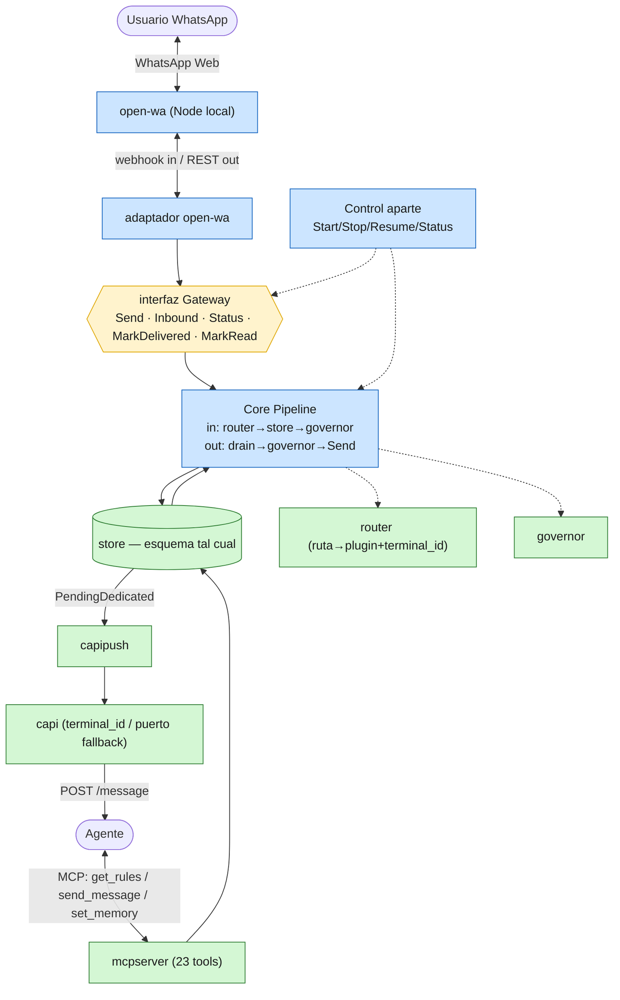

# piumy-gateway — inventario de cherry-pick + plan de migración

> **⚠️ PIVOTE (ct-2026-07-11, ST-E):** este plan es **histórico** y fue escrito contra **open-wa**. El proyecto pivoteó a **whatsmeow** (puro-Go, sin Node); `internal/openwa` fue **borrado**. La estructura del plan (fases F0→F5, cherry-pick, cAPI/MCP, schema, semáforo) sigue vigente — solo cambió el cliente de mensajería. Tesis actual: `../../CLAUDE.md`.

Core server en Go: puente **open-wa ↔ cAPI**. Cherry-pick de **estructura** desde Piumy
(`C:\proyectos\Piumy\coderoot`, módulo Go `pimywa`, código en `core/internal/`),
reimplementación limpia, `whatsmeow` fuera. Regla de código limpio: ver `../../CLAUDE.md`
(una responsabilidad por unidad · interfaz solo donde separa · gate duro en código ·
diagrama antes de codear).

> **Nombre:** el proyecto se llama **piumy-gateway** (módulo Go `piumy-gateway`). El
> diseño original se redactó bajo el nombre de trabajo `pimywa`; corregido a `piumy` por
> decisión del boss. Los env vars son `PIUMY_*` (ej. `PIUMY_MCP_KEY`, `PIUMY_OPENWA_*`).

---

## 1. Diagrama objetivo

---

## 2. Inventario de cherry-pick (por paquete)

Fuente: `Piumy/coderoot/core/internal`. Solo `gateway` y `media` tocan whatsmeow.
Reescritura de imports: `pimywa/core/internal/<pkg>` → `piumy-gateway/internal/<pkg>`.

| Paquete | Acción | Nota |
|---|---|---|
| `store` | **Migrar tal cual** | Esquema SQLite (7 tablas) + acceso. Esquema literal en `store/store.go`. El oro. Agnóstico. |
| `router` | **Migrar tal cual** | Whitelist + rutas + plugin. Sumar `terminal_id` por ruta. |
| `governor` | **Migrar tal cual** | Anti-ban (rate limit, kill switch). Edge-cases pagados hoy. |
| `capi` · `capipush` | **Migrar tal cual** | Despacho cAPI (AES-GCM). ⚠️ En la fuente **cAPI vive dentro de `restapi/`** (`api.go`), no hay carpetas `capi`/`capipush` sueltas — mapear en F1/F4. Sumar terminal_id/puerto fallback. |
| `mcpserver` | **Migrar tal cual** | 23 tools. Ajustar `ReadMarker` para apuntar al pipeline. |
| `autoreply` · `bridge` | **Migrar tal cual** | Modo auto (opcional en MVP). |
| `eventbus` · `state` · `mcpguard` · `config` · `dashboard` · `sysinfo` · `netinfo` · `sessionbackup` | **Migrar tal cual** | Todos agnósticos. |
| `gateway` | **REESCRIBIR** | Es el spaghetti + whatsmeow. Se parte en: interfaz `Gateway` + `corepipeline` + adaptador `openwa`. Mirar el viejo como referencia (governor/outbox/receipts). |
| `media` | **Reescribir/diferir** | Acoplado a `whatsmeow.DownloadableMessage`. open-wa entrega media distinto (URL/base64). Media = post-MVP; por ahora shim/no-op. |
| `whatsmeow` | **FUERA** | No se usa. |

### Esquema DB (se migra literal — es contrato de datos)
Tablas: **chats · messages · outbox · drafts · chat_groups · media · kv.**
Campos clave por contacto en `chats`: `mode`(auto/dedicated) · `rules`(RO agente) · `memory`(RW agente) · `context`(RW agente) · `is_boss`(RO agente) · `status` · `confirmation_mode` · `description` · `claimed_by/until`. Migraciones por `ALTER TABLE` (columnMigrations) — portar el mismo mecanismo.

### Contrato MCP (se migra literal — 23 tools)
Gate global: **Bearer token fail-closed** (`PIUMY_MCP_KEY`) + flood guard. `send_message` con 6 checks (incluye el **gate duro "sin rules → no actúa"** — la garantía va acá, no en la skill). **NO exponer** (privilegiadas, solo REST): `SetChatRules`, `SetIsBoss`, `ApproveDraft` — el agente nunca reescribe las reglas por las que se lo juzga ni se auto-declara boss. Escribibles por agente: solo `set_chat_memory` / `set_chat_context`.

---

## 3. Contrato del adaptador open-wa (de la doc oficial)

- **Servidor:** `npx @open-wa/wa-automate -p <puerto> -k <api_key>` (+ `--socket` o `-w <webhook_url>`).
- **Inbound:** open-wa entrega un `Message` — campos que usamos: `body`/`text`, `from` (chat id: `\d+@c.us` 1-1, `\d+-\d+@g.us` grupo, `\d+@lid`), `sender`/`senderId`, `t`/`timestamp`, `type`, `notifyName`, `mimetype`. Vía **webhook** (POST a nuestra URL) o **socket**. → mapear a `store.Message`.
- **Outbound:** `POST sendText { to|chatId, content }` al REST de open-wa (con api key).
- **Receipts:** `MarkRead` vía `sendSeen` (sí); `MarkDelivered` probable **no-op** (WhatsApp Web lo hace solo).
- **Auth:** api key en la request. Puerto = fallback del `terminal_id` del agente.

---

## 4. Plan por fases

- **F0 — Esqueleto.** `go.mod` (module `piumy-gateway`), `internal/`, `main.go` mínimo, el esquema DB (CREATE TABLE literal de Piumy `store/store.go`), config env. Build verde vacío.
- **F1 — Cherry-pick limpio.** Migrar los paquetes agnósticos (store, router, governor, eventbus, state, config, mcpguard, capi/capipush [ver nota restapi], sessionbackup, sysinfo, netinfo, dashboard, autoreply, bridge). Ajustar imports al módulo nuevo. `go build/vet/test` verde por paquete.
- **F2 — interfaz Gateway + corepipeline.** Definir la interfaz; reescribir limpio la lógica que en Piumy vive embebida en `gateway.go` (inbound: router→store→governor→MarkDelivered; outbox drain→governor→pacing→Send). Control facade aparte (Start/Stop/Resume/Status). Tests del pipeline con un adaptador fake.
- **F3 — adaptador open-wa.** Servidor HTTP para el webhook/socket inbound → `store.Message`; cliente REST para el outbound (`sendText`). Config `PIUMY_OPENWA_*` (endpoint, api key, puerto) env-only. Test con `httptest` fake de open-wa.
- **F4 — mcpserver + cAPI.** Migrar las 23 tools; wire del `capipush` con `terminal_id` por ruta (puerto fallback). Verificar el gate duro de `send_message`.
- **F5 — main.go + smoke local.** Wire todo; correr open-wa + piumy-gateway en la PC; smoke round-trip (WhatsApp → open-wa → pipeline → cAPI → agente → MCP → outbox → open-wa → WhatsApp).

Disciplina por fase (regla del proyecto): diagrama de flujo del sub-cambio → `dflux_resolve` → codear → `ponytail-review` → verde.

---

## 5. El core del core + puntos a confirmar

El comportamiento del agente (cómo usa rules/memory/context, el semáforo, el gate duro)
está diseñado en **`AGENT-BEHAVIOR.md`**. Los 4 puntos ahí ya tienen **decisión de
referencia** — solo necesitan el OK del boss al llegar a F3/F4, no frenan F0-F2:

1. **Semáforo del header** `{ level: boss/caution/danger, rule_ref }` — un solo mensaje, la skill obliga a leer la rule por MCP, gate duro en `send_message`. **[CONFIRMAR]**
2. **memory = permanente / context = del momento**, ambos RW por el agente. **[CONFIRMAR]**
3. **confirmation_mode**: default por tipo (1-1 none / grupo required), rules override. **[CONFIRMAR]**
4. **media**: post-MVP. **[CONFIRMAR]**

> El gate duro de las rules ("sin rules no se actúa") ya vive en `send_message` (código),
> se migra tal cual. La skill guía; nunca es la garantía.
