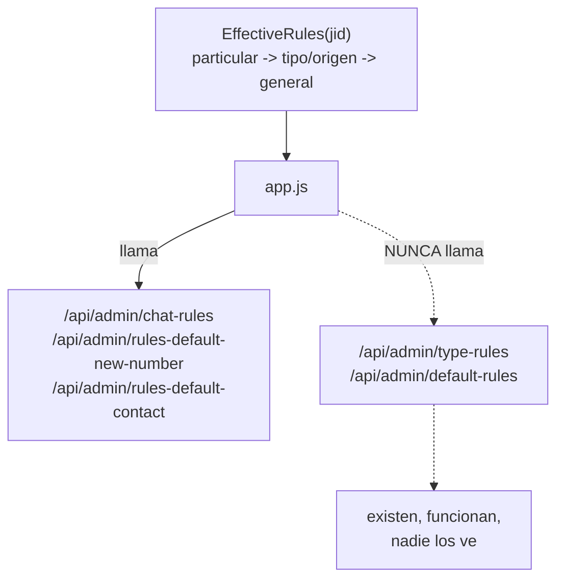
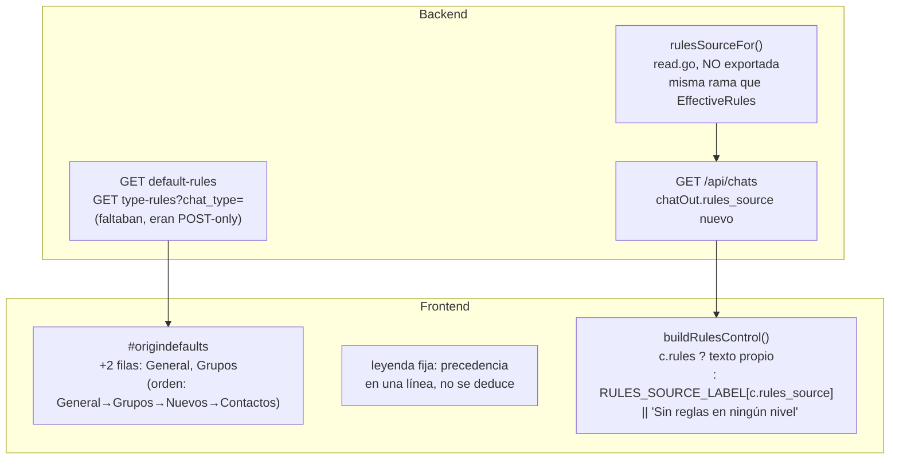
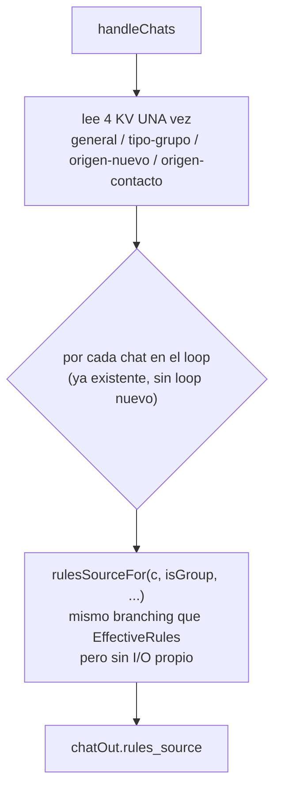
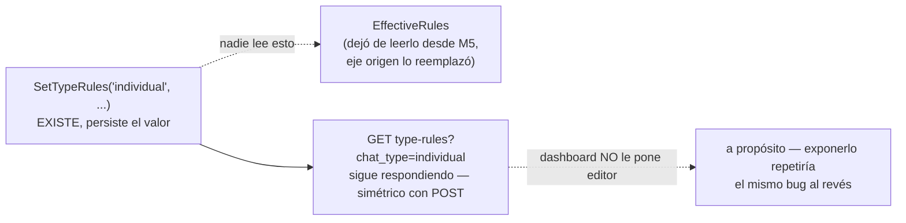

# Reglas invisibles (ct-2026-07-31)

Boss verbatim: *"las reglas por defecto no se ven"*. Citrino lo verificó
antes de despachar: `app.js` nunca llamaba `/api/admin/default-rules` ni
`/api/admin/type-rules` — existían, funcionaban, afectaban cómo contesta el
agente, y nadie podía verlos desde el tablero. Un chat sin reglas propias
mostraba `"(sin reglas propias)"`, que miente por omisión: sugiere que ahí
no rige nada, cuando puede estar aplicando la regla de tipo o la general.

## El problema — dos niveles sin interfaz

## El fix — 4 niveles visibles, un solo cálculo de jerarquía

## rulesSourceFor — por qué NO es solo "llamar EffectiveRules por fila"

`EffectiveRules` por fila habría significado hasta `dashboardChatLimit`
round-trips extra a la DB por request — acá las 4 KV se leen una vez y el
branching es puro Go sobre datos ya en memoria.

## La trampa conocida — `rules_type_individual`

Decisión de Citrino: **no reconectarlo** (cambiar el orden de resolución
con reglas reales cargadas es riesgo puro) y **no exponerlo** en el
dashboard. Queda anotado como deuda — reconectar o sacar el setter, sin
resolver en este cambio.

## Criterio de listo

- Los 4 niveles (particular ya existía; General, Grupos, Mensajes nuevos,
  Contactos) se ven y se editan desde el tablero, en orden de jerarquía,
  con leyenda explícita.
- Un chat sin reglas propias dice qué regla lo rige y de qué nivel viene;
  si de verdad no hay ninguna en ningún nivel, lo dice distinto.
- `go build ./... && go vet ./... && go test ./...` verde — tests nuevos:
  `TestChatsEndpointRulesSource` (los 6 casos: particular, tipo:grupo,
  general-por-grupo-sin-tipo, origen:nuevo, origen:contacto, ninguno),
  `TestGetSetTypeRulesRoundTrip`, `TestGetTypeRulesRejectsInvalidChatType`,
  `TestGetSetDefaultRulesRoundTrip`.
- `set_chat_rules`/`set_type_rules`/`set_default_rules` siguen bloqueadas
  por MCP — sin cambios, las reglas se escriben desde el tablero, nunca
  por un agente.
- `docs/MANUAL.md` actualizado.
