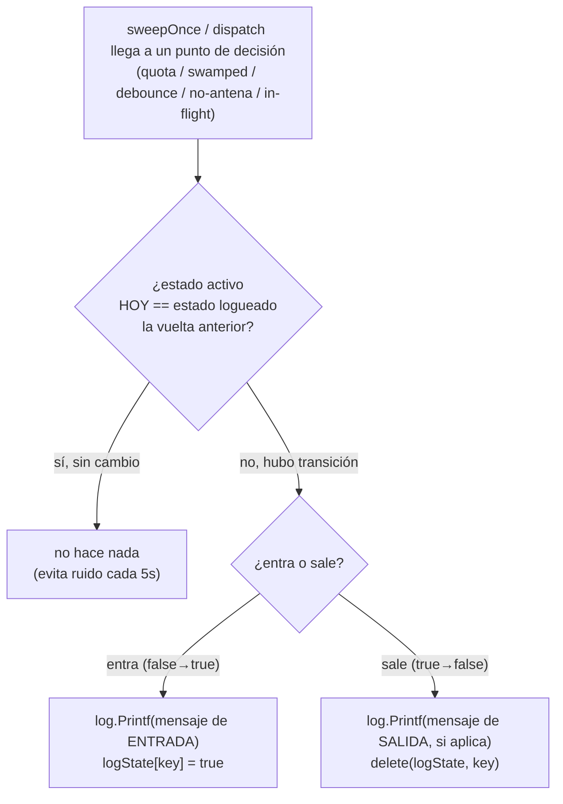

# S1 — Observabilidad del despacho cAPI (ct-2026-07-30-0309)

Contrato: `internal/capipush/capipush.go` no logueaba nada — ni éxito, ni
fallo, ni la razón de no despachar. Diagnosticar el smoke del 2026-07-29
exigió leer el código fuente línea por línea. Este sub-cambio **solo agrega
visibilidad** — cero lógica de despacho tocada (eso es S2-S4).

## 1. Puntos mudos identificados (contrato madre + hijo)

| Punto | Línea | Frecuencia sin fix | Tratamiento |
|---|---|---|---|
| Cuota diaria excedida | `sweepOnce` ~325 | cada sweep (5s) mientras dura | transición (logState) |
| Backpressure swamped | `sweepOnce` ~338 | cada sweep mientras dura | transición (logState) |
| Chat debouncado | `sweepOnce` ~344 | cada sweep durante la ventana (60s-5m) | transición (logState, por chat) |
| Injector = LogInjector (sin antena) | `dispatch` ~471 | cada sweep mientras no haya antena | transición (logState, por terminal) |
| Gate in-flight | `dispatch` ~474 | cada sweep mientras el terminal esté ocupado | transición (logState, por terminal) |
| Dispatch exitoso | `dispatch` fin | nunca se logueaba | log directo, siempre (evento real, no ruido) |
| Fallo de Inject (entrega) | `dispatch` ~551 | nunca se logueaba con detalle propio | log directo, siempre — es el fallo más probable en producción |

El sweep corre cada 5s: un log por vuelta para un estado que dura minutos
inunda el archivo. Los primeros 5 puntos son **condiciones sostenidas**
(persisten sweep tras sweep) → se logean solo en la transición
false→true/true→false. Los últimos 2 son **eventos** (ocurren una vez por
intento real de despacho) → se logean siempre que ocurren, sin necesidad de
deduplicar.

## 2. Mecanismo: `logState` + `logTransition`

`logState map[string]bool` vive en `Pusher` (mismo patrón que
`redispatchCount`: solo lo toca la goroutine de `sweepOnce`, sin lock). Las
keys son `"quota"`, `"swamped"` (estado global) y `"debounce:"+chatJID`,
`"noAntenna:"+terminalID`, `"inFlight:"+terminalID` (estado por chat/terminal).

`pruneStaleState` (antes `pruneRedispatchCount`, ahora también limpia las
entradas `"debounce:"+chatJID` de chats que salieron de `pending`) evita que
el mapa crezca sin límite para chats que dejan de tener mensajes pendientes
sin pasar por la rama "false" del loop.

## 3. Eventos directos (sin transición)

`dispatch()` ya termina en éxito o en error una sola vez por intento — no
hay repetición de sweep en juego, así que se loguean sin más:

- **Éxito**: una línea al final de `dispatch()`, antes del `return nil` —
  chat, terminal, nivel, cantidad de mensajes, nonce.
- **Fallo de entrega** (`Inject()` devuelve error): línea propia con prefijo
  distintivo (`ENTREGA FALLIDA`) antes de `CancelDispatch` — hoy ese error
  solo llegaba disuelto en el log genérico `capipush: dispatch %s: %v` de
  `sweepOnce`, indistinguible de cualquier otro error interno (falla de
  `store.GetChat`, encrypt, etc).

## Judgment calls

1. **Un solo helper genérico (`logTransition`) para las 5 condiciones
   sostenidas**, en vez de 5 campos booleanos/mapas ad-hoc — mismo
   mecanismo, distinta key. Menos código, mismo criterio en los 5 sitios.
   `quota` y `swamped` loguean también la salida (mensaje propio); `debounce`,
   `noAntenna` e `inFlight` no tienen mensaje de salida útil, así que su
   transición false se resuelve con `delete(p.logState, key)` directo
   (equivalente exacto a `logTransition(key, false, nil, nil)` — borrar una
   key ausente ya es no-op en Go — hallazgo de `ponytail-review`).
2. **No hay pruning para `noAntenna:`/`inFlight:`** (por terminal) — el
   universo de terminales es chico y estable (agentes registrados), a
   diferencia de `debounce:` (por chat, potencialmente muchos a lo largo del
   tiempo) que sí hereda el pruning ya existente.
3. **Rebautizo `pruneRedispatchCount` → `pruneStaleState`** (nombre privado,
   sin impacto en tests que referencian el campo `redispatchCount`
   directamente) — ahora hace dos limpiezas relacionadas, no una.
