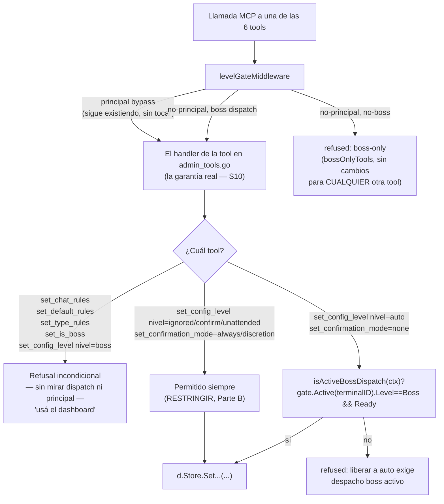

# S10 — El candado real, no el del prompt (ct-2026-07-30-1349)

Contrato madre: `ct-2026-07-30-0308-reparación-del-canal-agente-gateway-hall`.
Prioridad alta — va antes que S4b.

## 1. La causa raíz exacta (no es "falta un chequeo", es un bypass existente)

`levelGateMiddleware` (`levelgate.go:102-105`):

```go
// Principal bypass: full authority, no dispatch needed.
if principalID != "" && terminalIDFromContext(ctx) == principalID {
    return next(ctx, req)
}
```

Esto corre ANTES de mirar `bossOnlyTools`, `gate.Active`, o cualquier otra cosa.
`bossOnlyTools` YA tenía las 6 tools listadas (`set_chat_rules`, `set_is_boss`,
`set_type_rules`, `set_default_rules`, `set_confirmation_mode`,
`set_config_level`) — el gate por nivel EXISTE y funciona para terminales
no-principal. El agujero es específico: cualquier llamada desde el terminal
`PrincipalTerminalID` (`PIUMY_DEFAULT_TERMINAL_ID`) se salta TODO,
incluido `bossOnlyTools`, sin mirar si hay un dispatch boss activo en ese
momento. Diseñado así a propósito ("bypasses the default-DENY gate
entirely and can call any tool without an active dispatch", comentario de
`Deps.Gate`) — razonable para MUCHAS tools, pero demasiado ancho para las 6
que tocan permiso/identidad.

## 2. El mecanismo: el candado vive en el HANDLER, no en el middleware



**Por qué en el handler y no ampliando el middleware:** `bossOnlyTools` es un
mapa binario (boss-o-nada) — no puede expresar "depende del VALOR del
argumento" (auto vs ignored, none vs always). Meter ese branching dentro de
`levelGateMiddleware` (que ya sirve a 20+ tools) lo complica para todos.
Poniéndolo en el handler de CADA una de las 6: (1) es el único lugar que ya
lee el argumento real (`level`/`mode`), (2) es a prueba de que el
principal-bypass exista o no — aunque alguien reintroduzca otro agujero en
el middleware mañana, estas 6 tools se siguen negando solas. **Se sacan las
6 de `bossOnlyTools`** (quedan "ungated" para el middleware — pasan
directo al handler) porque su semántica ya no es "boss o nada", es la del
handler.

## 3. Por qué el dashboard no se rompe

Las 6 tools YA tienen su REST equivalente, con su propio auth
(`d.auth(...)`, bearer token), completamente separado de MCP:

| Tool MCP | Endpoint REST (ya existe, sin tocar) |
|---|---|
| `set_chat_rules` | `POST /api/admin/chat-rules` |
| `set_is_boss` | `POST /api/admin/is-boss` |
| `set_type_rules` | `POST /api/admin/type-rules` |
| `set_default_rules` | `POST /api/admin/default-rules` |
| `set_confirmation_mode` | `POST /api/admin/confirmation-mode` |
| `set_config_level` | `POST /api/admin/config-level` |

El dashboard llama estos endpoints directo (`internal/restapi/admin.go`),
nunca pasa por `levelGateMiddleware` ni por los handlers de
`admin_tools.go` — cerrar el camino MCP no le toca ni un carácter.

## 4. Alcance: por qué NO se tocan `set_chat_status`/`set_mode`

El contrato los menciona en la enumeración de texto, pero:
- `set_mode` (auto/dedicated) es un eje TOTALMENTE distinto — ruteo
  (¿lo despacha capipush o lo maneja `internal/autoreply`?), no
  confianza/permiso. No hay escalada de privilegio posible ahí.
- `set_chat_status` (whitelist/blacklist/new/ignored/agent_exclusive) ya
  vive en `chatScopedArg` (no en `bossOnlyTools`) — triage, no permiso; ya
  está correctamente abierto y scopeado al chat del dispatch.

Ninguno de los dos participa en la cadena de ataque descrita (reglas /
is_boss / nivel de confianza). Se dejan intactos — cambiarlos sería alcance
fuera de lo que el criterio de listo pide. Flagueado a Citrino para
confirmar la lectura, no asumido en silencio.

## 5. Memoria/contexto — la línea que no se toca

`remember`, `set_chat_memory`, `set_chat_context` no entran en este
subcontrato — son "agent-writable" por diseño (`get_chat`'s propia doc:
"memory/context son agent-writable... rules es READ-ONLY, solo settable
via set_chat_rules"). El agente escribe lo que OBSERVA (memoria/contexto),
nunca lo que lo AUTORIZA (reglas/is_boss/nivel). Ningún cambio de S10 los
roza.

## Judgment calls

1. **`isActiveBossDispatch` exige `Ready`, no solo `Level==Boss`** — mismo
   criterio que ST-A (`ct-2026-07-11-0740`) y `validateSend` ya aplican: un
   dispatch boss consumido (`gateDone`) no debe seguir otorgando el
   privilegio de liberar chats.
2. **Las 6 tools salen de `bossOnlyTools`** en vez de agregar una excepción
   ahí — el mapa es binario, esto ya no lo es; sacarlas es más honesto que
   forzar el modelo a mentir por partes.
3. **Sin tocar el principal bypass del middleware** — cambiarlo afecta
   create_group/set_kill_switch/set_capi_connector/approve_draft y más,
   ninguno de ellos parte de este contrato ni de la cadena de ataque
   descrita. El fix vive exactamente donde está el riesgo.

## Nota (T31, ct-2026-08-06-0244)

`set_chat_rules` — una de "las 6" de este documento — dejó de estar
MCP-BLOCKED. El boss revirtió esa parte puntual, sin condiciones,
verbatim: *"con que la skill recomiende, ya es responsabilidad del
usuario."* Las otras 5 (`set_is_boss`/`set_type_rules`/
`set_default_rules`/`set_confirmation_mode`/`set_config_level`) siguen
exactamente como este documento las describe — sin cambios. Detalle
completo en `docs/T31-DIAGRAMA-DESBLOQUEAR-SET-CHAT-RULES.md`. Este
documento queda como registro de la decisión ORIGINAL (por qué se cerró
así en su momento), no se reescribe.
