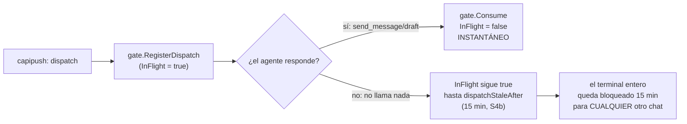
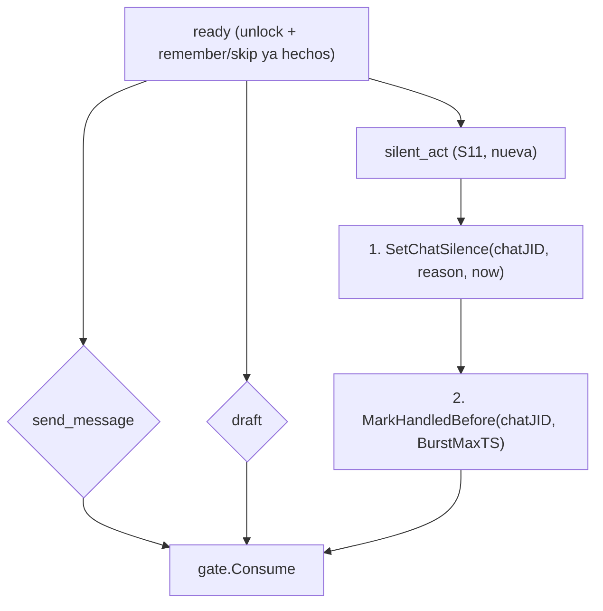

# S11 — El silencio como acto de primera clase (ct-2026-07-30-1619)

Contrato madre: `ct-2026-07-30-0308-reparación-del-canal-agente-gateway-hall`.
Absorbe y reencuadra el defecto 5 de S4b (quedó anotado, sin tocar código,
en esa entrega). Idea del boss, verbatim: *"no se si me gusta mucho la idea
de tener siempre la última palabra"* / *"falta un silent act"*.

## El problema — hablar es gratis, callarse cuesta 15 minutos

`gate.Consume` sólo se llamaba desde `send.go` (líneas de `send_message` y
`draft`) — el turno se liberaba ÚNICAMENTE al enviar. Eso contradice de
frente la política que el propio sistema le entrega al agente
(`internal/autoreply/decision-policy.md`, punto 1):

> "NO siempre respondas. Dar siempre la última palabra es un error
> garrafal. Si el último mensaje del chat lo diste vos (el agente), NO
> vuelvas a escribir."

La política pide silencio; la mecánica premiaba hablar. Cuando eso pasa,
gana la mecánica — no depende del criterio del modelo, es la estructura.

## El fix — `silent_act`, la tercera rama de `ready`

`silent_act` no comparte `validateSend` (no hay contenido que validar, no
hay `to` — como `remember`/`skip`, opera siempre sobre el chat del
dispatch actual, sin override) pero exige el MISMO gate: `gate.Active(termID)`
bound + `Ready`. La decisión de callarse pesa lo mismo que la de enviar, así
que no puede saltarse el checkpoint unlock/remember-skip que enviar sí
exige — "no debilitar el gate" (cuidado explícito del contrato).

Tres efectos, mismo orden que `send_message`/`draft`:

1. **`store.SetChatSilence(chatJID, reason, now)`** — registra el motivo
   (opcional, texto libre: "ya tuve la última palabra", "no me
   corresponde", "spam") y cuándo. Hoy el silencio es indistinguible de un
   agente colgado o un mensaje que nunca llegó; con el motivo, el dueño
   puede auditar el criterio del agente en vez de confiar a ciegas.
2. **`store.MarkHandledBefore(chatJID, active.BurstMaxTS)`** — el burst
   despachado no se re-despacha (mismo bound que `send_message`/`draft` ya
   usan).
3. **`gate.Consume(termID)`** — la que mata el sesgo: MISMO call site que
   usa `send.go`, ningún método nuevo en `gate.go`. El terminal se libera
   al instante, no en 15 minutos.

## Decisiones (con evidencia, dejadas explícitas por el contrato)

**¿Tool nueva o extender `skip`?** Tool nueva. `skip` ya significa otra
cosa: el checkpoint `noting → ready` ("nada que recordar") — DESPUÉS del
cual el agente TODAVÍA puede enviar. `silent_act` es una acción TERMINAL,
como `send_message`/`draft` (la decisión de NO enviar). Fusionar los dos
significados en un botón es exactamente lo que vuelve incomprensible un
sistema más adelante — el mismo criterio que separó `bossOnlyTools` de
`selfGatedTools` en S10.

**¿Dónde vive el motivo?** Dos columnas nuevas en `chats`
(`silence_reason`/`silence_at`), no una tabla — mismo patrón que
`memory`/`context`: un solo slot ("la última vez"), no un historial. Se
recupera con el `get_chat`/`GetChat` que ya existe — sin superficie nueva
de consulta.

## Qué NO se rompe / no se toca

- `gate.go` queda intacto — `Consume` ya era exportado y genérico (no sabe
  si lo llama un envío o un silencio); no hizo falta ningún método nuevo.
- `levelgate.go` queda intacto — `silent_act` no tiene `to`/`chat_id` que
  escapar, así que no entra en `chatScopedArg` (mismo motivo por el que
  `send_message`/`draft` tampoco están ahí: hacen su propio chequeo de
  chat-match, ver el comentario de `chatScopedArg`).
- Un dispatch `boss` sigue "sin gate" (nace `Ready`) — `silent_act` funciona
  igual para boss, caution y danger, mismo criterio que `remember`/`skip`.

## Criterio de listo

- Test: recibe dispatch → `silent_act` → el siguiente chat se despacha sin
  esperar 15 min (`TestSilentActReleasesTerminalImmediately`, chequea
  `gate.InFlight` false inmediatamente después, y que un segundo
  `silent_act` da `locked:` — one-shot, igual que `send_message`).
- Test: los mensajes del burst quedan marcados atendidos
  (`TestSilentActMarksBurstHandled`, `PendingDedicated` vacío después).
- Test: el motivo queda registrado y es recuperable
  (`TestSilentActRecordsReason`, vía `GetChat`).
- Test: exige el mismo gate que `send_message` — sin dispatch, o locked/
  noting, se rechaza (`TestSilentActRequiresBoundReadyDispatch`).
- `go build ./... && go vet ./... && go test ./...` verde.
- `MANUAL.md` actualizado.
- Pendiente: verificación en vivo — un chat donde el agente decide
  `silent_act` no debe bloquear a los demás.

## Cierre: la política ahora nombra la herramienta (Citrino, contenido; acá el cableado)

La nota que dejé como "fuera de scope" resultó ser el criterio de listo: sin
nombrar `silent_act`, la herramienta existe pero el sesgo sigue intacto — el
agente sigue sin saber que hay un botón para cerrar el turno en silencio.
Citrino decidió el contenido; acá quedó investigar CUÁL archivo edita algo
real.

**Hallazgo antes de tocar nada:** hay DOS `decision-policy.md`, no uno —
`internal/mcpserver/decision-policy.md` (embebido por `mcpserver.go`,
`get_decision_policy`/`policy_version` lo sirven — el que lee el agente con
sesión MCP, gate y `silent_act` disponible) e
`internal/autoreply/decision-policy.md` (embebido por `autoreply/worker.go`,
alimenta a un `bridge.Bridge` — un worker que resuelve
`{ShouldReply, Draft, NeedsConfirmation}` en una sola llamada a un LLM
externo, SIN sesión MCP, SIN gate, SIN `silent_act` disponible). Ya habían
divergido entre sí (puntos 5 y 8 con texto distinto) — dos copias
independientes de "la" política, silenciosamente fuera de sync. `PolicyPath`
(`PIUMY_POLICY_PATH`, default `""` según `F5-DESIGN.md`/`MANUAL.md`) es un
archivo externo COMPARTIDO que ambos leerían en vez de su propio embed SI
estuviera configurado — no lo está (default documentado), así que el
embebido de `mcpserver` es el que efectivamente gobierna hoy.

**Edité solo `internal/mcpserver/decision-policy.md`** (punto 1, texto
verbatim de Citrino, sin las comillas invertidas de su mensaje — el archivo
no usa ese estilo en ningún otro punto, p.ej. "escalate"/"send_message" ya
aparecen sin backticks). **NO toqué `internal/autoreply/decision-policy.md`**
— mencionar `silent_act` ahí sería instrucción rota: ese worker no tiene MCP,
no tiene gate, no puede llamar esa tool. La divergencia entre los dos
archivos es un hallazgo aparte, señalado a Citrino, no resuelto acá (unificar
o mantener separados es una decisión de arquitectura, no parte de S11).
