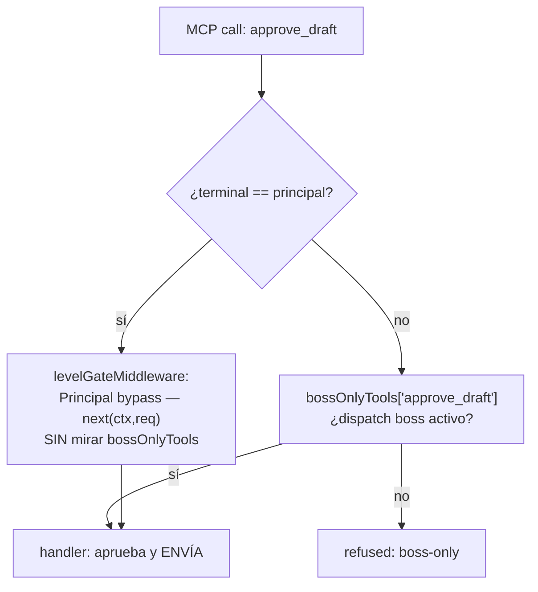
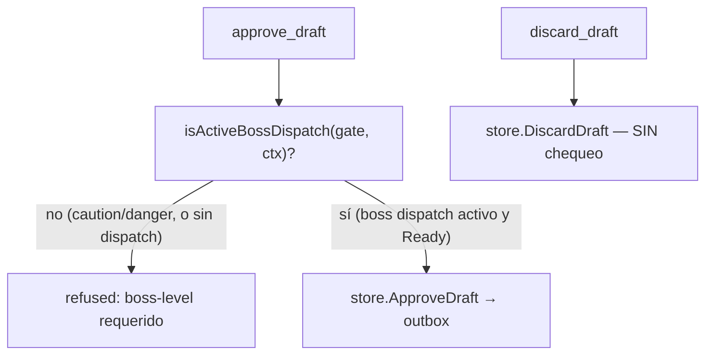

# S12 — approve_draft tiene el mismo bypass del principal que cerramos en S10 (ct-2026-07-30-1622)

Contrato madre: `ct-2026-07-30-0308-reparación-del-canal-agente-gateway-hall`.
Continuación directa de S10, mismo patrón, otro botón. Chico.

## El problema

`approve_draft`/`discard_draft` estaban en `bossOnlyTools` — cubre terminales
no-principal. Pero el "Principal bypass" del middleware (el MISMO que S10
encontró) salta esa gate entera sin mirar si hay un dispatch boss activo. El
agente principal podía aprobar y ENVIAR un borrador retenido sin que el boss
lo pidiera — vaciando lo que se configuró el mismo día (números
desconocidos en `confirm`, respuestas retenidas para revisión del boss): a
un desconocido le alcanza con convencer al agente de aprobar la respuesta
que le iba dirigida a él mismo.

## El fix — mismo patrón de S10, reusando `isActiveBossDispatch`

| Acción | Regla |
|---|---|
| `approve_draft` (envía → **libera**) | exige `isActiveBossDispatch(gate, ctx)` |
| `discard_draft` (no envía → **restringe**) | siempre permitido |

- Ambas tools salen de `bossOnlyTools` (el mismo mapa binario que S10 ya
  demostró no alcanza para lógica per-tool) y pasan a `selfGatedTools` —
  witness set para tests, no parte de la enforcement real.
- `approve_draft` reusa `isActiveBossDispatch` **sin duplicarlo** — el mismo
  helper que `set_confirmation_mode`("none")/`set_config_level`("auto") ya
  usan (S10, `admin_tools.go`).
- `discard_draft` no recibe ningún chequeo nuevo: cero código, solo sale de
  `bossOnlyTools`. Mismo criterio que las restricciones de S10
  (`always`/`discretion`/`confirm`/`unattended`/`ignored`): restringir es
  gratis.
- La feature que el boss quiere sigue viva sin tocar nada: "aprobá los
  pendientes" registra un dispatch nivel boss en el terminal que lo recibe,
  así que `isActiveBossDispatch` da `true` — funciona igual que antes para
  el caso real que el boss pidió.
- Descripciones actualizadas: ya no dicen "OWNER-ONLY" (mentira para el
  principal, mismo tipo de falla que S10 corrigió en las otras 6) — dicen
  lo que el código hace cumplir.

## Qué NO se toca

- El bypass del middleware en sí — afecta 20+ tools fuera de este contrato;
  la corrección va en el handler, donde está el riesgo real (misma decisión
  de S10).
- La ruta REST del dashboard (`internal/restapi/admin.go`) — llama
  `store.ApproveDraft`/`DiscardDraft` directo, nunca pasa por `gate` ni por
  este middleware. Verificado: cero cambio de comportamiento ahí.

## Criterio de listo

- Test: `approve_draft` sin dispatch boss (sin dispatch, danger, o
  principal-sin-dispatch — el incidente exacto) → rechazado
  (`TestApproveDraftRequiresBossDispatch`).
- Test: `approve_draft` con dispatch boss activo → permitido
  (`TestApproveAndDiscardDraft`, ya existente).
- Test: `discard_draft` sin dispatch boss (sin dispatch, o danger) →
  permitido (`TestDiscardDraftAlwaysAllowed`).
- La ruta del dashboard sigue funcionando igual (sin cambios de código ahí,
  confirmado).
- Descripciones actualizadas.
- `go build ./... && go vet ./... && go test ./...` verde. `ponytail-review`
  pasado — diff mínimo, un solo `if` nuevo en `approve_draft`, cero código
  en `discard_draft`.
- `MANUAL.md` actualizado.
