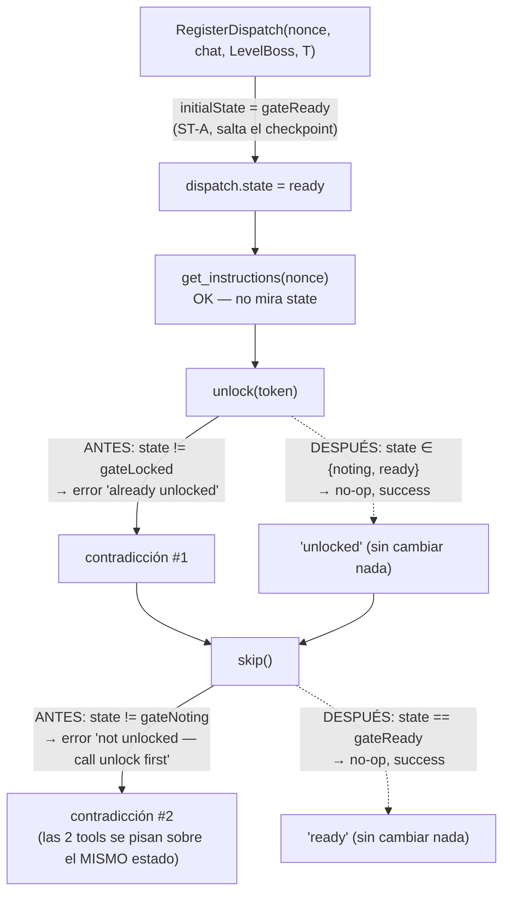

# S2 — Gate del dispatch: estado inconsistente sin salida (ct-2026-07-30-030928)

Contrato madre: `ct-2026-07-30-0308-reparación-del-canal-agente-gateway-hall`.

## 1. Causa raíz (confirmada, no es la hipótesis de Citrino tal cual — es más simple)

`RegisterDispatch` arranca un dispatch `boss` directo en `gateReady` (ST-A,
ct-2026-07-11-0740 — `gate.go:142-145` — boss nunca necesitó el checkpoint
unlock/remember/skip). Pero `Unlock` y `advanceToReady` (el motor de
`remember`/`skip`) no lo saben: los dos comparan contra UN SOLO estado
esperado y tratan cualquier otro estado como el mismo error genérico.

El agente sigue el ritual descrito para danger/caution (llama `unlock` por
hábito, aunque `get_instructions` ya avisa "boss-level dispatches are exempt")
y las dos tools se contradicen sobre EL MISMO estado (`ready`, no locked). El
agente queda sin saber si avanzar, `send_message` nunca se llama,
`gate.Consume` nunca corre, y el terminal queda `InFlight` para siempre (hasta
el stale sweep, 1h por defecto) — el "canal congelado" que reportó el smoke.

## 2. Fix: `Unlock`/`advanceToReady` idempotentes desde el estado ya-alcanzado

No se toca `RegisterDispatch` (la garantía de seguridad, intacta). Se
generaliza `Unlock`/`advanceToReady` para que "ya pasaste este checkpoint" sea
un **éxito silencioso**, no un error — vale para boss (nace en `ready`) y
también, de yapa, para un doble-llamado de `unlock`/`skip` en caution/danger
(idempotencia general, no un caso especial de boss):

| Estado real | `unlock()` | `remember()`/`skip()` |
|---|---|---|
| `locked` | transición real (valida token) | error real: "not unlocked — call unlock first" |
| `noting` | **no-op success** (ya pasó este paso) | transición real |
| `ready` | **no-op success** | **no-op success** (ya pasó este paso) |
| `done` | error DISTINTO: "dispatch already consumed" | error DISTINTO: "dispatch already consumed" |

Ya no hay par de mensajes que se contradigan sobre el mismo estado: o las dos
tools reportan éxito (boss, o un doble-llamado inofensivo), o las dos
describen honestamente por qué no se puede avanzar (`locked` real, o `done`
real — mensaje propio, ya no reusa "already unlocked").

## 3. Timeout ya libera solo — le faltaba el log (criterio 3 del contrato)

`sweepLocked` ya reclamaba un dispatch stale (H5, ct-2026-07-10-0540) sin
reiniciar el gateway — pero en silencio. Se agrega un `log.Printf` en el
punto de evicción (mismo canal que S1: transición real, no ruido de sweep —
`gateSweepInterval` es 5 minutos, no 5 segundos, así que ni siquiera hace
falta lógica de deduplicación).

## 4. Segundo defecto de Citrino (nonces huérfanos por force-replace) — NO se toca la lógica

Confirmado contra `docs/F4B-DIAGRAMA-PRIVILEGE-TRANSITION-FIX.md` y los tests
`TestCancelDispatchIgnoresMismatch`/`TestRegisterDispatchClosesResidualPrivilegeWindow`
ya existentes: el force-replace de `RegisterDispatch` reemplaza SIEMPRE el
dispatch anterior de un terminal, esté o no todavía en curso — es la garantía
de seguridad documentada ("no dejar privilegio residual"), no un bug. El
chequeo `gate.InFlight` en `capipush.dispatch()` es solo UX/eficiencia (evita
interrumpir trabajo legítimo), nunca la garantía real.

Bajo operación normal (un solo goroutine de sweep, secuencial) el InFlight
guard evita la colisión en la práctica. El defecto #1 de arriba es la causa
más probable de que colisionara hoy: un dispatch boss atascado en la
contradicción nunca llega a `Consume`, así que sigue "vivo" (no `done`) por
mucho más tiempo del normal, ampliando la ventana en la que un mensaje nuevo
puede toparse con él. Arreglar #1 reduce la frecuencia real del choque.

Lo que SÍ se agrega (sin tocar `RegisterDispatch`): un log en
`GetInstructions` cuando el nonce no existe o no matchea el terminal — hoy
esos dos casos devuelven un error MCP al agente pero no dejan rastro del lado
del gateway. Mismo criterio de S1: decisión silenciosa → visible.

## Judgment calls

1. **Idempotencia general, no un `if level == LevelBoss` puntual** — mismo
   código sirve para boss (nace en `ready`) y para un doble-llamado
   inofensivo en cualquier nivel. Menos ramas, mismo resultado.
2. **`done` sigue siendo un error** (a propósito, ST-A): dejar que
   `unlock`/`skip` tengan éxito silencioso sobre un dispatch consumido
   sería confuso y contradice la garantía "un terminal que ya usó su
   dispatch queda gateado hasta el próximo" — aunque `Ready` (que es lo que
   de verdad gatea `send_message`/`levelGateMiddleware`) nunca lo permitiría
   de todos modos.
3. **No se reproduce mecánicamente el defecto #2** (nonce huérfano) con un
   test dedicado — el mecanismo YA está cubierto por
   `TestCancelDispatchIgnoresMismatch`; agregar un test que fuerce la MISMA
   colisión desde `capipush` sería reprobar una garantía de seguridad ya
   probada, no una regresión nueva.
