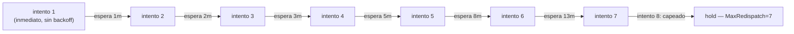

# S4b — Los tres relojes del reintento, calibrados juntos (ct-2026-07-30-1255)

Contrato madre: `ct-2026-07-30-0308-reparación-del-canal-agente-gateway-hall`.
Reemplaza al S4 original. Cinco defectos, cuatro con fix de código, uno
(#5) resuelto por análisis — ver sección propia abajo.

## Defecto 1 — el más grave: fallo de entrega consume presupuesto

```go
p.gate.RegisterDispatch(...)
p.redispatchCount[oldest.ID]++         // ← sube ACÁ, antes de Inject
...
if err := injector.Inject(...); err != nil {
    p.gate.CancelDispatch(...)          // revierte el gate...
    return err                          // ...pero NO el contador
}
```

**Fix:** mover el incremento a DESPUÉS de un `Inject` exitoso. Un fallo de
entrega (canal caído) ya no gasta nada del presupuesto de contención — se
reintenta cada sweep (5s), sin límite, hasta que el canal vuelve. Es
exactamente lo que pide el boss ("resiliente si se corta 48 horas") sin
necesidad de un segundo contador: "no se pudo entregar" simplemente deja de
tocar `redispatchCount` en absoluto.

## Defecto 2 — el anclaje al más viejo mata el chat entero

`oldest := burst[0]` — si el mensaje MÁS VIEJO agota sus intentos, el
`return nil` corta TODO el burst, incluidos mensajes nunca intentados.

**Fix:** anclar al mensaje MÁS NUEVO (`burst[len(burst)-1]`) en vez del más
viejo. Si no llegó nada nuevo, más-nuevo == más-viejo (mismo comportamiento
que antes, capea correctamente un chat mudo). Si llegó un mensaje nuevo, el
ancla cambia — ese mensaje nunca fue intentado, así que su contador
arranca en 0 y el burst completo (viejo + nuevo, coalescidos igual que
siempre) vuelve a intentarse. Un agente que ignora TODO igual queda contenido
en cuanto deja de llegar tráfico nuevo — la protección real (contra un
agente colgado) no se debilita, sólo deja de castigar el tráfico fresco.

## Defecto 3 — Fibonacci con techo, y por qué `MaxRedispatch` pasa a 7



Tabla de Citrino (idea del boss): 1, 2, 3, 5, 8, 13 minutos — **6 valores**.
6 valores = 6 BRECHAS entre intentos = **7 intentos totales**, no 6. Con
`MaxRedispatch=3` (el viejo default) sólo se hubieran usado los primeros 2
valores de la tabla — subir a 7 es lo que hace que "no hace falta más que
eso" (Citrino) sea literalmente cierto: la tabla se usa completa, de punta
a punta. Total acumulado: 1+2+3+5+8+13 = 32 minutos antes de darse por
vencido — coherente con "un agente real toma minutos", no segundos.
`redispatchBackoff(attempt)` no crece más allá del último valor (13m) si
alguna vez `MaxRedispatch` se configura más alto — mismo criterio "no hace
falta más" aplicado como techo defensivo. Jitter ±25%, mismo criterio que
`isDebounced` ya usa (tráfico interno gateway→terminal, sin riesgo de baneo,
pero consistente).

## Defecto 4 — una hora de canal muerto

`dispatchStaleAfter` 1h → **15 minutos**. Coherente con el conjunto: más
que el paso más largo de Fibonacci (13m, así que un agente legítimamente
lento a mitad de un reintento no queda cortado a mitad de camino), muchísimo
menos que 1 hora. `gateSweepInterval` (5 min, sin tocar) sigue siendo el
barrido que aplica el reclamo — peor caso ahora ~20 min, contra ~65 min de
antes.

**Settings, no hardcode:** `MaxRedispatch` y `DispatchStaleAfter` se leen
en vivo (`store.SettingCapipushMaxRedispatch`/
`SettingCapipushDispatchStaleAfter`) — `Config` da el fallback de código.
`gate.SetStaleAfter(...)` ya era un seam pensado para esto (su propio doc:
"so the window can be tuned without a rebuild") — `sweepOnce` lo llama en
cada vuelta, reusando el mecanismo existente en vez de darle a `Gate` una
dependencia nueva de `store`.

## Defecto 5 — cerrar el gate no marca `handled` (resuelto por análisis, sin tocar código)

Investigado el mecanismo real antes de asumir la lectura de Citrino:
`mark_handled` es una operación de DB pura — **no** llama a `gate.Consume`.
Un dispatch que llega a `ready` sin `send_message` (que sí llama `Consume`)
se queda `InFlight=true` indefinidamente. Mientras `InFlight` sea `true`,
`dispatch()` retorna en la línea del chequeo de `InFlight` (antes de llegar
siquiera al cap de reintentos) — así que el barrido de 5 segundos NO puede
re-despachar ese mensaje mientras el gate sigue "colgado" en `ready`.

**El mecanismo real es `dispatchStaleAfter`, no el barrido de 5s:** el
único camino para que ese mensaje vuelva a `PendingDedicated`-elegible es
que el reclamo por timeout libere el terminal — con el 1h viejo, un uso de
"toda la noche" alcanza de sobra para que el timeout dispare una vez y el
barrido siguiente re-despache un mensaje que el agente YA había procesado
(aunque no marcado). El defecto 3 (backoff) no es lo que lo neutraliza — es
el **defecto 4** (bajar `dispatchStaleAfter` a 15 min): la ventana de
re-despacho espurio se achica en la misma proporción (de ~1h a ~20 min), y
el "daño" de una re-entrega espuria de un mensaje ya atendido es un duplicado
inofensivo (no un flood — `redispatchCount` con backoff sigue limitando
cuántas veces puede repetirse). No se toca código aparte del fix de
defecto 4 — la corrección la absorbe.

## Qué NO se rompe

- Contención sigue activa: un agente colgado (ignora TODO, nunca llega
  tráfico nuevo) sigue capeado en `MaxRedispatch` intentos — sólo cambia
  CUÁNTOS (7 en vez de 3) y CADA CUÁNTO (Fibonacci en vez de cada 5s).
- Los 557 pares de identidad — sin tocar, ajeno a este contrato.

## Judgment calls

1. **Un solo `lastDispatchAt map[string]time.Time`**, no un struct nuevo —
   reusa la misma clave (`anchor.ID`) que `redispatchCount` ya usa, se
   podà junto en `pruneStaleState`.
2. **`redispatchBackoff` es tabla de código, no setting** — es una decisión
   de diseño (la curva en sí), no una perilla operativa; `MaxRedispatch`
   (cuántos pasos usar) y `DispatchStaleAfter` sí son perillas y sí van a
   settings.
3. **`gate.go`'s `dispatchStaleAfter` (la constante, el valor ANTES de
   cualquier `SetStaleAfter`) también baja a 15m** — evita que quede un
   valor de 1h como trampa para cualquier `NewGate()` que nunca reciba un
   `SetStaleAfter` (p.ej. un test, o un build que no cablea capipush).
