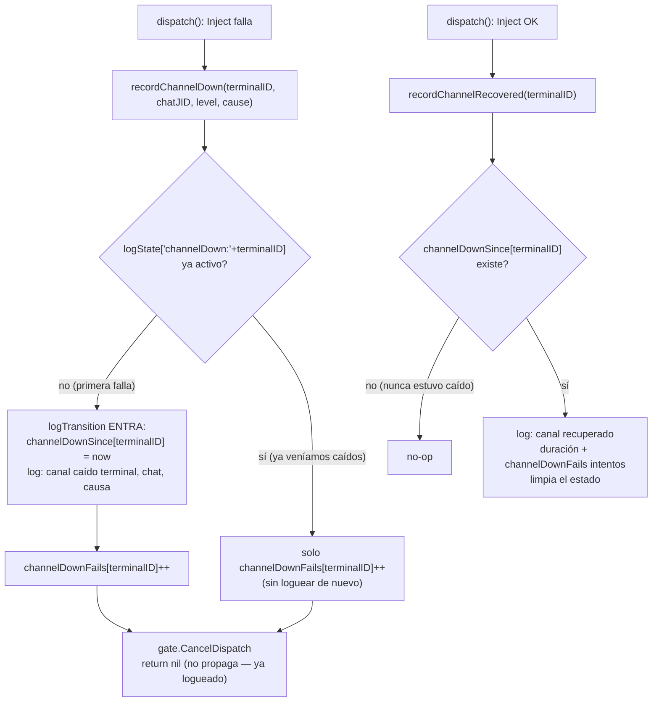

# S4c — El log del canal caído se ahoga a sí mismo (ct-2026-07-30-1512)

Contrato madre: `ct-2026-07-30-0308-reparación-del-canal-agente-gateway-hall`.
Continuación directa de S4b — encontrado por la verificación EN VIVO del
propio S4b (corte real de antena), no por tests: los tests no podían
mostrarlo porque no miden volumen de log a lo largo del tiempo.

## La medición que lo disparó

Corte real, antena apagada 2026-07-30 11:09→11:10 (14 min):

| Medición | Valor |
|---|---|
| Líneas de log generadas | 306 |
| De ellas, duplicadas | 153 |
| Proyección al escenario de 48h del boss | ~63.000 líneas |

El subcontrato (S4b) que hizo sobrevivible un corte de 48 horas **destruye
el propio log** en ese mismo corte — y el log es lo que S1 construyó
justamente porque no había con qué diagnosticar.

## Qué NO se toca

**Reintentar cada sweep mientras el canal está caído es correcto.** Es lo
que hizo que los 3 mensajes del boss llegaran 6 segundos después de volver
la antena (decisión deliberada de S4b, documentada en el código: "retries
every sweep, unbounded, until the channel comes back"). El problema es
loguear cada sweep, no reintentar cada sweep.

## El fix — el mismo `logTransition` de S1, aplicado a un estado que nació después

- **Clave de transición por TERMINAL, no por chat** (decisión explícita del
  contrato, verificada antes de codear): una antena caída falla TODOS los
  chats ruteados a ese terminal de forma idéntica — una clave por chat
  seguiría multiplicando el ruido que el corte real expuso. `logState`
  gana un tercer prefijo (`"channelDown:"`, junto a `"debounce:"` y
  `"backoff:"` ya existentes) exactamente igual que `"noAntenna:"` e
  `"inFlight:"`, que ya son por-terminal.
- **Entrada:** una línea con terminal, el CHAT que primero disparó la
  falla y la causa exacta (`handshake status 404`) — ese dato fue lo que
  permitió a Citrino diagnosticar el corte real de un vistazo, sin abrir
  código (el payoff de S1). No se pierde.
- **Salida:** una línea con cuánto duró el estado y cuántos intentos
  fallaron mientras estuvo activo (`channelDownFails[terminalID]`) — dato
  operativo real ("estuvo caído 14 min, 153 intentos") que antes no existía
  en ningún lado, y sólo puede reportarse en el momento en que el estado
  termina.
- **La duplicación de línea por fallo se resuelve al mismo tiempo:** antes
  cada fallo escribía `ENTREGA FALLIDA...` (en `dispatch`) Y
  `capipush: dispatch %s: %v` (en `sweepOnce`, el catch genérico de
  cualquier error de `dispatch`). Como `dispatch()` es el ÚNICO llamador de
  ese path y su valor de retorno solo se usa para ese log, `dispatch` ahora
  devuelve `nil` en el path de fallo de `Inject` (ya logueado vía
  `recordChannelDown`) en vez de propagar el error — `sweepOnce` nunca ve
  el error, nunca lo re-loguea. La línea que sobrevive es la de mejor
  contexto (chat+terminal+causa en la entrada; duración+conteo en la
  salida), no un wrapper de error nuevo para distinguir el caso — la
  solución más simple que cierra el requisito.

## Qué NO se rompe

- El reintento sigue siendo cada sweep, sin backoff ni límite mientras el
  canal esté caído — sólo cambia el LOG, verificado con
  `TestChannelDownLogsTransitionOnceNotPerSweep` (`inj.count() == 5` tras 5
  sweeps fallidos, misma cantidad de intentos que antes).
- Otros errores de `dispatch()` (GetChat, sin terminal_id, encrypt,
  RegisterDispatch) NO pasan por este mecanismo — siguen logueados una vez
  por `sweepOnce`'s línea genérica, sin cambios; el problema era
  específicamente el path de `Inject`, doble-logueado.
- `channelDownSince`/`channelDownFails` no se podan en `pruneStaleState` —
  mismo criterio que `"noAntenna:"+terminalID`/`"inFlight:"+terminalID`
  (tampoco podados hoy): claves por terminal, un conjunto acotado por la
  cantidad de agentes, no por mensaje.

## Criterio de listo

- Test: N sweeps consecutivos con `Inject` fallando → UNA línea de entrada,
  no N (`TestChannelDownLogsTransitionOnceNotPerSweep`).
- Test: al recuperarse, una línea de salida con duración y conteo
  (`TestChannelRecoveryLogsDurationAndFailedCount`).
- `go build ./... && go vet ./... && go test ./...` verde.
- Verificación en vivo: repetir el corte real, contar líneas — tienen que
  ser 2, no 300.
