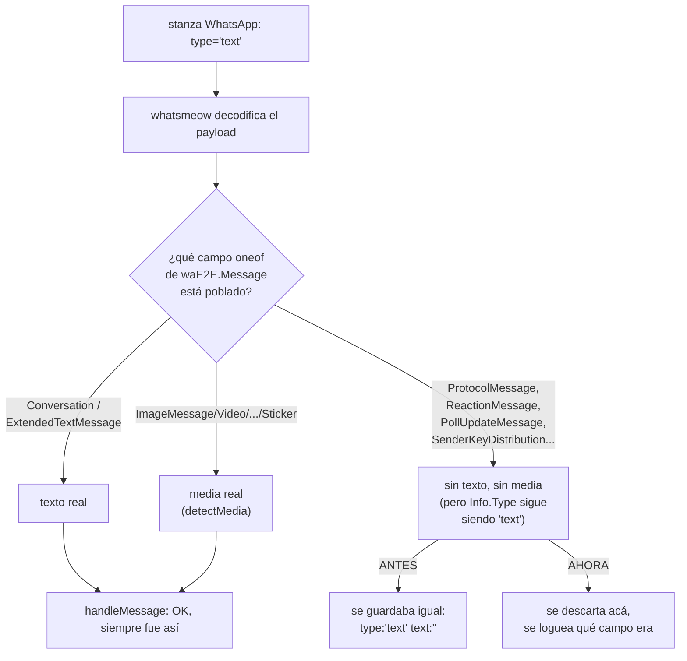
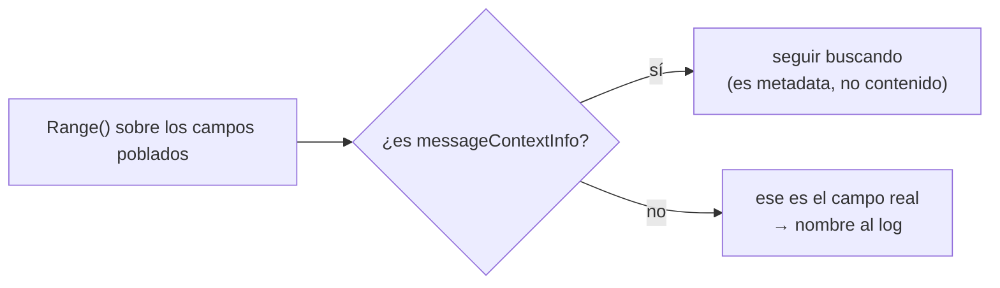

# S5 — Mensajes con tipo texto y cuerpo vacío (ct-2026-07-30-031027)

Contrato madre: `ct-2026-07-30-0308-reparación-del-canal-agente-gateway-hall`.

## La evidencia

Chat Note-to-Self del boss, **nueve mensajes
en quince segundos** (ts 1785335604–1785335619), todos `from_me:false`,
`type:"text"`, `text:""`. Uno de esos vacíos fue el envelope que capipush
despachó al agente durante el smoke — el disparador de la cadena que mató
el canal (S2): el agente no tenía nada que hacer con un envelope en blanco,
no cerró el gate, el canal quedó trabado detrás.

## Investigación — por qué `Info.Type` miente

`internal/whatsmeow/inbound.go`'s `handleMessage` (antes del fix):

```go
text := evt.Message.GetConversation()
if text == "" {
    text = evt.Message.GetExtendedTextMessage().GetText()
}
msgType := evt.Info.Type   // ← acá está el problema
```

`types.MessageInfo.Type` se llena en whatsmeow's `parseMessageInfo`
(`message.go:219`): `info.Type = ag.OptionalString("type")` — lee el
atributo `type` del NODO CRUDO del stanza (`<message type="text" ...>`),
**no el payload descifrado**. Y WhatsApp pone `type="text"` en el stanza
para casi TODO lo que no es media explícita — reacciones, mensajes de
protocolo (revokes, history-sync notifications, reparto de claves
app-state...), votos de poll — el payload real vive en CUÁL campo `oneof`
de `waE2E.Message` está poblado, algo que `Info.Type` no puede ver.

Confirmado leyendo whatsmeow (`message.go:1101`, `handleDecryptedMessage`):
**TODO** payload decodificado se despacha como `*events.Message`, sea texto,
reacción, protocolo, o lo que sea — la app (piumy-gateway) es la que tiene
que distinguir, whatsmeow no filtra nada por vos.



## Qué eran los nueve — honesto sobre el límite de la evidencia

**No se puede reconstruir el protobuf EXACTO de esos nueve puntuales** — el
esquema `messages` nunca guardó el payload crudo, solo `type`/`text`
(justo lo que salía mal), así que no hay un forense retroactivo posible.

Lo que sí es cierto, por código: decir "eran texto" nunca fue verdad —
`Info.Type` no distingue nada de esto. Y el patrón (Note-to-Self,
`from_me:false`, ráfaga de nueve en quince segundos) encaja con tráfico de
sincronización multi-device de WhatsApp — mensajes de protocolo (reparto
de claves app-state, notificaciones de history-sync) que fluyen entre los
dispositivos vinculados del propio boss A TRAVÉS del chat Note-to-Self,
comportamiento documentado del protocolo multi-device, no un bug de
piumy-gateway del lado de la ingesta de ESE dato en particular.

Para que la PRÓXIMA ocurrencia quede identificada con certeza — no solo
teorizada — el fix agrega diagnóstico permanente (`firstSetFieldName`,
abajo), no un log temporal de una sola vez como en S7c.

## El fix

```go
m, isMedia := detectMedia(evt)
if isMedia && (a.router == nil || a.router.Resolve(chatJID).Allowed) {
    msgType, text = a.downloadAndStoreMedia(...)
} else if text == "" && !isMedia {
    log.Printf("... campo=%s", firstSetFieldName(evt.Message))
    return // nunca llega al store ni al pipeline de despacho
}
```

`firstSetFieldName(msg *waE2E.Message) string` usa reflection de protobuf
(`msg.ProtoReflect().Range`) en vez de un switch a mano sobre los 100+
campos `oneof` que tiene `waE2E.Message` (reacciones, protocolo, polls, y
lo que WhatsApp siga agregando) — un switch quedaría desactualizado la
primera vez que aparezca una variante nueva; reflection no. Salta
`messageContextInfo` (campo 35, metadata que viaja junto a casi cualquier
otro contenido) explícitamente: sin ese salto, un mensaje con
`ReactionMessage`(46)/`PollUpdateMessage`(50) TAMBIÉN con
`MessageContextInfo` poblado reportaría "messageContextInfo" en vez del
contenido real, porque reflection visita los campos en orden de número, y
35 < 46/50.



## Qué NO se rompe / trade-off señalado

- El descarte es AMPLIO (cualquier evento sin texto Y sin media detectada
  por `detectMedia`), no una lista de tipos "conocidos seguros de tirar" —
  la alternativa (enumerar `ProtocolMessage`/`ReactionMessage`/
  `PollUpdateMessage`/etc. a mano) tiene el MISMO problema que evitar un
  switch en el log: queda vieja. Un tipo de contenido real que
  `detectMedia` todavía no cubre (location/contact/list/order/product)
  también caería acá HOY — pero nunca en silencio: el log nombra el campo
  exacto, así que se ve de inmediato si empieza a pasar, y se puede sumar
  soporte explícito como su propio contrato, no una sorpresa.
- No se tocó `capipush`/`gate` — el descarte pasa ANTES de que el evento
  llegue al store o al canal `a.inbound`, tal como pedía el contrato ("no
  toques el gate ni el pipeline de despacho").

## Adenda — `history.go` (Citrino, antes de integrar)

`persistHistoryMessage` (`history.go`, el backfill histórico) tenía el
MISMO patrón exacto (`evt.Message.GetConversation()` /
`GetExtendedTextMessage()` / `evt.Info.Type`, sin chequeo de
no-texto-no-media) — señalado sin tocar en el primer pase de S5. Citrino
decidió que entra en ESTE contrato, no en uno separado: la misma lección
(arreglar solo el path en vivo y dejar `history.go` igual) ya costó S7c
horas antes hoy mismo con el bug de identidad @lid/número, y el backfill es
MÁS expuesto, no menos — un solo `HistorySync` puede traer miles de
mensajes de una vez.

**Verificado antes de aplicar el mismo fix** (la duda explícita de
Citrino): `ParseWebMessage` (whatsmeow's `client.go`) NO llena
`types.MessageInfo.Type` en absoluto (queda `""`, a diferencia del `"text"`
del path en vivo) — pero SÍ llama `evt.UnwrapRaw()` internamente, igual que
el path en vivo, así que `evt.Message` (el `*waE2E.Message`) tiene la
MISMA forma en ambos casos. `firstSetFieldName` no depende de
`Info.Type` — lee directo el `*waE2E.Message` — así que sigue teniendo algo
útil que nombrar. Confirmado con un test dedicado
(`TestPersistHistoryMessageDiagnosticLogNamesRealPayloadField`) y también
que `firstSetFieldName(nil)` no explota y devuelve la frase explícita
`"(sin campos poblados)"` en vez de una cadena vacía — el caso borde que
Citrino pidió cubrir explícitamente.

Mismo fix, mismo lugar en el flujo (antes de `AddMessage`/`TouchChat`, sin
tocar `resolveChatJID` ni la deduplicación existente).

**Hallazgo aparte, señalado, no tocado:** con `ParseWebMessage` dejando
`Info.Type` siempre en `""`, un mensaje de texto LEGÍTIMO en el histórico
queda guardado con `type:""`, no `type:"text"` como en el path en vivo —
una inconsistencia previa a este fix, no relacionada con el bug de eventos
vacíos, y no tocada acá (no es lo que pedía el contrato).

## Criterio de listo

- Explicación de qué eran los nueve mensajes: dada arriba, con el límite
  honesto de lo que la evidencia permite (mecanismo probado por código;
  identidad exacta de esos nueve, no reconstruible retroactivamente;
  diagnóstico permanente agregado para la próxima vez).
- Test que cubra el caso:
  `TestHandleMessageDropsProtocolMessageWithNoText`,
  `TestHandleMessageDropsReactionMessageWithNoText`,
  `TestHandleMessageDiagnosticLogNamesRealPayloadField` (confirma que el
  log nombra el campo real, no `messageContextInfo`) — path en vivo.
  `TestPersistHistoryMessageDropsProtocolMessageWithNoText`,
  `TestPersistHistoryMessageDiagnosticLogNamesRealPayloadField` — path de
  history, mismo criterio.
- `go build ./... && go vet ./... && go test ./...` verde.
- `ponytail-review` pasado — un solo helper nuevo (`firstSetFieldName`),
  compartido entre `inbound.go` y `history.go` sin duplicarlo, reusa
  `protoreflect` (ya dependencia transitiva de whatsmeow), cero switch a
  mantener.
