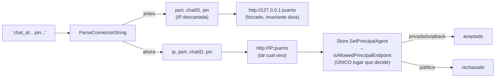
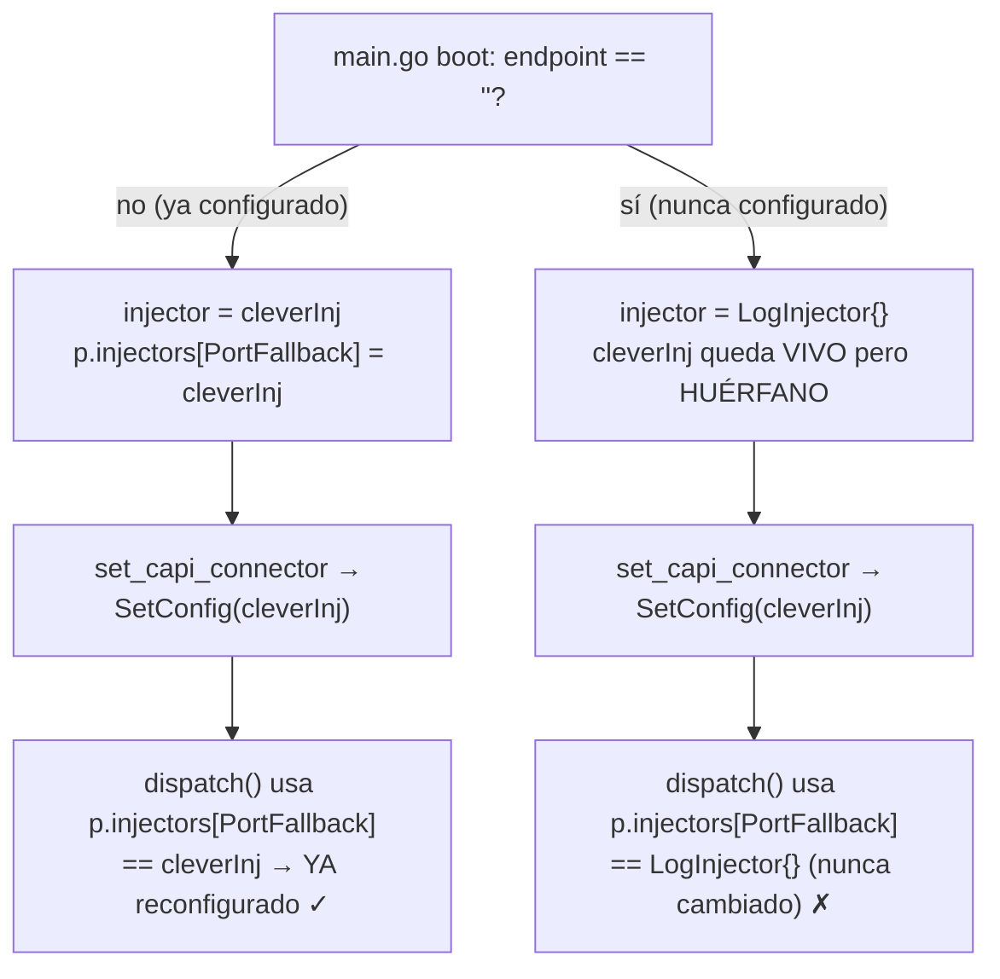
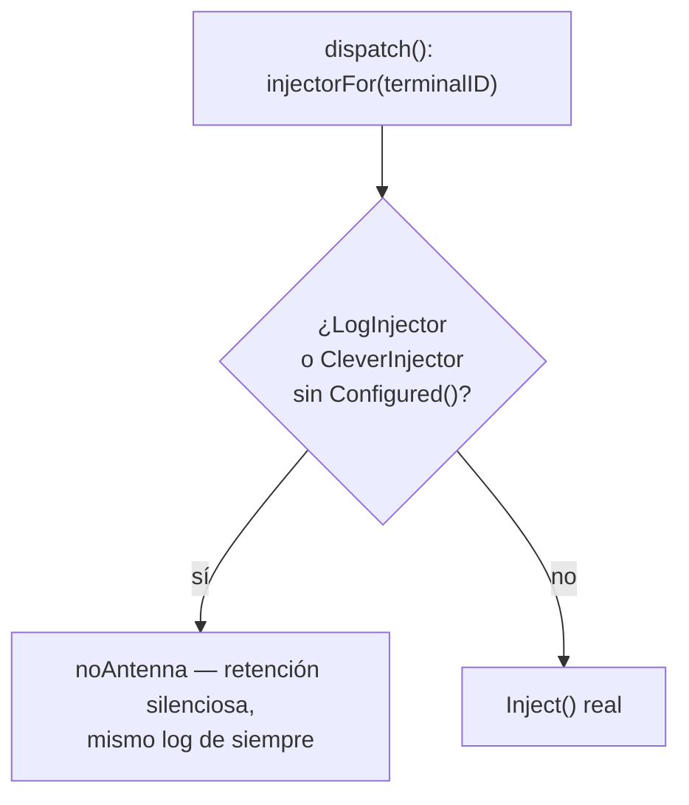

# S6 — set_capi_connector: hot-reload falso y la IP de LAN descartada (ct-2026-07-30-031048)

Contrato madre: `ct-2026-07-30-0308-reparación-del-canal-agente-gateway-hall`.
El primero de los cuatro chicos, el único que rompe el caso Raspberry Pi.

## Defecto 2 primero — más simple, y bloquea al 1 en los tests

`capiconn.ParseConnectorString` descartaba la IP del string
(`"<ip:puerto> ..."`) y ambos llamadores (`set_capi_connector` MCP,
`handleSetCAPIConnectorLine` REST) forzaban `http://127.0.0.1:<puerto>`,
llamándolo "invariante dura". Eso decide "¿este endpoint se acepta?" ANTES
de que `store.isAllowedPrincipalEndpoint` —el ÚNICO lugar que debe decidir
eso, arreglado un día antes (`5de2594`) para aceptar rangos privados
(RFC1918/RFC4193, link-local) justo para habilitar Raspberry Pi— tuviera
un voto. La validación se arregló; esta puerta la anulaba igual.

**Fix:** `ParseConnectorString` devuelve la IP también. Ambos llamadores
arman el endpoint con esa IP tal cual y dejan que `Store.SetPrincipalAgent`
(que ya llama `isAllowedPrincipalEndpoint`) decida. `handleSetCAPIConnectorLine`
además pasó de `Store.SetCAPIConnector` (sin validar NADA) a
`Store.SetPrincipalAgent` — mismo write path que el tool MCP y que
`POST /api/admin/agent-update`, para que la decisión viva en un solo lugar
de verdad, no en tres.

## Defecto 1 — investigado antes de asumir el diagnóstico

El contrato citaba `capipush.go:240-241` (`RegisterInjector`: "principal
slot immutable post-`New()`") como la causa. **Escribí un test end-to-end
antes de tocar nada** (`TestSetConfigOnPrincipalInjectorHotReloadsWithoutRestart`,
y su contraparte previa a este fix) para verificar, no asumir:

1. Con `cleverInj` YA registrado en `PortFallback` (endpoint no-vacío al
   boot, como el smoke probablemente tenía) → `SetConfig` sobre ese mismo
   puntero SÍ llega a `dispatch()`. El test pasó ANTES de tocar código.
   `RegisterInjector`'s guard no participa en absoluto en este camino —
   existe para que un agente SECUNDARIO nunca pueda secuestrar el slot del
   principal (`RegisterInjector(agentID, ...)` con `agentID == PortFallback`
   es no-op), no para la reconfiguración del propio principal, que pasa por
   `SetConfig` sobre el puntero ya registrado, no por `RegisterInjector`.
2. **El bug real es más angosto:** `main.go` solo registraba `cleverInj`
   como injector de `PortFallback` SI `endpoint != ""` al boot. Si arrancaba
   vacío (cAPI nunca configurado, o credenciales limpiadas), quedaba un
   `LogInjector{}` registrado — y `cleverInj` seguía vivo, pero HUÉRFANO:
   `SetConfig` lo reconfiguraba a él, pero `dispatch()` seguía usando el
   `LogInjector{}` original para siempre, porque `RegisterInjector` se niega
   a tocar el slot del principal. "Aplica en caliente" era literalmente
   falso en ese escenario concreto — coincide con el comentario que YA
   tenía `main.go`: *"el próximo restart (o un SetConfig en caliente) activa
   el transporte real"* — la segunda mitad de esa frase era la promesa rota.

**Fix:** `main.go` registra `cleverInj` SIEMPRE, tenga o no endpoint al
boot — nunca un `LogInjector{}` separado para este slot.
`(*CleverInjector) Configured() bool` (`Endpoint != ""`) le avisa a
`dispatch()` que trate un `CleverInjector` sin credenciales EXACTAMENTE
igual que `LogInjector` (retención silenciosa, sin `Inject()` real contra
`""`) — así no hace falta un segundo objeto para el caso "todavía sin
configurar", y el ÚNICO puntero que existe es siempre el que
`set_capi_connector` reconfigura.

`RegisterInjector`/`UnregisterInjector` NO se tocaron — la invariante que
protegen (nadie puede secuestrar el slot del principal) es correcta y
ajena a este bug.

## Qué NO se toca / hallazgos señalados, sin resolver acá

- **`handleSetCAPIConnector` (REST, `POST /api/admin/capi-connector`, campos
  manuales, no la línea pegada) sigue sin validar NADA** — toma
  `body.Endpoint` crudo y llama `Store.SetCAPIConnector` directo, sin pasar
  por `isAllowedPrincipalEndpoint` en absoluto. No comparte
  `ParseConnectorString` (no hay IP que descartar, el bug es otro: cero
  validación, no invariante dura) — no lo tocó este fix mecánicamente, y no
  estaba en el contrato. Señalado a Citrino como hallazgo aparte, no
  resuelto: aceptaría hoy un endpoint público sin rechazo.
- El túnel (endpoint público real, post-MVP) sigue fuera de scope —
  decisión del boss: "después vemos".

## Criterio de listo

- Cambiar la antena del principal surte efecto sin reiniciar:
  `TestSetConfigOnPrincipalInjectorHotReloadsWithoutRestart` (end-to-end,
  servidor httptest fake) + `TestUnconfiguredCleverInjectorTreatedAsNoAntenna`
  (el caso "nunca configurado" sigue retenido en silencio, no rompe nada).
- Un endpoint de LAN privada sobrevive el guardado, uno público se rechaza:
  `TestSetCAPIConnectorFullString` (reescrito — antes afirmaba el forzado a
  127.0.0.1, ahora afirma que la IP privada sobrevive),
  `TestSetCAPIConnectorRejectsPublicIP`,
  `TestSetCAPIConnectorLineValid`/`TestSetCAPIConnectorLineRejectsPublicIP`
  (REST), `TestParseConnectorString` (capiconn, ahora afirma que la IP
  sobrevive).
- `go build ./... && go vet ./... && go test ./...` verde.
- `ponytail-review` pasado — ningún objeto/interfaz nueva más allá de
  `Configured() bool` y el chequeo de tipo en `dispatch()`; `main.go` queda
  con MENOS ramas (se sacó el `if endpoint != ""` para decidir el injector).
- `MANUAL.md` actualizado (`set_capi_connector`, `ParseConnectorString`,
  `CleverInjector.Configured`).
