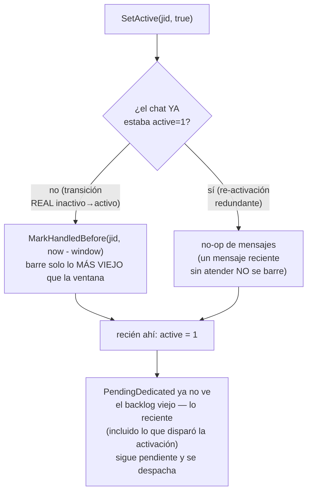
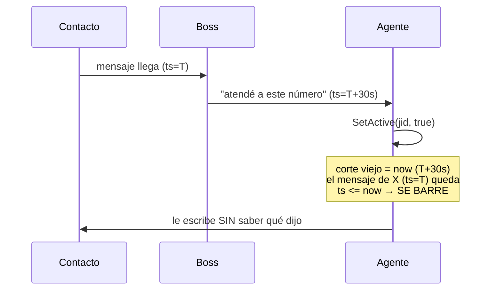

# S8 — set_chat_active dispara una avalancha de historial (ct-2026-07-30-031126)

Contrato madre: `ct-2026-07-30-0308-reparación-del-canal-agente-gateway-hall`.
Anteúltimo. Empieza con una pregunta, no con código: **¿S3 ya lo resolvió?**

## Investigación primero — S3 NO cubre esto

S3 (`ct-2026-07-30-030948`) agregó `Config.SwampedWindow` +
`store.CountRecentPendingNonBoss(sinceTS)` — pero esa ventana **solo acota
el UMBRAL de backpressure** (¿el canal está bajo presión AHORA?), no cuáles
mensajes `PendingDedicated` (la query que arma la cola de despacho real,
`capipush.dueChats()`) devuelve. Leído directo:

```sql
-- PendingDedicated (store/pending.go) — SIN ventana temporal
SELECT ... FROM messages m JOIN chats c ON c.jid = m.chat_jid
WHERE m.from_me = 0 AND m.handled = 0 AND c.mode = 'dedicated'
AND (c.is_boss = 1 OR (c.active = 1 AND c.status != 'ignored'))
ORDER BY m.ts ASC LIMIT ?
```

Ningún filtro de tiempo. Activar un chat (`active: 0→1`) hace que TODO su
backlog no atendido, sin importar la edad, aparezca acá instantáneamente —
exactamente el síntoma del smoke (cola 76→82, mensaje de febrero). **S3 no
lo resuelve** — reportado a Citrino antes de escribir código, como pedía el
contrato.

## El fix — el "cómo" era mío, elegí la opción más precisa

Citrino dio dos opciones: (1) marcar como atendido lo anterior al momento
de activación, o (2) una ventana temporal propia del despacho. Elegí (1):



Por qué (1) y no (2): una ventana temporal en el DESPACHO afectaría a
CUALQUIER chat ya activo con backlog legítimamente viejo (un agente caído
varios días, por ejemplo) — esos mensajes dejarían de despacharse PARA
SIEMPRE en silencio, un cambio de comportamiento mucho más grande y no
específico de "activación". (1) ata el corte exactamente al momento en que
el contrato lo define: "activar significa de ahora en adelante", ni más ni
menos.

## Corrección de Citrino — el corte en `now` se comía el mensaje que motivó la activación

Primera versión: `MarkHandledBefore(jid, time.Now().Unix())` — barre TODO lo
anterior al instante exacto de la activación. Rompe el flujo principal del
boss (verbatim, 2026-07-30: *"si te digo 'atiende a este numero 9849083'
debes hablarle y dejarlo en auto"*):



Mismo patrón que motivó S10 (ahí el boss necesitaba poder liberar `auto` con
orden suya) — el mensaje real que dispara la orden del boss SIEMPRE llega
ANTES de la orden, nunca simultáneo. Barrer hasta `now` literal garantiza
comerse ese mensaje siempre, no en un caso raro.

**Fix:** el corte es `now - activationSweepWindow` (default 1h,
`SettingActivationSweepWindow`, mismo patrón que `SwampedWindow` de S3 —
settings con fallback de código). Cualquier mensaje dentro de la última hora
sobrevive el barrido y se despacha normal; solo lo genuinamente viejo (días,
meses) se marca `handled`. Elegido sobre "conservar el último burst"
(la otra opción de Citrino) porque definir "burst" fuera de `capipush`
duplicaría o acoplaría con esa lógica — la ventana settings-driven sigue el
patrón ya establecido, sin inventar un concepto nuevo.

**El chequeo de transición es la parte que importa.** Sin él, cualquier
re-activación redundante (p.ej. `set_config_level(chat, "auto")` sobre un
chat que YA es "auto") barrería un mensaje genuino que el agente todavía no
atendió — casi tan grave como el bug original. `SetActive` lee el estado
ACTUAL antes de escribir el nuevo, y solo barre en la transición real
`0→1`.

## Por qué en `SetActive`, no en cada llamador

`SetConfigLevel("boss"/"auto"/"confirm")` ya llama `SetActive(jid, true)`
internamente — poniendo el chequeo ACÁ (en vez de en `set_chat_active`, el
tool MCP) cubre las 4 puertas de activación (el tool directo + las 3
traducciones de nivel) con una sola fuente, sin duplicar el chequeo de
transición en cada una.

## Qué NO se rompe

- **No borra, no oculta.** `MarkHandledBefore` solo flippea
  `messages.handled` — `GetMessages`/`get_messages` no filtra por
  `handled` en absoluto, así que el historial completo (y la lista del
  dashboard) queda idéntico. Verificado leyendo `GetMessages` antes de
  codear: cero mención de `handled` en su SQL.
- Reusa `MarkHandledBefore` tal cual — el mismo método que ya usan
  `send_message`/`draft`/`approve_draft`/`silent_act` para "esto ya no
  necesita otro despacho". Ningún método nuevo en `store`.
- Verificado con un fork de investigación (no solo lectura propia) que
  NINGÚN test existente en todo el repo agrega un mensaje a un chat ANTES
  de activarlo con `SetActive`/`SetConfigLevel` — el orden real en cada
  caller (incluido el helper `dedicate()` de `capipush_test.go`, usado en
  ~35 tests) siempre activa primero, agrega mensajes después. Cero
  regresión esperada, confirmada corriendo el módulo completo.

## Criterio de listo

- Activar un chat con historial viejo no genera avalancha:
  `TestSetActiveSweepsOldBacklogOnActivation` (backlog de "febrero"
  sintético, `PendingDedicated` da 0 justo después de activar).
- El historial sigue disponible vía `get_messages`: mismo test, verifica
  `GetMessages` sigue devolviendo los 2 mensajes viejos completos.
- **El mensaje que motiva la activación sobrevive** (el que faltaba en el
  primer pase, señalado por Citrino):
  `TestSetActiveSweepPreservesMessageThatPromptedActivation` — mensaje de
  hace un minuto + mensaje de hace 90 días, misma activación: el reciente
  queda en `PendingDedicated`, el viejo se barre. Las dos verdades a la vez,
  no una a costa de la otra.
- La re-activación redundante no barre mensajes genuinos:
  `TestSetActiveDoesNotResweepAlreadyActiveChat`.
- `go build ./... && go vet ./... && go test ./...` verde (módulo
  completo, no solo `internal/store`).
- `ponytail-review` pasado — un `if` + una query de una línea dentro de
  `SetActive`, más una settings key (mismo patrón ya establecido por S3) —
  cero método nuevo, cero abstracción especulativa.
