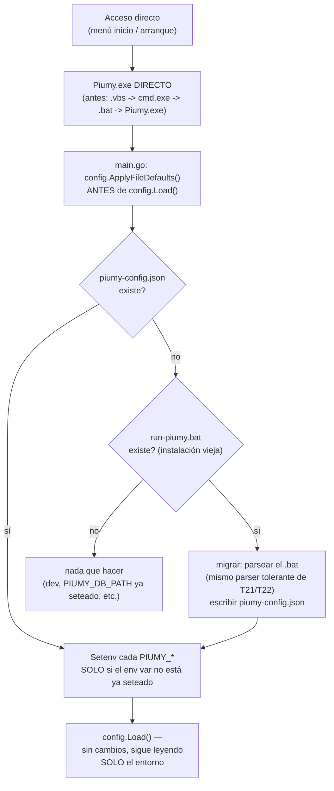

# T11 — sacar el .bat del arranque: config en un archivo, Piumy se lanza directo (ct-2026-08-05-1214)

Último de los contratos que bloqueaban publicar. Boss verbatim: *"ahora se
abre una mini pantalla negra al querer entrar al dashboard, se nota que se
ejecuta un bat o algo, se puede hacer eso silencioso?"*

## Diagnóstico, por eliminación (ya venía hecho en el contrato, verificado)

- `Piumy.exe` instalado es subsystem GUI — no abre consola por sí mismo.
- Los dos accesos directos (menú inicio, arranque de Windows) apuntaban a
  `run-piumy-hidden.vbs`, que corre el `.bat` con ventana oculta.
- Único candidato: el `cmd.exe` que ejecuta `run-piumy.bat`. En Windows 11
  el host de consola por defecto (Windows Terminal) no siempre respeta el
  pedido de ventana oculta — el parpadeo negro.

La causa de fondo no es el parpadeo: **hay un script de shell en el camino
de arranque**, y solo está ahí para setear variables de entorno. Un .bat de
Windows tampoco viaja a Linux/Mac/Raspberry (la dirección post-MVP del
proyecto) — un archivo de configuración sí.

## El fix

**Precedencia: variable de entorno primero, archivo después** (regla
explícita del contrato) — `ApplyFileDefaults` (`internal/config/
filedefaults.go`) solo hace `os.Setenv` para una clave si `os.Getenv`
todavía está vacío. `config.Load()` (`config.go`) queda 100% sin tocar:
sigue leyendo nada más que el entorno, no sabe ni le importa si un valor
vino de una variable puesta a mano o de un archivo — dev, `rl.bat`, los
tests, todo sigue andando igual.

## Dos archivos, direcciones opuestas — no se mezclan (advertencia explícita del contrato)

| Archivo | Dirección | Quién lo toca |
|---|---|---|
| `piumy-config.json` (nuevo, T11) | **ENTRADA** — el gateway lo LEE al arrancar | Solo el instalador (o la migración) lo escribe; el gateway solo lee |
| `agent-connect.json` (T1/T2) | **SALIDA** — el gateway lo ESCRIBE para que un agente lo lea | Solo el gateway escribe; un agente en otra parte lo lee |

Mismas claves (MCP/REST/CAPI), propósito opuesto. Confundirlos sería
escribir credenciales de entrada donde alguien espera leer un contrato de
conexión, o viceversa — el contrato pidió explícitamente no hacerlo.

## Migración — nadie que actualice pierde sus claves

`internal/config/filedefaults.go`'s `migrateFromBat` porta el MISMO parser
tolerante que T21/T22 escribieron para `piumy.iss` (`HasBOM`/`ParseSetLine`
equivalentes, en Go): mayúscula/minúscula en `set`, comillas (T22: el valor
NUNCA se despoja de las suyas), espacios, última coincidencia gana. Exige
las 3 claves base (MCP/REST/BACKUP) — si falta cualquiera, aborta SIN
escribir nada (mismo "ante la duda, no se pisa nada" de T21). `CapiKey`
ausente (launcher 0.1.1) se genera con `crypto/rand` — mucho más simple que
el Pascal Script de `piumy.iss`, que necesitó todo el rodeo de `CoCreateGuid`
por un bug de marshaling; Go tiene `crypto/rand` de la stdlib, sin drama.

El **instalador** (`piumy.iss`) hace lo mismo del lado de la reinstalación:
`ResolveKeys` ahora prueba 3 fuentes en orden — `piumy-config.json` (una
instalación que ya actualizó a T11) → `run-piumy.bat` (una instalación
vieja, sin actualizar — el parser tolerante de T21/T22, sin tocar) →
generar las 4 (instalación limpia). Las dos fuentes existentes comparten
`FinalizeKeys` para la validación — un solo criterio de "¿esto cierra?",
no dos por mantener en sync.

## El instalador ya no escribe ni el .bat ni el .vbs

- `CurStepChanged` escribe `piumy-config.json` (JSON, mismo patrón de
  escritura-verificada de T22/T23: `Log` siempre, `MsgBox` solo si no es
  silencioso, la app no arranca si la escritura falla).
- `[Icons]`: los dos accesos directos apuntan a `{app}\Piumy.exe` directo —
  sin `IconFilename` (el ícono de Piumy.exe ya es el correcto).
- El `.vbs` deja de generarse — no le queda ningún propósito.
- Un `run-piumy.bat` VIEJO (de una instalación previa a T11) se deja tal
  cual, sin tocar — sigue siendo un launcher manual funcional para quien
  quiera usarlo, simplemente ya no es parte del camino normal ni el
  instalador vuelve a escribirlo.

## Probado en vivo (instalador real, `dist/Piumy-Setup-0.1.3.exe`, `//VERYSILENT //SUPPRESSMSGBOXES`)

| Escenario | Resultado |
|---|---|
| Instalación limpia | `piumy-config.json` escrito, SIN `.bat` ni `.vbs`; acceso directo real (`.lnk`) apunta a `Piumy.exe` directo (verificado leyendo el `.lnk` con `WScript.Shell`); la app arranca y responde por REST usando SOLO el archivo (cero env vars puestas a mano) |
| Migración desde `run-piumy.bat` (4 claves) | `piumy-config.json` nace con las 4 EXACTAS; el `.bat` viejo queda intacto, sin tocar |
| Reinstalar con `piumy-config.json` ya existente (editado a mano) + `.bat` viejo con otro valor | Gana el JSON — nunca se re-migra desde un `.bat` potencialmente obsoleto |
| `piumy-config.json` con BOM (UTF-16) | **exit 7, cero archivos copiados** — mismo criterio que un `.bat` con BOM |
| `piumy-config.json` truncado (falta `PIUMY_BACKUP_KEY`) | **exit 7, cero archivos copiados** |
| Escritura de `piumy-config.json` bloqueada (path ocupado) | **exit 0, la app NO arranca, sin colgarse** — mismo patrón de T22/T23 |
| `PIUMY_DB_PATH` puesto como variable de entorno real, lanzando `Piumy.exe` directo | Gana el env var — el DB real usado es el del env var, no el de `piumy-config.json` |

Tests de Go (`internal/config/filedefaults_test.go`, 10 casos): precedencia
env-gana, llenado desde archivo, no-op sin archivos, migración desde `.bat`
(claves exactas + persistidas), CAPI faltante generada, aborto por clave
base faltante, aborto por BOM, parser tolerante (mayús/minús, las dos
formas de comillas), duplicados (última gana), segunda corrida no
re-migra.

## Qué NO se rompe

- `config.Load()` (`config.go`) sin cambios de comportamiento — sigue
  siendo env-only; el doc del paquete se actualizó para explicar la nueva
  capa ANTERIOR (`ApplyFileDefaults`), no para reinterpretar `Load`.
- `agent-connect.json`/`internal/agentconnect` sin tocar.
- `LaunchFirstRunAndOpenDashboard` (el primer arranque, dentro del
  instalador) ya lanzaba `Piumy.exe` directo, nunca a través del `.bat` —
  sin cambios ahí.
- Desarrollo (`rl.bat`, variables puestas a mano), tests, todo sigue
  andando exactamente igual — el archivo de config es puramente aditivo,
  nunca obligatorio.

## Deuda pagada

T6 (ct-2026-08-05-0315) dejó anotado un `ponytail:` — "parsear el .bat a
mano es feo, pero es lo que hay; el camino de upgrade es mover las 4
claves a un archivo de config propio en vez de vivir solo dentro del
launcher." `piumy-config.json` es ese archivo. Comentario borrado de
`piumy.iss` — la deuda está pagada, no solo anotada.

## Criterio de listo

- El boss arranca desde el menú inicio y no ve ninguna ventana negra —
  estructuralmente garantizado: no queda ningún `.bat`/`.vbs`/`cmd.exe`
  en el camino (verificado: el `.lnk` real apunta a `Piumy.exe`, subsystem
  GUI, directo). Falta la confirmación del boss en su propia instalación.
- Actualización sobre una instalación con `.bat`: las 4 claves migran
  intactas — antes-y-después en la tabla arriba.
- Instalación limpia: archivo escrito, gateway arranca sin consola.
- Las variables de entorno siguen ganando — probado contra el binario real.
- `go build ./... && go vet ./... && go test ./...` verde, con test de
  precedencia y de migración (`internal/config/filedefaults_test.go`).
- `docs/MANUAL.md` y `CHANGELOG.md` actualizados. El `ponytail:` de T6 se
  borró de `piumy.iss`.
