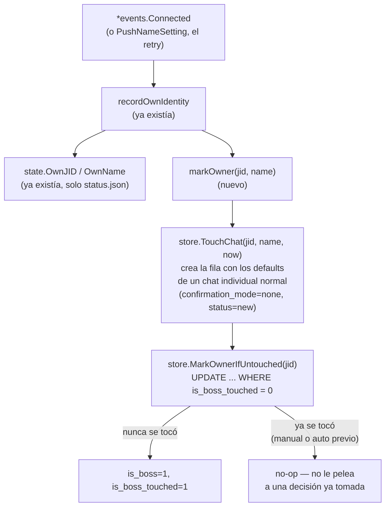

# T12 — el número propio se marca dueño solo (ct-2026-08-05-1231)

Contrato madre: `ct-2026-08-05-0155`. Boss verbatim: *"un problema, el
selfnumber no se auto define como boss automaticamente"*.

## El problema

Nada marcaba `is_boss` automáticamente — el único camino era
`POST /api/admin/is-boss` desde el tablero. En una instalación nueva, el
que instaló no podía hacer nada desde su propio WhatsApp hasta acordarse de
marcarse a mano.

## El fix

## Por qué `TouchChat` primero, no un `INSERT` directo

`MarkOwnerIfUntouched` necesita que la fila YA EXISTA con los defaults de
un chat individual — si insertara la fila desde cero, quedaría con el
default crudo de la migración de columna (`confirmation_mode='always'`, el
pensado para grupos), y el `ON CONFLICT` de `TouchChat` nunca pisa esa
columna en un update posterior. Efecto real si se saltea este paso:
`send_message`'s gate (`c.ConfirmationMode == "always"`, `send.go:174`) no
mira `is_boss` — CADA respuesta del agente al dueño quedaría como draft
esperando que el dueño se apruebe a sí mismo. `TouchChat` ya resuelve esto
bien (es el mismo camino que crea cualquier chat 1-1 nuevo) — reusarlo, no
reinventar el insert.

## Cómo se distingue "nunca se tocó" de "lo desmarcaron a propósito"

Columna nueva `chats.is_boss_touched` (booleano, independiente de
`config_level_source` — ese ya combina 4 campos y `MarkOwnerIfUntouched`
necesita rastrear SOLO `is_boss`, no pelearle a un cambio de `active`/
`confirmation_mode` que nunca tocó `is_boss`):

- **`SetIsBoss`** (el único setter — REST/dashboard, nunca MCP) marca
  `is_boss_touched=1` en cada llamada, sea `true` o `false`. Cualquier
  decisión explícita del dueño, en cualquier dirección, congela el campo
  para siempre.
- **`MarkOwnerIfUntouched`** solo actúa si `is_boss_touched=0` — y al
  actuar, también lo deja en 1 (mismo motivo: no repetir el auto-marcado en
  cada reconexión no aporta nada, ya quedó `is_boss=1`).
- **Migración de columna** (`ALTER TABLE ... DEFAULT 1`): toda fila YA
  EXISTENTE en una instalación real arranca en `1` (tocada) — mismo
  criterio de seguridad que `config_level_source` (`schema.go`): no hay
  forma de distinguir retroactivamente "nunca se tocó" de "se desmarcó a
  mano" en una instalación que ya viene funcionando, así que se asume
  tocada y se la deja exactamente como está. El auto-marcado solo actúa
  desde acá en adelante, en filas nuevas.

## Qué NO se rompe / no se toca

- Ningún otro chat cambia — `MarkOwnerIfUntouched` solo se llama con
  `state.OwnJID`, nunca con otro JID (ningún otro número personal del
  dueño se puede adivinar — sigue siendo manual, tal como pide el
  contrato).
- `is_boss` sigue viniendo de un solo lugar: la identidad de la sesión de
  WhatsApp (`client.Store.ID`) en el punto de conexión — ningún mensaje,
  agente ni MCP tool puede tocarlo (`SetIsBoss` sigue sin tool MCP
  cableada).
- `ConfigLevel`/`PendingDedicated`/`LevelFor` ya trataban `is_boss=1` como
  bypass incondicional (activo o no) — no hizo falta tocar ninguno de los
  tres.

## Criterio de listo

- Test store: fila nunca tocada + `MarkOwnerIfUntouched` → `is_boss=true`.
- Test store: `SetIsBoss(false)` (desmarcado a mano) + `MarkOwnerIfUntouched`
  otra vez (simula reconexión) → sigue `false`.
- Test whatsmeow: `markOwner` en una instalación limpia dos veces seguidas
  (simula reconexión sin intervención) → sigue `true`, sin loop de writes
  raros.
- Test whatsmeow: `markOwner` no toca ningún otro chat.
- `go build ./... && go vet ./... && go test ./...` verde.
- `MANUAL.md` + `CHANGELOG.md`.
