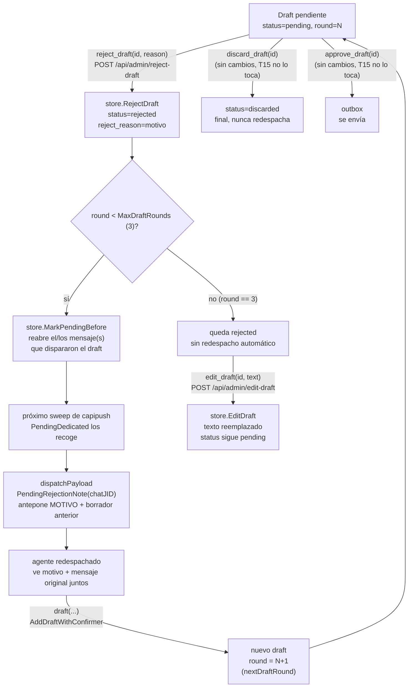

# T15 — rechazar un borrador con motivo, tope de tres rondas, editar sin aprobar (ct-2026-08-05-123241)

Backend de borradores. Citrino, requisito explícito: *"el motivo tiene que
viajar con el mensaje, no aparte"* — si el agente re-redacta sin saber qué
estuvo mal, el rechazo es un borrado con pasos de más.

## El flujo

## Por qué el motivo vive EN el draft, no en un canal aparte

`drafts.reject_reason` es una columna del mismo row que `drafts.text` — no
una tabla separada, no un campo en `chats`. `capipush.dispatchPayload`
consulta `store.PendingRejectionNote(chatJID)` en el momento del despacho
(mismo patrón que ya usa para adjuntar `rules.md`) y antepone el motivo +
el texto del borrador rechazado ANTES del texto de los mensajes — el
agente ve ambas cosas en la MISMA inyección, nunca tiene que ir a
buscar por qué lo rechazaron con una tool aparte.

`PendingRejectionNote` se autolimpia: consulta el draft más reciente del
chat por `created_ts DESC LIMIT 1` — en cuanto existe un draft nuevo
(el redraft del agente), esa consulta deja de traer el rechazado. No hace
falta una bandera "ya resuelto".

## El tope de tres rondas

`drafts.round` se calcula en `AddDraftWithConfirmer` vía `nextDraftRound`:
si el draft más reciente del chat quedó `rejected`, el nuevo continúa la
cadena (`round + 1`); cualquier otro caso (recién aprobado, descartado, o
un chat sin drafts previos) arranca en 1 — un tema nuevo no hereda la
ronda de un tema viejo ya resuelto.

El tope no bloquea rechazar — sí bloquea el REDESPACHO automático que
rechazar dispararía. Rechazar la ronda 3 registra el motivo igual
(`PendingRejectionNote` lo sigue mostrando si el chat se dispara por otra
vía, p. ej. un mensaje nuevo del contacto), pero `reject_draft` no llama
`MarkPendingBefore` — el ciclo de ida y vuelta no está convergiendo, y
seguir pidiéndole al agente un cuarto intento no es la salida. `edit_draft`
(retocar el texto a mano) o `discard_draft` (cortar del todo) son los
caminos que le quedan al dueño.

## Qué NO se tocó

- **`approve_draft`/`discard_draft`** — sin cambios de comportamiento; T15
  agrega dos acciones nuevas a la familia, no modifica las que ya existían.
- **El gate duro de `send_message`/`validateSend`** — rechazar/editar un
  draft no es un envío, no toca ningún check de esa función.
- **`capipush`'s propio `MaxRedispatch`/backoff Fibonacci** — es el tope de
  reintentos de ENTREGA de un mensaje (falla el injector, reintenta),
  concepto distinto al tope de RONDAS de reject→redraft; no se
  comparten contador ni lógica.
- **T16 (la pestaña del tablero)** — depende de este backend, queda para
  después; los endpoints REST (`reject-draft`/`edit-draft`) ya están
  listos para que la UI los llame.

## Criterio de listo

- `store.RejectDraft`/`EditDraft`/`PendingRejectionNote`/`MarkPendingBefore`
  + `drafts.round`/`reject_reason` (migración `ALTER TABLE`).
- `reject_draft`/`edit_draft` — tools MCP + `POST /api/admin/reject-draft`/
  `edit-draft`, misma familia sin-gate que `discard_draft`.
- `capipush.dispatchPayload` antepone el motivo, verificado con el mensaje
  original todavía presente en el mismo payload.
- Tope de 3 rondas probado de punta a punta: reject→redraft dos veces,
  la tercera ronda no redespacha pero sí registra el motivo.
- `go build/vet/test` verde en todo el módulo.
- `docs/MANUAL.md`/`CHANGELOG.md` actualizados.
