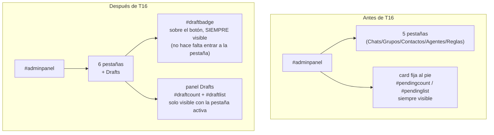
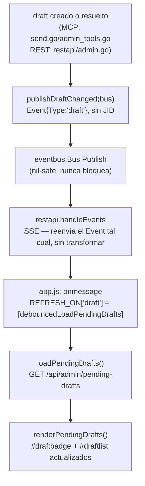
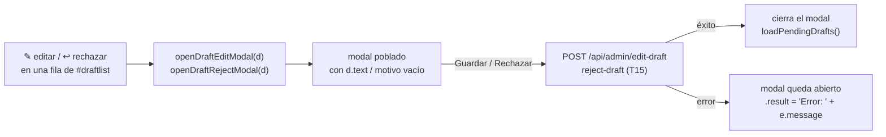

# T16 — pestaña Drafts: contador sobre el botón, editar/rechazar, auto-refresco real (ct-2026-08-05-123257)

Depende de T15 (backend de rechazar/editar). Pedido del boss, verbatim vía
Citrino: *"el contador de borradores en espera sobre el botón, y adentro
leer el mensaje, editar, borrar, aceptar y rechazar. Rechazar pide el
motivo."* Lo que más le importaba a Citrino: *"que el contador se
actualice solo. Un borrador que aparece y no se ve hasta recargar es una
respuesta que salió tarde."*

## De footer fijo a pestaña

Antes de T16, "Confirmaciones pendientes" era una card fija al pie de
`#adminpanel`, siempre visible, fuera del sistema de pestañas. T16 la
convierte en una 6ª pestaña (`Chats/Grupos/Contactos/Agentes/Reglas/
Drafts`) — el switch de pestañas (`app.js`, genérico por
`data-tab`/`data-panel`, ct-2026-07-19-1801) no necesitó ningún cambio.

## El contador que se actualiza solo

Antes de T16, nada publicaba al eventbus cuando un draft se creaba o
resolvía — `loadPendingDrafts` solo corría en el poll de 15s o al
reconectar SSE. El pedido de Citrino exigía cerrar ese hueco, no
inventar un polling nuevo: *"colgate del ciclo de refresco que ya
existe."*

`Event` sigue sin payload (mismo criterio que `wa_connected`/
`history_batch`) — ningún caller necesita el `chat_jid`, el dashboard
refetchea la lista completa. Publicado desde **6 puntos**, dos paquetes
que no comparten internals (`publishDraftChanged` duplicado a propósito,
uno por paquete):

| Acción | Dónde |
|---|---|
| Crear (`draft` tool, `send_message` con `confirmation_mode=always`) | `mcpserver/send.go` |
| Aprobar / descartar / rechazar / editar (MCP) | `mcpserver/admin_tools.go` |
| Aprobar / descartar / rechazar / editar (REST, el tablero mismo) | `restapi/admin.go` |

`reject_draft` publica una sola vez, ANTES de la rama `round >=
MaxDraftRounds` — rechazar ronda 1/2 (redespacha) y rechazar la ronda del
tope (no redespacha) cambian el estado del draft en los dos casos, así
que las dos rutas necesitan el nudge.

## Editar y rechazar — el mismo esqueleto de modal que ya existía

`#draftEditModal`/`#draftRejectModal` son variaciones de
`#agentdeletemodal`/`#approvermodal` — mismo `.overlay > .term.modal >
.titlebar + .screen`, mismo criterio anti-`window.prompt`/
`window.confirm` que rige el resto del tablero. `draftReject_confirm`
exige un motivo no vacío del lado del cliente (el backend también lo
exige — esto solo evita el viaje).

## Qué más cambió en cada fila

- `who.textContent` suma `" — ronda N"` cuando `d.round > 1` (T15 ya
  mandaba `round` en el JSON de `PendingDrafts`; nadie lo mostraba antes
  de T16).
- 4 botones por fila ahora: `✓ aprobar` / `✎ editar` / `↩ rechazar` /
  `✕ descartar` — los dos primeros ya existían, los dos nuevos llaman
  `edit-draft`/`reject-draft` (T15).

## Qué NO se tocó

- El backend de T15 (`store.RejectDraft`/`EditDraft`/`PendingRejectionNote`,
  `capipush.dispatchPayload`) — T16 es pura UI + el wiring de eventbus que
  faltaba, cero cambio de la lógica de rondas/motivo.
- El poll de 15s de `loadPendingDrafts` — queda como red de seguridad
  (mismo criterio que `loadStatus`/`loadAgents`), el SSE es la mejora, no
  el reemplazo.
- `docs/DASHBOARD-AUTO-REFRESH-2026-07-24.md`'s propio diseño (tabla
  declarativa `REFRESH_ON`, debounce en los loaders, watchdog de
  reconexión) — `draft` es exactamente la extensión que ese documento
  anticipaba, ninguna pieza nueva del mecanismo.

## Verificación

Sin extensión de Chrome disponible en esta sesión para el click-through
visual. Verificado en su lugar contra un binario real (scratchpad, DB
sembrada a mano con `go run` de un programa temporal — nunca la
instalación real):
- `curl` al HTML/JS servidos por el binario — confirma que
  `data-tab="drafts"`/`#draftbadge`/`#draftlist`/`#draftEditModal`/
  `#draftRejectModal` llegan tal cual se escribieron, y `node --check`
  sobre el `app.js` servido — sintaxis válida.
- `GET /api/admin/pending-drafts` devuelve `round` en el JSON.
- `edit-draft`/`reject-draft` (ronda normal y en el tope)/`approve-draft`/
  `discard-draft` mutan la lista exactamente como se espera, contra el
  servidor real.
- `curl -N GET /api/events` conectado en paralelo — una llamada real a
  `discard-draft` hizo aparecer `{"type":"draft","ts":...}` en el stream
  SSE, confirmando el camino completo (`Publish` → `handleEvents` →
  browser) sin necesidad de abrir un navegador.

## Criterio de listo

- Pestaña Drafts nueva, footer viejo eliminado.
- `#draftbadge` visible sobre el botón sin entrar a la pestaña, oculto en 0.
- Editar/rechazar (con motivo obligatorio) funcionando, mismo esqueleto de
  modal que el resto del tablero.
- `Event{Type:"draft"}` publicado en los 6 puntos de creación/resolución,
  ambos paquetes (MCP y REST).
- `REFRESH_ON.draft` colgado del ciclo de auto-refresco existente, sin
  polling nuevo.
- `go build/vet/test` verde en todo el módulo. `node --check` verde sobre
  `app.js`.
- `docs/MANUAL.md` actualizado (`eventbus`, `mcpserver` — orden de
  construcción, dashboard).
