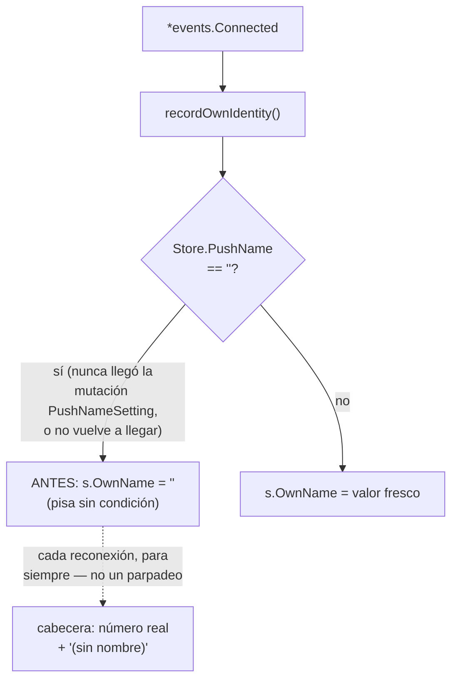
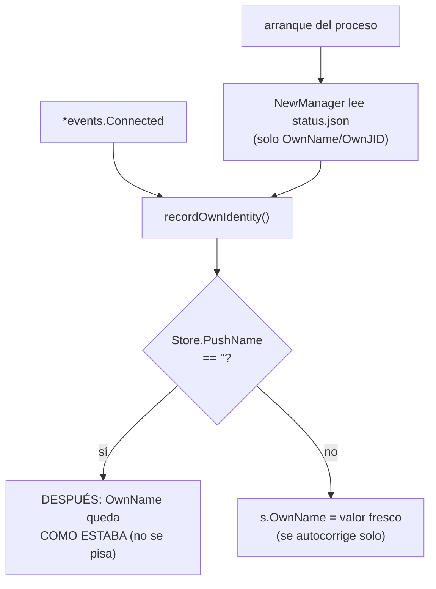
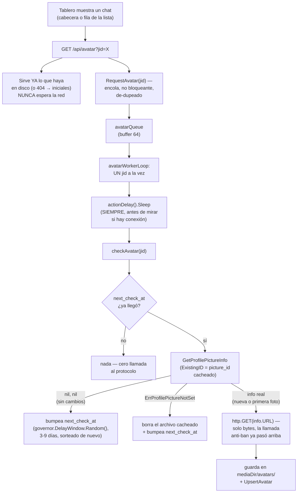

# T17 — nombre y avatar: los de la cuenta y los de cada chat (ct-2026-08-05-1240)

El boss mandó capturas: la cabecera dice **"(sin nombre)"** sobre el número
de la cuenta, y en la lista de chats los individuales aparecen como
números crudos, sin nombre ni foto — salvo uno con nombre de agenda
("Contacto Uno").

Tres partes. Este documento cubre **Parte 1** (bug del nombre de cuenta,
arreglado) y **Parte 2** (nombre en la lista de chats, verificado — no era
un bug). **Parte 3** (el avatar) se propuso partir aparte — ver el cierre
más abajo.

## Parte 1 — el nombre de la cuenta

### Recorrido antes de tocar nada

`state.OwnJID`/`OwnName` los escribe `whatsmeow.recordOwnIdentity`, en cada
`*events.Connected` y en `*events.PushNameSetting`. La hipótesis de
Citrino: el estado en memoria arranca vacío (`state.NewManager` nunca relee
`status.json`), así que hay una ventana en blanco hasta que llega el
próximo `Connected`. Ella misma marcó el hueco: **`OwnJID` y `OwnName` los
escribe la MISMA llamada** — si el arranque en blanco fuera la única causa,
los dos quedarían vacíos, no solo el nombre. Y en la captura del boss, el
número SÍ aparecía.

### Reproducción — a nivel código, sin pareo real

Mismo patrón que `TestNewLogsExistingSessionFound` (`adapter_test.go`):
`seedFakeDevice` inserta una fila de dispositivo YA pareada
(`Store.ID != nil`) con `push_name=""` directo en `whatsmeow_device`. Se
verificó contra la librería `whatsmeow` vendorizada
(`go.mau.fi/whatsmeow@v0.0.0-20260709092057-...`):

- `Store.PushName` lo escribe **exclusivamente** la mutación de appstate
  `PushNameSetting` (`appstate.go:367`) — único lugar en todo el módulo
  (`grep "Store\.PushName\s*=" .` → un solo resultado).
- No existe ninguna llamada consultable para pedirlo de nuevo:
  `GetUserInfo` devuelve `types.UserInfo{VerifiedName, Status, PictureID,
  Devices, LID}` — sin nombre.
- Esa mutación puede no volver a replicarse nunca para una cuenta ya
  asentada (no es un evento periódico, es un push server-side puntual).

### Fix, dos mitades

1. **`recordOwnIdentity`** (`internal/whatsmeow/inbound.go`) — solo pisa
   `OwnName` cuando el valor fresco no es vacío. Mismo criterio que
   `TouchChat` ya aplica a `chats.name` (`chat.go`'s `CASE WHEN
   excluded.name != ''...`) — reusado, no un patrón nuevo. `OwnJID` sigue
   incondicional: un JID pareado no "deja de pasar".
2. **`state.NewManager`** (`internal/state/state.go`) — siembra
   `OwnName`/`OwnJID` desde un `status.json` existente al arrancar.
   Deliberadamente angosto: **solo esos dos campos**, nunca el resto del
   `Status` (`Mood`, `WAConnected`, `Queue`, `Muted`, ...) — sembrar un
   `Mood="responding"` o `WAConnected=true` viejo de una corrida caída
   mentiría sobre el proceso ACTUAL, un bug peor que el que esto arregla.
   Archivo ausente o corrupto cae al mismo `Status{Mood:"idle"}` de
   siempre.

### Tests

- `TestRecordOwnIdentityWithEmptyPushNameLeavesNameBlank` — reproduce el
  bug (antes del fix del punto 1: confirma que `OwnJID` se setea pero
  `OwnName` queda vacío con `Store.PushName=""`).
- `TestRecordOwnIdentityPreservesKnownNameWhenPushNameEmpty` — confirma el
  fix: un `OwnName` ya conocido sobrevive una reconexión con
  `Store.PushName=""`.
- `TestNewManagerSeedsOwnIdentityFromExistingFile` /
  `_MissingFileStartsBlank` / `_CorruptFileStartsBlank` (`state_test.go`)
  — el sembrado angosto, y los dos fallbacks seguros.

## Parte 2 — nombre en la lista de chats

**Investigado antes de tocar código** (pedido explícito: "averiguá si ya
se está guardando el push name; si se guarda, usalo cuando no haya nombre
de agenda"). Resultado: **ya se guardaba, y ya se usaba.**

- `corepipeline.handleInbound` llama `TouchChat(jid, msg.PushName, ts)` en
  cada mensaje entrante (`pipeline.go:235`) — el push name de WhatsApp
  YA es `chats.name`.
- `chatOut.Name` (`read.go`) expone ese valor tal cual, sin filtrar.
- La precedencia agenda → push name → número YA existe del lado del
  frontend, desde S1h: `app.js#renderRow`,
  `nameDiv.textContent = c.contact_name || c.name || jidNumber(c.jid)`.

Faltaba solo la confirmación a nivel API — nada que arreglar, un hueco de
cobertura de test. `TestChatsEndpointNameCarriesPushNameWithNoAgendaEntry`
(`read_test.go`, nuevo) lo cierra: `Name` viaja con el push name aunque no
haya `contact_name`.

**Por qué el boss vio números pelados igual**: esos chats no tienen NINGÚN
mensaje entrante real — el boss les escribió y nunca le contestaron, o son
contactos sincronizados nunca conversados. Ahí no hay push name que
mostrar (WhatsApp solo entrega el push name de quien te escribe A TI,
nunca por consulta) — el número es la única etiqueta disponible, no una
falla de este código. T18/T18B (mismo día, `ct-2026-08-05-1243`) ya saca
esos chats de la pestaña Chats vía `origin`.

## Verificación

- `go build/vet/test` verde en todo el módulo.
- `docs/MANUAL.md`/`CHANGELOG.md` actualizados.

## Parte 3 — el avatar (sub-cambio aparte, rama `t17-avatar`)

Partida con OK de Citrino sobre la propuesta original (ver T17 Partes 1+2
para el pedido de split). Es la parte delicada: pedir fotos de perfil es
actividad hacia WhatsApp, cuenta para el anti-ban igual que cualquier otra
acción server-facing — el boss tiene 719 números/591 contactos, un
barrido de eso es exactamente el patrón que tira una cuenta.

**Ajuste de Citrino sobre la propuesta original**: el primer borrador
proponía re-chequear cada foto cacheada "cada 7 días" — un intervalo
fijo. Corrección explícita: *"contra WhatsApp, ventanas aleatorias —
nunca valores fijos ni redondos... un intervalo fijo es un patrón, y los
patrones son lo que se detecta."* La ventana quedó como un RANGO (3-9
días), sorteado con `governor.DelayWindow.Random()` — el mismo mecanismo
que ya pacea los segundos entre acciones, aplicado acá a escala de días,
independiente por cada número.

### Qué se hizo

- **`internal/store/avatar.go`** — `store.Avatar{JID, PictureID, Path,
  FetchedAt, NextCheckAt}`, tabla `avatars` (schema.go). Deliberadamente
  **fuera de `resetTables`**: es un cache de la foto ACTUAL de WhatsApp,
  no historial de mensajes — un "partir de 0" no tiene por qué tocarlo.
  `GetAvatar`/`UpsertAvatar` — un solo camino de escritura para los tres
  desenlaces de un chequeo (foto nueva, sin cambios, confirmado sin foto),
  para que no diverjan en tres SQL distintos.
- **`internal/store/settings.go`** — `SettingAvatarRecheckMin/Max`, mismo
  patrón `SettingActionDelayMin/Max` de siempre (override en caliente vía
  KV, `config.Load()` da el default de código).
- **`internal/whatsmeow/avatar.go`** (nuevo) — `RequestAvatar`/
  `avatarWorkerLoop`/`checkAvatar`/`downloadAndCacheAvatar`/
  `avatarRecheckWindow`. Reusa `actionDelay()` (el mismo
  `governor.DelayWindow` que ya pacea contactos/media) para el ritmo
  ENTRE pedidos, y `extensionFor`/`safeMediaName` (`media.go`) para
  guardar el archivo — nada nuevo donde ya había algo que servía.
  `avatarWorkerLoop` lanzado desde `Start`, igual que
  `mediaBgWorkerLoop`.
- **`internal/restapi/avatar_read.go`** (nuevo) — `GET /api/avatar?jid=`,
  mismo patrón binario que `GET /api/media` (`d.auth()`-gateado, un
  `` no puede mandar `X-API-Key`). `AvatarRequester` (interfaz
  local, mismo motivo que `MediaFetcher`) cableada en `main.go`
  (`Avatars: gw`).
- **`internal/dashboard/web/app.js`** — `buildAvatar`/`initialsFor`/
  `initialsSpan`. Cableado en la cabecera (`#heroavatar`, `loadStatus`) y
  en cada fila de la lista de chats (`renderRow`, dentro de un
  `.row-flex` nuevo que envuelve el avatar + el bloque de texto
  existente). CSS nuevo en `style.css` (`.avatar`/`.avatar-lg`/
  `.avatar-sm`/`.avatar-initials`/`.row-flex`/`.row-textwrap`).
- **Config**: `PIUMY_AVATAR_RECHECK_MIN/MAX` (default 3d/9d),
  `whatsmeow.Config.AvatarRecheckMin/Max`.

### Verificado antes/durante, no supuesto

- **`ExistingID` es barato del lado del protocolo** — leído directo del
  código de la librería vendorizada (`user.go`): si el `id` que mandamos
  coincide con el actual, el servidor responde sin el nodo `<picture>`
  (o con `status=304`), y `GetProfilePictureInfo` devuelve `(nil, nil)`
  sin transferir la imagen.
- **Los tres desenlaces reales**: `ErrProfilePictureNotSet` (sin foto,
  distinguible), `(nil, nil)` (sin cambios), o `(&info, nil)` (foto
  real) — confirmado leyendo `GetProfilePictureInfo` completo, no
  asumido por el nombre del error.
- **Smoke end-to-end manual**: binario compilado, corrido con una DB
  temporal, login vía `/api/auth/login`, avatar sembrado directo en el
  store + un archivo `.jpg` de prueba, `GET /api/avatar?jid=...`
  confirmado sirviendo los bytes exactos con `Content-Type: image/jpeg`,
  y `GET /api/avatar?jid=<inexistente>` confirmado 404. El navegador
  (`claude-in-chrome`) no estaba disponible en este entorno para una
  verificación visual — dejado explícito, no maquillado como "probado en
  el navegador".

### Tests

- `store`: `TestGetAvatarNoRow`, `TestUpsertAvatarRoundTrips`,
  `TestUpsertAvatarOverwritesOnConflict`.
- `whatsmeow`: `TestRequestAvatarDedupesAndDropsWhenFull`,
  `TestRequestAvatarNilStoreIsNoOp`, `TestCheckAvatarSkipsWhenStillFresh`
  (cero llamada al protocolo si todavía no toca), `TestDownloadAndCacheAvatarSavesFileAndStoreRow`,
  `TestDownloadAndCacheAvatarNoMediaDirIsNoOp`,
  `TestClearCachedAvatarFileRemovesFile` (+ EmptyPathIsNoOp),
  `TestAvatarRecheckWindowRespectsKVOverride`.
  **`TestAvatarWorkerLoopPacesRequestsWithVariableGaps`** — la evidencia
  pedida explícitamente: drena la cola con el loop REAL (no un atajo) y
  mide, con reloj real, la separación entre pedidos consecutivos.
  Ejemplo de una corrida real: `35ms, 46ms, 52ms, 56ms` — nunca por
  debajo del mínimo configurado, nunca la misma separación repetida.
- `restapi`: `TestAvatarEndpointServesCachedBytesAndNudgesRecheck`,
  `_NotFoundWithNoCachedRow`, `_NotFoundForConfirmedNoPhoto`,
  `_NotFoundForDiskDrift`, `_RequiresJID`, `_NilAvatarsIsSafe`,
  `_AuthGate`.
- `node --check` sobre `app.js` — sintaxis válida.

### Qué NO se tocó

- El popup del celular (`.phone-avatar`, index.html) — sigue con su
  emoji fijo "💬". El contrato pedía cabecera + lista, no ese popup;
  ampliarlo es una decisión aparte, no asumida acá.
- `resetTables` — deliberadamente sin agregar `avatars`. Es una decisión
  de bajo riesgo, no checkpointeada con Citrino como el resto de esa
  lista sí lo está — señalado en el reporte de cierre, no decidido en
  silencio.

## Verificación (Parte 3)

- `go build/vet/test` verde en todo el módulo.
- `docs/MANUAL.md`/`CHANGELOG.md` actualizados.
- Smoke manual end-to-end del endpoint (ver arriba) — navegador no
  disponible en este entorno, dejado explícito.
