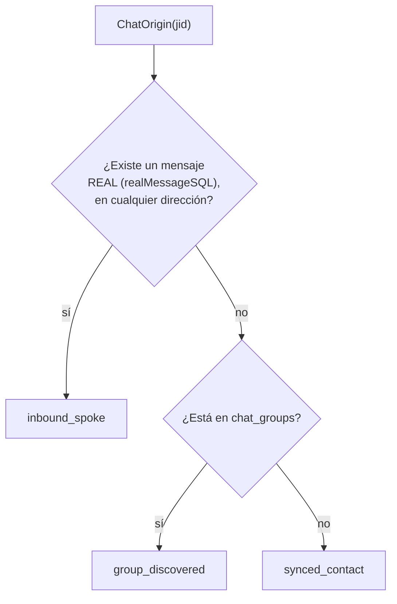

# T18 — separar chats por origen, no por tipo (ct-2026-08-05-1243)

El boss: su bandeja mezclaba ~1351 chats — gente que le escribió junto a
números que solo aparecieron por compartir un grupo. El dato para separarlos
(`store.ChatOrigin`) ya existía; la pantalla nunca lo usó.

> **Resuelto en T18B** (mismo día, `ct-2026-08-05-1243`) — el hallazgo de
> `chat_groups` sin escritor, documentado más abajo, se cerró: la tabla se
> retiró, `ChatOrigin`/`GroupsOf` pasaron a leer `group_members`, y el punto
> 4 (consolidar la implementación paralela) quedó cerrado. Ver
> `docs/T18B-DIAGRAMA-RETIRAR-CHAT-GROUPS.md` para el detalle — este
> documento queda como el registro de lo que se encontró y por qué se paró
> a preguntar, no se reescribe.

## Recorrido — con qué criterio separaba antes de tocar nada

La pestaña Chats no usaba `ChatOrigin` en ningún punto:
1. Filtro de TIPO en el backend (`p2p`/`group`/`group_member`).
2. Un filtro APARTE, con OTRA fuente de datos (`group_members` +
   `ChatJIDsWithMessages`), que aproximaba "ocultar los que solo aparecieron
   en un grupo" — pero solo para chats completamente vacíos.
3. Agrupamiento visual por `config_level` (boss/auto/confirm/unattended/
   ignored) — el nivel de permiso, no el origen.

Dentro de cualquiera de esas 5 secciones, un chat real y uno de puro
artefacto de grupo convivían mezclados, ordenados solo por fecha.

## El bug en `ChatOrigin` — confirmado con reproducción

```go
SELECT EXISTS(SELECT 1 FROM messages WHERE chat_jid = ? AND from_me = 0)
```

Solo miraba mensajes ENTRANTES. Un chat que el dueño inició y nadie
contestó (`from_me=1` únicamente) caía en `group_discovered` o
`synced_contact`, nunca `inbound_spoke` — aunque sea una conversación real.
Reproducido con 3 casos concretos (store real, scratchpad) antes de
codear:

| Caso | Mensajes | `ChatOrigin` (antes) |
|---|---|---|
| Dueño escribe, sin respuesta, comparte un grupo | 1 outbound | `group_discovered` ❌ |
| Dueño escribe, sin respuesta, sin grupo | 1 outbound | `synced_contact` ❌ |
| Hay respuesta entrante (control) | 1 outbound + 1 inbound | `inbound_spoke` ✓ |

**Fix**: reusar `realMessageSQL` (la misma constante que ya usa
`ChatJIDsWithMessages`) sin filtrar por `from_me` — "existe un mensaje real,
en cualquier dirección". De paso quedó resuelto un segundo defecto: la
consulta original tampoco excluía ruido de protocolo (recibos/reacciones
sin texto ni tipo), que `realMessageSQL` sí excluye.



El valor `"inbound_spoke"` se mantuvo sin renombrar — es superficie que
`list_chats`/`get_chat` (MCP) y `decision-policy.md` ya leen, y el concepto
de fondo ("esto es una conversación real, no un artefacto") no cambió.
Ajustadas sí las DESCRIPCIONES de esos tres lugares: ya no dicen "te habló"
— dicen "hay una conversación real, en cualquier dirección", y remiten a
`last_speaker` para la pregunta de quién tiene el turno.

## Hallazgo sin resolver, flagueado — `chat_groups` no tiene escritor real

Al ir a consolidar el filtro de la pestaña Chats sobre `ChatOrigin` (en vez
de la implementación paralela por `group_members`), apareció esto:
**`chat_groups` (la tabla que lee `group_discovered`/`GroupsOf`) no tiene
NINGÚN escritor en código de producción** — `AddGroupMember` solo se llama
desde tests. El sync real de grupos (`whatsmeow.seedGroups`, `inbound.go`)
escribe `group_members` vía `UpsertGroupMember`, con un comentario propio
explícito: *"NOT AddGroupMember (chat_groups, a different table,
untouched)"*.

Consecuencia: `group_discovered` nunca dispara en producción hoy (todo cae
en `synced_contact` en su lugar — mismo resultado práctico para "no es una
conversación", pero la etiqueta miente), y **`get_chat_groups` (tool MCP,
"qué grupos comparte este número") siempre devuelve vacío.**

**No se tocó** — cambiar el filtro de la pestaña Chats para usar
`c.Origin == "group_discovered"` en reemplazo de la implementación por
`group_members` habría dejado de ocultar los números-solo-de-grupo en
producción (la condición nunca es cierta), rompiendo silenciosamente algo
que hoy funciona. Se dejó la implementación por `group_members` intacta
para ese propósito puntual, y se flagueó a Citrino en vez de adivinar —
arreglar `chat_groups` de verdad (cablearla desde el mismo lugar que
`UpsertGroupMember`, o retirarla) es una decisión aparte, pendiente.

## Lo que sí se cerró en T18

1. **`chatOut.Origin` expuesto** (`GET /api/chats`) — ya se calculaba en
   cada `ListChats` (`enrichChat`) y se descontaba; ahora viaja. Gratis.
2. **La pestaña Chats filtra por `origin`** — `app.js#isRealConversation`
   (`c.origin === "inbound_spoke"`) reemplaza a `hasMessages`
   (`c.has_messages`). Mismo efecto práctico hoy (dado que
   `group_discovered` no dispara en producción, `origin !== "inbound_spoke"`
   cubre exactamente lo mismo que antes cubría `!has_messages`), pero con
   el criterio correcto — y ya no se rompe cuando `chat_groups` se
   arregle: el día que `group_discovered` empiece a disparar de verdad,
   este filtro ya está listo, sin tocar nada más.
3. **`ChatOrigin` corregido** — mensaje real en cualquier dirección,
   protocol-noise excluido, misma fuente que `ChatJIDsWithMessages`.
4. **Descripciones ajustadas** — `decision-policy.md`, `list_chats`,
   `get_chat` (MCP) ya no dicen "te habló"; dicen lo que el criterio
   nuevo significa de verdad, y remiten a `last_speaker` para "me toca
   responder".

## Lo que quedó pendiente (decisión de Citrino, no adivinada)

**Resuelto en T18B** — decisión: se retira `chat_groups`. Ver
`docs/T18B-DIAGRAMA-RETIRAR-CHAT-GROUPS.md`.

- ~~Si `chat_groups`/`AddGroupMember`/`GroupsOf` se cablean de verdad... o
  se retiran.~~ Se retiran.
- ~~Una vez resuelto lo anterior, recién ahí tiene sentido borrar la
  implementación paralela por `group_members`.~~ Hecho en T18B.

## Verificación

- `TestChatOriginRealMessageEitherDirection`/
  `TestChatOriginGroupDiscoveredAndSyncedContact`/
  `TestChatOriginIgnoresProtocolNoise` (store) — los 3 casos reproducidos
  más protocol-noise, cero cobertura existía antes de T18.
- `TestChatsEndpointExposesOrigin` (restapi) — `origin` viaja en
  `GET /api/chats`, incluido el caso "el dueño escribió y no le
  contestaron" → `inbound_spoke`.
- `node --check` sobre `app.js` — sintaxis válida tras el cambio de
  `hasMessages` a `isRealConversation`.
- `go build/vet/test` verde en todo el módulo.

## Criterio de listo (parcial — la consolidación de `chat_groups` queda abierta)

- `ChatOrigin` cuenta ambas direcciones, excluye ruido de protocolo.
- `chatOut.Origin` expuesto, pestaña Chats filtrando por él.
- `decision-policy.md`/`list_chats`/`get_chat` con la descripción correcta.
- `docs/MANUAL.md` con el hallazgo de `chat_groups` documentado, y la nota
  de los tres "origen" distintos que pidió Citrino.
- La consolidación completa (borrar la implementación paralela por
  `group_members`) queda pendiente de que se resuelva `chat_groups`.
