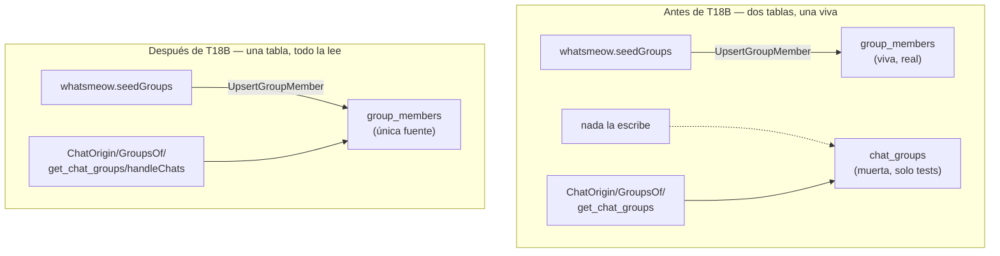

# T18B — se retira `chat_groups`, `group_members` queda como fuente única (ct-2026-08-05-1243)

Sub-cambio aparte, sobre el hallazgo que T18 dejó flagueado sin resolver:
`chat_groups` (la tabla que `store.ChatOrigin`'s `group_discovered` y
`get_chat_groups` (MCP) leían) no tenía ningún escritor en código de
producción — solo tests. Ver `docs/T18-DIAGRAMA-SEPARAR-POR-ORIGEN.md`
para el hallazgo completo, tal como se reportó.

## La decisión del boss, vía Citrino

> Hay dos tablas para la misma relación — qué números están en qué grupo —
> y solo una está viva. Cablear la segunda significa escribir dos veces lo
> mismo y mantenerlas sincronizadas para siempre. Es exactamente la clase
> de deuda que venimos pagando todo el día: dos fuentes para un dato
> terminan divergiendo, y la que menos se usa es la que miente cuando
> alguien la consulta. `group_members` es la que el sync real escribe.
> Esa se queda.

Sin ambigüedad sobre cuál de las dos tablas sobrevive — la que el código
real ya escribe, no la que "en teoría" debería.

## Verificación previa, antes de tocar código

Confirmado con evidencia, no dado por hecho:

1. **Sin migración de datos** — `chat_groups` nunca tuvo escritor en
   producción (`AddGroupMember` solo se llamaba desde tests, confirmado
   por grep en todo el repo). Nada que salvar.
2. **`group_members` cubre grupos sin admin** — verificado contra la
   librería `whatsmeow` vendorizada: `GetJoinedGroups` pide TODOS los
   grupos del participante sin condición de rol, y `parseGroupNode` itera
   cada `<participant>` sin filtrar por admin. `IsAdmin`/`IsSuperAdmin` es
   metadata DE cada participante, no un gate sobre si aparece. `seedGroups`
   (nuestro código) tampoco filtra. No es un problema.
3. **`group_members` solo se refresca al conectar/reconectar, o con un
   `KickResync` explícito** — confirmado: `seedGroups` se llama solo desde
   `handleConnected` (evento `*events.Connected`) y `KickResync`. No existe
   ningún handler para `events.GroupInfo`/`events.JoinedGroup` (los eventos
   de la librería para "cambió la membresía de un grupo" / "te agregaron a
   un grupo") — la librería los define, este código nunca los suscribe.
   Tampoco hay un fallback en `handleMessage` que agregue oportunistamente
   a un remitente desconocido. **Cuidado real, documentado, no resuelto
   acá** (el boss lo pidió saber, no lo pidió arreglar): un grupo nuevo o
   un miembro nuevo no aparece en `group_members` hasta la próxima
   reconexión/`KickResync`. No es peor que antes — antes `group_discovered`
   nunca disparaba en absoluto; ahora dispara, con esta ventana de
   frescura conocida. Si se quiere en vivo, es un sub-cambio aparte
   (cablear `events.GroupInfo`/`events.JoinedGroup`).

## Qué se hizo

- **Borrado entero**: la tabla `chat_groups` (fuera del `schema` const),
  `store.AddGroupMember`, `store.RemoveGroupMember`. Cero deprecación,
  cero shim — nada los llamaba en producción, no había nada que preservar
  hacia atrás.
- **`ChatOrigin`** — el chequeo de "¿está en algún grupo?" pasa de
  `SELECT EXISTS(... FROM chat_groups ...)` a `SELECT EXISTS(... FROM
  group_members ...)`.
- **`GroupsOf(memberJID)`** — reescrita para leer `group_members` en vez
  de `chat_groups`. Misma firma, mismo propósito ("¿en qué grupos está
  este número?"), fuente distinta. `get_chat_groups` (MCP) y
  `ChatOrigin` la comparten — ambos responden de verdad ahora.
- **`internal/restapi/read.go`'s `handleChats`** — la implementación
  paralela (`isGroupMemberCanon`, construida desde `ListAllGroupMembers`)
  se reemplazó por `c.Origin == "group_discovered"` — mismo criterio que
  `ChatOrigin` ya calcula por chat (`enrichChat`), sin recomputar nada
  aparte. Cierra el punto 4 que T18 había dejado pendiente.
- **`resetTables`** (`reset.go`) — de 8 a 7 nombres, `chat_groups` afuera.
- **`rekeyReferencingRows`** (`reconcile.go`, la fusión @lid↔número) — su
  nota de "esta tabla queda fuera de alcance" ahora nombra `group_members`
  (la que de verdad aplica), no la tabla retirada.

## Qué NO se tocó

- El criterio de fondo de `ChatOrigin` (T18: mensaje real en cualquier
  dirección) — sin cambios, T18B solo toca el chequeo de grupo.
- El filtro de la pestaña Chats (`app.js#isRealConversation`,
  `origin === "inbound_spoke"`) — sin cambios de código; ahora sí se
  beneficia de un `group_discovered` que dispara de verdad, sin tocar
  nada del lado del frontend.
- La ventana de frescura de `group_members` (conecta/reconecta/
  `KickResync`, nunca en vivo) — documentada, no resuelta, per el pedido
  explícito del boss ("verificá... si falla, avisá").

## Tests

- `TestGroupsOf` (store, nuevo) — un número en dos grupos reporta los dos;
  sin grupos reporta vacío. Cero cobertura directa existía antes.
- `TestGetChatGroupsReturnsRealData` (mcpserver, nuevo) — antes de T18B
  esto no se podía probar de verdad (siempre vacío); ahora confirma que
  `get_chat_groups` devuelve el grupo real tras `UpsertGroupMember`.
- `TestSeedGroupsPopulatesGroupMembersAndDescription` (whatsmeow) — el
  aserto que antes confirmaba "`chat_groups` queda intacta" se invirtió:
  ahora confirma que `GroupsOf` SÍ ve el grupo tras el seed.
- `TestChatOrigin*` (store, de T18) — sin cambios de expectativa, solo
  de tabla interna; siguen verdes.
- `TestResetMessagingDataWipesOnlyTheAgreedTables` — ajustado a 7 tablas.
- `TestOpenCreatesSchemaAndIsIdempotent` — `chat_groups` fuera de
  `wantTables`.

## Criterio de listo

- `chat_groups`, `AddGroupMember`, `RemoveGroupMember` no existen en
  ningún lado del código ni del schema.
- `ChatOrigin`/`GroupsOf`/`get_chat_groups` leen `group_members`, y
  `group_discovered` dispara de verdad (probado).
- La implementación paralela de `handleChats` quedó consolidada sobre
  `ChatOrigin` — punto 4 de T18, cerrado.
- La ventana de frescura de `group_members` (conecta/reconecta/
  `KickResync`) queda documentada en `docs/MANUAL.md` y en este archivo.
- `go build/vet/test` verde en todo el módulo.
- `docs/MANUAL.md`/`docs/T18-DIAGRAMA-SEPARAR-POR-ORIGEN.md`/
  `CHANGELOG.md` actualizados.
