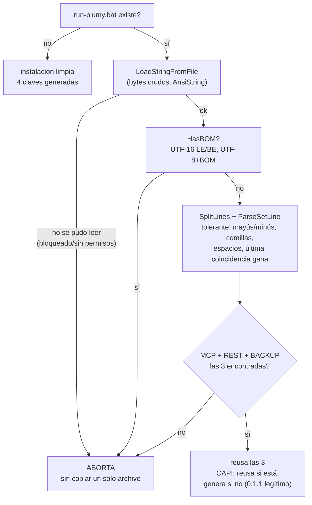
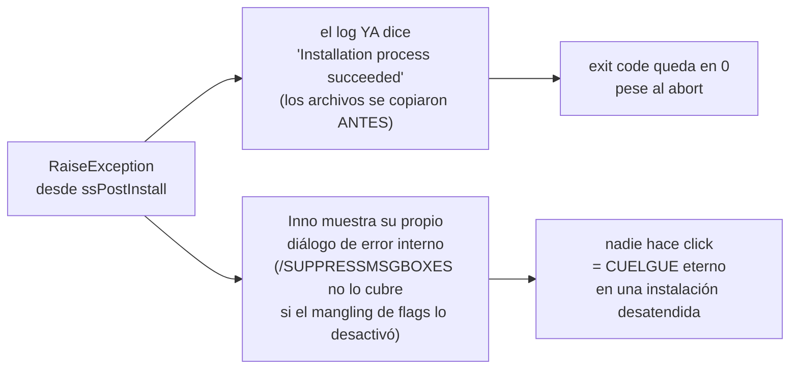
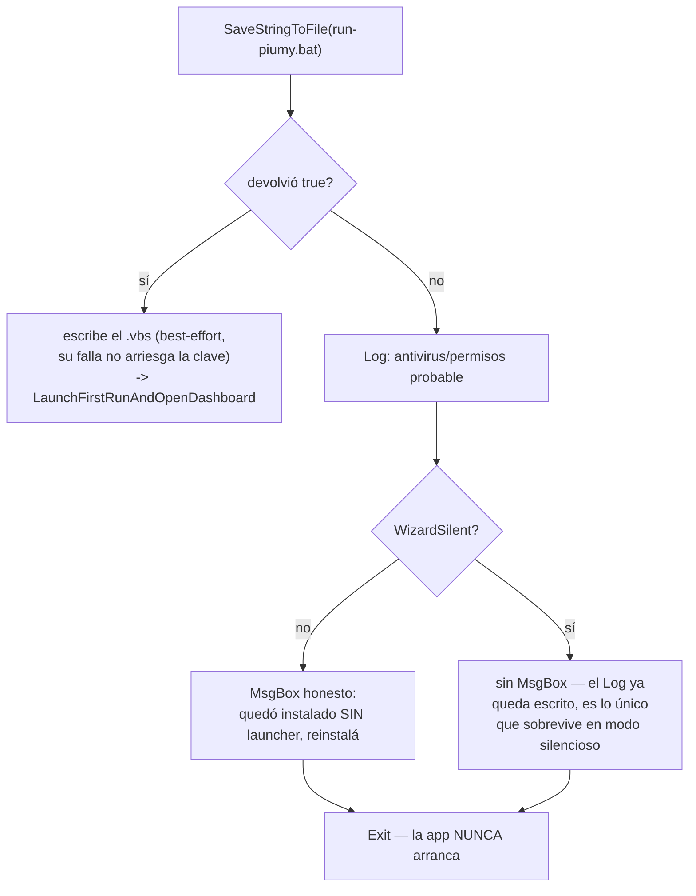
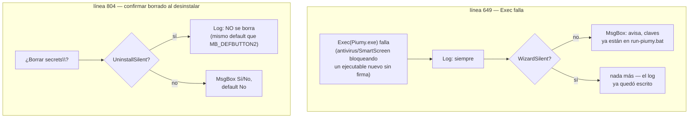
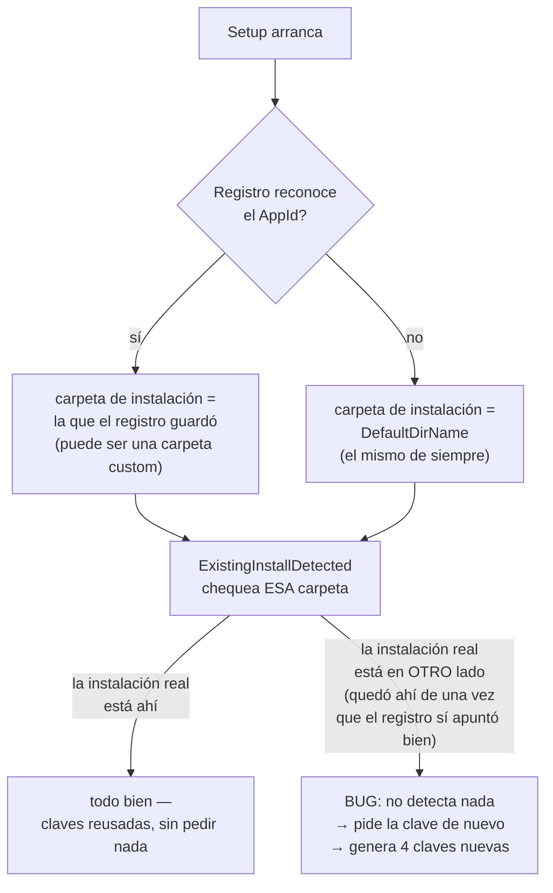
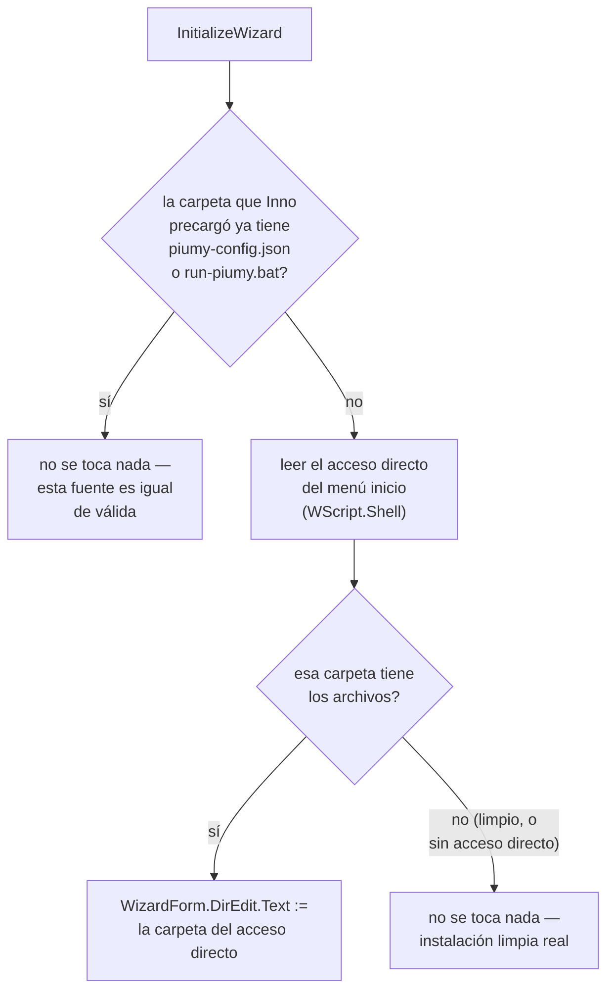

# T21 — el instalador nunca puede pisar claves que no pudo leer (ct-2026-08-05-1308)

CRITICAL, bloquea la publicación del instalador. Sale de la revisión
independiente de Amatista (R2, `ct-2026-08-05-1302`). Boss verbatim (vía
Citrino): el caso realista es alguien abriendo `run-piumy.bat` en el Bloc de
notas y guardándolo como "Unicode" — el propio comentario del archivo
invitaba a editarlo a mano.

## El defecto que reemplaza

`ExistingBatKey`/`KeyOrGenerate` (T6) exigían un match EXACTO de
`"set VAR="`. Si fallaba — UTF-16, mayúsculas, comillas, archivo truncado o
bloqueado — no avisaba: `KeyOrGenerate` generaba una clave nueva y
`SaveStringToFile` pisaba el launcher viejo. Los backups cifrados con la
clave anterior quedaban ilegibles para siempre, sin log, sin aviso.

## La regla: ante la duda, no se pisa nada



## Dónde corre esto — el hallazgo que obligó a rediseñar, no solo parchear

El primer intento dejó el parser nuevo llamado desde `CurStepChanged`
(`ssPostInstall`), en el mismo lugar donde vivía `KeyOrGenerate`. Compiló,
pero **probado en vivo se colgaba para siempre** en cualquier camino de
aborto real:



Verificado con el arnés headless (`//VERYSILENT //SUPPRESSMSGBOXES`, flags
con doble slash — Git Bash mangla `/VERYSILENT` en un path falso si va con
una sola barra, apagando la supresión sin avisar): el log mostró
`"Installation process succeeded"` seguido de `"CurStepChanged raised an
exception"` — la excepción SÍ disparaba el mensaje correcto, pero
`ssPostInstall` corre **después** de que Inno ya considera copiados los
archivos. Un `RaiseException` ahí es tarde: no cancela la instalación como
un fallo real, solo interrumpe el resto del script.

**El fix real:** `PrepareToInstall(var NeedsRestart: Boolean): String` — el
hook de Inno pensado exactamente para esto, corre DESPUÉS de que el usuario
confirmó la carpeta pero ANTES de copiar un solo archivo. Devolver un
string no vacío ahí es lo que Inno reconoce como fallo genuino: cancela
TODA la instalación, no deja nada a medio escribir, y el exit code sale
distinto de cero — probado (ver tabla abajo). `ResolveLauncherKeys` se
reescribió de `procedure` (con `RaiseException`) a `function: String`
(mensaje de error o `''`), y guarda el resultado en 5 variables globales
(`ResolvedMcpKey`/`RestKey`/`BackupKey`/`CapiKey`/`RestAddr`) que
`CurStepChanged` usa tal cual — ya no puede volver a leer ni a abortar ahí.

## Probado en vivo (instalador real, `dist/Piumy-Setup-0.1.2.exe`, `//VERYSILENT //SUPPRESSMSGBOXES`)

| Escenario | Resultado |
|---|---|
| Instalación limpia (sin `run-piumy.bat`) | exit 0, 4 claves generadas |
| Upgrade, launcher con 4 claves | exit 0, las 4 reusadas EXACTAS |
| Upgrade, launcher 0.1.1 (3 claves, sin CAPI) | exit 0, 3 reusadas + CAPI generada |
| Upgrade, `SET` mayúscula + comillas + espacios | exit 0, las 4 parseadas correctamente |
| Upgrade, clave duplicada (2 líneas) | exit 0, gana la ÚLTIMA línea |
| Upgrade, `PIUMY_REST_ADDR` agregado a mano | exit 0, preservado en el launcher nuevo |
| Upgrade, launcher UTF-16 (BOM real, escrito con .NET Unicode) | **exit 7, CERO archivos copiados** |
| Upgrade, launcher truncado (falta BACKUP_KEY) | **exit 7, CERO archivos copiados** |
| Upgrade, launcher bloqueado (handle exclusivo abierto) | **exit 7, CERO archivos copiados** |
| Reinstalar con Piumy corriendo (mismo `AppMutex`) | **exit 1, binario intacto, no reinstala** |
| Desinstalar con Piumy corriendo | **exit 1, no desinstala** |

Batería de funciones puras (`HasBOM`/`SplitLines`/`ParseSetLine`) verificada
aparte con un arnés Inno descartable (`InitializeSetup` corriendo asserts
contra archivos reales, `Result:=False` antes de instalar nada — mismo
patrón que el arnés de T8, borrado tras usarlo): 14/14 casos.

## Los dos secundarios del mismo archivo

- **Desinstalación, default "No"** (antes "Sí" — quien apretaba Enter
  perdía su historial): `MB_YESNO or MB_DEFBUTTON2`.
- **`AppMutex`**: nombre fijo `PiumyGatewaySingleInstanceMutex`, creado por
  el binario mismo (`appmutex_windows.go`, `CreateMutexW`, best-effort,
  nunca frena el arranque normal) apenas entra a `main()`, antes de
  `config.Load()`. Inno lo chequea solo, en `[Setup]` — nada más en el
  script lo toca. Sin esto, reinstalar/desinstalar con Piumy abierto daba
  el diálogo "archivo en uso" de Windows para `Piumy.exe`, y "Ignorar" ahí
  dejaba el ejecutable VIEJO corriendo emparejado con el launcher NUEVO.

## Un tercer agregado, detectado en vivo durante las pruebas (Citrino)

El paso final (`LaunchFirstRunAndOpenDashboard`) abría
`http://127.0.0.1:8092/dashboard/` con el puerto **escrito a mano**. Una
instalación con `PIUMY_REST_ADDR` distinto (agregado a mano para esquivar
un choque de puerto) abría el tablero de OTRA instalación — le pasó
literalmente al boss durante las pruebas silenciosas de este mismo
sub-cambio (pestañas del tablero abriéndose solas). Dos partes:

1. `ResolveLauncherKeys` ahora también preserva `PIUMY_REST_ADDR` si el
   launcher anterior lo tenía (no es una clave — no aborta si falta, `''`
   = usar el default de `config.go`, `:8092`).
2. `LaunchFirstRunAndOpenDashboard` arma la URL con el puerto real
   (preservado o default), y **no abre nada en modo silencioso**
   (`WizardSilent` corta antes del `ShellExecAsOriginalUser` — el `Exec`
   que arranca la app sigue andando igual, solo el navegador se salta).

## Qué NO se rompe / no se toca

- `GenerateRandomHex`/`CoCreateGuid` intactos — la aleatoriedad no cambió.
- El launcher permanente sigue sin la clave del tablero ni el correo
  (esos solo viven en el entorno del proceso de instalación, como antes).
- Ningún chat/dato de la app — esto es 100% del lado del instalador.

## Criterio de listo (T21)

- Los 3 caminos de fallo reales (UTF-16, truncado, bloqueado) abortan con
  exit code distinto de cero y CERO archivos copiados — tabla arriba.
- Actualización normal desde 0.1.1 (3 claves) y 0.1.2 (4 claves): sigue
  funcionando, claves intactas — tabla arriba.
- Duplicados: gana la última — tabla arriba.
- El log dice, por clave, si se reusó o se generó (`Log(...)` en
  `ResolveLauncherKeys` — no llega a la instalación real cuando aborta
  antes, que es exactamente el punto: nada se escribe).
- Desinstalación: default "No".
- Instalador recompilado (`dist/Piumy-Setup-0.1.2.exe`, ISCC 6.7.3).
- `go build ./... && go vet ./... && go test ./...` verde (mutex en Go).
- `CHANGELOG.md` actualizado.

---

# T22 — comillas en el valor, y escribir el launcher sin verificar (ct-2026-08-05-1455)

Bloqueaba la publicación. Tercera revisión de Amatista (R3,
`ct-2026-08-05-1448`), sobre T21: confirmó que `PrepareToInstall` es
correcto y que todos los caminos de LECTURA abortan limpio — encontró dos
huecos nuevos, uno en el parser, uno en la ESCRITURA, que nadie había
mirado.

## Hueco 1 — `ParseSetLine` sacaba las comillas del valor, cmd no lo hace

Amatista lo verificó ejecutando cmd de verdad (y yo lo re-verifiqué
independiente antes de tocar código, mismo resultado):

```
set PIUMY_A="abc123"   ->  variable queda CON comillas: ["abc123"]
set "PIUMY_B=abc123"   ->  variable queda SIN comillas: [abc123]
```

`ParseSetLine` (T21) probó solo la segunda forma — consistente por
casualidad. La primera no: si alguien edita el `.bat` y escribe
`set PIUMY_BACKUP_KEY="miclave"`, la app cifra sus backups con
`"miclave"` (comillas incluidas, ese es el valor real de la variable). El
parser viejo sacaba las comillas antes de reusar → reinstalar dejaba
`miclave` sin comillas, una clave DISTINTA a la que la app tenía en
memoria — y no abortaba, porque la clave "se encontró". El único hueco
que le quedaba a "ante la duda, no se pisa nada": no abortaba, y tampoco
reusaba bien.

**Fix, dirección de Citrino:** replicar cmd exacto, no interpretar. Se
borró el bloque que despojaba comillas del VALOR (`V[1]='"' ... V :=
Copy(...)`, T21 líneas 304-305) — el que envuelve TODO `VAR=valor` entre
comillas (`set "VAR=valor"`) ya las sacaba correctamente antes de llegar
ahí, sin tocarlo.

## Hueco 2 — el launcher se escribía sin chequear que se escribió

`SaveStringToFile` (línea 667) no miraba su resultado booleano. Un
antivirus bloqueando la creación de un `.bat` — **actor real y frecuente,
no hipotético** — dejaba la instalación anunciando éxito, y
`LaunchFirstRunAndOpenDashboard` arrancaba la app igual, con las 4 claves
SOLO en el entorno de ese proceso. Si esa corrida generaba un backup,
quedaba cifrado con una clave que muere al cerrar el proceso — **la misma
pérdida de R2 (T21), entrando por la escritura en vez de la lectura.** La
tabla de pruebas de T21 cubría lectura (UTF-16/truncado/bloqueado);
ningún caso de escritura.



**Ya estamos después de copiar los archivos** (mismo punto tarde que
`ssPostInstall`'s propio `RaiseException` resultó ser para abortar toda la
instalación, T21) — así que acá no se aborta la instalación entera con
exit code distinto de cero; se corta ANTES de arrancar la app (para que
las claves generadas nunca cifren nada ilegible después) y se avisa
honesto, exactamente como pidió el contrato.

### El cuelgue que encontré probando ESTE fix — no cubierto por `/SUPPRESSMSGBOXES`

Mi primer intento llamaba `MsgBox(...)` sin condición al detectar la
falla. **Probado en vivo, colgó el instalador para siempre en modo
silencioso** — mismo síntoma que el bug original de T21, causa distinta:

- El diálogo INTERNO de Inno por una excepción no atrapada (T21,
  `RaiseException` desde `ssPostInstall`) SÍ se auto-responde con
  `/SUPPRESSMSGBOXES` (log: `"Defaulting to OK for suppressed message
  box"`).
- Un `MsgBox()` propio, llamado directo desde `[Code]`, **NO** — verificado
  con un arnés aislado (`InitializeSetup` con un `MsgBox` de prueba,
  `//SUPPRESSMSGBOXES`): se colgó igual, sin loguear nada después.

Esto explica por qué `NextButtonClick` (T8) nunca llama `MsgBox` en la
rama `WizardSilent` — no es estilo, es la única forma de que sobreviva un
deploy desatendido. Mismo patrón acá: `if not WizardSilent then MsgBox(...)`
— el `Log(...)` (ya emitido antes, incondicional) es lo único que
sobrevive en silencioso, y es justo donde más hace falta que sobreviva
(un antivirus bloqueando el `.bat` es tan o más probable en un deploy
desatendido que en uno interactivo con alguien mirando).

## Menores del mismo pase

- **`GenerateRandomHex` ahora propaga error como string**, no
  `RaiseException` — corre DENTRO de `PrepareToInstall` desde T21 (vía
  `ResolveLauncherKeys`) y nunca se había probado desde ahí. Probabilidad
  de que `CoCreateGuid` falle: ínfima — arreglo barato (`TryGenerateRandomHex`,
  wrapper de conveniencia para no repetir el manejo en los 5 sitios que
  generan una clave), mismo mecanismo que el resto del hook.
- **URL del tablero con `PIUMY_REST_ADDR` en forma `host:puerto`** (ej.
  `127.0.0.1:9000`, no `:9000`): la versión vieja SIEMPRE anteponía
  `127.0.0.1`, armando `http://127.0.0.1127.0.0.1:9000` — malformado.
  Cosmético (la app arranca bien, el launcher persiste el valor tal cual)
  pero se arregla en una línea: si `RestAddr` no empieza con `:`, ya trae
  su propio host, no se antepone nada.

## Probado en vivo (agregado a la tabla de T21, no reemplaza)

| Escenario | Resultado |
|---|---|
| Upgrade, `set PIUMY_MCP_KEY="aaaa1111"` (comillas alrededor del valor) | exit 0, reusa **`"aaaa1111"` con comillas** — idéntico al valor real |
| Upgrade, `set "PIUMY_REST_KEY=bbbb2222"` (comillas envolviendo todo) | exit 0, reusa `bbbb2222` **sin comillas** — idéntico al valor real |
| Escritura de `run-piumy.bat` bloqueada (path ocupado por un directorio) | **exit 0, la app NO arranca, ningún archivo de clave se pisa** (antes: cuelgue eterno con mi primer intento de fix) |
| Spot-check T21: instalación limpia | exit 0, sigue igual |
| Spot-check T21: UTF-16 aborta | exit 7, cero archivos, sigue igual |
| Spot-check T21: truncado aborta | exit 7, cero archivos, sigue igual |
| Spot-check T21: `AppMutex` bloquea reinstalar | exit 1, sigue igual |

## Criterio de listo (T22)

- Comillas: las dos formas que verificó Amatista, valor reusado idéntico
  al real — tabla arriba.
- Escritura: fallo simulado, la app no arranca, avisa (Log siempre;
  `MsgBox` solo si hay alguien mirando — el cuelgue real que encontré
  probando la primera versión del aviso).
- Tabla de T21 repasada por spot-check, no rehecha entera — sigue verde.
- Instalador recompilado (`dist/Piumy-Setup-0.1.2.exe`, ISCC 6.7.3).
- `CHANGELOG.md` y este documento actualizados.

---

# T23 — los dos diálogos que quedaron vivos (ct-2026-08-05-1615)

Lo único que faltaba para publicar. Cuarta revisión de Amatista (R4): el
mismo patrón que T22 documentó y arregló en la escritura del launcher
(`MsgBox()` propio, no cubierto por `/SUPPRESSMSGBOXES`, cuelga una
instalación desatendida para siempre) **quedó vivo en otros dos lugares del
mismo archivo**.

## Barrido completo de la superficie — no solo los dos que señaló Amatista

Citrino pidió verificar que no quedara ninguno más, no solo arreglar los
dos nombrados. Enumeré cada `MsgBox`/`RaiseException` del archivo:

| Línea | Qué es | ¿Cuelga en silencioso? | Por qué |
|---|---|---|---|
| 572 | `RaiseException`, dentro de la rama `WizardSilent` de `NextButtonClick` | No | Verificado por T8 con su propio arnés — exit code distinguible, mensaje al log |
| 582, 587 | `MsgBox`, `NextButtonClick`, DESPUÉS del `Exit` de la rama silenciosa | No | Inalcanzable en silencioso — la rama `WizardSilent` retorna antes de llegar acá |
| **649** | `MsgBox`, `Exec` falla al arrancar Piumy.exe | **Sí, antes de este fix** | **Arreglado ahora** |
| 753 | `MsgBox`, falla al escribir `run-piumy.bat` | No | Ya arreglado en T22 (`if not WizardSilent`) |
| **804** | `MsgBox`, confirmación de borrar `secrets\` al desinstalar | **Sí, antes de este fix** | **Arreglado ahora** |

Ningún otro mecanismo de diálogo en el archivo — grepeé también
`external`/`SuppressibleMsgBox`/`TaskDialogMsgBox`/`Confirm(`, nada más que
las dos importaciones ya conocidas (`CoCreateGuid`,
`SetEnvironmentVariableW`). Las páginas del wizard (bienvenida, EULA,
carpeta, contraseña) las salta Inno solo en modo silencioso — comportamiento
propio del motor, no código nuestro, no en riesgo.

## Los dos arreglados



**Línea 649 (`Exec` falla):** mismo patrón exacto que T22 — `Log` siempre,
`MsgBox` solo si `not WizardSilent`. Estado recuperable (las 4 claves ya
quedaron escritas en `run-piumy.bat` en este punto — un acceso directo
alcanza), pero sin el fix la máquina quedaba con una instalación "zombie":
archivos copiados, proceso nunca arrancado, instalador colgado para
siempre esperando un click que nadie da.

**Línea 804 (confirmar borrado al desinstalar):** distinto de los otros dos
— es una pregunta Sí/No que decide algo irreversible (`DelTree`), no un
aviso informativo. No hay "MsgBox solo si no silencioso, seguir igual" acá:
en silencioso, `UninstallSilent` salta directo al MISMO default que ya
tenía el diálogo interactivo (`MB_DEFBUTTON2` = No, no borrar) y lo
registra. Un retiro desatendido de varias máquinas nunca pierde datos por
un click que nadie dio — ni se cuelga esperándolo.

## Probado en vivo

- **`Exec` falla, silencioso:** arnés aislado (`InitializeSetup` llamando
  `Exec` contra un path inexistente, mismo patrón Log+MsgBox condicional
  exacto) — `//VERYSILENT //SUPPRESSMSGBOXES`, sin cuelgue, log escrito,
  el script sigue ejecutando después del bloque.
- **Desinstalación silenciosa con `secrets\` presente:** instalación real
  completa (`dist/Piumy-Setup-0.1.2.exe`) → `unins000.exe
  //VERYSILENT //SUPPRESSMSGBOXES` → **exit 0, sin cuelgue, `secrets\`
  intacta** (el default seguro se respetó, no se borró nada sin
  confirmación explícita).

## Criterio de listo (T23)

- Los dos guardados — tabla arriba.
- Superficie completa verificada, ninguno más — tabla arriba.
- Instalación silenciosa con `Exec` fallando: no cuelga, sale, motivo en
  el log — probado con arnés aislado.
- Desinstalación silenciosa: no cuelga — probado con instalación real.
- Instalador recompilado (`dist/Piumy-Setup-0.1.2.exe`, ISCC 6.7.3).
- `CHANGELOG.md` y este documento actualizados.

---

# T24 — el instalador pedía la clave de nuevo en una actualización real (ct-2026-08-05-1740)

CRÍTICO, bloqueaba publicar. El smoke en la máquina del boss (instalador
0.1.3 sobre su instalación real 0.1.1) falló en el primer paso: pidió la
clave del tablero. El boss canceló — su instalación quedó intacta, cero
archivos tocados (el aborto limpio de T21/T22/T23 hizo su trabajo). Pero el
síntoma en sí ya era la señal de un defecto nuevo: una actualización real
NUNCA debería pedir esa clave (T8).

## Por qué pasaba — el registro es la única fuente que Inno usa, y puede faltar

`ExistingInstallDetected` confía en la carpeta de instalación que Inno
resuelve — y Inno la resuelve, ANTES de que corra una sola línea nuestra,
así: si el AppId está en el registro de desinstalación (`HKCU...\Uninstall\
...`), usa la carpeta registrada ahí; si no, cae al directorio por
defecto (`DefaultDirName`, nunca cambió de versión a versión). Si esa
entrada de registro falta o quedó desactualizada — instalación hecha a
mano, limpieza de registro, carpeta movida, cualquier motivo, no hace falta
saber cuál en particular — la carpeta de instalación cae al default de
siempre, y si la instalación real del usuario NO está ahí, todo lo que
depende de esa carpeta (`ExistingInstallDetected`, `ResolveKeys`) falla en
silencio: pide la clave de nuevo Y genera 4 claves nuevas, exactamente
sobre una instalación que ya tenía las suyas.



Reproducido en aislamiento, con un `DefaultDirName` de prueba distinto del
real para poder aislar el caso sin tocar una instalación real de esta
máquina (además: esta misma máquina tenía una carpeta Piumy real con
datos, que el propio harness bloqueó leer — señal de que no había que
tocarla). Con la entrada de registro borrada a propósito y el
`run-piumy.bat` real sentado en una carpeta DISTINTA a la que cae por
default: el instalador cayó al default, no encontró nada ahí, pidió la
clave y generó 4 claves nuevas — el mismo desastre, reproducido a demanda.

## El fix — el acceso directo del menú inicio sobrevive a que el registro no

Chequear el mismo `DefaultDirName` otra vez no agrega nada: es
textualmente la misma carpeta a la que Inno ya cayó. Hace falta una fuente
DISTINTA del registro para encontrar la carpeta real. La sección `Icons`
crea SIEMPRE (sin `Tasks:`, a diferencia del de inicio automático) un
acceso directo del menú inicio apuntando directo al ejecutable dentro de
la carpeta real — y para que ese acceso directo alguna vez haya arrancado
la app de verdad, tuvo que apuntar a la carpeta REAL, no a una que Inno
"cree" que es la correcta. Leerlo con `WScript.Shell` (mismo mecanismo que
T11 ya usó para VERIFICAR el `.lnk` real, ahora para LEERLO en runtime)
recupera esa carpeta sin depender del registro.

**Windows puro, adrede — el boss lo marcó al ver la solución.** `WScript.Shell`
y un `.lnk` no existen fuera de Windows; el día que haya instalador para
Linux/Mac (post-MVP), esta función concreta no viaja. Lo que SÍ cruza es el
PROBLEMA: "el instalador precargó solo una carpeta que puede no ser la
instalación real, cuando el mecanismo del sistema para reconocerla falta o
quedó desactualizado" — ese problema hay que resolverlo de nuevo en cada
plataforma, con la fuente de verdad que esa plataforma ofrezca (en
Linux/Mac, probablemente el propio `piumy-config.json` en su ruta estándar
alcance, sin necesitar un acceso directo — pero esa decisión es de quien
construya ese instalador). El comentario en `piumy.iss` (junto a
`PreviousInstallDirFromShortcut`) lo deja explícito para que nadie porte el
mecanismo en vez de resolver el problema.



`ExistingInstallDetected`/`ResolveKeys`/`PrepareToInstall` no se tocan —
todos leen la misma constante de directorio de instalación vía
`ExpandConstant`, y esa constante ahora refleja la carpeta correcta desde
`InitializeWizard` en adelante. Cablear en el único punto donde se decide
la carpeta, no parchear cada consumidor por separado.

### El error que encontré haciendo el fix — la constante no se puede expandir todavía en `InitializeWizard`

Mi primer intento llamaba a `ExistingInstallDetected` (que expande la
constante de directorio) directo desde `InitializeWizard`. Probado en
vivo: `Runtime error: Error interno: se intentó expandir la constante
"app" antes de que se inicialice` — instalación abortada. La constante en
sí no está lista todavía en ese momento del ciclo de vida, aunque
`WizardForm.DirEdit.Text` (el campo de texto que Inno ya precargó, vía
registro o el default) sí es un `String` normal, legible sin problema.
Fix: chequear `WizardForm.DirEdit.Text` directo, nunca la constante, dentro
de `InitializeWizard`.

## Probado en vivo (instalador de prueba, aislado — tres escenarios)

| Escenario | Antes del fix | Después del fix |
|---|---|---|
| Registro reconoce, carpeta correcta | exit 0, claves reusadas de `piumy-config.json` | Sin cambios — sigue igual |
| **Sin registro, `run-piumy.bat` real en OTRA carpeta, acceso directo sobrevive** | **pide la clave, genera 4 claves nuevas** | **detecta la carpeta real vía el acceso directo, reusa las 4 claves de `run-piumy.bat`, no pide nada** |
| Instalación limpia real (sin registro, sin acceso directo, sin archivos en ningún lado) | genera 4 claves (correcto) | Sin cambios — sigue generando 4 (no hay falso positivo) |

Verificado con `Log()` en cada paso: la carpeta que Inno precarga, la
carpeta que devuelve el acceso directo, y la carpeta final después del
posible override — los tres casos de la tabla se corresponden exactamente
con lo esperado.

## Qué NO se rompe

- Una instalación con un directorio CUSTOM que el registro SÍ reconoce
  correctamente no se toca — el fix solo actúa cuando la carpeta que Inno
  precargó no tiene instalación.
- `ResolveKeys`/`PrepareToInstall`/`CurStepChanged` sin cambios de código —
  siguen leyendo la misma constante de directorio, ahora correcta antes de
  que ellos corran.
- Instalación limpia real (sin acceso directo previo): sigue generando 4
  claves nuevas, sin falso positivo.

## Criterio de listo (T24)

- Reproducido en aislamiento: sin registro + archivos reales en otra
  carpeta → pide la clave y genera claves nuevas (el bug real).
- Con el fix: la misma situación reusa las 4 claves sin pedir nada —
  tabla arriba.
- Regresión: registro-reconoce-correctamente sigue igual; instalación
  limpia real sigue generando 4 claves (no hay falso positivo) — tabla
  arriba.
- Instalador recompilado (`dist/Piumy-Setup-0.1.3.exe`, ISCC 6.7.3) desde
  el archivo real, sin instrumentación de depuración.
- Comentario en `piumy.iss` (junto a `PreviousInstallDirFromShortcut`) deja
  explícito que el mecanismo es Windows puro y que lo que cruza a otra
  plataforma es el problema, no el `.lnk` (agregado del boss, verbatim:
  "tiene que quedar comentado, para cuando se compile para mac y linux se
  resuelva distinto").
- `CHANGELOG.md` y este documento actualizados.
