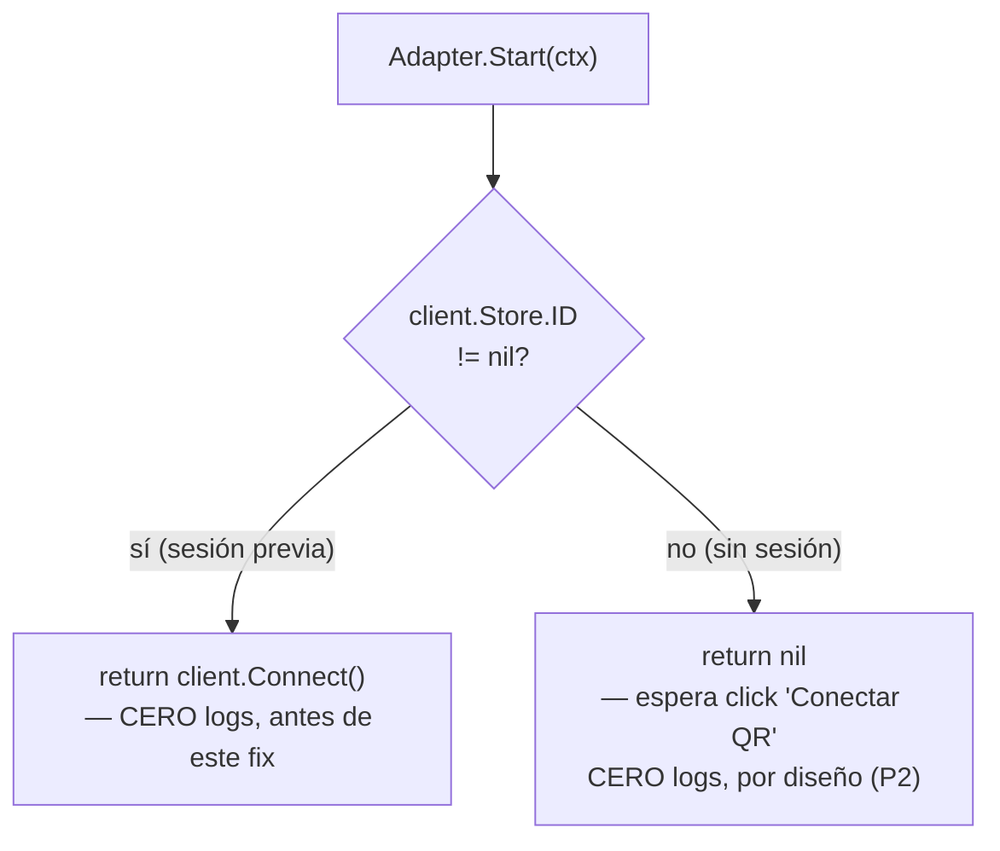
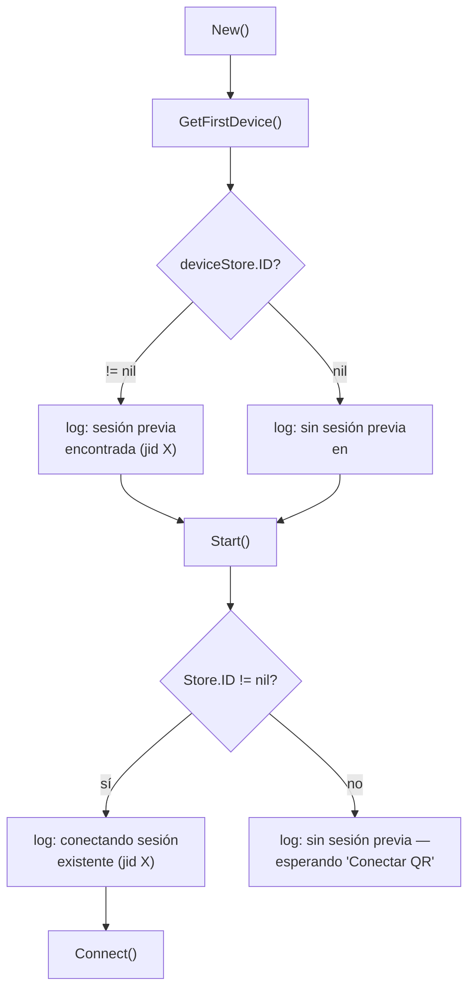
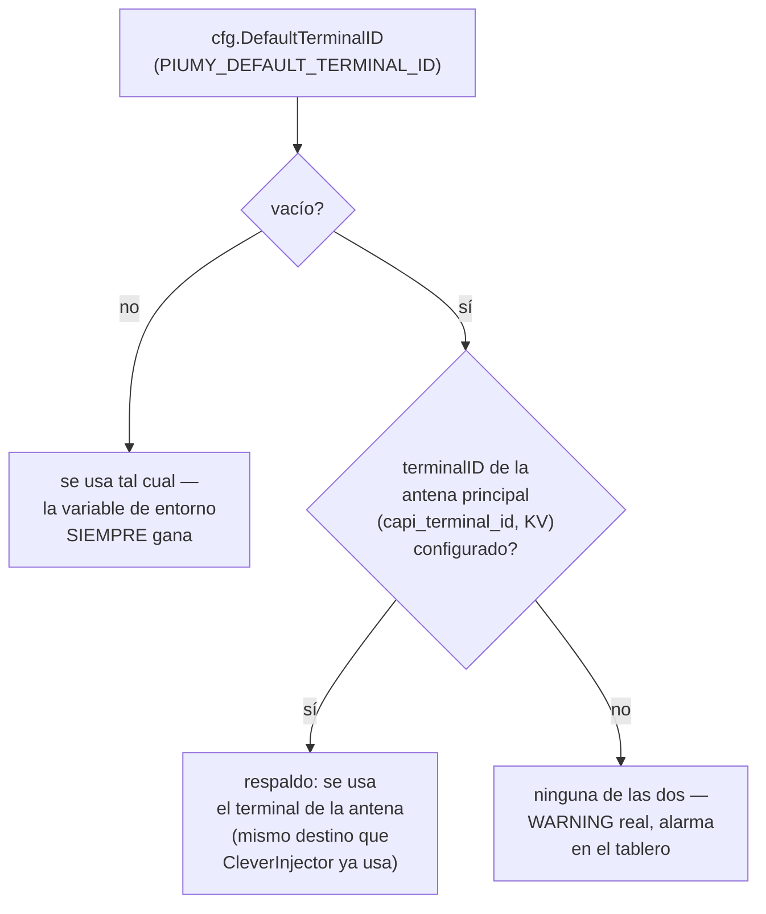

# T25 — el smoke real: WhatsApp no arranca, y no reporta nada (ct-2026-08-05-1833)

Primer smoke real sobre la instalación del boss (0.1.1 → 0.1.3, instalador de
master `7137f2c`, silencioso, sin `/DIR`). T6/T8/T11/T13/T21-T24 funcionaron
sobre datos reales — claves preservadas, acceso directo directo a
`Piumy.exe`, reglas de fábrica sembradas, contraseña conservada. Quedaron
tres hallazgos; este documento cubre los tres.

## Hallazgo 1 (bloqueante) — WhatsApp no conecta, y el log no dice nada

Síntoma: `connected: false`, `show_qr: false`, `own_number` vacío, y **cero
líneas de whatsmeow en todo el log de arranque** — ni conectando, ni error,
ni QR. El `whatsmeow.db` (1 MB, con la sesión previa) está en la carpeta
correcta.

### Metodología — descartar antes de sospechar

`Start()` (`adapter.go`) tiene exactamente dos caminos:



Ambos caminos eran silenciosos — la pregunta de Citrino ("no es *por qué no
conecta*, es *por qué no reporta nada*") apunta exactamente acá: el log
vacío es consistente con CUALQUIERA de los dos caminos, y también con un
`Connect()` que sí se llama pero nunca dispara un evento (los eventos
post-conexión — `Connected`, `LoggedOut`, `StreamReplaced`, etc. — SÍ
loguean, ver `handleEvent`/`handleDisconnect`, inbound.go; ninguno apareció).

Reproducido en aislamiento, tres hipótesis descartadas con test (no sobre la
instalación del boss, per contrato):

| Hipótesis | Método | Resultado |
|---|---|---|
| El wiring `piumy-config.json` → env → `cfg.WADBPath` está roto | Cadena completa (`config.ApplyFileDefaultsIn` → `config.Load` → `whatsmeow.New`) contra un `whatsmeow.db` sintético con un dispositivo pareado (insert SQL directo — `PutDevice` de la librería revienta con un dispositivo sintético, los campos `Account.*` solo existen tras un pareo real) | `cfg.WADBPath` correcto, `New()` encuentra el dispositivo — cadena sana |
| Una carpeta con espacio en el nombre (perfil de Windows real, ej. "Juan Perez") rompe el DSN de `modernc.org/sqlite` | Mismo `whatsmeow.db` sintético, carpeta con espacio | Encontrado igual — no es esto |
| La versión de la librería whatsmeow cambió entre el build de 0.1.1 (`a93e29b`) y master, y el schema no migra bien | `git show a93e29b:go.mod` vs. `go.mod` actual | Versión IDÉNTICA (`v0.0.0-20260709092057-73fe7355f59f`) — no es esto |

Las tres cadenas SANAS en aislamiento — el mecanismo, tomado pieza por
pieza, funciona. Lo que no pude reproducir sin acceso a la máquina real del
boss: por qué su `Store.ID` específicamente sale `nil` (o por qué un
`Connect()` real cuelga sin emitir un evento) — eso hace falta un dato más
de su instalación real (ver "Qué falta" abajo).

### El fix — cerrar el hueco de logging, sea cual sea la causa real

Lo que SÍ es un defecto real, independiente de la causa de fondo: el hueco
de logging mismo. `handleEvent`/`handleDisconnect` implementan fielmente el
"silent death" hardening (H6) para todo lo que pasa DESPUÉS de un evento —
pero el momento ANTES de que exista un evento (¿se encontró una sesión?
¿se llamó a Connect()?) no decía nada. Alguien reproduciendo esto en el
futuro se topa con la MISMA ambigüedad que yo.



Dos `log.Printf` nuevos: uno en `New()` (dice si `GetFirstDevice` encontró
un dispositivo pareado, con el jid), uno en `Start()` (dice que va a
intentar `Connect()` antes de llamarlo, y loguea el error si `Connect()`
falla sincrónicamente). Ninguno de los dos existía. Con esto, la PRÓXIMA
corrida en la máquina del boss dice sin ambigüedad cuál de los dos caminos
tomó — cierra exactamente el hueco que motivó la pregunta.

Tests (`internal/whatsmeow/adapter_test.go`): `TestNewLogsNoExistingSession`
(sin dispositivo, loguea "sin sesión previa"), `TestNewLogsExistingSessionFound`
(dispositivo sintético insertado por SQL directo, loguea "sesión previa
encontrada" + el jid). Deliberadamente NO agregué un test para el log de
`Start()` con `Connect()` real — habría sido el primer test de este
paquete en tocar red de verdad (WhatsApp de verdad, aunque con credenciales
falsas que no le hacen nada a ninguna cuenta real) por un beneficio marginal
(una línea, ya cubierta estructuralmente por el mismo `if`).

### Qué falta — no pude cerrar la causa de raíz sin la máquina real

Con el logging nuevo, el PRÓXIMO smoke va a decir directamente "sin sesión
previa en `<path>`" (si `Store.ID` es `nil` — mi sospecha principal) o
"conectando sesión existente" seguido de silencio otra vez (si el problema
es de red/conectividad en su máquina específica, no de código). Cualquiera
de las dos respuestas cierra la ambigüedad de una vez.

## Hallazgo 3 — no existía (corrección de Citrino)

Lo que sigue es la investigación original, dejada intacta por transparencia
— pero el hallazgo en sí NO era real. Citrino comparó el hash guardado
contra `bcrypt` de `"piumy"` de forma directa sobre la base real del boss:
**da verdadero.** La contraseña del tablero del boss ES la de fábrica —
`factory_password: true` decía la verdad. Su prueba de login (la que
reportó como "credenciales inválidas") tenía el campo `user` en vez de
`username`, así que el servidor rechazaba cualquier intento — no una falla
de `isFactoryPassword`. **T9 funcionó exactamente como tenía que funcionar.**

`TestFactoryPasswordAlarmIgnoresEnvSeedWhenOwnerAlreadyChangedIt` (abajo)
sigue siendo un test válido — cubre un caso real que podría aparecer — pero
no fue el que causó el síntoma reportado; se agregó investigando una
sospecha que resultó equivocada.

<details>
<summary>Investigación original (el hallazgo resultó no ser real, ver arriba)</summary>

Síntoma reportado: `factory_password: true`, pero la clave `piumy`
"no entraba" (login con el campo mal armado) y el log decía "usando el hash
ya existente". Sospecha original: la instalación silenciosa deja
`PIUMY_DASHBOARD_PASSWORD=piumy` en el entorno, y la detección lo mira en
vez de comparar solo contra el hash guardado.

**Descartado con test.** `isFactoryPassword` y `handleLogin` pasan por la
MISMA función (`passHash`) y la MISMA comparación bcrypt — `passHash` solo
mira la variable de entorno cuando el hash guardado está vacío (`v == ""`,
`auth.go` línea 66). Con un hash existente, la variable de entorno queda
sin usarse, sea cual sea su valor.

`TestFactoryPasswordAlarmIgnoresEnvSeedWhenOwnerAlreadyChangedIt`
(`auth_test.go`): hash propio sembrado + `PIUMY_DASHBOARD_PASSWORD=piumy`
seteada igual — verifica `isFactoryPassword() == false` Y un login real
contra el servidor de pruebas con "piumy" da 401, con la clave propia da
200. Correcto, pero la sospecha en sí no era la causa — no había causa,
el hash del boss realmente era el de fábrica.

</details>

## Hallazgo 2 — `PIUMY_DEFAULT_TERMINAL_ID` vacío, decisión de Citrino

Ninguna de mis dos propuestas (A: alarma nueva: B: auto-siembra tipo T12) —
Citrino encontró un tercer camino que no agrega nada nuevo: **la antena
principal ya cableada (`capi_terminal_id` en el KV) YA ES el destino al que
capipush despacha todo lo demás.** El propio log de arranque lo mostraba
sin que nadie lo conectara:

```
capipush: WARNING — PIUMY_DEFAULT_TERMINAL_ID vacío...
capipush: CleverInjector -> http://192.168.1.113:8788 (terminal b5acde44-...)
```

"No sé a quién despachar" en una línea, "despacho a este" en la siguiente —
un cable de medio camino, no una configuración faltante.



**Implementado** (`main.go`, `resolveDefaultTerminalID` — función pura,
testeada): si `PIUMY_DEFAULT_TERMINAL_ID` está vacío pero la antena
principal ya tiene `terminalID` resuelto (KV o env), ESE valor pasa a ser
`cfg.DefaultTerminalID` antes de armar `pusher`/`mcpSrv`/`restHTTP` — los
tres consumidores existentes (`PortFallback`, `PrincipalTerminalID` x2) lo
ven ya resuelto, sin tocar ninguno de los tres por separado. La advertencia
real (`WARNING — ... vacío`) se movió a DESPUÉS de aplicar el respaldo —
ahora solo dispara cuando NI el env NI la antena dan un terminal.

Mi opción A (alarma en el tablero) se agregó igual, para ese caso real:
`GET /api/status` expone `default_terminal_configured` (mismo patrón que
`factory_password`/`antenna_configured` — sin caché, refleja
`Deps.PrincipalTerminalID`, que ya lleva el respaldo aplicado desde
main.go), y el tablero (`index.html`/`app.js`) muestra una alarma cuando es
`false`.

**Verificado en vivo** (binario compilado, no sobre la instalación del
boss): sin antena ni env → `WARNING` en el log, `default_terminal_configured:
false`. Configurando la antena vía `/api/admin/capi-connector-line` MIENTRAS
el proceso corre → el respaldo NO se aplica solo (`PortFallback` es
inmutable post-arranque, documentado en `capipush.go` — "The principal slot
is immutable post-New" — el mismo criterio que ya regía is_boss, no algo
nuevo que agregué). Reiniciando CON la antena ya configurada → el log dice
"usando el terminal de la antena principal (...) como respaldo", sin
`WARNING`, y `default_terminal_configured: true`. Un reinicio real hace
falta para que is_boss empiece a despachar — no es cosmético, coincide con
cómo capipush ya se comporta.

## Criterio de listo

- Hallazgo 1: tres hipótesis de causa descartadas con test aislado (wiring
  del path, espacio en la ruta, versión de la librería) — las tres sanas.
  Logging nuevo cierra la ambigüedad "no se llama vs. falla antes de
  loguear" para el próximo smoke.
- Hallazgo 2: `resolveDefaultTerminalID` (main.go) — env gana siempre,
  antena principal como respaldo, WARNING real solo si ninguna de las dos
  está puesta. Alarma nueva en el tablero (`default_terminal_configured`,
  `GET /api/status` + `index.html`/`app.js`) para ese último caso.
  Verificado en vivo (binario real, no la instalación del boss): sin
  antena → WARNING + alarma; con antena configurada DESPUÉS del arranque →
  no se aplica solo (PortFallback es inmutable post-arranque, ya
  documentado); reiniciando CON la antena → respaldo aplicado, sin
  WARNING, alarma apagada.
- Hallazgo 3: no era real — corrección de Citrino, T9 funcionó
  correctamente. El test que quedó (`TestFactoryPasswordAlarmIgnoresEnvSeedWhenOwnerAlreadyChangedIt`)
  es válido igual, cubre un caso real, aunque no fue el causante.
- `go build/vet/test` verde, tests nuevos:
  `TestResolveDefaultTerminalID` (main_test.go),
  `TestStatusEndpointDefaultTerminalConfigured` (read_test.go).
- `CHANGELOG.md` actualizado.
