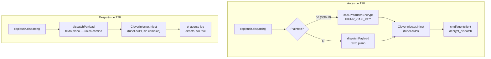

# T28 — el despacho va sin cifrado propio, sin interruptor (ct-2026-08-05-2242)

Reversión de T2 (ct-2026-08-05-0205). Contexto completo: T27 (ct-2026-08-05-2233)
pidió dejar el cifrado a un flag apagado por default; el boss lo rechazó — es
la **tercera vez** que pide el despacho plano, y cada vez volvió a aparecer
cifrado. Eso cambia el problema: si vuelve tres veces, algo en la
documentación lo reintroduce. T28 saca el mecanismo del todo, sin flag, y
audita esa causa.

## La decisión, en los términos del boss

> "Clever coder es mío, y lo programo yo... Lo único que hace es buscar
> actualizaciones del mismo programa. Entonces, no hay nada de qué protegerse."

El canal cAPI (CleverCoder) **ya es un túnel cifrado** — negocia una key por
handshake, por terminal (ver la skill `capi-protocol`). Lo que T2 agregó
encima era una SEGUNDA capa, adentro de ese túnel — protegía el contenido
de CleverCoder mismo. Pero CleverCoder es del dueño, en su propia máquina:
no hay de qué protegerse ahí. Cifrar y volver a descifrar en el mismo lugar
del que en teoría te protegías (una alternativa que se consideró y se
descartó: que CleverCoder mismo descifrara y entregara texto plano — para
descifrar necesita la key, y con la key deja de estar protegido de él).

**Por qué sin interruptor, no con uno apagado (la corrección sobre T27):**
un flag apagado es exactamente el mecanismo por el que esto revive — alguien
lo prende "porque estaba ahí y parecía la opción segura". El día que
CleverCoder sea de un tercero (venta del producto, un cliente corriendo
sobre el CleverCoder de otro) esa capa vuelve a tener sentido — y ese día se
vuelve a escribir, a un commit de distancia, no a un interruptor.

## Por qué volvía tres veces — el barrido completo del repo

Citrino pidió peinar manuales embebidos, `docs/`, comentarios — cualquier
cosa que un agente lea antes de trabajar — buscando toda mención al
cifrado del despacho, `agentclient`, `decrypt_dispatch` o la clave de cAPI.
**Encontrado y confirmado como la causa real:**

| Archivo | Qué decía | Por qué reintroduce |
|---|---|---|
| `internal/mcpserver/manuals/connect/SKILL.md` | "el cifrado nunca es opcional" (sección "Por qué el ping cifrado no es un error"), paso 6 "Cablear el descifrador" como paso obligatorio | Manual que un agente lee ANTES de poder trabajar — una afirmación tan categórica ("nunca") no deja margen para que alguien piense que es removible |
| `internal/mcpserver/manuals/orchestrator/operacion.md` | "los despachos van cifrados y la clave vive solo del lado del agente" — sección "Conectar un agente", sin condicional | El manual de quien CONFIGURA el sistema — presentaba el cifrado como propiedad estructural, no como algo que alguien decidió y podía volver a decidir |
| `docs/MANUAL.md` | "el cifrado NO es opcional — `PIUMY_CAPI_PLAINTEXT` es solo para desarrollo" | El mapa que cualquiera en el proyecto lee para orientarse rápido — la misma afirmación categórica, en el lugar que más se lee |
| `installer/windows/piumy.iss` (comentario) | "el gateway cifra igual (nunca opcional...)" | Comentario de código, mismo texto, mismo efecto en quien lo lea antes de tocar el instalador |

Ninguno de los cuatro estaba mintiendo cuando se escribió — el cifrado
efectivamente no era opcional en ese momento (T2 lo decidió así, y T27 lo
reafirmó explícitamente: "no hagas el cifrado opcional, es una propiedad
del producto a defender"). El problema no es que el texto haya estado mal
escrito — es que una decisión de producto quedó grabada en prosa
categórica ("nunca", "no es opcional") en CUATRO lugares distintos, y
nadie los volvió a mirar cuando la decisión cambió. Que la palabra
"nunca" apareciera en un manual que un agente lee como instrucción
operativa es, en retrospectiva, la señal más clara: sonaba a regla del
sistema, no a una configuración de hoy.

**Los cuatro reescritos** — ahora dicen que la decisión SE TOMÓ, no la
describen como propiedad del sistema:
- `connect/SKILL.md`: paso 6 y la sección del ping cifrado, borrados —
  no hay nada que cablear, el agente lee el despacho directo. El JSON de
  ejemplo de `agent-connect.json` ya no lista `capi_key`/`agentclient_path`.
- `orchestrator/operacion.md`: "Conectar un agente" reescrita — nombra la
  decisión T28 explícitamente, y aclara que la causa típica de "conectado
  pero no ve nada" pasó a ser la antena/el conector, no un cableado de
  descifrado.
- `docs/MANUAL.md`: `## capi` y `## agentclient` pasan a ser notas de
  "borrado, por qué" en vez de secciones vivas: las funciones ya no
  existen, documentarlas como si existieran sería peor que borrarlas.
- `piumy.iss`: el comentario queda como nota histórica ("T2 sumó esto,
  T28 lo sacó"), no como afirmación de comportamiento actual.

**Agregado del boss, mismo tramo:** los tres manuales ahora enlazan a la
skill `capi-protocol` (CleverCoder, bundled) para el protocolo real —
handshake, pinpass, el túnel cifrado — en vez de redescribirlo. El
protocolo no es nuestro; nuestros manuales lo usan, no lo redefinen. Cada
vez que se redescribe se crea una segunda verdad que envejece sola —
exactamente el mecanismo que causó este tramo.

## Lo que se borró (código, no solo prosa)

- `internal/capi` (paquete entero) — `Producer`, `Encrypt`, `Decrypt`,
  AES-256-GCM sobre `PIUMY_CAPI_KEY`.
- `cmd/agentclient` (paquete entero) — el mini-servidor MCP agente-side,
  la tool `decrypt_dispatch`.
- `config.CAPIKey`/`PIUMY_CAPI_KEY`, `config.CAPIPlaintext`/
  `PIUMY_CAPI_PLAINTEXT` — ninguno de los dos tiene reemplazo, no son
  "ahora vacíos por default", dejaron de existir como campos.
- `capipush.Config.Plaintext` y el branching en `dispatch()` —
  `dispatchPayload` (renombrada de `plaintextPayload`, ya no hay un
  segundo modo del que distinguirse) es el único camino.
- `restapi.Deps.Plaintext`/`CAPIProducer` — `handleCAPIPing` arma el
  mismo formato compacto siempre, sin branching.
- `agentconnect.Info/Params.CAPIKey`/`AgentClientPath` — `agent-connect.json`
  ya no publica una clave de descifrado ni la ruta de un binario que no
  existe más.
- Instalador: ya no genera ni preserva una 4ta clave, ya no empaqueta
  `agentclient.exe`. Versión 0.1.3 → 0.1.4 (cambia el contenido del
  paquete, mismo criterio de siempre).
- `build-all.sh`: ya no compila `agentclient-windows-amd64.exe`.

**Lo que NO se tocó, a propósito:** el AES-256-GCM de `CleverInjector`
(`postMessage`, `deriveKey`) — ESE es el túnel real de cAPI, el que el
boss dijo que alcanza. `capiconn` (parseo del connector string de la
antena) tampoco — es sobre CONECTARSE a la antena, no sobre cifrar el
despacho, un concepto distinto que comparte el nombre "cAPI" por ser el
mismo protocolo. El cifrado del backup (`sessionbackup`, `PIUMY_BACKUP_KEY`,
el badge "Cifrado" del tablero) es una feature aparte, sin relación.

## Qué NO se pudo verificar / se dejó como está

- **`.claude/skills/piumy-connect/SKILL.md`** — copia local, no trackeada
  por git (confirmado: no aparece en ningún `git ls-files`). Tenía el
  mismo texto "el cifrado nunca es opcional" que la fuente — no la edité
  directamente (editarla no tiene efecto en el binario, y CleverCoder la
  reparte por su cuenta desde la fuente real); va a quedar desactualizada
  hasta que se resincronice. Vale la pena confirmar que ese proceso corra
  pronto, o alguien puede leer la copia vieja mientras tanto.
- **Docs históricos de diseño** (`docs/F4-DESIGN.md`, `docs/F4B-DIAGRAMA-CAPI-CAPIPUSH.md`,
  `docs/F5-DESIGN.md`, `docs/F4D-DIAGRAMA.md`, `docs/S1-DIAGRAMA-OBSERVABILIDAD-CAPIPUSH.md`,
  `docs/S4C-DIAGRAMA-LOG-CANAL-CAIDO.md`, `docs/S5-DIAGRAMA-MENSAJES-VACIOS.md`,
  `docs/T21-DIAGRAMA-INSTALADOR-KEY-SAFETY.md`) — todos mencionan el
  cifrado del despacho, todos deliberadamente SIN TOCAR. Son el registro
  de qué se decidió y por qué en su momento (T2, T21-T24) — reescribirlos
  borraría la traza de una decisión real que existió, con su propio
  razonamiento, y que se revirtió después con el suyo. Mismo criterio que
  la corrección del hallazgo 3 de T25: la traza de qué se creyó y cuándo
  vale más que un archivo prolijo que la borra. Si alguno de estos se lee
  como instrucción viva en vez de historia, avisen y se revisa — pero por
  ahora ninguno está en el camino de lo que un agente necesita para
  trabajar (a diferencia de los 4 manuales de arriba).
- **CHANGELOG.md** — la entrada de T2 ("Cifrado intacto, nunca opcional")
  queda intacta, histórica; T28 se agrega como entrada nueva, no reescribe
  la vieja.

## Criterio de listo

- Cuatro fuentes de la reintroducción identificadas y corregidas —
  `connect/SKILL.md`, `orchestrator/operacion.md`, `docs/MANUAL.md`,
  `piumy.iss` — todas en modo "decisión tomada", no "configuración".
- Los tres manuales de Piumy enlazan a `capi-protocol` en vez de
  redescribir el handshake/pinpass/túnel.
- `internal/capi` y `cmd/agentclient` borrados enteros, no deshabilitados.
- Cero flag: `PIUMY_CAPI_PLAINTEXT`/`CAPIPlaintext`/`Deps.Plaintext` no
  existen en ningún lado del código.
- `CleverInjector`'s propio AES-256-GCM (el túnel real) intacto,
  verificado sin tocar — mismos tests (`clever_injector_test.go`) verdes.
- Instalador recompilado (`Piumy-Setup-0.1.4.exe`, ISCC 6.7.3) sin
  `agentclient.exe` empaquetado.
- `go build/vet/test` verde en todo el módulo.
- `docs/MANUAL.md` y `CHANGELOG.md` actualizados.
