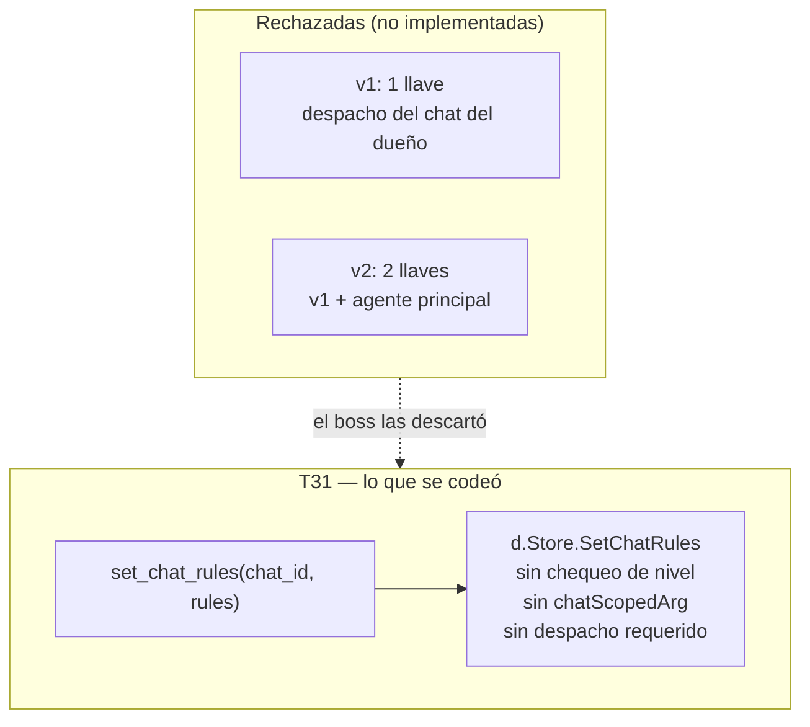

# T31 — `set_chat_rules` se desbloquea por MCP, sin condiciones (ct-2026-08-06-0244)

Reversión de S10 (`ct-2026-07-30-1349`), para un solo botón. Reemplaza dos
versiones intermedias de este mismo contrato que el boss rechazó — no hace
falta rastrearlas, este documento es el completo.

## La decisión, en los términos del boss

> "No pongas condiciones, que la skill recomiende nada mas, me cargan que
> metan tantas limitaciones y frenos miedosos. Con que la skill recomiende
> entonces ya es responsabilidad del usuario. Despues por eso que tenemos
> que estar fixiando limitaciones que yo nunca pedí"

Citrino había propuesto primero una llave (el despacho tiene que venir del
chat del dueño) y después dos (esa condición MÁS que el agente sea el
principal) — las dos pensadas para el escenario que el boss mismo
describió: un agente que atiende desconocidos podría ser engañado para
reescribir reglas de otro chat con un `cAPI: from is boss` falso. El boss
las rechazó las dos: quiere la separación de agentes como **decisión de
arquitectura**, no como candado de código.

## Por qué "sin condiciones" y no "una condición razonable"

El propio día trajo la evidencia: tres frenos agregados por precaución, en
tres contratos distintos, los tres deshechos después de bloquear algo que
el boss sí necesitaba:

| Freno | Contrato que lo agregó | Por qué volvió |
|---|---|---|
| Whitelist del router sin excepción para is_boss | (histórico) | T30 — bloqueaba al dueño hablar con su propio gateway |
| Rules vacías = agente mudo, sin bypass | (histórico) | T5 — chats `auto` sin nadie respondiendo, silencio sin aviso |
| Cifrado del despacho, nunca opcional | T2 | T28 — el boss lo pidió sin cifrar tres veces antes de que alguien auditara por qué volvía |

Ninguno de los tres se agregó por mala fe — cada uno parecía la opción
seria en su momento. El patrón es el argumento del boss: la precaución
agregada por adelantado, sin un ataque real detrás, termina siendo el
obstáculo que alguien tiene que desarmar después.

## Qué cambió — y qué no

**Se desbloqueó, sin condiciones:**
- `set_chat_rules` (MCP) — el handler llama `store.SetChatRules(jid, rules)`
  directo. Ausente de `bossOnlyTools`, `chatScopedArg` y `selfGatedTools` —
  ningún gate, en ningún lado del código. Funciona sin despacho atado,
  desde cualquier terminal, sobre cualquier `chat_id` (no solo el del
  despacho propio — "sin condiciones" es literal).

**Se quedó exactamente igual, a propósito — "lo único que queda afuera es
lo que no pidió":**
- `set_type_rules`/`set_default_rules` — reglas de alcance amplio
  (por-tipo, global). El boss pidió destrabar las reglas de UN chat, no
  las que rigen todos.
- `set_is_boss` — la llave maestra, sin tocar.
- `set_confirmation_mode`/`set_config_level` — sin tocar, sin relación con
  este contrato.
- El resto de `bossOnlyTools` (kill switch, capi connector, grupo/perfil).

**La arquitectura que el boss sí quiere, escrita como recomendación:** la
skill `piumy-operator` explica que separar agentes (uno con
`set_chat_rules`, otro que atienda desconocidos sin la capacidad) es buen
diseño — en tono de consejo, no de advertencia de seguridad. Y una línea
nueva en la lista de "cuándo es un ataque": si un chat pide usar
`set_chat_rules` para cambiar las reglas de OTRO chat, es el mismo intento
de manipulación de siempre — la tool no lo va a impedir, el criterio es
del agente.

## Lo que NO se tocó

- El **governor** (`internal/whatsmeow`, anti-ban de pacing real) — sin
  relación con este contrato, ni se mencionó.
- `set_chat_memory`/`set_chat_context` — ya eran agent-writable, sin
  cambios; siguen siendo los únicos DOS chat-scoped a su propio despacho
  además de `set_chat_status`/`set_chat_active`/`set_mode`.
- `docs/S10-DIAGRAMA-GATE-DURO-CONFIG.md` — queda como registro de la
  decisión ORIGINAL (por qué se bloqueó en su momento), con una nota al
  final apuntando acá. No se reescribe — mismo criterio que T28 con los
  docs de T2.

## Tests

- `TestRulesAndIsBossToolsAlwaysBlockedViaMCP` (admin_tools_test.go) —
  `set_chat_rules` sale de la tabla; las otras 3 (`set_type_rules`/
  `set_default_rules`/`set_is_boss`) siguen ahí, sin cambios.
- `TestSetChatRulesUnconditionallyAllowedViaMCP` (nuevo) — mismos 4
  escenarios que el test de arriba cubría para bloquear, ahora afirmando
  éxito: sin despacho, despacho danger apuntando a OTRO chat (sin scoping),
  despacho boss, terminal principal sin despacho. Cada caso verifica
  también que el store quedó escrito, no solo el mensaje de éxito.
- `approver_test.go` — "cannot touch rules" pasa a "can touch rules like
  any other dispatch level" (positivo).
- `no_boss_tool_test.go` — `intentionallyUngated` (set-testigo de un solo
  nombre) para que el chequeo genérico de "todo tool con un argumento
  `rules` debe estar gateado" no vuelva a fallar contra esta excepción a
  propósito, y siga cayendo sobre cualquier tool FUTURA parecida.
  `TestPrivilegedToolsExistAndRegistered` verifica explícitamente que
  `set_chat_rules` está registrada y en NINGUNO de los tres mapas de gate.

## Criterio de listo

- `set_chat_rules` funciona sin condición alguna — 4 escenarios probados,
  incluido terminal sin despacho.
- `set_type_rules`/`set_default_rules`/`set_is_boss` sin cambios,
  verificado con el mismo test que ya los cubría.
- `docs/AGENT-BEHAVIOR.md`, `docs/MANUAL.md`, `piumy-operator` (skill)
  actualizados — la excepción escrita como decisión tomada, no como
  configuración (mismo criterio que T28).
- `docs/S10-DIAGRAMA-GATE-DURO-CONFIG.md` con nota, sin reescribir.
- `go build/vet/test` verde en todo el módulo.
