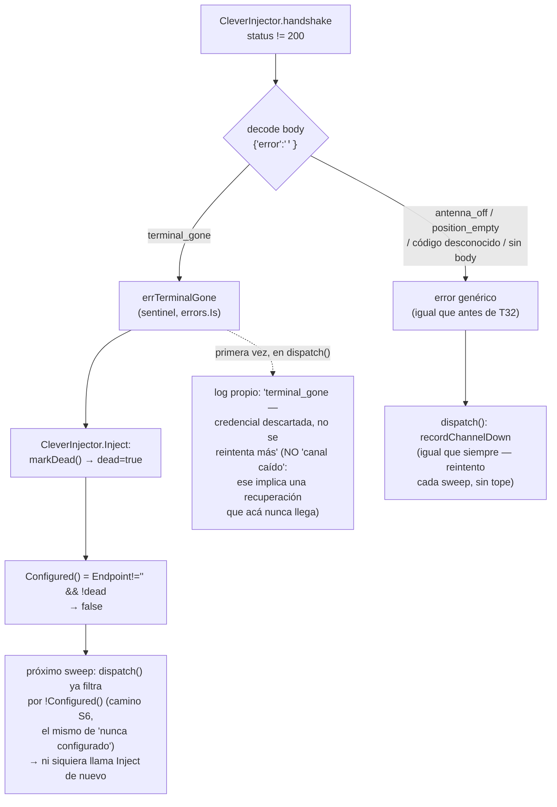

# T32 — distinguir los tres motivos por los que un despacho no se entrega (ct-2026-08-06-1109)

Acuerdo con el líder de CleverCoder, ya implementado y verificado de su lado
en **v1.6.68.191** (protocolo `external-agent-protocol.md` §2,
ct-2026-08-06-0221). Hasta ahora el handshake devolvía un solo error para
tres situaciones distintas y `capipush` no podía decidir qué hacer con cada
una.

## Los tres códigos

| Código | Qué significa | Clase | Qué hace `dispatch()` |
|---|---|---|---|
| `antenna_off` | el terminal existe, la antena está apagada | TRANSITORIO | vuelve a la cola |
| `position_empty` | sin party, esa posición no tiene terminal abierto todavía | TRANSITORIO | vuelve a la cola |
| `terminal_gone` | ese terminal no corresponde a nada, nunca va a existir | PERMANENTE | descarta la credencial, no reintenta más |

Un código que esta versión no reconoce (un CleverCoder viejo con el
`terminal_not_listening` de antes que colapsaba los tres, o uno nuevo del
futuro) se trata como transitorio — nunca rompe, queda anotado en el log.

## Por qué esta forma y no otra

**El sentinel vive en `CleverInjector`, no en `capipush.dispatch`.** El
handshake y su parseo del código son responsabilidad del injector — es quien
habla el protocolo. `dispatch()` solo necesita UNA pregunta
(`errors.Is(err, errTerminalGone)`), no reimplementar la tabla de códigos.

**`markDead` reutiliza `Configured()`, no agrega un segundo flag que
`dispatch()` tenga que aprender.** Un `CleverInjector` con `dead=true` se ve
EXACTAMENTE como uno que nunca tuvo `Endpoint` — el camino "sin antena
registrada" que ya existía (S6, ct-2026-07-30-031048) lo cubre gratis, sin
tocar el chequeo de `dispatch()`. Solo el momento en que el error llega
necesita una rama nueva: para loguear el motivo con su propia línea de una
sola vez, en lugar de la genérica `recordChannelDown`/`recordChannelRecovered`
— ese par asume una recuperación eventual que, para una credencial
genuinamente muerta, no va a pasar nunca. Loguearlo como "canal caído" sería
prometer algo falso.

**`antenna_off`/`position_empty`/códigos desconocidos no cambian nada.** Ya
eran, y siguen siendo, el `recordChannelDown` de siempre — reintento cada
sweep, sin consumir el presupuesto de redespacho (S4b, delivery failures
nunca cuentan contra `MaxRedispatch`), sin dar de baja el registro del
agente. Esa es la razón de que la compatibilidad hacia atrás salga gratis:
un CleverCoder viejo, que no manda el campo `error` en absoluto, cae al mismo
`fmt.Errorf("clever_injector: handshake status %d", ...)` que existía antes
de este contrato — cero cambio de comportamiento para él.

## Verificado antes de codear

- Protocolo y shape exacto de la respuesta leídos del lado de CleverCoder:
  `C:\proyectos\clevercoder\coderoot\MYClaudeLibrary\Resources\Protocol\
  external-agent-protocol.md` (§2, la tabla de los tres códigos) y
  `ExternalAgentApiService.cs` (`HandleHandshake`/`ResolveIncomingChatId`) —
  confirmado: los tres códigos viajan como `404` + body
  `{"error":"<code>"}` (`ErrorJson`), nunca un campo distinto ni un status
  distinto entre ellos.
- Confirmado que el código viejo (pre-191) devolvía `terminal_not_listening`
  colapsando los tres — por eso ese string puntual, además de cualquier
  código futuro no tabulado, cae al camino transitorio genérico sin caso
  especial.

## Qué se hizo

- **`internal/capipush/clever_injector.go`**:
  - `errTerminalGone` — sentinel `errors.Is`-comprobable.
  - `handshake` decodifica `{"error":"<code>"}` en cualquier respuesta
    no-200 (best-effort — un body vacío o sin ese campo no rompe nada).
    Solo `"terminal_gone"` toma la rama especial; cualquier otra cosa
    (incluido código desconocido o body vacío) cae al `fmt.Errorf` genérico
    de siempre.
  - `CleverInjector.dead` (nuevo campo, mismo mutex que `token`/`key`) +
    `markDead()`. `Configured()` pasa a `Endpoint != "" && !dead`.
    `SetConfig` limpia `dead` junto con `token`/`key` — una credencial
    nueva revive el injector.
  - `Inject` llama `markDead()` cuando CUALQUIERA de los dos handshakes
    (el inicial, o el re-handshake tras un 401) devuelve `errTerminalGone`.
- **`internal/capipush/capipush.go`** (`dispatch`): rama
  `errors.Is(err, errTerminalGone)` antes del `recordChannelDown` genérico
  — loguea una línea propia y `CancelDispatch`, sin entrar al
  `channelDownSince`/`channelDownFails` de S4c.
- **`internal/store/agents.go`**: doc del campo `Agent.AntennaTerminalID`
  explica que un id sin party es una POSICIÓN, no un terminal puntual —
  por qué `position_empty` es normal, no una credencial mal configurada
  (pedido explícito del contrato, "que quede escrito donde se guarda la
  credencial de un agente").

## Qué NO se tocó

- El protocolo de `/message` (§3) y su propio `404 delivery_unavailable` —
  carrera distinta (la sesión ya pasó el handshake), fuera del alcance de
  este contrato.
- `invalid_pinpass` (401) — no es uno de los tres códigos del handshake,
  sigue disparando el re-handshake-una-vez de siempre (protocolo §5).
- El `chat_id` estable en sí (cómo CleverCoder lo calcula) — ya viene hecho
  de su lado, aditivo, cero migración de este lado.

## Tests

- `clever_injector_test.go`: un caso por código
  (`TestCleverInjector_TerminalGoneMarksDead`,
  `_AntennaOffStaysConfigured`, `_PositionEmptyStaysConfigured`), más
  compatibilidad (`_UnknownCodeStaysConfigured` simula el
  `terminal_not_listening` viejo, `_NoErrorBodyStaysConfigured` simula un
  server sin el campo `error` en absoluto) y la revivificación
  (`_SetConfigRevivesDeadCredential`).
- `capipush_test.go`: `TestDispatchTerminalGoneLogsPermanentNotChannelDown`
  confirma que `dispatch()` no entra al camino `recordChannelDown` para
  este caso, y que el log explica el motivo real.

## Criterio de listo

- Los tres códigos hacen lo suyo — probado uno por uno.
- Un código desconocido no descarta nada y queda en el log — probado.
- Un CleverCoder viejo (sin el campo `error`) sigue funcionando igual que
  hoy — probado.
- El log dice cuál de los tres fue.
- `go build/vet/test` verde en todo el módulo.
- `docs/MANUAL.md`/`CHANGELOG.md` actualizados.
