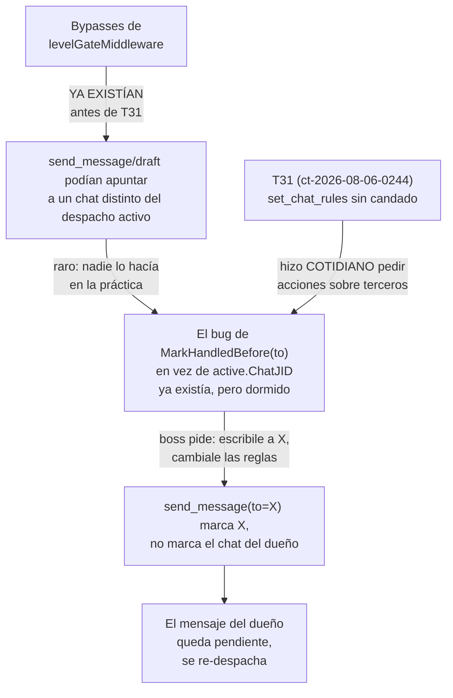
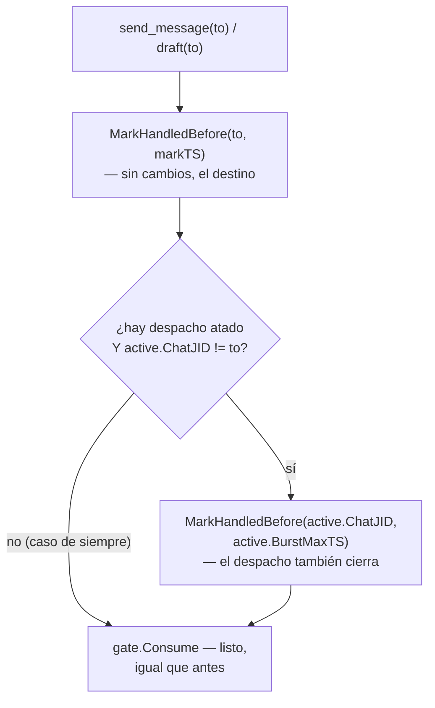

# T33 — actuar sobre otro chat deja el mensaje del dueño sin cerrar (ct-2026-08-06-1526)

## Lo que pasó, en vivo

El boss ordenó por WhatsApp: escribirle a un tercer número, cambiarle las
reglas y anotarle contexto y memoria. El agente hizo todo. Su propio
mensaje le llegó dos veces. `GateStaleAfter` son 15 minutos y el agente
tardó bastante menos — no fue demora.

**Causa**: `send_message` marca como atendido el chat **destino**
(`MarkHandledBefore(to, ...)`). El agente le escribió a la amiga, así que
se marcó el chat de ella; el mensaje del dueño quedó sin marcar, el sweep
lo encontró pendiente y lo re-despachó con un nonce nuevo.

## Corrección al propio contrato — registrada, no reescrita

El contrato original, verbatim (`ct-2026-08-06-1526`), decía:

> Hasta hoy un agente siempre respondía **en el mismo chat del que venía
> el despacho**. Destino y origen eran el mismo, y marcar uno marcaba el
> otro. **T31 rompió esa suposición**: el dueño ahora puede ordenar
> acciones sobre terceros.

Investigando antes de tocar código, esto resultó **incompleto**. Lo que
realmente pasa (`internal/mcpserver/levelgate.go`, `levelGateMiddleware`):

```go
// Principal bypass: full authority, no dispatch needed.
if principalID != "" && terminalIDFromContext(ctx) == principalID {
    return next(ctx, req)
}
...
if active.Level == LevelBoss {
    ...
    return next(ctx, req)
}
```

Dos bypasses — el terminal principal, y cualquier despacho nivel boss —
que existían **antes** de T31 y ya dejaban a `send_message`/`draft`
apuntar a un `chat_id` distinto del despacho activo. `chatScopedArg`
(la restricción "mismo chat que el despacho") **nunca aplicó** a un
despacho boss, desde que existe esa gate.

**Corrección, para que quede escrito qué se creyó y qué resultó**: T31
no introdujo la posibilidad de actuar sobre otro chat — esa ya estaba.
**T31 la volvió el caso cotidiano** (el dueño pidiendo una acción sobre
un tercero, en vez de una situación rara) — por eso el bug, real desde
antes, recién ahora se hizo visible en un caso de uso real.



## Recorrido completo antes de escribir (pedido explícito del contrato)

Grep exhaustivo de `gate.Consume`/`MarkHandledBefore` en todo
`internal/mcpserver`: **4 call sites, 2 archivos** (`send.go`,
`admin_tools.go`) — no hay ninguno escondido.

| Tool | ¿Marca algo? | ¿Cierra el turno (`gate.Consume`)? | Estado |
|---|---|---|---|
| `send_message` (2 ramas) | `MarkHandledBefore(to, ...)` | Sí | **BUG** — marcaba solo `to` |
| `draft` | `MarkHandledBefore(to, ...)` | Sí | **BUG** — mismo que `send_message` |
| `silent_act` | `MarkHandledBefore(active.ChatJID, ...)` | Sí | Sano — nunca tuvo `to`, siempre marca su propio despacho |
| `approve_draft` | `MarkHandledBefore(chatJID del borrador, ...)` | **No** | Sano, a propósito — ver abajo |
| Todo el resto (`set_chat_rules`, `set_chat_memory`, `set_chat_context`, `set_chat_status`, `set_chat_active`, `set_mode`, `escalate`, `claim_chat`, `release_chat`, `mark_handled`, `resolve_chat`, los `get_*`) | Nada | Nunca | No es un bug nuevo — nunca tocaron el turno, ni antes de T31 |

**`approve_draft` es un caso distinto, verificado sano**: marca el chat
DEL BORRADOR (correcto — eso sí se atendió) pero nunca llama
`gate.Consume` — a propósito, para poder aprobar varios pendientes en un
mismo turno sin liberar el terminal en el primero. El despacho propio de
quien llama queda intacto; el agente cierra su turno aparte (típicamente
respondiéndole al dueño, lo que ya marca bien porque `to == active.ChatJID`
en ese caso).

## El fix — Caso 1: el bug real

Un solo helper, compartido entre los 3 call sites que sí importan
(`send_message` × 2 ramas, `draft`) — `internal/mcpserver/send.go`:

```go
func markDispatchChatIfDifferent(d Deps, active ActiveDispatch, bound bool, to string) {
    if !bound || active.ChatJID == to {
        return
    }
    if err := d.Store.MarkHandledBefore(active.ChatJID, active.BurstMaxTS); err != nil {
        log.Printf("mcpserver: mark_handled_before (dispatch chat) %s: %v", active.ChatJID, err)
    }
}
```

- **`active.BurstMaxTS`, nunca `now`** — mismo criterio que `silent_act`
  ya usaba: un mensaje que llegó al chat del despacho DESPUÉS de la ráfaga
  que se atendió queda pendiente, no se marca de más (listo cuando #4).
- **No-op si `active.ChatJID == to`** — el caso de siempre (responder en
  el mismo chat) no se toca, cero escritura doble.
- `gate.Active(termID)` pasó a mirarse SIEMPRE (antes solo para
  no-principal, ya que `markTS` no lo necesitaba para el principal) — el
  despacho activo importa para este chequeo sin importar si quien llama es
  principal o no.



## El fix — Caso 2: solo administración, sin envío

**No se cierra automático.** Un cierre implícito en `set_chat_rules` le
robaría el turno a un agente que todavía va a responder — peor que el
problema que arregla (acordado con Citrino).

Lo que sí cambia: la skill (`internal/mcpserver/manuals/operator/SKILL.md`
— la fuente real; `.claude/skills/piumy-operator/SKILL.md` es una copia
sin efecto) ahora dice el costo completo, no solo "cerrá tu turno":

- Si el turno entero fue administrativo sobre otro chat (reglas, memoria,
  contexto), es el mismo caso que quedarse callado — cerrar con
  `silent_act` en el despacho propio.
- El costo real, explícito: no es que un mensaje se re-despache — son 15
  minutos con el **terminal entero** bloqueado, no solo ese chat.
- `mark_handled` NO alcanza como salida manual — confirmado leyendo su
  handler, nunca llama `gate.Consume`. Solo tacha un mensaje puntual.

## Hallazgo aparte, en la misma skill — mismo patrón que el cifrado de T28

La skill real (ya al día con T31) tenía **tres afirmaciones que el código
no respalda** — el mismo patrón que Citrino nombró: *"el texto que un
agente lee como instrucción diciendo algo que el código no hace."*

1. Tabla "Lo que SÍ tocas": `"Cerrar el turno | mark_handled · resolve_chat"`
   — falso, ninguna de las dos cierra el turno. **Contradecía la línea 25
   del mismo documento**, que sí decía la verdad.
2. `"Todas, salvo set_chat_rules, operan sobre el chat de tu despacho. Si
   pasás otro chat_id, te rechaza."` — verdad solo para caution/danger,
   falso para boss (y para el terminal principal).
3. El diagrama "El circuito completo" tenía un paso final
   `"→ mark_handled si el tema quedó cerrado"` — mismo error que el punto
   1, encontrado de paso mientras se corregía ese, con el mismo motivo.

Las tres, corregidas. `resolve_chat` se reclasificó a "Entender el chat"
(es una lectura pura); `mark_handled` a "Estado del chat" (no cierra
nada, pero sí es una escritura chica sobre el chat propio).

## Verificación

- `TestSendMessageToAnotherChatAlsoClosesDispatchChat` /
  `TestDraftToAnotherChatAlsoClosesDispatchChat` — reproducen el caso
  real del boss. **Confirmado que fallan sin el fix** (revertido
  temporalmente, corridos, restaurado) antes de darlos por buenos.
- `TestSendMessageToAnotherChatDoesNotMarkDispatchMessagesAfterBurst` —
  listo cuando #4, no marca de más.
- `TestSendMessageSameChatDoesNotDoubleMark` — listo cuando #3, el caso
  de siempre sigue igual.
- `go build/vet/test` verde en todo el módulo.

## Criterio de listo

1. Despacho del dueño + envío a otro chat → los dos quedan marcados. ✓ probado.
2. Despacho del dueño + solo cambio de reglas, sin envío → sigue igual
   que hoy (bound-pero-sin-consumir hasta los 15 min); la skill ahora lo
   explica completo, no se agregó cierre automático. ✓ decidido con Citrino.
3. El caso de siempre — responder en el mismo chat — sigue igual. ✓ probado.
4. Los mensajes posteriores al burst siguen pendientes. ✓ probado.
5. `go build/vet/test` verde, con test del caso cruzado. ✓
6. La skill del operador dice lo que hace falta. ✓ (más las 2 líneas
   falsas pedidas + 1 encontrada de paso).
7. `docs/MANUAL.md` y CHANGELOG. Ver ahí.
