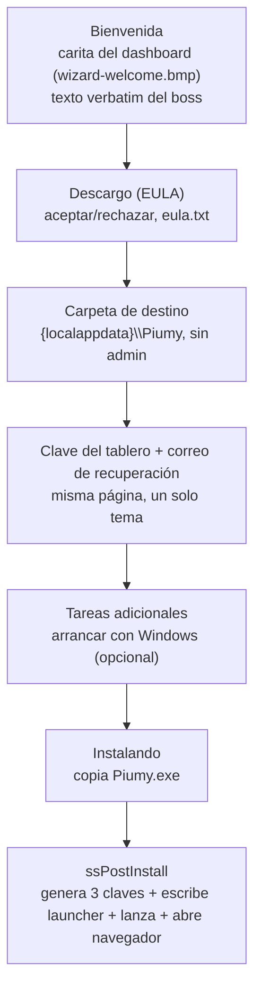
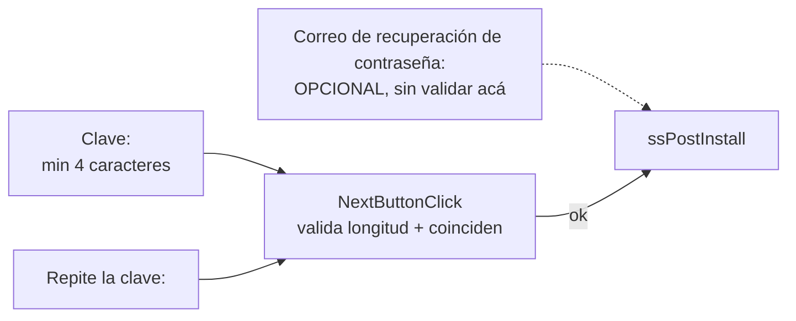
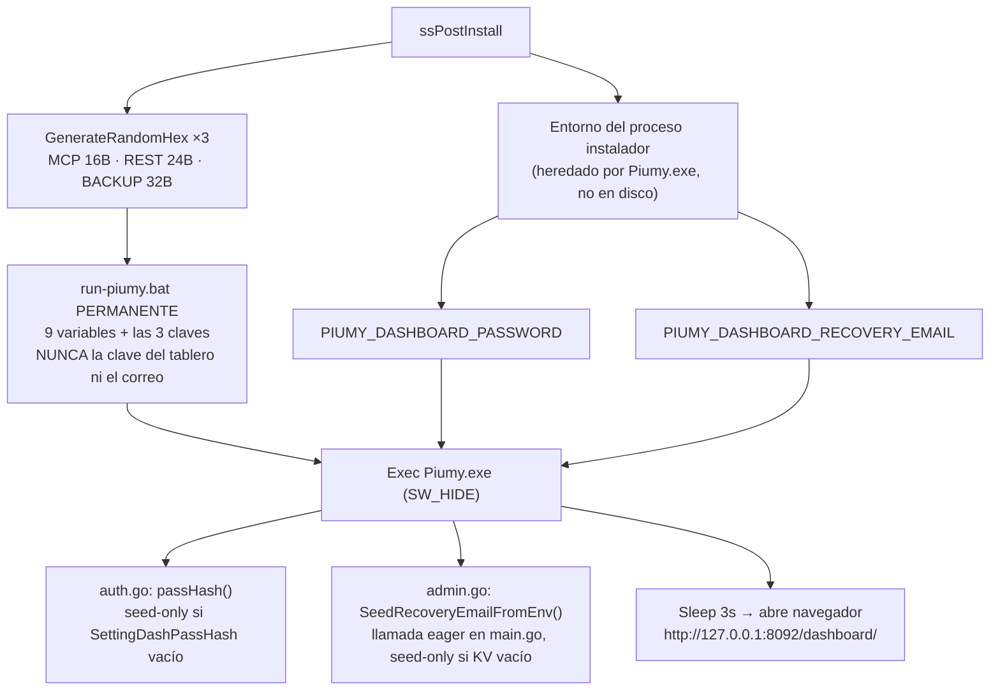
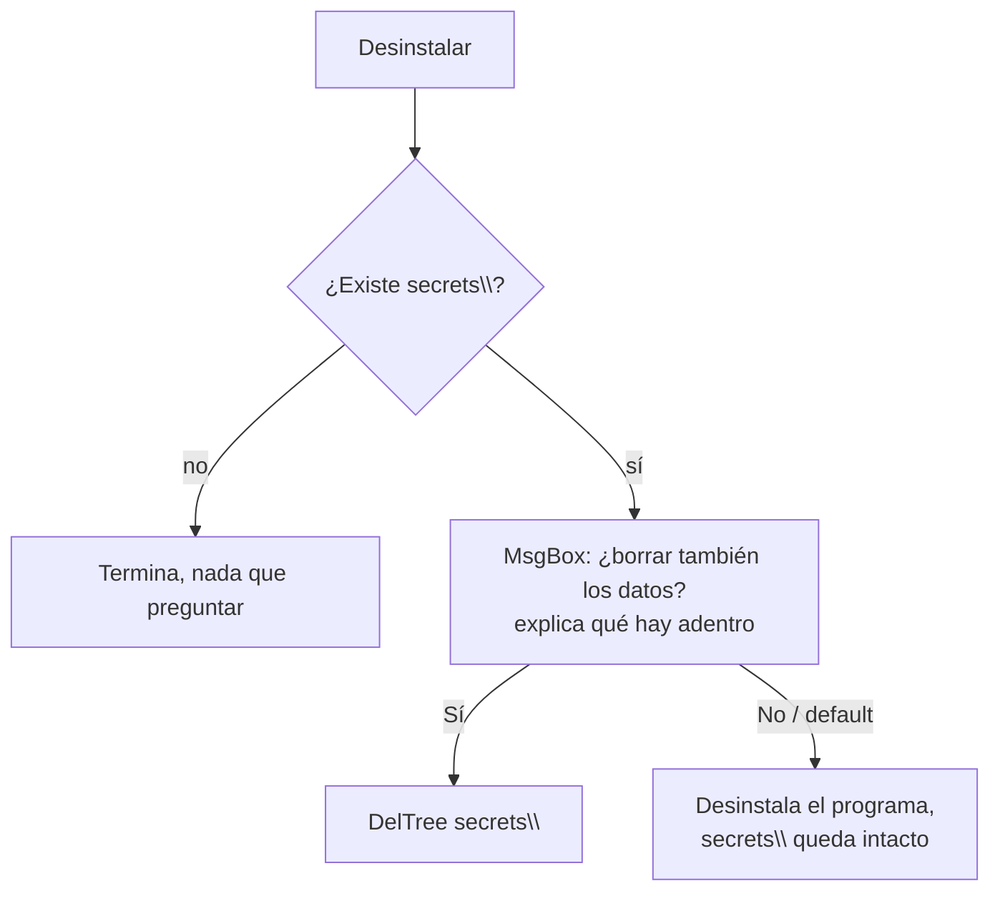

# Instalador de Windows (ct-2026-07-31-1643)

> **T21 (ct-2026-08-05-1308)** reescribió por completo cómo se leen/reusan
> las claves de una instalación existente y MOVIÓ ese paso de
> `ssPostInstall` a `PrepareToInstall` (corre antes de copiar archivos,
> para poder abortar limpio) — el diagrama de "ssPostInstall" de abajo
> quedó desactualizado en ese punto (y ya venía desactualizado desde T2/T6
> en el número de claves). Ver **`docs/T21-DIAGRAMA-INSTALADOR-KEY-SAFETY.md`**
> para el flujo real y actual de generación/reuso de claves.

Boss verbatim: *"mi idea principal es que todo se encapsule junto con el
gateway... quisiera compilar esto para que sea llegar a instalar para
cualquier clever codeur en el futuro."* Primer instalador: solo Windows,
Inno Setup, `installer/windows/piumy.iss`. Repo público, se sube SOLO el
`.exe` compilado — no el código fuente (subida no es tarea de Tourmaline).

## El wizard, de punta a punta

## La página de la clave (D) — 3 campos, un tema

## ssPostInstall (G) — qué genera y qué persiste dónde

## GenerateRandomHex — por qué CoCreateGuid y no CryptoAPI

`CryptAcquireContextW`+`CryptGenRandom` (advapi32.dll) reventaban con
**Access Violation en el mismo offset del binario**, probado con dos formas
de pasar el buffer (`array of Byte` tipado, después `AnsiString`) — el
offset idéntico entre builds con código distinto adentro de la función
señala que el problema es la marshaling nativa de Pascal Script para esa
forma de llamada externa, no el tipo del lado del script. Reproducido en
vivo, diagnosticado con un build de diagnóstico (crypto stubbeada) que
instaló de punta a punta sin error. Fix: `CoCreateGuid` (ole32.dll) — un
solo parámetro `var TGUID`, tipo explícitamente soportado por Pascal
Script. Aleatoriedad sigue siendo real (motor criptográfico de Windows, no
un timestamp). Verificado sin GUI: instalador headless propio (mismo
código, `/VERYSILENT`, dos carpetas) — 6 claves generadas, las 6 distintas,
ninguna vacía.

## Desinstalación

## Criterio de listo

- `go build ./... && go vet ./... && go test ./...` verde (el gateway
  ganó `restapi.SeedRecoveryEmailFromEnv` + su wiring en `main.go`).
- Instalador compila limpio con ISCC.
- Aleatoriedad verificada sin UI (harness headless, 2 corridas, 6 claves
  distintas, ninguna vacía) — la restricción de mouse/teclado de la sesión
  impidió el click-through real; queda pendiente para cuando se levante o
  lo pruebe el boss.
- `docs/MANUAL.md` actualizado (sección S1e-2, siembra desde el
  instalador).
